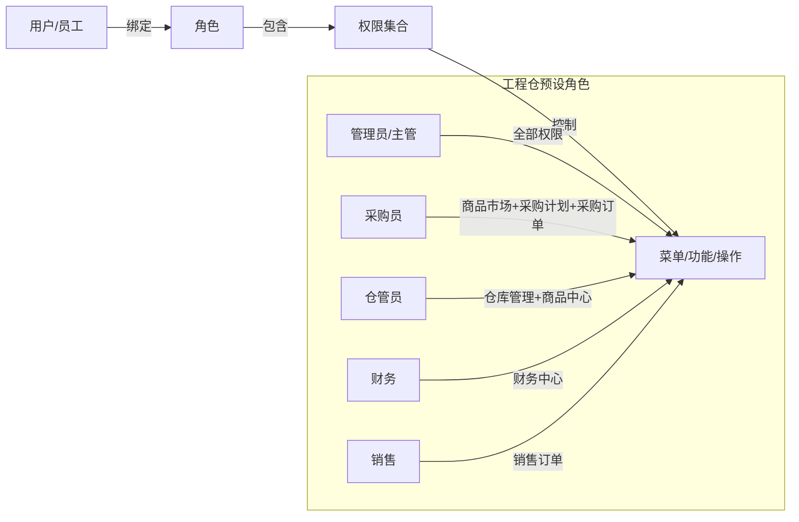
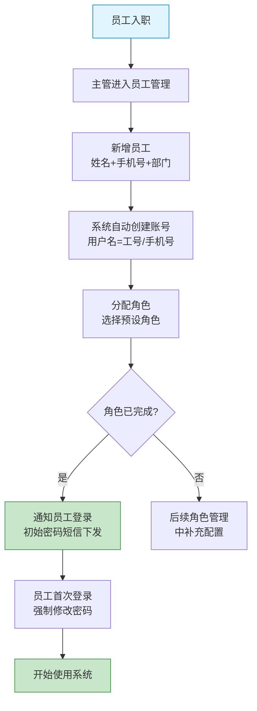

# 工程仓端 - 系统设置功能详细设计

> 版本：v2.0  
> 文档状态：已定稿  
> 所属章节：第十三章

## 版本历史

| 版本 | 日期 | 修订内容 | 修订人 |
|:----:|:----:|---------|:-----:|
| v1.0 | 2026-04-24 | 初始创建，覆盖系统设置全部3个功能点 | PM |
| v2.0 | 2026-04-24 | 重构为新版11章模板，新增设计原则、流程图、权限矩阵、非功能性需求、异常汇总表、接口依赖 | PM |

<!-- ============================================================ -->
<!-- PRD六层模型：                                                    -->
<!--                                                              -->
<!-- 核心层(必写)： 功能概述 → 设计原则 → 业务规则(含流程图) → 功能点详情   -->
<!-- 扩展层(推荐)： 权限矩阵 → 非功能性需求 → 异常汇总 → 接口依赖      -->
<!-- 治理层(状态模块必写)： 状态流转图 → 状态治理矩阵 → 版本历史       -->
<!-- ============================================================ -->

---

## 一、功能概述

### 1.1 功能定位

系统设置负责工程仓的组织管理，包括账号、员工、角色和权限配置。采用**RBAC（基于角色的访问控制）权限模型**，通过"用户→角色→权限"三层结构实现细粒度的功能权限控制，确保不同角色的员工只能操作其权限范围内的功能。

### 1.2 核心概念

| 概念 | 说明 | 示例 |
|:----|------|------|
| 账号 | 员工登录系统的凭证（用户名+密码） | zhangsan@wh |
| 员工 | 工程仓的雇员信息 | 张三（采购部） |
| 角色 | 权限的集合，预设5个角色 | 管理员/采购员/仓管员/财务/销售 |
| 权限树 | 按模块→子功能→操作的树形结构 | 订单管理→采购订单→查看/创建/取消 |
| RBAC | 基于角色的访问控制模型 | 用户→角色→权限 |

### 1.3 目标用户

- **主管**：所有操作权限（账号管理、员工管理、角色配置）
- **普通员工**：仅查看个人信息（无管理权限）

### 1.4 RBAC权限模型

### 1.5 模块范围

| 功能分类 | 主要功能 | 涉及角色 |
|:--------|---------|---------|
| 账号管理 | 账号列表、新建账号、编辑账号、停用/启用 | 主管 |
| 员工管理 | 员工列表、新增员工、编辑员工 | 主管 |
| 角色管理 | 角色列表、角色权限配置 | 主管 |

---

## 二、核心设计原则

> **系统设置遵循"最小权限"和"三层权限隔离"原则。**

### 2.1 最小权限原则

- 默认所有员工没有任何权限
- 权限通过角色赋予，不单独对员工授权
- 每个角色只包含完成工作所需的最少权限

### 2.2 三层权限结构

- **用户层**：一个员工绑定一个账号，一个员工可绑定多个角色
- **角色层**：角色是权限的集合，按岗位职责预设
- **权限层**：权限树颗粒度为"模块→子功能→操作"

### 2.3 安全基线

- 初始密码系统生成，首次登录强制修改
- 连续5次密码错误 → 账号锁定30分钟
- 账号停用后立即无法登录

---

## 三、业务规则

### 3.1 账号规则

- **唯一性**：一个员工对应一个账号，用户名全局唯一
- **停用规则**：账号停用后立即无法登录
- **密码规则**：初始密码系统生成，首次登录强制修改，密码强度≥8位含字母+数字
- **离职处理**：员工离职→关联账号自动停用
- **登录锁定**：连续5次密码错误→账号锁定30分钟

### 3.2 员工规则

- **完整性**：员工信息必须包含姓名+手机号+部门
- **唯一性**：一个手机号在工程仓内唯一
- **离职转岗**：员工离职或转岗→调整角色绑定（不影响账号）

### 3.3 角色规则

- **预设角色**：管理员/采购员/仓管员/财务/销售
- **自定义角色**：支持自定义角色（V2）
- **权限继承**：管理员角色拥有全部权限，不可修改
- **权限变更生效**：修改角色权限后，已登录用户下次请求时生效（Token刷新）

### 3.4 核心业务流程图

#### 流程图1：员工入职→开通账号→分配角色

---

## 四、权限矩阵

| 功能模块 | 具体操作 | 主管 | 普通员工 | 说明 |
|:--------|---------|:----:|:--------:|------|
| **账号管理** | 查看账号列表 | ✅ | ❌ | - |
| | 新建账号 | ✅ | ❌ | - |
| | 编辑账号 | ✅ | ❌ | - |
| | 启用/停用账号 | ✅ | ❌ | - |
| **员工管理** | 查看员工列表 | ✅ | ❌ | - |
| | 新增员工 | ✅ | ❌ | - |
| | 编辑员工 | ✅ | ❌ | - |
| **角色管理** | 查看角色列表 | ✅ | ❌ | - |
| | 配置角色权限 | ✅ | ❌ | - |
| **个人信息** | 查看本人信息 | ✅ | ✅ | 所有角色可见 |

---

## 五、非功能性需求

### 5.1 性能要求

| 接口/场景 | 指标 | P95要求 | 说明 |
|:---------|:----|:-------:|------|
| 账号列表 | 响应时间 | ≤ 300ms | - |
| 员工列表 | 响应时间 | ≤ 300ms | - |
| 角色列表 | 响应时间 | ≤ 200ms | 含权限树 |
| 角色权限保存 | 响应时间 | ≤ 500ms | 批量更新权限 |

### 5.2 安全要求

| 风险点 | 预期防护策略 |
|:------|---------|---------|
| 越权操作 | 接口权限校验 | 每个接口校验用户角色，无权限返回403 |
| 密码泄露 | 登录锁定+密码强度 | 5次错误锁定30分钟，密码≥8位字母+数字 |
| 越权查看他人信息 | 数据隔离 | 普通员工只能查看本人信息 |
| 权限变更延迟 | Token刷新机制 | 修改角色权限后，用户下次请求时权限即时生效 |

---

## 六、功能点详细设计

### 6.1 员工管理（P0）

#### 交互逻辑

1. 页面加载：获取员工列表（按入职时间倒序）→ 渲染表格
2. 搜索：姓名/手机号/部门搜索
3. 点击"新增员工" → 表单弹窗 → 填入姓名+手机号+部门
4. 新增后自动创建关联账号
5. 点击员工 → 查看详情 + 分配角色

#### 原子字段定义

| 字段 | 必填 | 来源 | 校验规则 | 展示规则 |
|:----|:----|:----:|:----|:--------|:--------|
| 姓名 | 是 | 前端输入 | 2-20个字符 | 文本 |
| 手机号 | 是 | 前端输入 | ^1[3-9]\d{9}$ | 脱敏展示 |
| 部门 | 是 | 前端输入 | 2-30个字符 | 标签 |
| 角色 | 否 | 角色接口 | 至少选择1个 | 标签组 |
| 入职时间 | 否 | 系统记录 | - | YYYY-MM-DD |
| 状态 | 是 | 系统管理 | 在职/离职 | 标签（绿/灰） |

#### 边界情况覆盖

| 场景 | 处理逻辑 | 提示文案 |
|:----|:--------|---------|
| 手机号重复 | 输入框实时校验 | "该手机号已被其他员工使用" |
| 新增后未分配角色 | 允许新增，提醒后续分配 | - |
| 员工离职 | 账号自动停用 | - |

---

### 6.2 账号管理（P0）

#### 交互逻辑

1. 页面加载：获取账号列表 → 渲染表格
2. 账号信息：用户名/关联员工/角色/状态/最后登录时间
3. 主管操作：启用/停用/重置密码
4. 新建账号：选择已有员工 → 自动生成初始密码 → 短信下发

#### 原子字段定义

| 字段 | 必填 | 来源 | 校验规则 |
|:----|:----|:----:|:----|:--------|
| 用户名 | 是 | 系统生成 | 全局唯一，字母开头 |
| 关联员工 | 是 | 员工接口 | 一个员工对应一个账号 |
| 密码 | - | 系统生成 | ≥8位含字母+数字 |
| 状态 | 是 | 系统管理 | 正常/停用/锁定 |

#### 边界情况覆盖

| 场景 | 处理逻辑 | 提示文案 |
|:----|:--------|---------|
| 员工已有关联账号 | 不允许重复创建 | "该员工已有账号" |
| 重置密码 | 系统生成新密码，短信下发 | "密码已重置，新密码已短信发送" |
| 停用账号 | 员工立即无法登录 | "账号已停用" |
| 登录锁定 | 5次密码错误后锁定30分钟 | "账号已被锁定，请30分钟后重试" |

---

### 6.3 角色权限配置（P1）

#### 交互逻辑

1. 角色列表：展示所有角色（预设+自定义）
2. 点击角色 → 进入权限配置页
3. 权限树展示：按模块→子功能→操作的树形结构
4. 勾选/取消权限 → 保存 → 权限即时生效

#### 原子字段定义

| 字段 | 必填 | 来源 | 展示规则 |
|:----|:----|:----:|:----|:--------|
| 角色名称 | 是 | 系统预设/自定义 | 卡片展示 |
| 角色说明 | 否 | - | 灰色小字 |
| 权限树 | Tree | 是 | 权限接口 | 树形结构，复选框 |
| 关联员工数 | 是 | 统计 | 数字标签 |

#### 边界情况覆盖

| 场景 | 处理逻辑 | 提示文案 |
|:----|:--------|---------|
| 管理员角色 | 权限不可修改，全部勾选 | "管理员拥有全部权限" |
| 角色正在被使用 | 修改权限时二次确认 | "该角色下有N名员工，修改后将影响其权限" |
| 权限保存失败 | Toast提示 | "权限配置保存失败，请重试" |

---

## 七、异常处理汇总表

| 异常场景 | 触发条件 | 处理方式 | 提示文案 |
|:--------|:--------|:--------|:--------|---------|
| 手机号重复 | 新增员工 | 输入框实时校验 | 返回已存在 | "该手机号已被使用" |
| 员工已有关联账号 | 创建账号 | 阻止创建 | 返回已存在 | "该员工已有账号" |
| 修改中角色被使用 | 角色权限修改 | 二次确认弹窗 | - | "该角色下有N名员工" |
| 权限保存失败 | 网络异常 | Toast | 回滚 | "权限配置保存失败，请重试" |
| 重置密码失败 | 短信发送异常 | Toast | - | "密码已重置，但短信下发失败" |
| 账号数据加载失败 | 接口异常 | 重试按钮 | - | "数据加载失败，请重试" |

---

## 八、接口需求说明

| 接口用途 | 核心能力要求 |
|:----|:----|:-------------|:--------:|
| 员工列表 | 员工列表 |
| 新增员工 | 新增员工 |
| 编辑员工 | 编辑员工 |
| 账号列表 | 账号列表 |
| 重置密码 | 重置密码 |
| 启用/停用 | 启用/停用 |
| 角色列表 | 角色列表 |
| 角色权限保存 | 角色权限保存 |

