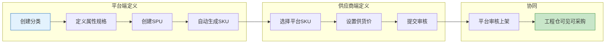
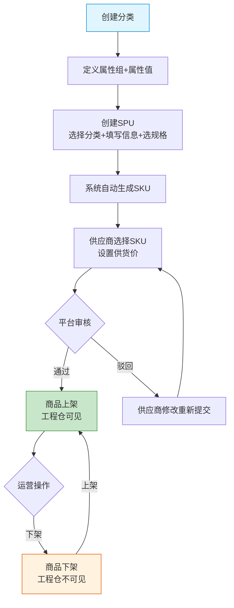

# 平台端 - 商品管理功能详细设计

> 版本：v1.0  
> 文档状态：初稿  
> 所属章节：第七章

## 版本历史

| 版本 | 日期 | 修订内容 | 修订人 |
|:----:|:----:|---------|:-----:|
| v1.0 | 2026-04-24 | 初始创建，覆盖商品管理14个功能点的完整详细设计 | PM |
| v2.0 | 2026-04-24 | 重构为新版11章模板，新增核心设计原则、Mermaid流程图、权限矩阵、非功能性需求、异常汇总表、接口依赖建议，原子字段新增必填列 | PM |

<!-- ============================================================ -->
<!-- PRD六层模型：                                                    -->
<!--                                                              -->
<!-- 核心层(必写)： 功能概述 → 设计原则 → 业务规则(含流程图) → 功能点详情   -->
<!-- 扩展层(推荐)： 权限矩阵 → 非功能性需求 → 异常汇总 → 接口依赖      -->
<!-- 治理层(状态模块必写)： 状态流转图 → 状态治理矩阵 → 版本历史       -->
<!-- ============================================================ -->

---

## 一、功能概述

### 1.1 功能定位

商品管理是平台端**功能最密集的模块**（14个功能点），负责商品基础数据的全生命周期管理——从分类定义→属性规格→SPU/SKU创建→供应商供货关系→商品审核上架。平台端商品中心是整个系统的商品数据源头。

### 1.2 核心概念

| 概念 | 说明 | 示例 |
|:----|------|------|
| 商品分类 | 三级树形分类体系，平台统一维护 | 建材→水泥→P.O42.5 |
| 属性组+属性值 | 规格属性定义 | "颜色:红/蓝/绿" |
| SPU | 标准产品单元，商品定义最上层 | "水泥P.O42.5" |
| SKU | 库存量单位，具体规格商品 | "水泥P.O42.5袋装" |
| 供货关系 | 供应商与SKU的关联+价格 | 华润水泥→水泥P.O42.5→¥300/吨 |

### 1.3 目标用户

- **平台运营**（核心用户）：管理商品基础数据
- **平台管理员**：审核商品上架

### 1.4 模块范围

| 功能分类 | 主要功能 | 优先级 | 功能数 |
|:--------|---------|:------:|:------:|
| 分类管理 | 分类树管理 | P0 | 1 |
| 属性管理 | 属性组管理、属性值管理 | P0 | 2 |
| SPU管理 | SPU新增、SPU详情、SPU列表查询、SPU编辑 | P0+P1 | 4 |
| SKU管理 | SKU列表、SKU详情、**SKU新增**、SKU编辑 | P0+P1 | **4** |
| 供货管理 | 供应商供货列表、设置供货价、供货状态切换 | P0 | 3 |
| 批量操作 | 批量上下架 | P1 | 1 |

---

## 二、核心设计原则

> **商品管理遵循"两段定义"原则：平台定义商品规格基础数据，供应商定义供货价格。**

### 2.1 两段定义原则

- 平台端：定义商品分类、属性规格、SPU/SKU基础结构——商品数据源头
- 供应商端：基于平台SKU设置供货价+维护库存——价格数据源头
- 两段数据通过"供货关系"关联，互不干扰

### 2.2 分类树形原则

- 三级分类体系（一级/二级/三级），所有商品必须关联到三级分类
- 分类树支持拖拽排序和层级调整，删除时校验关联数据

### 2.3 SKU自动生成原则

- 创建SPU时选择规格属性 → 系统自动笛卡尔积生成SKU组合
- **已存在的SPU支持手动新增SKU**：从SKU列表页→选择SPU→继承已有SKU规格→按需调整规格组合后提交
- SKU编码自动生成：SPU_ID + 规格值缩写
- SKU组合>100个时提示精简

---

## 三、业务规则

### 3.1 分类规则

- 三级树形结构（level=1/2/3）
- 删除分类时校验是否有下级分类和关联商品
- 排序号越大越靠前

### 3.2 SPU→SKU规则

- 创建SPU时选择规格属性 → 系统自动笛卡尔积生成SKU
- SKU编码格式：SPU_ID + 规格值缩写
- 一个分类下SPU名称不可重复

### 3.3 供货规则

- 一个SKU可被多个供应商供应
- 供货价必须大于0
- 供货状态=停用时，工程仓端不可见
- 供货价变更→记录价格变更历史

### 3.4 核心业务流程图

#### 流程图1：商品两段定义流程



#### 流程图2：商品从创建到上架全流程



---

## 四、权限矩阵

### 4.1 功能权限总表

| 功能模块 | 具体操作 | 运营 | 管理员 | 说明 |
|:--------|---------|:----:|:------:|------|
| **分类管理** | 增删改查分类 | ✅ | ✅ | - |
| **属性管理** | 管理属性组+属性值 | ✅ | ✅ | - |
| **SPU管理** | SPU增删改查 | ✅ | ✅ | - |
| **SKU管理** | SKU查看/编辑 | ✅ | ✅ | SKU编码不可改 |
| **供货管理** | 查看+维护供货关系 | ✅ | ✅ | - |
| **批量操作** | 批量上下架 | ✅ | ✅ | - |

### 4.2 权限校验方式

- **前端**：运营和管理员权限一致（无差异化展示）
- **后端**：操作接口校验平台角色

---

## 五、非功能性需求

### 5.1 性能要求

| 接口/场景 | 指标 | P95要求 | 说明 |
|:---------|:----|:-------:|------|
| 商品列表/SKU列表 | 响应时间 | ≤ 500ms | 含多条件筛选+分页 |
| SPU创建（含SKU生成） | 响应时间 | ≤ 2s | SKU<100时，>100提示精简 |
| 分类树加载 | 响应时间 | ≤ 300ms | 分类缓存 |
| 供货列表查询 | 响应时间 | ≤ 500ms | - |

### 5.2 埋点需求

| 页面 | 事件名 | 触发时机 | 上报字段 |
|:----|:------|---------|---------|
| SPU管理 | spu_create | 创建SPU提交 | `categoryId`, `skuCount` |
| 供货管理 | supplier_price_set | 设置供货价 | `skuId`, `supplierId`, `price` |
| 批量操作 | batch_status_change | 批量上下架 | `count`, `action`(up/down) |

### 5.3 安全要求

| 风险点 | 预期防护策略 |
|:------|---------|---------|
| 越权操作商品 | 接口角色校验 | 商品操作接口校验平台角色 |
| 重复提交SPU | 前端防抖+幂等 | 按钮防抖 + SPU名称唯一约束 |

---

## 六、功能点详细设计

### 6.1 分类树管理（P0）

#### 交互逻辑

1. 页面加载：获取全部分类 → 渲染树形结构
2. 拖拽排序：拖拽节点调整层级/排序 → 自动保存
3. 右键菜单：新增同级/新增子级/编辑/删除
4. 编辑即时刷新：修改后树结构即时更新

#### 原子字段定义

| 字段 | 必填 | 来源 | 校验规则 | 展示规则 | 默认值 |
|:----|:----|:----:|:----|:--------|:--------|:-----:|
| 分类名称 | 是 | 表单输入 | 非空，同级唯一 | Input框 | - |
| 父级分类 | 是 | 树结构 | 合法父级ID | 树选择器，自动关联 | 当前选中 |
| 层级 | 否 | 自动生成 | 1/2/3 | 只读文本，自动计算 | 自动 |
| 排序号 | 否 | 表单输入 | ≥0 | InputNumber | 0 |

#### 边界情况覆盖

| 场景 | 处理逻辑 | 提示文案 |
|:----|:--------|---------|
| 删除有下级分类 | 阻止删除 | "该分类下有子分类，无法删除" |
| 删除有关联商品 | Modal警告确认 | "该分类下有N个商品，删除后将影响这些商品" |
| 同级名称重复 | 前端校验拦截 | "同级已存在同名分类" |

---

### 6.2 属性组管理（P0）

#### 交互逻辑

1. 属性组列表展示：名称+排序号+关联属性数
2. 新增弹窗：输入属性组名称+排序号
3. 编辑弹窗：修改属性组信息
4. 删除确认：校验是否有关联属性值

#### 原子字段定义

| 字段 | 必填 | 来源 | 校验规则 | 展示规则 |
|:----|:----|:----:|:----|:--------|:--------|
| 属性组名称 | 是 | 表单输入 | 全局唯一 | Input框 |
| 排序号 | 否 | 表单输入 | ≥0 | InputNumber |

#### 边界情况覆盖

| 场景 | 处理逻辑 | 提示文案 |
|:----|:--------|---------|
| 名称重复 | Toast提示 | "该属性组名称已存在" |
| 有属性值→删除 | Modal警告 | "该属性组下有N个属性值，删除后属性值将一并删除" |

---

### 6.3 属性值管理（P0）

#### 交互逻辑

1. 按属性组左侧筛选 → 右侧展示当前组所有属性值
2. 新增：弹窗输入属性值名称+规格值
3. 编辑/删除：行级操作

#### 原子字段定义

| 字段 | 必填 | 来源 | 校验规则 | 展示规则 |
|:----|:----|:----:|:----|:--------|:--------|
| 属性值名称 | 是 | 表单输入 | 组内唯一 | Input框 |
| 规格值 | 否 | 表单输入 | - | Input框 |

#### 边界情况覆盖

| 场景 | 处理逻辑 | 提示文案 |
|:----|:--------|---------|
| 名称重复 | Toast提示 | "该属性组下已存在同名属性值" |
| 被SKU引用→删除 | Modal警告 | "有N个SKU使用了该属性值，删除后将影响这些SKU" |

---

### 6.4 SPU新增（P0）

#### 交互逻辑

1. 步骤一：选择商品分类（树形选择器，仅可选三级分类）
2. 步骤二：填写SPU名称/品牌/描述/主图 + 选择规格属性组
3. 步骤三：预览自动生成的SKU组合表格（规格值笛卡尔积）
4. 提交：校验必填项 → 保存SPU → 跳转SPU详情

#### 原子字段定义

| 字段 | 必填 | 来源 | 校验规则 | 展示规则 |
|:----|:----|:----:|:----|:--------|:--------|
| 所属分类 | 是 | 树选择 | 三级分类 | 树形选择器 |
| SPU名称 | 是 | 表单输入 | 分类内唯一 | Input框 |
| 品牌 | 否 | 表单输入 | - | Input框 |
| 商品描述 | 否 | 富文本 | - | RichEditor |
| 主图 | 否 | 图片上传 | jpg/png | ImageUpload |
| 规格属性 | 否 | 多选 | - | CheckboxGroup |

#### 边界情况覆盖

| 场景 | 处理逻辑 | 提示文案 |
|:----|:--------|---------|
| SKU组合>100个 | Modal提示 | "规格组合超过100个，请精简规格属性" |
| SPU名称重复 | 后端校验 | "该分类下已存在同名SPU" |

---

### 6.5 SPU详情（P0）

#### 交互逻辑

1. 基本信息区：SPU名称/分类/品牌/描述/主图（只读）
2. SKU列表区：当前SPU下所有SKU的表格（编码/规格/价格/状态）
3. 规格属性区：展示选中的规格属性组和属性值
4. 操作按钮区：编辑/删除（根据状态动态展示）

---

### 6.6 SKU列表（P0）

#### 交互逻辑

1. 页面加载：获取SKU列表 → 渲染表格
2. 多条件筛选：分类/SPU名称/品牌/SKU编码/状态
3. 分页展示：每页20条
4. 点击SKU编码→跳转SKU详情

#### 原子字段定义

| 字段 | 必填 | 来源 | 展示规则 |
|:----|:----|:----:|:----|:--------|
| SKU编码 | 是 | 系统生成 | 超链接，可点击跳转 |
| SPU名称 | 是 | SPU信息 | 文本 |
| 规格描述 | 否 | 属性组合 | 标签展示 |
| 参考单价 | 否 | 平台设定 | 数字+单位"元" |
| 状态 | 是 | 系统状态 | Tag(enabled/disabled) |
| 关联供应商数 | 否 | 统计 | 数字角标 |

---

### 6.7 SKU详情（P0）

#### 交互逻辑

1. 基本信息卡片：SKU编码/SPU名称/分类/参考单价
2. 规格属性标签：以标签形式展示规格值
3. 供应商列表Tab：展示当前SKU的所有关联供应商+供货价+状态
4. 操作按钮：**编辑**（弹窗编辑）/ 管理供货关系
   - 「编辑」按钮→弹出SKU编辑弹窗（同6.15规格编辑弹窗，预填当前SKU的规格值+价格）

---

### 6.8 供应商供货列表（P0）

#### 交互逻辑

1. 列表展示：供应商名称/供货价/审核状态/启用状态/操作按钮
2. 筛选项：按供应商名称/状态筛选
3. 操作：设置供货价/切换启用状态

---

### 6.9 设置供货价（P0）

#### 交互逻辑

1. 弹窗编辑：输入供货价+备注
2. 价格校验：价格>0
3. 提交：记录价格变更历史 → 刷新列表

#### 边界情况覆盖

| 场景 | 处理逻辑 | 提示文案 |
|:----|:--------|---------|
| 价格≤0 | 前端校验拦截 | "供货价格必须大于0" |
| 重复提交 | 后端幂等 | "价格未变更" |

---

### 6.10 供货状态切换（P0）

#### 交互逻辑

1. 点击开关 → Modal二次确认
2. 确认后更新状态 → 刷新列表
3. 停用后工程仓端不可见该商品

#### 边界情况覆盖

| 场景 | 处理逻辑 | 提示文案 |
|:----|:--------|---------|
| 停用确认 | Modal二次确认 | "停用后工程仓端将无法看到该商品，确认停用？" |

---

### 6.11 SPU列表查询（P1）

#### 交互逻辑

1. 树形分类筛选：左侧分类树选择 → 右侧展示该分类下SPU
2. 多条件搜索：品牌/状态/创建时间
3. 列表展示：SPU名称/分类/品牌/SKU数量/状态/创建时间

---

### 6.12 SPU编辑（P1）

修改SPU的基本信息（名称/品牌/描述/主图）。仅平台运营/管理员可编辑。

---

### 6.13 SKU编辑（P1）

> SKU编辑与SKU新增共用同一规格编辑弹窗组件，预填当前SKU的规格值和价格，支持按需调整。

#### 交互逻辑

1. 入口：SKU详情页 → 点击**「编辑」**按钮 → 弹出SKU编辑弹窗
2. 弹窗打开时，自动加载当前SKU的SPU规格属性，并预填当前SKU的规格值
3. 用户可修改规格组合（删除/新增规格行、切换属性值）和参考单价
4. SKU编码只读展示，不可修改
5. 提交：校验必填 → 保存变更 → 关闭弹窗 → 刷新SKU详情

#### 弹窗界面说明

```
┌──────────────────────────────────────────────────┐
│  编辑SKU                      × (关闭)           │
├──────────────────────────────────────────────────┤
│                                                   │
│  SKU编码：SPU001-RED-50KG（只读）                  │
│  SPU名称：水泥P.O42.5（只读）                     │
│  所属分类：建材→水泥→P.O42.5（只读）              │
│                                                   │
│  ┌─ 规格组合 ───────────────────────────────┐    │
│  │                                            │    │
│  │  规格属性    属性值         操作           │    │
│  │  ─────────────────────────────────────       │    │
│  │  颜色 ✅     ▼ 红色           🗑️ ➕       │    │
│  │              ├── 红色  ← 已选中             │    │
│  │              ├── 蓝色                      │    │
│  │              └── 绿色                      │    │
│  │                                            │    │
│  │  重量 ✅     ▼ 50kg/袋       🗑️ ➕        │    │
│  │              ├── 50kg/袋  ← 已选中          │    │
│  │              └── 25kg/袋                   │    │
│  │                                            │    │
│  │  [+ 添加规格属性]                          │    │
│  └────────────────────────────────────────────┘    │
│                                                   │
│  参考单价：__300__ 元（可修改，>0）                │
│                                                   │
│  ┌────────────────────────────┐                    │
│  │         取消               │    确认保存         │
│  └────────────────────────────┘                    │
└──────────────────────────────────────────────────┘
```

#### 规格编辑规则

| 操作 | 行为 | 说明 |
|:----|:-----|:-----|
| 删除规格行 | 🗑️ | 删除当前规格行，至少保留1行 |
| 切换属性值 | 下拉单选 | 从该规格属性的预定义值中选择其他值 |
| 添加同规格行 | ➕ | 新增一行同规格属性，选择新值（实现多值SKU） |
| 添加新规格属性 | 「+ 添加规格属性」 | 从平台全局属性组中选择，为SPU新增规格维度 |

> 🆕 与新增SKU共用弹窗组件的差异：
> - 编辑弹窗中的属性值下拉**默认选中**当前SKU的规格值（新增弹窗默认为空）
> - SKU编码只读展示（新增弹窗无此字段）
> - 保存后只修改当前SKU，不影响SPU下其他SKU
> - 若编辑后与已有SKU规格重复→提示"该规格组合已存在"

#### 原子字段定义

| 字段 | 必填 | 来源 | 校验规则 | 展示规则 |
|:----|:----|:----:|:----|:--------|
| SKU编码 | 是 | 系统生成 | 只读，不可修改 | 文本显示 |
| SPU信息 | 是 | 自动带入 | 只读 | 文本显示SPU名称+分类路径 |
| 规格属性 | 是 | 预填当前值+可编辑 | 每行必须选择属性值 | 规格行表格，下拉单选，默认选中当前值 |
| 参考单价 | 否 | 表单输入 | >0 | InputNumber，预填当前值 |

#### 边界情况覆盖

| 场景 | 处理逻辑 | 提示文案 |
|:----|:--------|---------|
| 修改规格后与已有SKU重复 | 后端校验，弹窗提示 | "该规格组合已存在，请调整后重新提交" |
| 删除规格行到只剩1行 | 🗑️按钮置灰 | "至少保留1行规格" |
| 属性值未选择→保存 | 前端校验拦截 | "请为所有规格行选择属性值" |
| 修改SKU所属SPU？ | 不允许 | SKU绑定SPU不可修改 |

---

### 6.14 批量上下架（P1）

#### 交互逻辑

1. 列表勾选多个SKU → 点击"批量上架"/"批量下架"按钮
2. Modal二次确认："确认对选中的N个商品执行上架/下架操作？"
3. 确认后显示进度条+结果汇总："成功N条，失败M条，失败原因：XXX"

---

### 6.15 SKU新增（P0）

> 在已有SPU下新增SKU，支持选择SPU后自动继承其已有SKU的规格属性，并允许按需调整规格组合。

#### 交互逻辑（两步弹窗）

**步骤一：选择SPU**

1. 入口：SKU列表页 → 点击右上角 **「+ 新增SKU」** 按钮（同6.6第5步）
2. 弹出「选择SPU」弹窗：
   - 搜索框：按SPU名称模糊搜索
   - 分类筛选：树形分类选择器（可选）
   - SPU列表：展示SPU名称/分类/品牌/SKU数/状态
   - 选中SPU后 → 自动进入步骤二

**步骤二：编辑规格**

3. 弹出「新增SKU规格编辑」弹窗（与SKU编辑共用组件）
   - 自动加载所选SPU的规格属性，继承规则见下
   - 属性值下拉默认为空（用户手动选择）
   - 支持删除/新增规格行、添加规格属性
4. 填写参考单价（可选）
5. 提交：校验必填 → 保存 → 关闭弹窗 → 刷新SKU列表

#### 选择SPU弹窗界面

```
┌──────────────────────────────────────────────────┐
│  选择SPU                          × (关闭)       │
├──────────────────────────────────────────────────┤
│                                                   │
│  搜索框：[ 输入SPU名称搜索...  ]  🔍              │
│                                                   │
│  分类筛选：▾ 全部分类                              │
│              ├── 建材                             │
│              │   ├── 水泥                         │
│              │   └── 钢材                         │
│              └── 五金                             │
│                                                   │
│  ┌─────────────── SPU列表 ──────────────────┐     │
│  │  SPU名称      │ 品牌  │ SKU数 │ 操作    │     │
│  │  ────────────────────────────────────       │     │
│  │  水泥P.O42.5  │ 华润  │  6    │ [选择]  │     │
│  │  水泥P.O32.5  │ 海螺  │  4    │ [选择]  │     │
│  │  水泥P.O52.5  │ 华润  │  3    │ [选择]  │     │
│  └───────────────────────────────────┘           │
│                                                   │
│  ┌──────────────────────┐                         │
│  │        取消          │                         │
│  └──────────────────────┘                         │
└──────────────────────────────────────────────────┘
```

#### 规格编辑弹窗界面

```
┌──────────────────────────────────────────────────┐
│  新增SKU                      × (关闭)           │
├──────────────────────────────────────────────────┤
│                                                   │
│  SPU名称：水泥P.O42.5（只读）                     │
│  所属分类：建材→水泥→P.O42.5（只读）              │
│                                                   │
│  ┌─ 规格组合 ───────────────────────────────┐    │
│  │                                            │    │
│  │  规格属性    属性值         操作           │    │
│  │  ─────────────────────────────────────       │    │
│  │  颜色 🟢     ▼ 请选择        🗑️ ➕        │    │
│  │              ├── 红色                      │    │
│  │              ├── 蓝色    ← 下拉单选        │    │
│  │              └── 绿色                      │    │
│  │                                            │    │
│  │  重量 🟢     ▼ 请选择        🗑️ ➕        │    │
│  │              ├── 50kg/袋                  │    │
│  │              ├── 25kg/袋                  │    │
│  │              └── 10kg/袋                  │    │
│  │                                            │    │
│  │  [+ 添加规格属性]                          │    │
│  └────────────────────────────────────────────┘    │
│                                                   │
│  参考单价：________ 元（可选，>0）                  │
│                                                   │
│  ┌────────────────────────────┐                    │
│  │         取消               │    确认提交         │
│  └────────────────────────────┘                    │
└──────────────────────────────────────────────────┘
```

#### 规格自动继承规则（核心逻辑）

**继承优先级：**

| 条件 | 行为 | 规则说明 |
|:----|:-----|:---------|
| 🥇 所选SPU下**已有其他SKU** | 继承这些SKU的规格属性组 | 自动分析SPU下所有已有SKU的规格差异，提取规格维度（如：颜色、重量），弹窗展示为可编辑的行 |
| 🥈 所选SPU**有规格但无SKU**（罕见） | 继承SPU关联的规格属性组 | 规格属性组来自创建SPU时选择的规格属性，与🥇结果一致 |
| 🥉 SPU**未设置任何规格** | 默认显示1行空规格行 | 提示"请添加规格属性"，用户手动添加 |

**举个例子：**

> SPU"水泥P.O42.5"已有SKU："红色+50kg/袋" 和 "蓝色+25kg/袋"
> → 程序自动分析这2个SKU的规格，提取出 **颜色** 和 **重量** 这2个规格维度
> → 弹窗自动展示2行规格（颜色行、重量行），属性值下拉为空等待选择
> → 用户只需选择对应的值即可新增SKU，无需重新定义规格

#### 行操作说明

| 操作 | 按钮 | 行为 | 条件 |
|:----|:----|:-----|:----|
| 选择属性值 | 下拉框（单选） | 从该规格属性的预定义值列表中选择一项 | 属性值必须从已有值中选择，不支持自由输入 |
| 删除此行 | 🗑️ | 删除当前规格行 | 至少保留1行时可用。若仅剩1行→按钮置灰，不可删除 |
| 添加规格行 | ➕ | 在当前规格属性下新增1行 | 每行属性值下拉独立选择，可重复选择同一值时视为"同一规格多值" |
| 添加规格属性 | 「+ 添加规格属性」 | 弹出全局规格属性列表，选择要新增的属性组 | 从平台已定义的属性组中选择，不可新增自定义属性 |

#### 示例场景

> **背景**：SPU"水泥P.O42.5"已有SKU，规格为：颜色（红/蓝/绿）、重量（50kg/袋、25kg/袋）
>
> **操作1**：新增一个SKU，规格为"红色 + 50kg/袋"
> → 弹出选择SPU → 搜"水泥"→ 选中"水泥P.O42.5" → 自动显示颜色+重量行 → 选择"红色"、"50kg/袋" → 提交
>
> **操作2**：新增SKU时，不想要"重量"规格
> → 点击重量行的 🗑️ 删除 → 只剩颜色规格行 → 选色 → 提交
>
> **操作3**：新增SKU时，新增"包装方式"规格
> → 点击「+ 添加规格属性」→ 从列表中选择"包装方式"（袋装/散装/吨袋）→ 新增一行 → 选择属性值 → 提交

#### 笛卡尔积规则

| 场景 | 规格行数 | 生成SKU数 | 说明 |
|:----|:--------:|:---------:|:----|
| 颜色=红色, 重量=50kg | 2行各1值 | **1个** | 每个值单选，1×1=1 |
| 颜色=红色+蓝色, 重量=50kg | 2行(颜色2值+重量1值) | **2个** | 2×1=2 |
| 颜色=红色+蓝色, 重量=50kg+25kg | 2行(颜色2值+重量2值) | **4个** | 2×2=4 |
| 颜色=红色, 重量=50kg, 包装=袋装 | 3行各1值 | **1个** | 1×1×1=1 |

> ⚠️ SKU组合超过50个时，弹窗提示"规格组合超过50个，确认提交？"，用户确认后才提交。

#### 原子字段定义

| 字段 | 必填 | 来源 | 校验规则 | 展示规则 |
|:----|:----|:----:|:----|:--------|
| 所属SPU | 是 | 步骤一选择 | 不可为空 | 只读文本（步骤一选择后自动填入） |
| SPU信息 | 是 | 自动带入 | 只读 | 文本显示SPU名称+分类路径 |
| 规格属性 | 是 | 自动继承+手动编辑 | 每行必须选择属性值，不可重复 | 规格行表格，下拉单选 |
| 参考单价 | 否 | 表单输入 | >0 | InputNumber |
| 生成SKU数 | 否 | 自动计算 | 组合数实时显示 | 文本统计 |

#### 边界情况覆盖

| 场景 | 处理逻辑 | 提示文案 |
|:----|:--------|---------|
| SPU未设置任何规格 | 弹窗默认显示1行空规格行 | "当前SPU未设置规格，请添加规格属性" |
| 未选择SPU→退出 | 关闭弹窗，不做任何操作 | - |
| 属性值未选择→提交 | 前端校验拦截，未选行标红 | "请为所有规格行选择属性值" |
| 同一规格行属性值重复 | 校验拦截 | "同一规格行内不可选择重复属性值" |
| 删除到只剩1行 | 🗑️按钮置灰，Tooltip提示 | "至少保留1行规格" |
| 新增的SKU与已有SKU重复 | 后端校验，弹窗提示 | "该规格组合已存在，请调整后重新提交" |
| 新增SKU后 → SKU组合>50 | 提交前Modal二次确认 | "规格组合超过50个（当前N个），确认提交？" |
| 新增的规格属性组未定义属性值 | 下拉列表为空，提示不可用 | "该属性组暂无属性值，请先在属性管理中添加" |

---

## 七、异常处理汇总表

| 异常场景 | 触发条件 | 处理方式 | 提示文案 |
|:--------|:--------|:--------|:--------|
| 删除分类→有下级 | 删除操作 | 按钮置灰+Tooltip | "该分类下有子分类，无法删除" |
| 删除分类→有商品 | 删除操作 | Modal黄色警告 | "该分类下有N个商品，删除后将影响这些商品" |
| 同级分类名重复 | 新增/编辑 | 表单标红 | "同级已存在同名分类" |
| 属性组名重复 | 新增/编辑 | Toast提示 | "该属性组名称已存在" |
| 属性值名重复 | 新增/编辑 | Toast提示 | "该属性组下已存在同名属性值" |
| SPU名重复 | 新建SPU | 表单标红 | "该分类下已存在同名SPU" |
| SKU组合>100 | 创建SPU提交 | Modal提示 | "规格组合超过100个，请精简规格属性" |
| 供货价≤0 | 设置供货价 | 表单标红 | "供货价格必须大于0" |
| 供货价无变更 | 设置供货价 | Toast提示 | "价格未变更，无需重复提交" |
| 批量→部分失败 | 批量上下架 | 结果详情展示 | "成功N条，失败M条" |
| ⭐ **SKU新增→属性值未选** | 提交新增SKU | 表单标红 | "请为所有规格行选择属性值" |
| ⭐ **SKU新增→值重复** | 同规格行选重复值 | 校验拦截 | "同一规格行内不可选择重复属性值" |
| ⭐ **SKU新增→组合已存在** | 新增已存在的SKU组合 | 弹窗提示 | "该规格组合已存在，请调整后重新提交" |
| ⭐ **SKU新增→组合>50** | 提交时 | Modal二次确认 | "规格组合超过50个（当前N个），确认提交？" |
| ⭐ **SKU新增→属性组无属性值** | 新增空属性组 | 下拉为空 | "该属性组暂无属性值，请先在属性管理中添加" |
| ⭐ **SKU新增→未选择SPU** | 点击新增SKU未选SPU | 步骤一不可跳过 | "请先选择一个SPU" |
| ⭐ **SKU编辑→规格重复** | 编辑后与已有SKU重复 | 弹窗提示 | "该规格组合已存在，请调整后重新提交" |
| ⭐ **SKU编辑→SKU编码不可改** | 试图修改编码 | 字段只读 | "SKU编码不可修改" |
| ⭐ **SKU编辑→属性值未选** | 提交保存 | 表单标红 | "请为所有规格行选择属性值" |

---

## 八、接口需求说明

| 接口用途 | 核心能力要求 |
|:----|:----|:-------------|
| 分类树 | 分类树 |
| 新增分类 | 新增分类 |
| 删除分类 | 删除分类 |
| 属性组列表 | 属性组列表 |
| 属性值列表 | 属性值列表 |
| 创建SPU | 创建SPU |
| SPU列表 | SPU列表 |
| SKU列表 | SKU列表 |
| **新增SKU** | **选择SPU→继承规格→提交新增SKU** |
| **编辑SKU** | **修改SKU规格属性+参考单价** |
| 设置供货价 | 设置供货价 |
| 切换供货状态 | 切换供货状态 |
| 批量上下架 | 批量上下架 |

---

## 九、状态治理矩阵

### 9.1 动作定义表

| 动作ID | 动作名称 | 触发方式 | 触发角色 | 说明 |
|:-----:|---------|---------|:-------:|------|
| PRD-01 | 分类树管理 | 树形拖拽/右键菜单 | 运营/管理员 | 三级分类CRUD |
| PRD-02 | 属性组管理 | 弹窗编辑 | 运营/管理员 | 分组+排序 |
| PRD-03 | 属性值管理 | 按组筛选+弹窗 | 运营/管理员 | 值CRUD |
| PRD-04 | SPU创建 | 3步骤向导 | 运营/管理员 | 选择分类→填信息→预览SKU |
| PRD-05 | SPU编辑 | 详情页编辑按钮 | 运营/管理员 | 修改基本信息 |
| PRD-06 | SKU查看 | 列表/详情页 | 运营/管理员 | 筛选+详情 |
| PRD-07 | **SKU编辑** | **点击编辑按钮→弹出编辑弹窗** | **运营/管理员** | **弹窗编辑SKU规格属性+参考单价** |
| PRD-08 | 设置供货价 | 弹窗编辑 | 运营/管理员 | 价格校验+历史记录 |
| PRD-09 | 切换供货状态 | 开关操作 | 运营/管理员 | 启用/停用 |
| PRD-10 | 批量上下架 | 批量操作 | 运营/管理员 | 进度条+汇总 |
| ⭐ **PRD-11** | **SKU新增** | **SKU列表页→选择SPU→编辑规格弹窗** | **运营/管理员** | **在已有SPU下新增SKU，支持规格自动继承+手动编辑** |

### 9.2 错误提示汇总

| 场景 | 提示文案 | 组件类型 |
|:----:|---------|:--------:|
| 删除分类→有下级 | "该分类下有子分类，无法删除" | Tooltip |
| 删除分类→有商品 | "该分类下有N个商品，删除后将影响这些商品" | Modal(黄色警告) |
| 同级分类名重复 | "同级已存在同名分类" | Toast |
| 属性组名重复 | "该属性组名称已存在" | Toast |
| 属性值名重复 | "该属性组下已存在同名属性值" | Toast |
| SPU名重复 | "该分类下已存在同名SPU" | Toast |
| SKU组合>100 | "规格组合超过100个，请精简规格属性" | Modal提示 |
| 供货价≤0 | "供货价格必须大于0" | Toast |
| 供货价无变更 | "价格未变更，无需重复提交" | Toast |
| 停用供货→确认 | "停用后工程仓端将无法看到该商品，确认停用？" | Modal |
| 批量上下架→确认 | "确认对选中的N个商品执行上架/下架操作？" | Modal |
| 批量→部分失败 | "成功N条，失败M条，失败原因：XXX" | Toast(带详情) |
| ⭐ **SKU新增→未选SPU** | "请先选择一个SPU" | Toast |
| ⭐ **SKU新增→规格重复** | "该规格组合已存在，请调整后重新提交" | Modal提示 |
| ⭐ **SKU新增→组合>50** | "规格组合超过50个（当前N个），确认提交？" | Modal二次确认 |
| ⭐ **SKU编辑→SKU编码不可改** | "SKU编码不可修改" | Tooltip |
| ⭐ **SKU编辑→规格重复** | "该规格组合已存在，请调整后重新提交" | Modal提示 |
