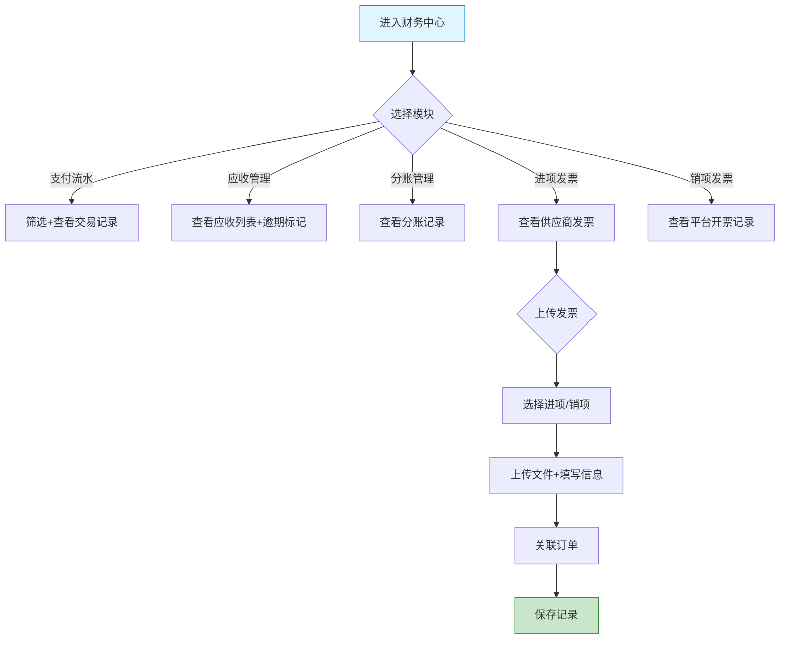

# 平台端 - 财务中心功能详细设计

> 版本：v1.0  
> 文档状态：初稿  
> 所属章节：第十一章

## 版本历史

| 版本 | 日期 | 修订内容 | 修订人 |
|:----:|:----:|---------|:-----:|
| v1.0 | 2026-04-24 | 初始创建，覆盖财务中心7个功能点的完整详细设计 | PM |
| v2.0 | 2026-04-24 | 重构为新版11章模板，新增核心设计原则、Mermaid流程图、权限矩阵、非功能性需求、异常汇总表、接口依赖建议 | PM |

<!-- ============================================================ -->
<!-- PRD六层模型：                                                    -->
<!--                                                              -->
<!-- 核心层(必写)： 功能概述 → 设计原则 → 业务规则(含流程图) → 功能点详情   -->
<!-- 扩展层(推荐)： 权限矩阵 → 非功能性需求 → 异常汇总 → 接口依赖      -->
<!-- 治理层(状态模块必写)： 状态流转图 → 状态治理矩阵 → 版本历史       -->
<!-- ============================================================ -->

---

## 一、功能概述

### 1.1 功能定位

财务中心是平台端**全平台财务管理**入口，包括支付流水监控、应收/分账管理、进项/销项发票管理。平台端财务管理以监控和记录为主，不做在线支付。

### 1.2 核心概念

| 概念 | 说明 |
|:----|------|
| 支付流水 | 所有端的在线支付交易记录 |
| 应收管理 | 平台各端应收款项记录 |
| 分账 | 系统自动计算的收入分账记录 |
| 进项发票 | 供应商给平台开具的发票 |
| 销项发票 | 平台给工程仓/施工方开具的发票 |

### 1.3 目标用户

- **平台财务**（核心用户）：管理发票、监控支付流水
- **平台管理员**：查看财务数据

### 1.4 模块范围

| 功能分类 | 主要功能 | 优先级 |
|:--------|---------|:------:|
| 支付流水 | 支付流水（汇总金额+导出） | P0 |
| 应收管理 | 应收记录 | P1 |
| 分账 | 分账列表 | P1 |
| 进项发票 | 进项发票列表 | P1 |
| 销项发票 | 销项发票列表 | P1 |
| 发票管理 | 发票上传、发票关联订单 | P2 |

---

## 二、核心设计原则

> **财务中心遵循"记录监控"原则——所有财务数据以记录和展示为主，不做在线交易。**

### 2.1 只读记录原则

- 所有财务数据（支付流水/应收/分账）只读不可操作
- 支付流水记录所有端的在线支付记录
- 分账记录不可手动修改

### 2.2 发票管理双向原则

- 进项发票=供应商→平台（成本端）
- 销项发票=平台→工程仓/施工方（收入端）
- 发票上传后关联对应订单，形成完整链路

---

## 三、业务规则

### 3.1 支付流水规则

- 支付流水记录所有端（供应商/工程仓/施工方）的在线支付记录
- 流水数据只读不可操作
- 支持按交易单号精确搜索

### 3.2 分账规则

- 分账规则由平台定义（按商品分类/供应商维度）
- 系统自动计算分账金额
- 分账记录不可手动修改

### 3.3 发票规则

- 一笔订单只能关联一个发票
- 发票上传后关联对应订单
- 发票文件格式：PDF/JPG/PNG，大小不超过10MB

### 3.4 核心业务流程图

---

## 四、权限矩阵

| 功能模块 | 具体操作 | 财务 | 管理员 | 说明 |
|:--------|---------|:----:|:------:|------|
| **支付流水** | 查看+导出 | ✅ | ✅ | - |
| **应收管理** | 查看 | ✅ | ✅ | - |
| **分账管理** | 查看 | ✅ | ✅ | - |
| **进项发票** | 查看 | ✅ | ✅ | - |
| **销项发票** | 查看 | ✅ | ✅ | - |
| **发票上传** | 上传+关联 | ✅ | ❌ | - |

---

## 五、非功能性需求

| 接口/场景 | P95要求 |
|:---------|:-------:|
| 支付流水查询 | ≤ 500ms |
| 发票列表查询 | ≤ 500ms |
| 发票上传 | ≤ 2s（含文件上传） |

---

## 六、功能点详细设计

### 6.1 支付流水（P0）

#### 交互逻辑

1. 顶部汇总：总交易笔数/总交易金额
2. 筛选条件：端/交易单号/交易时间范围/支付状态
3. 列表展示：交易单号/来源端/订单编号/支付金额/支付方式/支付状态/支付时间
4. 导出按钮：导出当前筛选结果到Excel

---

### 6.2 应收管理（P1）

列表展示：应收单号/应收端/应付方/金额/状态/到期日。逾期标记：超期未收款项红色标记。

### 6.3 分账列表（P1）

列表展示：分账编号/订单编号/商品/总金额/供应商分账金额/平台分账金额/状态/分账时间。

### 6.4 进项发票列表（P1）

列表展示：发票编号/供应商/金额/税号/开票日期/关联订单/状态/操作。

### 6.5 销项发票列表（P1）

列表展示：发票编号/开票对象/金额/税号/开票日期/关联订单/状态。

### 6.6 发票上传（P2）

#### 交互逻辑

1. 弹窗：选择发票类型（进项/销项）+ 上传发票 + 填写信息
2. 关联订单：搜索订单编号进行关联
3. 提交后记录保存

#### 边界情况覆盖

| 场景 | 提示文案 |
|:----|---------|
| 文件格式不支持 | "仅支持JPG/PNG/PDF格式文件" |
| 发票编号重复 | "该发票编号已存在" |
| 关联订单不存在 | "未找到该订单，请检查订单编号" |

### 6.7 发票关联订单（P2）

展示当前发票已关联的订单列表，支持关联和解除关联（二次确认）。

---

## 七、异常处理汇总表

| 异常场景 | 提示文案 |
|:--------|---------|
| 发票文件格式不支持 | "仅支持JPG/PNG/PDF格式文件" |
| 发票编号重复 | "该发票编号已存在" |
| 关联订单不存在 | "未找到该订单，请检查订单编号" |
| 导出任务已提交 | "导出任务已提交，请稍后在下载中心查看" |

---

## 八、接口需求说明

| 接口 | 用途 | 性能要求 |
|:----|:----|:--------:|
| 支付流水 | 支付流水 |
| 导出流水 | 导出流水 |
| 应收列表 | 应收列表 |
| 分账列表 | 分账列表 |
| 发票列表 | 发票列表 |
| 上传发票 | 上传发票 |
| 关联订单 | 关联订单 |

---

## 九、状态治理矩阵

### 9.1 动作定义表

| 动作ID | 动作名称 | 触发方式 | 说明 |
|:-----:|---------|---------|------|
| FIN-01 | 查看支付流水 | 页面加载/筛选 | 交易记录查询 |
| FIN-02 | 导出流水 | 导出按钮 | Excel导出 |
| FIN-03 | 查看应收管理 | 页面加载/筛选 | 应收记录查询 |
| FIN-04 | 查看分账记录 | 页面加载/筛选 | 分账记录查询 |
| FIN-05 | 查看进项发票 | 页面加载/筛选 | 进项发票查询 |
| FIN-06 | 查看销项发票 | 页面加载/筛选 | 销项发票查询 |
| FIN-07 | 上传发票 | 弹窗上传 | 发票文件+关联 |

### 9.2 错误提示汇总

| 场景 | 提示文案 |
|:----:|---------|
| 发票文件格式不支持 | "仅支持JPG/PNG/PDF格式文件" |
| 发票编号重复 | "该发票编号已存在" |
| 关联订单不存在 | "未找到该订单，请检查订单编号" |
| 导出中提示 | "导出任务已提交，请稍后在下载中心查看" |
