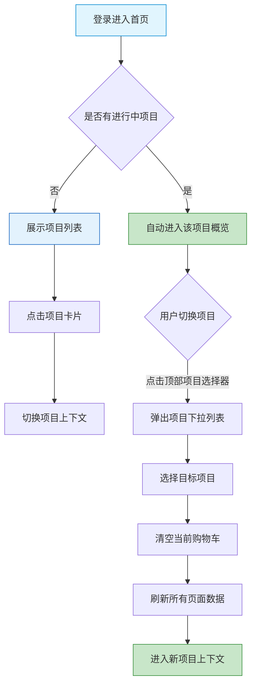

# 施工方端 - 首页与项目功能详细设计

> 版本：v2.0  
> 文档状态：已定稿  
> 所属章节：第五章

## 版本历史

| 版本 | 日期 | 修订内容 | 修订人 |
|:----:|:----:|---------|:-----:|
| v1.0 | 2026-04-24 | 初始创建，覆盖首页与项目全部5个功能点 | PM |
| v2.0 | 2026-04-24 | 重构为新版11章模板，新增核心设计原则、Mermaid流程图、权限矩阵、非功能性需求、异常汇总表、接口依赖建议，原子字段新增必填列 | PM |

<!-- ============================================================ -->
<!-- PRD六层模型：                                                    -->
<!--                                                              -->
<!-- 核心层(必写)： 功能概述 → 设计原则 → 业务规则(含流程图) → 功能点详情   -->
<!-- 扩展层(推荐)： 权限矩阵 → 非功能性需求 → 异常汇总 → 接口依赖      -->
<!-- 治理层(状态模块必写)： 状态流转图 → 状态治理矩阵 → 版本历史       -->
<!-- ============================================================ -->

---

## 一、功能概述

### 1.1 功能定位

首页与项目是施工方端的**组织核心模块**，施工方以项目为维度管理所有采购活动。首页提供项目列表、切换、概览等核心能力，是施工方登录后的第一站。

### 1.2 核心概念

| 概念 | 说明 | 示例 |
|:----|------|------|
| 项目 | 施工方负责的建筑工程项目，采购组织维度 | "深圳湾壹号装修项目" |
| 项目切换 | 施工方负责多个项目时在不同项目间切换上下文 | 从"A项目"切换到"B项目" |
| 工程仓 | 项目关联的仓库，施工方的商品供应方 | "南山工程仓"、"宝安工程仓" |
| 项目概览 | 展示当前项目的采购核心指标看板 | 本月采购金额/待发货订单数 |

### 1.3 目标用户

- **采购员**（核心用户）：日常在项目间切换，浏览商品、管理订单
- **管理员**：管理项目关联的工程仓配置，查看项目详情
- **仓管员**：查看项目概览数据，了解待处理工单

### 1.4 模块范围

| 功能分类 | 主要功能 | 涉及角色 |
|:--------|---------|---------|
| 项目管理 | 项目列表、项目切换、项目详情 | 所有角色 |
| 项目概览 | 项目数据看板 | 管理员、采购员 |
| 工程仓管理 | 工程仓列表（查看项目关联仓） | 所有角色 |

---

## 二、核心设计原则

> **施工方以"项目"为一切操作的上下文根维度，所有采购数据隔离于项目。**

### 2.1 项目隔离原则

- 不同项目的购物车、订单、库存数据完全隔离
- 项目切换后，所有页面数据刷新为当前项目上下文
- 项目与工程仓多对多关联，一个工程仓可服务多个项目

### 2.2 上下文即时切换原则

- 项目切换操作反应速度快（≤300ms），减少等待感知
- 切换后购物车清空（不同项目独立购物车），订单列表自动刷新
- 最近使用的项目排在列表最前面，方便快速进入

### 2.3 轻量概览原则

- 项目概览只展示核心采购指标，不做明细数据下钻
- 各指标卡片独立加载，互不影响

---

## 三、业务规则

### 3.1 项目规则

- 施工方可管理多个项目，但同一时间只能在一个项目中操作
- 项目切换后，所有采购数据（购物车、订单）跟随当前项目
- 项目与工程仓多对多关联

### 3.2 首页规则

- 默认进入首页后展示项目列表
- 若有正在进行的项目，自动进入该项目概览
- 最近使用的项目排在列表最前面

### 3.3 核心业务流程图

#### 流程图1：项目切换上下文变更流程

---

## 四、权限矩阵

### 4.1 功能权限总表

| 功能模块 | 具体操作 | 管理员 | 采购员 | 仓管员 | 说明 |
|:--------|---------|:------:|:------:|:------:|------|
| **项目列表** | 查看项目列表 | ✅ | ✅ | ✅ | 所有角色 |
| | 搜索项目 | ✅ | ✅ | ✅ | - |
| **项目切换** | 切换当前项目 | ✅ | ✅ | ✅ | 所有角色 |
| **项目概览** | 查看概览数据 | ✅ | ✅ | ❌ | 仓管员无需查看 |
| | 查看数据指标 | ✅ | ✅ | ❌ | - |
| **工程仓列表** | 查看关联工程仓 | ✅ | ✅ | ✅ | - |
| | 点击进入商品市场 | ✅ | ✅ | ✅ | - |
| **项目详情** | 查看项目信息 | ✅ | ✅ | ✅ | 所有角色 |

### 4.2 权限校验方式

- **前端**：按钮/功能级权限控制，无权限操作隐藏
- **后端**：接口校验用户角色和项目归属

---

## 五、非功能性需求

### 5.1 性能要求

| 接口/场景 | 指标 | P95要求 | 说明 |
|:---------|:----|:-------:|------|
| 项目列表查询 | 响应时间 | ≤ 300ms | 含项目数量少，缓存5分钟 |
| 项目切换 | 响应时间 | ≤ 300ms | 切换后前端清空+重请求 |
| 项目概览统计 | 响应时间 | ≤ 500ms | 各指标卡片并行请求 |
| 工程仓列表查询 | 响应时间 | ≤ 300ms | 关联仓数量少 |

### 5.2 埋点需求

| 页面 | 事件名 | 触发时机 | 上报字段 |
|:----|:------|---------|---------|
| 首页 | home_project_list_view | 进入项目列表页 | - |
| 项目切换 | project_switch | 切换项目操作 | `fromProjectId`, `toProjectId` |
| 项目概览 | project_overview_view | 进入概览页 | `projectId` |

### 5.3 安全要求

| 风险点 | 预期防护策略 |
|:------|---------|---------|
| 越权查看其他项目数据 | 接口校验项目归属 | 每个接口校验用户是否属于该项目 |
| 切换频率控制 | 前端防抖 | 切换操作2秒内禁止重复切换 |

---

## 六、功能点详细设计

### 6.1 项目列表（P0）

#### 交互逻辑

1. 页面加载：请求项目列表接口 → 以卡片形式展示项目列表
2. 点击项目卡片 → 切换至该项目（若仅1个项目则自动进入）
3. 支持按项目名称搜索
4. 左滑项目卡片可查看关联工程仓数量

#### 原子字段定义

| 字段 | 必填 | 来源 | 校验规则 | 展示规则 | 默认值 |
|:----|:----|:----:|:----|:--------|:--------|:-----:|
| 项目名称 | 是 | 项目接口 | 非空 | 左对齐主标题 | - |
| 项目编码 | 是 | 项目接口 | 非空 | 次要文本 | - |
| 项目地址 | 否 | 项目接口 | - | 文本摘要(截断) | - |
| 关联工程仓数 | 否 | 项目接口 | ≥0 | 数字角标 | 0 |
| 最近使用时间 | 否 | 项目接口 | - | 排名依据 | - |

#### 边界情况覆盖

| 场景 | 处理逻辑 | 提示文案 |
|:----|:--------|---------|
| 项目列表为空 | 显示空状态插画+引导新建项目提示 | "暂无项目" |
| 搜索无结果 | 显示空状态 | "未找到匹配的项目" |
| 接口超时 | 显示整页重试按钮 | "项目加载失败，请重试" |
| 用户只有1个项目 | 自动进入项目概览，不展示项目列表 | - |

---

### 6.2 项目切换（P0）

#### 交互逻辑

1. 点击顶部项目名称 → 弹出项目选择下拉列表
2. 下拉列表按最近使用时间排序，显示项目名称+编码
3. 选择目标项目 → 切换当前项目上下文
4. 切换后：购物车内容清空，订单列表刷新为当前项目数据
5. 切换后：商品市场数据切换到当前项目关联工程仓

#### 原子字段定义

| 字段 | 必填 | 来源 | 校验规则 | 展示规则 | 默认值 |
|:----|:----|:----:|:----|:--------|:--------|:-----:|
| 当前项目ID | 是 | 前端全局状态 | 非空 | 顶部导航栏显示 | 默认项目 |
| 项目名称 | 是 | 项目接口 | 非空 | 顶部导航栏+下拉箭头 | - |
| 可用项目列表 | 是 | 项目接口 | 至少1个 | 下拉列表 | - |

#### 边界情况覆盖

| 场景 | 处理逻辑 | 提示文案 |
|:----|:--------|---------|
| 切换失败 | 保持当前项目不变，Toast提示 | "项目切换失败，请重试" |
| 目标项目已删除 | 从下拉列表中移除，自动切到第一个可用项目 | "该项目已不可用，已自动切换" |
| 网络异常时切换 | 前端缓存项目列表，可离线切换 | - |

---

### 6.3 项目概览（P1）

#### 交互逻辑

1. 页面加载：进入项目首页 → 调用概览统计接口 → 渲染指标卡片
2. 展示指标：本月采购金额、本月采购单数、待发货订单、待确认订单
3. 各指标卡片独立展示，点击可跳转对应模块列表

#### 原子字段定义

| 字段 | 必填 | 来源 | 校验规则 | 展示规则 | 默认值 |
|:----|:----|:----:|:----|:--------|:--------|:-----:|
| 本月采购金额 | 否 | 统计接口 | ≥0 | 数字+单位"元" | 加载中... |
| 本月采购单数 | 否 | 统计接口 | ≥0 | 数字卡片 | 加载中... |
| 待发货订单 | 否 | 统计接口 | ≥0 | >0时橙色预警 | 加载中... |
| 待确认订单 | 否 | 统计接口 | ≥0 | >0时蓝色高亮 | 加载中... |

#### 边界情况覆盖

| 场景 | 处理逻辑 | 提示文案 |
|:----|:--------|---------|
| 统计接口超时 | 对应卡片显示"--" | 无额外提示 |
| 全部指标为0 | 正常显示0 | - |
| 只有当月数据 | 首次进入项目时0数据正常展示 | - |

---

### 6.4 工程仓列表（P1）

#### 交互逻辑

1. 列表展示当前项目关联的所有工程仓
2. 每个工程仓显示名称、地址摘要、商品数量
3. 点击工程仓 → 进入该工程仓的商品市场
4. 下拉加载更多（若关联仓数量多）

#### 原子字段定义

| 字段 | 必填 | 来源 | 校验规则 | 展示规则 | 默认值 |
|:----|:----|:----:|:----|:--------|:--------|:-----:|
| 工程仓名称 | 是 | 仓库接口 | 非空 | 左对齐主标题 | - |
| 工程仓地址 | 否 | 仓库接口 | - | 次要文本 | - |
| 商品数量 | 否 | 仓库接口 | ≥0 | 文本"共{N}件商品" | 0 |

#### 边界情况覆盖

| 场景 | 处理逻辑 | 提示文案 |
|:----|:--------|---------|
| 无关联工程仓 | 显示空状态 | "当前项目未关联工程仓" |
| 工程仓已停用 | 列表灰色显示，不可点击 | "该工程仓已停用" |
| 商品数量为0 | 正常显示"共0件商品" | - |

---

### 6.5 项目详情（P1）

#### 交互逻辑

1. 从项目列表点击项目卡片 → 进入项目详情页
2. 展示项目完整信息：名称、编码、地址、关联工程仓列表、创建时间
3. 关联工程仓列表可点击跳转

#### 原子字段定义

| 字段 | 必填 | 来源 | 校验规则 | 展示规则 | 默认值 |
|:----|:----|:----:|:----|:--------|:--------|:-----:|
| 项目名称 | 是 | 项目接口 | 非空 | 主标题 | - |
| 项目编码 | 是 | 项目接口 | 非空 | 次要文本 | - |
| 项目地址 | 否 | 项目接口 | - | 完整文本 | - |
| 关联工程仓 | 否 | 仓库接口 | - | 可点击列表 | [] |
| 创建时间 | 否 | 项目接口 | - | YYYY-MM-DD HH:mm | - |

#### 边界情况覆盖

| 场景 | 处理逻辑 | 提示文案 |
|:----|:--------|---------|
| 项目信息加载失败 | 显示重试按钮 | "项目信息加载失败" |
| 关联工程仓已删除 | 列表不展示已删除仓 | - |

---

## 七、异常处理汇总表

| 异常场景 | 触发条件 | 处理方式 | 提示文案 |
|:--------|:--------|:--------|:--------|---------|
| 项目列表加载失败 | 接口返回错误/网络异常 | 显示整页重试 | 无特殊处理 | "项目加载失败，请重试" |
| 项目切换失败 | 切换接口异常 | 保持当前项目 | 返回切换失败原因 | "项目切换失败，请重试" |
| 项目概览加载失败 | 统计接口异常 | 对应卡片显示"--" | 无特殊处理 | "数据加载失败" |
| 工程仓列表加载失败 | 接口异常 | 显示重试按钮 | 无特殊处理 | "工程仓信息加载失败" |
| 项目详情加载失败 | 接口异常 | 显示重试按钮 | 无特殊处理 | "项目信息加载失败" |
| 切换过于频繁 | 2秒内重复切换 | 禁用切换按钮 | - | "请勿频繁切换" |

---

## 八、接口需求说明

| 接口用途 | 核心能力要求 |
|:----|:----|:-------------|:--------:|
| 项目列表 | 项目列表 |
| 项目切换 | 项目切换 |
| 项目概览统计 | 项目概览统计 |
| 工程仓列表 | 工程仓列表 |
| 项目详情 | 项目详情 |
