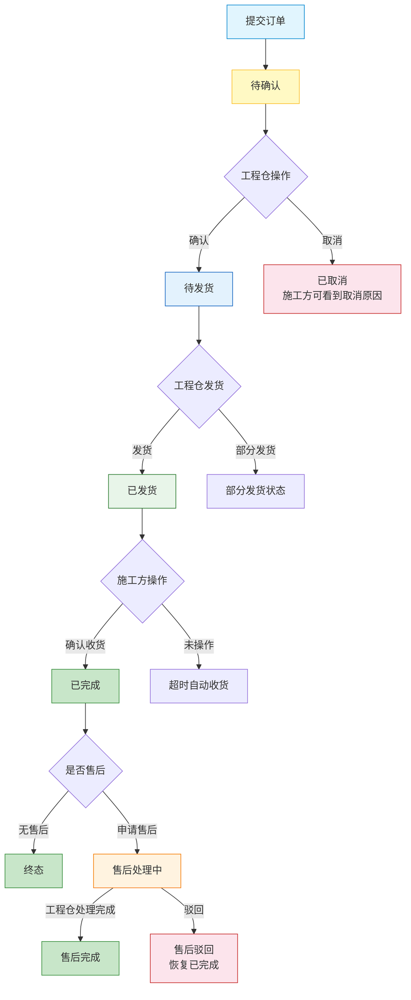
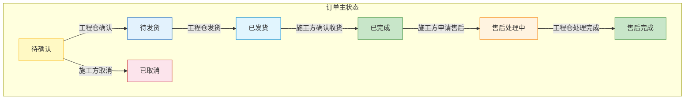
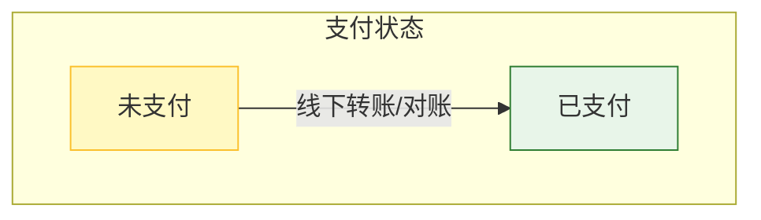
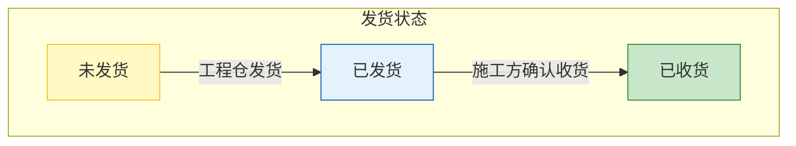

# 施工方端 - 订单管理功能详细设计

> 版本：v2.0  
> 文档状态：已定稿  
> 所属章节：第八章

## 版本历史

| 版本 | 日期 | 修订内容 | 修订人 |
|:----:|:----:|---------|:-----:|
| v1.0 | 2026-04-24 | 初始创建，覆盖订单管理全部6个功能点 | PM |
| v2.0 | 2026-04-24 | 重构为新版11章模板，新增核心设计原则、Mermaid流程图、状态流转图、权限矩阵、非功能性需求、异常汇总表、接口依赖建议，原子字段新增必填列 | PM |

<!-- ============================================================ -->
<!-- PRD六层模型：                                                    -->
<!--                                                              -->
<!-- 核心层(必写)： 功能概述 → 设计原则 → 业务规则(含流程图) → 功能点详情   -->
<!-- 扩展层(推荐)： 权限矩阵 → 非功能性需求 → 异常汇总 → 接口依赖      -->
<!-- 治理层(状态模块必写)： 状态流转图 → 状态治理矩阵 → 版本历史       -->
<!-- ============================================================ -->

---

## 一、功能概述

### 1.1 功能定位

订单管理是施工方端的**核心消费模块**，覆盖从下单到收货再到售后的完整订单生命周期。施工方通过订单管理模块跟踪每个采购订单的状态、进行收货和售后操作。

### 1.2 核心概念

| 概念 | 说明 | 示例 |
|:----|------|------|
| 采购订单 | 施工方向工程仓发起的商品采购订单 | "PO-20260424-0001" |
| 订单三状态 | 订单主状态/支付状态/发货状态独立运行 | 主状态=已发货，支付=未支付 |
| 确认收货 | 施工方验收货物后确认完成的最终操作 | "确认收货"按钮 |
| 售后申请 | 对已完成订单的质量/数量问题发起申诉 | "申请售后"表单 |

### 1.3 目标用户

- **采购员**（核心用户）：查看订单状态、取消待确认订单、申请售后
- **管理员**：管理所有订单，确认收货操作
- **仓管员**：查看订单列表和详情，了解采购进度

### 1.4 模块范围

| 功能分类 | 主要功能 | 涉及角色 |
|:--------|---------|---------|
| 订单查询 | 订单列表、订单详情、订单跟踪 | 所有角色 |
| 订单操作 | 取消订单、确认收货 | 管理员、采购员 |
| 售后衍生 | 申请售后 | 管理员、采购员 |

---

## 二、核心设计原则

> **订单采用"三状态分离"设计：主状态、支付状态、发货状态各轨道独立运行，互不阻塞。**

### 2.1 三状态分离原则

| 状态轨道 | 状态值 | 核心规则 | 说明 |
|:--------|:-------|:--------|------|
| **订单主状态** | 待确认 → 待发货 → 已发货 → 已完成 / 已取消 | 施工方操作推进 | 主流程链路 |
| **支付状态** | 未支付 → 已支付 | 对接财务系统，施工方只读 | 线下支付对账用 |
| **售后状态** | 无售后 → 售后处理中 → 售后完成 | 独立于主状态运行 | 不影响主状态流转 |

### 2.2 施工方操作边界

- 施工方仅能操作"待确认"状态的订单取消
- 施工方仅能操作"已发货"状态的订单确认收货
- 施工方仅能操作"已完成"状态的订单申请售后

### 2.3 数据隔离原则

- 订单数据按项目隔离，不同项目的订单完全独立
- 订单按创建时间倒序排列
- 状态筛选范围作用于当前项目

---

## 三、业务规则

### 3.1 订单状态规则

| 状态 | 说明 | 施工方可操作 |
|:----|------|:----------:|
| 待确认（pending） | 已下单，等待工程仓确认订单 | ✅ 取消 |
| 待发货（confirmed） | 工程仓已确认，等待发货 | ❌ |
| 已发货（shipped） | 工程仓已发货，运输中 | ✅ 确认收货 |
| 已完成（completed） | 施工方已确认收货 | ✅ 申请售后 |
| 已取消（cancelled） | 订单作废 | ❌ |
| 售后处理中（after_sale） | 已发起售后申请 | 等待工程仓处理 |

### 3.2 订单列表规则

- **默认排序**：按下单时间倒序排列
- **状态Tab筛选**：全部/待确认/待发货/已发货/已完成/已取消
- **分页规则**：滚动加载，每页20条
- **空状态**：该状态下无订单时显示空状态插画

### 3.3 售后规则

- 仅"已完成"状态的订单可申请售后
- 售后问题类型：质量问题 / 数量问题 / 其他
- 问题描述必填，字数限制500字以内
- 售后申请提交后通知工程仓处理

### 3.4 核心业务流程图

#### 流程图1：订单生命周期流程

---

## 四、权限矩阵

### 4.1 功能权限总表

| 功能模块 | 具体操作 | 管理员 | 采购员 | 仓管员 | 说明 |
|:--------|---------|:------:|:------:|:------:|------|
| **订单列表** | 查看订单列表 | ✅ | ✅ | ✅ | 所有角色 |
| | 状态Tab筛选 | ✅ | ✅ | ✅ | - |
| **订单详情** | 查看完整订单信息 | ✅ | ✅ | ✅ | - |
| | 查看状态时间线 | ✅ | ✅ | ✅ | - |
| **取消订单** | 取消待确认订单 | ✅ | ✅ | ❌ | 仅采购角色 |
| **确认收货** | 确认收货操作 | ✅ | ❌ | ✅ | 管理员+仓管员 |
| **申请售后** | 提交售后申请 | ✅ | ✅ | ❌ | 仅采购角色 |
| **订单跟踪** | 查看物流信息 | ✅ | ✅ | ✅ | 所有角色 |

### 4.2 权限校验方式

- **前端**：按钮级权限控制，无权限操作隐藏（不同角色看到的操作按钮不同）
- **后端**：订单操作接口校验用户角色

---

## 五、非功能性需求

### 5.1 性能要求

| 接口/场景 | 指标 | P95要求 | 说明 |
|:---------|:----|:-------:|------|
| 订单列表查询 | 响应时间 | ≤ 500ms | 分页20条/页 |
| 订单详情查询 | 响应时间 | ≤ 300ms | 含商品明细+时间线 |
| 取消订单 | 响应时间 | ≤ 500ms | 含状态校验 |
| 确认收货 | 响应时间 | ≤ 300ms | - |
| 申请售后 | 响应时间 | ≤ 500ms | 含文件上传 |

### 5.2 埋点需求

| 页面 | 事件名 | 触发时机 | 上报字段 |
|:----|:------|---------|---------|
| 订单列表 | order_list_view | 进入订单列表 | `statusTab` |
| 订单列表 | order_status_filter | 切换状态Tab | `status` |
| 订单详情 | order_detail_view | 查看订单详情 | `orderId` |
| 订单操作 | order_cancel | 取消订单 | `orderId`, `reason` |
| 订单操作 | order_confirm_receipt | 确认收货 | `orderId` |
| 售后 | after_sale_apply | 申请售后 | `orderId`, `type` |

### 5.3 安全要求

| 风险点 | 预期防护策略 |
|:------|---------|---------|
| 越权取消订单 | 接口校验订单归属和状态 | 仅待确认+本项目的订单可取消 |
| 重复确认收货 | 后端幂等 | 订单状态机保证不可重复收货 |
| 售后描述XSS | 输入过滤+转义 | 富文本输入过滤HTML标签 |

---

## 六、功能点详细设计

### 6.1 订单列表（P0）

#### 交互逻辑

1. 页面加载：默认展示全部订单（按状态Tab），第一页20条
2. Tab筛选：全部/待确认/待发货/已发货/已完成/已取消
3. 点击订单卡片 → 进入订单详情
4. 下拉加载更多，触底自动加载下一页
5. 卡片右侧根据状态展示操作按钮（如取消/确认收货）

#### 原子字段定义

| 字段 | 必填 | 来源 | 校验规则 | 展示规则 | 默认值 |
|:----|:----|:----:|:----|:--------|:--------|:-----:|
| 订单编号 | 是 | 订单接口 | 非空 | 等宽字体 | - |
| 工程仓名称 | 是 | 订单接口 | 非空 | 左对齐次要文本 | - |
| 商品摘要 | 是 | 订单接口 | 非空 | "名称×数量+..." | - |
| 订单金额 | 是 | 订单接口 | >0 | 红色加粗右对齐 | - |
| 订单状态 | 是 | 订单接口 | - | 状态Tag(颜色区分) | - |
| 下单时间 | 是 | 订单接口 | - | YYYY-MM-DD HH:mm | - |

#### 边界情况覆盖

| 场景 | 处理逻辑 | 提示文案 |
|:----|:--------|---------|
| 该状态下无订单 | 显示空状态插画 | "暂无{状态名}订单" |
| 订单列表加载失败 | 显示重试按钮 | "订单加载失败，请重试" |
| 商品摘要过长 | 截断显示"..." | - |

---

### 6.2 订单详情（P0）

#### 交互逻辑

1. 页面加载：请求订单详情接口 → 渲染订单详情页
2. 顶部：订单编号+状态Tag
3. 商品明细区域：名称/规格/数量/单价/小计
4. 金额汇总区域：商品金额+运费+合计
5. 收货信息区域：地址+联系人
6. 状态时间线：竖向时间线展示从下单到当前的变更记录
7. 底部操作栏：根据状态动态展示操作按钮

#### 原子字段定义

| 字段 | 必填 | 来源 | 校验规则 | 展示规则 | 默认值 |
|:----|:----|:----:|:----|:--------|:--------|:-----:|
| 订单编号 | 是 | 订单接口 | 非空 | 顶部标题 | - |
| 订单状态 | 是 | 订单接口 | - | 状态Tag(颜色不同) | - |
| 商品列表 | 是 | 订单接口 | 至少1个 | 列表：名称/规格/数量/单价/小计 | [] |
| 商品金额 | 是 | 订单接口 | ≥0 | 金额汇总 | 0.00 |
| 运费 | 否 | 订单接口 | ≥0 | 金额汇总 | 0.00 |
| 订单总金额 | 是 | 订单接口 | >0 | 加粗红色大号 | - |
| 收货地址 | 是 | 订单接口 | 非空 | 文本 | - |
| 状态时间线 | 是 | 订单接口 | 非空 | 竖向时间线 | [] |

#### 边界情况覆盖

| 场景 | 处理逻辑 | 提示文案 |
|:----|:--------|---------|
| 订单详情加载失败 | 显示重试按钮 | "订单信息加载失败" |
| 订单已删除/不存在 | 显示错误提示 | "订单不存在" |
| 物流信息为空 | 不展示物流区域 | - |

---

### 6.3 取消订单（P0）

#### 交互逻辑

1. 前置条件：订单状态=待确认
2. 点击"取消订单"按钮 → Modal二次确认弹窗
3. 弹窗显示取消原因选择：不需要了/下错了/其他
4. 确认 → 调用取消接口 → 订单状态变更为"已取消"
5. 取消 → 保持现状
6. 取消成功后发送通知给工程仓

#### 原子字段定义

| 字段 | 必填 | 来源 | 校验规则 | 展示规则 | 默认值 |
|:----|:----|:----:|:----|:--------|:--------|:-----:|
| 取消原因 | 否 | 用户选择 | - | Radio选择 | 其他 |
| 当前状态 | 是 | 订单接口 | =待确认 | - | - |

#### 边界情况覆盖

| 场景 | 处理逻辑 | 提示文案 |
|:----|:--------|---------|
| 订单已确认（状态不对） | 取消按钮置灰隐藏 | "该订单已确认，无法取消" |
| 取消接口失败 | Toast提示，数据不更新 | "取消订单失败，请稍后重试" |
| 订单已被工程仓取消 | 前端显示已取消状态 | - |

---

### 6.4 确认收货（P0）

#### 交互逻辑

1. 前置条件：订单状态=已发货
2. 点击"确认收货"按钮 → Modal二次确认弹窗
3. 弹窗提示：确认已收到全部货物？
4. 确认 → 调用收货接口 → 订单状态变更为"已完成"
5. 完成后更新项目采购统计数据

#### 边界情况覆盖

| 场景 | 处理逻辑 | 提示文案 |
|:----|:--------|---------|
| 非已发货状态 | 确认收货按钮隐藏 | - |
| 重复确认收货 | 后端幂等，第二次返回成功 | - |
| 确认收货失败 | Toast提示，数据保持 | "确认收货失败，请重试" |
| 部分收货 | 当前版本仅支持整单确认收货 | - |

---

### 6.5 申请售后（P1）

#### 交互逻辑

1. 前置条件：订单状态=已完成
2. 点击"申请售后"按钮 → 弹出售后表单（Modal/新页面）
3. 选择问题类型：质量问题 / 数量问题 / 其他
4. 填写问题描述（必填，限500字）
5. 可选上传图片附件（最多3张，每张≤5MB）
6. 提交 → 售后申请提交成功，通知工程仓
7. 提交后订单状态变更为"售后处理中"

#### 原子字段定义

| 字段 | 必填 | 来源 | 校验规则 | 展示规则 | 默认值 |
|:----|:----|:----:|:----|:--------|:--------|:-----:|
| 问题类型 | 是 | 用户选择 | 三选一 | Radio/Select | - |
| 问题描述 | 是 | 用户输入 | 非空，≤500字 | Textarea | - |
| 附件图片 | Array[File] | 否 | 用户上传 | 每张≤5MB，最多3张 | ImageUpload | [] |
| 当前订单状态 | 是 | 订单接口 | =已完成 | 只读展示 | - |

#### 边界情况覆盖

| 场景 | 处理逻辑 | 提示文案 |
|:----|:--------|---------|
| 未完成订单申请售后 | 售后按钮隐藏 | - |
| 描述为空 | 阻止提交，表单校验 | "请填写问题描述" |
| 图片过大 | 前端拦截不上传 | "图片大小不能超过5M" |
| 图片数量超限 | 隐藏上传按钮 | "最多上传3张图片" |
| 提交失败 | Toast提示，内容保留 | "售后申请提交失败，请重试" |
| 重复提交售后（已有进行中的售后） | 提示已有售后处理中 | "已有售后申请在处理中" |

---

### 6.6 订单跟踪（P1）

#### 交互逻辑

1. 在订单详情页点击物流信息区域 → 展开物流详情
2. 展示：物流公司名称、物流单号（可复制）
3. 物流轨迹时间线：各转运节点的时间+地点+状态

#### 原子字段定义

| 字段 | 必填 | 来源 | 校验规则 | 展示规则 | 默认值 |
|:----|:----|:----:|:----|:--------|:--------|:-----:|
| 物流公司 | 否 | 物流接口 | - | 文本标签 | - |
| 物流单号 | 否 | 物流接口 | - | 文本+复制按钮 | - |
| 物流轨迹 | 否 | 物流接口 | - | 竖向时间线 | [] |

#### 边界情况覆盖

| 场景 | 处理逻辑 | 提示文案 |
|:----|:--------|---------|
| 无物流信息 | 物流区域不展示 | - |
| 物流轨迹加载失败 | 显示基础信息，轨迹显示加载失败 | "物流轨迹加载失败" |
| 物流单号可复制 | 点击单号复制到剪贴板 | Toast："已复制" |

---

## 七、异常处理汇总表

| 异常场景 | 触发条件 | 处理方式 | 提示文案 |
|:--------|:--------|:--------|:--------|---------|
| 订单列表加载失败 | 接口异常/超时 | 显示重试按钮 | 无特殊处理 | "订单加载失败，请重试" |
| 订单详情加载失败 | 接口异常 | 显示重试按钮 | 无特殊处理 | "订单信息加载失败" |
| 取消订单-状态不对 | 订单已确认 | 按钮置灰/隐藏 | 返回状态冲突 | "该订单已确认，无法取消" |
| 取消订单-接口失败 | 网络异常 | Toast提示 | 事务回滚 | "取消订单失败，请稍后重试" |
| 确认收货-状态不对 | 非已发货状态 | 按钮隐藏 | 返回状态冲突 | - |
| 确认收货-接口失败 | 网络异常 | Toast提示 | 事务回滚 | "确认收货失败，请重试" |
| 申请售后-已有进行中售后 | 重复提交 | 阻止提交 | 返回已有售后处理中 | "已有售后申请在处理中" |
| 申请售后-接口失败 | 网络异常 | Toast提示，保持数据 | 事务回滚 | "售后申请失败，请重试" |
| 物流轨迹加载失败 | 物流接口异常 | 基础信息展示，轨迹隐藏 | - | "物流轨迹加载失败" |

---

## 八、接口需求说明

| 接口用途 | 核心能力要求 |
|:----|:----|:-------------|:--------:|
| 订单列表 | 订单列表 |
| 订单详情 | 订单详情 |
| 取消订单 | 取消订单 |
| 确认收货 | 确认收货 |
| 申请售后 | 申请售后 |
| 物流跟踪 | 物流跟踪 |

---

## 九、状态流转图

### 9.1 订单主状态

### 9.2 支付状态

### 9.3 发货状态

---

## 十、状态治理矩阵

### 10.1 动作定义表

| 动作ID | 动作名称 | 触发方式 | 触发角色 | 说明 |
|:-----:|---------|---------|:-------:|------|
| SOR-01 | 查看订单 | 点击订单卡片 | 所有角色 | 查看订单详情 |
| SOR-02 | 取消订单 | 点击取消按钮 | 管理员、采购员 | 仅待确认状态可操作 |
| SOR-03 | 确认收货 | 点击确认收货 | 管理员、仓管员 | 仅已发货状态可操作 |
| SOR-04 | 申请售后 | 点击申请售后 | 管理员、采购员 | 仅已完成状态可操作 |
| SOR-05 | 跟踪物流 | 点击物流信息 | 所有角色 | 已发货/已完成状态可用 |
| SOR-06 | 查看售后进度 | 点击售后详情 | 管理员、采购员 | 售后处理中状态可用 |

### 10.2 状态×操作矩阵

| 状态 \ 操作 | SOR-01查看 | SOR-02取消 | SOR-03收货 | SOR-04售后 | SOR-05跟踪 | SOR-06售后进度 |
|:-----------:|:----------:|:----------:|:----------:|:----------:|:----------:|:--------------:|
| **待确认** | ✅ | ✅ | ❌ | ❌ | ❌ | ❌ |
| **待发货** | ✅ | ❌ | ❌ | ❌ | ❌ | ❌ |
| **已发货** | ✅ | ❌ | ✅ | ❌ | ✅ | ❌ |
| **已完成** | ✅ | ❌ | ❌ | ✅ | ✅ | ❌ |
| **已取消** | ✅ | ❌ | ❌ | ❌ | ❌ | ❌ |
| **售后处理中** | ✅ | ❌ | ❌ | ❌ | ❌ | ✅ |

### 10.3 每状态角色权限

#### 待确认（未处理，施工方可取消）

| 操作 | 管理员 | 采购员 | 仓管员 |
|:----:|:-------:|:-------:|:------:|
| 查看订单 | ✅ | ✅ | ✅ |
| 取消订单 | ✅ | ✅ | ❌ |

#### 已发货（运输中，施工方可确认收货）

| 操作 | 管理员 | 采购员 | 仓管员 |
|:----:|:-------:|:-------:|:------:|
| 查看订单 | ✅ | ✅ | ✅ |
| 确认收货 | ✅ | ❌ | ✅ |
| 跟踪物流 | ✅ | ✅ | ✅ |

#### 已完成（终态，施工方可申请售后）

| 操作 | 管理员 | 采购员 | 仓管员 |
|:----:|:-------:|:-------:|:------:|
| 查看订单 | ✅ | ✅ | ✅ |
| 申请售后 | ✅ | ✅ | ❌ |
| 跟踪物流 | ✅ | ✅ | ✅ |
