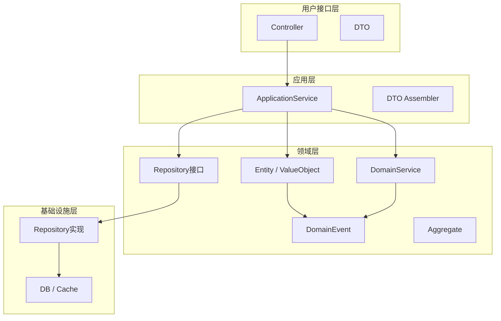

# {项目名称} - 领域模型设计

> 版本：v1.0  
> 文档状态：初稿  
> 所属章节：第四章

<!-- ============================================================ -->
<!-- 模板说明：本文档定义核心领域模型，面向DDD实现                 -->
<!-- 核心章节：功能概述 / 核心实体 / 领域服务 / 领域事件 / 分层架构 -->
<!-- ============================================================ -->

---

## 一、功能概述

### 1.1 功能定位

本文档定义{项目名称}的**领域模型**，包括核心领域实体、领域服务、领域事件。面向开发团队，指导后端代码的领域驱动设计（DDD）实现，确保业务逻辑的准确性和可维护性。

### 1.2 核心概念

| 概念 | 说明 |
|-----|------|
| 领域实体 | 有唯一标识的业务对象，如订单、库存 |
| 值对象 | 无唯一标识的概念性对象，如地址、金额 |
| 领域服务 | 跨实体的业务操作，如库存调拨 |
| 领域事件 | 业务操作触发的通知，如订单创建事件 |
| 聚合根 | 实体关系的根节点，如Order是OrderItem的聚合根 |

### 1.3 目标用户

- **后端开发工程师**：基于领域模型设计代码结构和数据库访问层
- **架构师**：评估领域划分和实体关系设计的合理性
- **技术负责人**：理解核心业务逻辑的代码映射

---

## 二、核心领域实体

### 2.1 {实体名称一}（{EntityNameInEnglish}）

**核心属性：**
- {属性名}: {类型} — {说明}
- {属性名}: {类型} — {说明}
- {属性名}: {类型} — {说明}

**关联关系：**
- 1:N {关联实体} ({说明})
- 1:1 {关联实体} ({说明})
- N:M {关联实体} ({说明})

**领域方法：**
- `{方法名}({参数})`: {说明}
- `{方法名}({参数})`: {说明}

**业务约束：**
- {约束条件1}
- {约束条件2}

### 2.2 {实体名称二}（{EntityNameInEnglish}）

**核心属性：**
- {属性名}: {类型} — {说明}

**关联关系：**
- N:1 {父实体} ({说明})
- 1:N {子实体} ({说明})

**领域方法：**
- `{方法名}({参数})`: {说明}

**业务约束：**
- {约束条件}

---

## 三、领域服务

### 3.1 {领域服务一}

> 说明：{服务描述}

```typescript
interface {ServiceName} {
  /** {方法描述} */
  {方法名}({参数}: {参数类型}): {返回类型}
  
  /** {方法描述} */
  {方法名}({参数}: {参数类型}): {返回类型}
}
```

**业务规则：**
1. {规则1}
2. {规则2}

### 3.2 {领域服务二}

<!-- 重复 3.1 的模板结构 -->

---

## 四、领域事件

### 4.1 事件定义

| 事件名称 | 触发时机 | 携带数据 | 消费者 |
|---------|---------|---------|--------|
| {EventName} | {触发场景} | {数据字段} | {消费服务} |
| {EventName} | {触发场景} | {数据字段} | {消费服务} |

### 4.2 事件处理流程

```typescript
// 示例：事件发布与订阅
// 发布方
domainEventPublisher.publish(new OrderCreatedEvent(orderId, timestamp))

// 订阅方
@EventListener
handleOrderCreated(event: OrderCreatedEvent) {
  // 更新库存、发送通知等
}
```

---

## 五、DDD分层架构



### 各层职责

| 分层 | 职责 | 包含内容 |
|-----|------|---------|
| **用户接口层** | 接收请求，返回响应 | Controller, DTO, 参数校验 |
| **应用层** | 业务流程编排，事务管理 | ApplicationService, Assembler |
| **领域层** | 核心业务逻辑 | Entity, ValueObject, DomainService, DomainEvent, Repository接口 |
| **基础设施层** | 技术实现 | RepositoryImpl, ORM映射, 消息队列 |

> **依赖规则：** 外层依赖内层，领域层不依赖任何外部框架

---

## 六、聚合定义

| 聚合根 | 包含实体 | 仓储 |
|-------|---------|------|
| {EntityName} | {子实体列表} | {RepositoryName} |
| {EntityName} | {子实体列表} | {RepositoryName} |

---

## 七、版本历史

| 版本 | 日期 | 修订内容 |
|:----:|:----:|---------|
| v1.0 | {YYYY-MM-DD} | 初始创建 |
