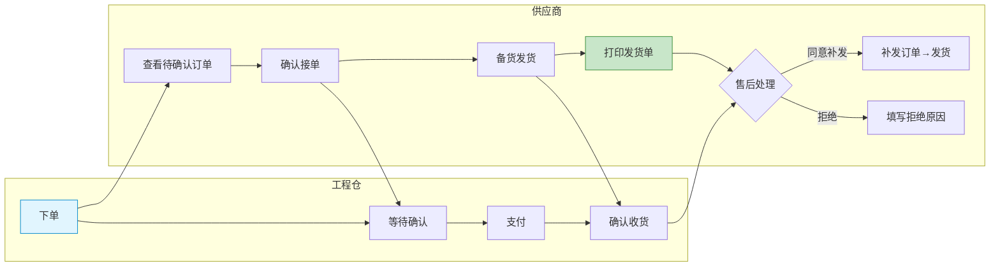
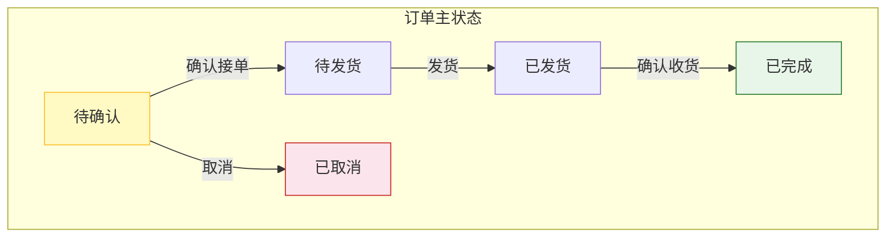
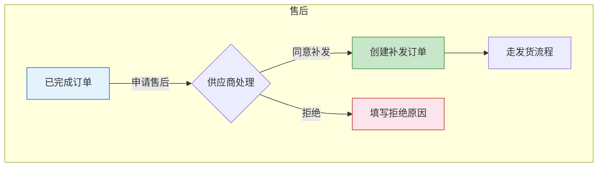

# 供应商端 - 订单管理功能详细设计

> 版本：v1.0  
> 文档状态：初稿  
> 所属章节：第七章

## 版本历史

| 版本 | 日期 | 修订内容 | 修订人 |
|:----:|:----:|---------|:-----:|
| v1.0 | 2026-04-24 | 初始创建，覆盖11个功能点的完整详细设计 | PM |
| v2.0 | 2026-04-24 | 重构为新版11章模板，新增核心设计原则、Mermaid流程图、权限矩阵、非功能性需求、异常汇总表、接口依赖建议 | PM |

<!-- ============================================================ -->
<!-- PRD六层模型：                                                    -->
<!--                                                              -->
<!-- 核心层(必写)： 功能概述 → 设计原则 → 业务规则(含流程图) → 功能点详情   -->
<!-- 扩展层(推荐)： 权限矩阵 → 非功能性需求 → 异常汇总 → 接口依赖      -->
<!-- 治理层(状态模块必写)： 状态流转图 → 状态治理矩阵 → 版本历史       -->
<!-- ============================================================ -->

---

## 一、功能概述

### 1.1 功能定位

订单管理是供应商端的**核心履约模块**，覆盖从接单到发货再到售后补发的完整订单生命周期。

### 1.2 核心概念

| 概念 | 说明 | 示例 |
|:----|------|------|
| 订单三状态 | 订单主状态/支付状态/发货状态独立运行 | pending→confirmed→shipped |
| 货损补发 | 运输中货物损坏后供应商重新发货 | - |
| 发货打印 | 供应商发货时打印的发货凭证单据 | - |

### 1.3 目标用户

- **管理员**（核心用户）：管理所有订单，确认/发货/售后
- **业务员**：查看订单，确认接单
- **仓管员**：发货操作
- **客服**：处理售后补发

### 1.4 模块范围

| 功能分类 | 主要功能 | 优先级 |
|:--------|---------|:------:|
| 订单管理 | 订单列表、详情、确认、取消、发货、打印 | P0-P1 |
| 售后管理 | 售后列表、货损处理、补发处理、拒绝补发 | P1-P2 |

---

## 二、核心设计原则

> **订单管理遵循"三状态分离"原则——订单/支付/发货各自独立运行，互不依赖。**

### 2.1 三状态分离原则

- 订单主状态：待确认→待发货→已发货→已完成→已取消
- 支付状态：未支付→已支付（只做记录，不做强制校验）
- 发货状态：未发货→已发货
- 三状态独立运行，互不阻塞

### 2.2 线下生意适配原则

- 物流公司非必填：支持自有配送场景
- 物流单号非必填：自有配送场景可不填
- 可分批发货，发货记录自动汇总

### 2.3 售后闭环原则

- 仅已完成的订单可发起售后
- 补发自动生成补发订单，沿用原订单价格
- 拒绝补发必须填写原因

---

## 三、业务规则

### 3.1 订单状态规则

- **待确认**（pending）：工程仓下单，等待供应商接单
- **待发货**（confirmed）：供应商已接单，等待发货
- **已发货**（shipped）：供应商已发货
- **已完成**（completed）：工程仓确认收货
- **已取消**（cancelled）：订单作废

### 3.2 发货规则

- 物流公司非必填：支持自有配送场景
- 物流单号非必填：自有配送场景可不填
- 可分批发货，发货记录自动汇总

### 3.3 售后规则

- 仅已完成的订单可发起售后
- 补发自动生成补发订单，沿用原订单价格
- 拒绝补发必须填写原因

### 3.4 核心业务流程图

#### 流程图1：订单履约全流程（含泳道）

---

## 四、权限矩阵

| 功能模块 | 具体操作 | 管理员 | 业务员 | 仓管员 | 客服 | 说明 |
|:--------|---------|:------:|:------:|:------:|:----:|------|
| **订单列表** | 查看列表 | ✅ | ✅ | ✅ | ✅ | - |
| **订单详情** | 查看详情 | ✅ | ✅ | ✅ | ✅ | - |
| **确认订单** | 确认接单 | ✅ | ✅ | ❌ | ❌ | - |
| **取消订单** | 取消操作 | ✅ | ❌ | ❌ | ❌ | - |
| **发货** | 填写物流发货 | ✅ | ❌ | ✅ | ❌ | - |
| **发货打印** | 打印发货单 | ✅ | ❌ | ✅ | ❌ | - |
| **售后处理** | 同意/拒绝补发 | ✅ | ❌ | ❌ | ✅ | - |

---

## 五、非功能性需求

| 接口/场景 | P95要求 |
|:---------|:-------:|
| 订单列表查询 | ≤ 500ms |
| 订单详情查询 | ≤ 300ms |
| 确认订单 | ≤ 500ms |
| 发货提交 | ≤ 500ms |
| 发货打印 | ≤ 300ms |

---

## 六、功能点详细设计

### 6.1 订单列表（P0）

#### 交互逻辑

1. 默认展示「待确认」Tab
2. Tab：全部/待确认/待发货/已发货/已完成/已取消
3. 点击订单卡片 → 进入订单详情
4. 每个Tab显示当前状态订单的数量角标

#### 原子字段定义

| 字段 | 类型 | 必填 | 来源 | 展示规则 |
|:----|:----|:----:|:----|:--------|
| 订单编号 | String(32) | 是 | 系统 | 文本 |
| 工程仓名称 | String(50) | 是 | 订单 | 文本 |
| 商品数量 | Integer | 是 | 订单 | 数字 |
| 订单金额 | Decimal(12,2) | 是 | 订单 | 数字+单位"元" |
| 订单状态 | Enum | 是 | 系统 | Tag(颜色区分) |
| 下单时间 | DateTime | 是 | 系统 | YYYY-MM-DD HH:mm |

---

### 6.2 订单详情（P0）

展示订单全部信息：顶部订单编号+状态Tag、工程仓信息+收货地址、商品明细列表、状态时间线、操作按钮区域（根据状态动态展示）。

### 6.3 确认订单（P0）

点击确认 → 直接执行（无二次确认）→ 状态变更为"待发货" → 通知工程仓。

#### 边界情况覆盖

| 场景 | 处理逻辑 | 提示文案 |
|:----|:--------|---------|
| 重复确认 | 幂等处理 | "该订单已确认，请勿重复操作" |
| 非待确认状态 | 按钮置灰 | - |

### 6.4 订单发货（P0）

#### 交互逻辑

1. 点击发货 → 弹出物流信息弹窗
2. 填写物流公司（非必填）、物流单号（非必填）、发货备注
3. 点击提交 → 状态变更为"已发货"

#### 原子字段定义

| 字段 | 类型 | 必填 | 来源 | 校验规则 |
|:----|:----|:----:|:----|:--------|
| 物流公司 | String(50) | 否 | Select/Input | - |
| 物流单号 | String(50) | 否 | Input | - |
| 发货备注 | String(200) | 否 | Textarea | 最大200字 |

### 6.5 售后管理—补发处理（P1）

查看货损证据→同意补发(自动创建补发订单)/拒绝补发(必填原因)。

### 6.6 发货打印（P0）

弹出发货单预览→确认调用浏览器打印功能。发货单模板：供应商信息+工程仓信息+商品明细+日期。

---

## 七、异常处理汇总表

| 异常场景 | 前端处理 | 提示文案 |
|:--------|:--------|---------|
| 重复确认订单 | Toast | "该订单已确认" |
| 非待确认状态取消 | 按钮置灰 | "该订单已确认，无法取消" |
| 补发拒绝理由为空 | 表单校验 | "请填写拒绝原因" |
| 订单不存在 | Modal | "订单不存在或已删除" |
| 发货提交失败 | Toast | "发货失败，请重试" |

---

## 八、接口依赖建议

| 接口 | 用途 | 性能要求 |
|:----|:----|:--------:|
| `/api/supplier/order/list` | 订单列表 | P95 ≤ 500ms |
| `/api/supplier/order/detail` | 订单详情 | P95 ≤ 300ms |
| `/api/supplier/order/confirm` | 确认订单 | P95 ≤ 500ms |
| `/api/supplier/order/ship` | 订单发货 | P95 ≤ 500ms |
| `/api/supplier/order/after-sale/process` | 售后处理 | P95 ≤ 500ms |
| `/api/supplier/order/print` | 发货打印 | P95 ≤ 300ms |

---

## 九、状态流转图

### 9.1 订单主状态

### 9.2 售后处理流程

---

## 十、状态治理矩阵

### 10.1 动作定义表

| 动作ID | 动作名称 | 触发方式 | 触发角色 | 说明 |
|:-----:|---------|---------|:-------:|------|
| ORD-01 | 确认订单 | 点击按钮 | admin/sales | 确认接单 |
| ORD-02 | 取消订单 | 点击按钮 | admin | 取消订单 |
| ORD-03 | 发货 | 点击按钮 | admin/warehouse | 填写物流发货 |
| ORD-04 | 打印发货单 | 点击按钮 | admin/warehouse | 打印发货凭证 |
| ORD-05 | 同意补发 | 点击按钮 | admin/service | 同意并创建补发单 |
| ORD-06 | 拒绝补发 | 点击按钮 | admin/service | 拒绝并填写原因 |

### 10.2 状态×操作矩阵

| 状态 \ 操作 | ORD-01确认 | ORD-02取消 | ORD-03发货 | ORD-04打印 | ORD-05补发 | ORD-06拒绝 |
|:----------:|:----------:|:----------:|:----------:|:----------:|:----------:|:----------:|
| **待确认** | ✅ | ✅ | ❌ | ❌ | ❌ | ❌ |
| **待发货** | ❌ | ❌ | ✅ | ❌ | ❌ | ❌ |
| **已发货** | ❌ | ❌ | ❌ | ✅ | ❌ | ❌ |
| **已完成** | ❌ | ❌ | ❌ | ✅ | ✅ | ✅ |
| **已取消** | ❌ | ❌ | ❌ | ❌ | ❌ | ❌ |

### 10.3 错误提示汇总

| 场景 | 提示文案 | 组件类型 |
|:----:|---------|:--------:|
| 重复确认订单 | "该订单已确认，请勿重复操作" | Toast |
| 非待确认状态取消 | "该订单已确认，无法取消" | Toast |
| 补发拒绝理由为空 | "请填写拒绝原因" | 表单校验 |
| 订单不存在 | "订单不存在或已删除" | Modal |
