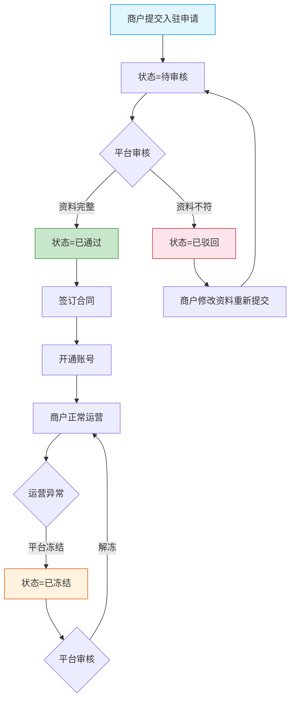
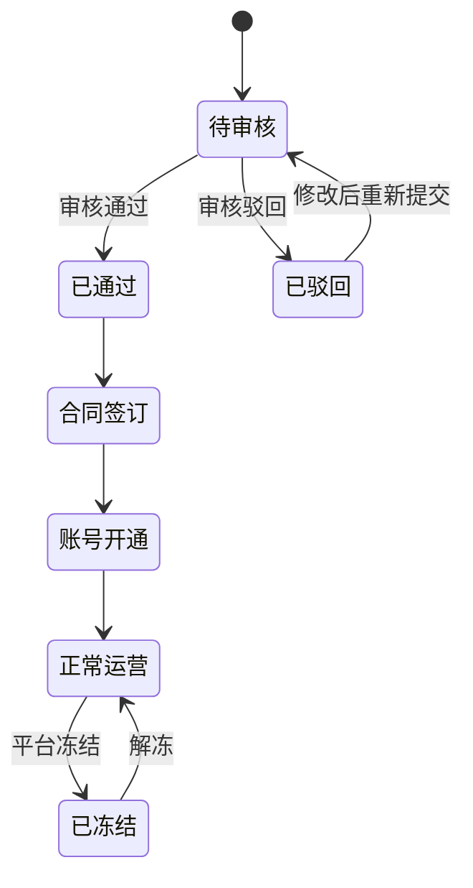

# 平台端 - 商户管理功能详细设计

> 版本：v1.0  
> 文档状态：初稿  
> 所属章节：第六章

## 版本历史

| 版本 | 日期 | 修订内容 | 修订人 |
|:----:|:----:|---------|:-----:|
| v1.0 | 2026-04-24 | 初始创建，覆盖商户管理7个功能点的框架结构 | PM |
| v2.0 | 2026-04-24 | 重构为新版11章模板，完善功能点详细设计（原TODO补全），新增核心设计原则、权限矩阵、非功能性需求、异常汇总表、接口依赖建议 | PM |

<!-- ============================================================ -->
<!-- PRD六层模型：                                                    -->
<!--                                                              -->
<!-- 核心层(必写)： 功能概述 → 设计原则 → 业务规则(含流程图) → 功能点详情   -->
<!-- 扩展层(推荐)： 权限矩阵 → 非功能性需求 → 异常汇总 → 接口依赖      -->
<!-- 治理层(状态模块必写)： 状态流转图 → 状态治理矩阵 → 版本历史       -->
<!-- ============================================================ -->

---

## 一、功能概述

### 1.1 功能定位

商户管理是平台端**最核心的管理功能**，负责供应商/工程仓/施工方三种商户类型的全生命周期管理——从入驻申请→资料审核→合同签订→账号开通→运营监控→冻结/解冻。是平台掌控商户准入和运营状态的唯一入口。

### 1.2 核心概念

| 概念 | 说明 | 示例 |
|:----|------|------|
| 商户类型 | 供应商/工程仓/施工方三种入驻类型 | supplier / warehouse / constructor |
| 入驻申请 | 商户在线提交的注册资料+资质文件 | 包含8个基本字段+营业执照 |
| 审核流 | 平台对商户申请的审批流程 | pending→approved/rejected |
| 合同 | 商户入驻后签署的服务协议 | PDF文件归档 |

### 1.3 目标用户

- **平台管理员**（核心角色）：审核/冻结/管理商户
- **平台客服**：查看商户信息，协助处理问题
- **平台超管**：拥有所有商户管理权限

### 1.4 模块范围

| 功能分类 | 主要功能 | 优先级 | 涉及角色 |
|:--------|---------|:------:|---------|
| 商户查询 | 商户列表查询 | P0 | admin/service |
| 商户创建 | 新增商户 | P0 | admin |
| 商户查看 | 商户详情 | P0 | admin/service |
| 商户审核 | 商户审核（通过/驳回） | P0 | admin |
| 商户管控 | 商户冻结/解冻 | P1 | admin |
| 合同管理 | 合同列表查询 | P1 | admin |
| 合同管理 | 新增合同 | P1 | admin |

---

## 二、核心设计原则

> **商户管理遵循"审核流驱动"原则，商户生命周期由平台审核节点控制。**

### 2.1 审核流驱动原则

- 商户状态变更必须经过平台审核（自动流转除外）
- 审核流程不可逆：通过→冻结→解冻为单向操作
- 驳回时强制填写原因（10-200字）

### 2.2 数据管控原则

- 商户基本资料提交后变为只读（不可修改），变更需重新提交审核
- 冻结状态下商户无法登录系统，但已有订单继续执行
- 合同文件只读归档，不可在线编辑

### 2.3 RBAC权限隔离

- 商户管理操作按角色严格区分：管理员可审核/冻结，客服仅查看
- 超管拥有所有商户管理权限

---

## 三、业务规则

### 3.1 商户状态规则

- **待审核（pending）**：商户提交入驻申请后默认状态
  - 平台管理员可查看资料并审核
  - 商户可撤回申请
  - 超30天未审核→系统提醒平台管理员
- **已通过（approved）**：审核通过，可进行合同签订和账号开通
  - 基本资料变为只读（不可修改）
  - 可签订合同、开通账号
- **已驳回（rejected）**：审核未通过
  - 商户查看驳回原因后可修改资料重新提交
  - 驳回原因必须填写（10-200字）
- **已冻结（frozen）**：运营异常时平台封禁
  - 冻结后所有端禁止登录
  - 已有订单继续执行（不中断交易）
  - 可解冻恢复

### 3.2 查询规则

- 默认按创建时间倒序
- 多条件筛选：商户名称/类型/状态/时间范围
- 状态Tab：全部/待审核/已通过/已驳回/已冻结

### 3.3 核心业务流程图

#### 流程图1：商户入驻审核流程

---

## 四、权限矩阵

### 4.1 功能权限总表

| 功能模块 | 具体操作 | 超管 | 管理员 | 客服 | 说明 |
|:--------|---------|:----:|:------:|:----:|------|
| **商户查询** | 查看商户列表 | ✅ | ✅ | ✅ | 所有角色 |
| | 详情查看 | ✅ | ✅ | ✅ | - |
| **商户创建** | 新增商户 | ✅ | ✅ | ❌ | - |
| **商户审核** | 审核（通过/驳回） | ✅ | ✅ | ❌ | - |
| **商户管控** | 冻结商户 | ✅ | ✅ | ❌ | - |
| | 解冻商户 | ✅ | ✅ | ❌ | - |
| **合同管理** | 查看合同 | ✅ | ✅ | ❌ | - |
| | 新增合同 | ✅ | ✅ | ❌ | - |

### 4.2 权限校验方式

- **前端**：按钮级权限控制，无权限操作直接隐藏
- **后端**：每个接口校验用户角色和归属，无权限返回403

---

## 五、非功能性需求

### 5.1 性能要求

| 接口/场景 | 指标 | P95要求 | 说明 |
|:---------|:----|:-------:|------|
| 商户列表查询 | 响应时间 | ≤ 500ms | 含多条件筛选+分页 |
| 商户详情查询 | 响应时间 | ≤ 300ms | - |
| 审核提交 | 响应时间 | ≤ 500ms | - |
| 合同查询 | 响应时间 | ≤ 500ms | - |

### 5.2 埋点需求

| 页面 | 事件名 | 触发时机 | 上报字段 |
|:----|:------|---------|---------|
| 商户列表 | merchant_list_view | 进入商户列表页 | `tab`, `filter` |
| 商户审核 | merchant_review | 提交审核结果 | `merchantId`, `action`(approved/rejected) |
| 商户冻结 | merchant_freeze | 冻结操作 | `merchantId` |
| 商户解冻 | merchant_unfreeze | 解冻操作 | `merchantId` |

### 5.3 安全要求

| 风险点 | 防护措施 | 实现方式 |
|:------|---------|---------|
| 越权审核商户 | 接口角色校验 | 仅admin/super_admin可调用审核接口 |
| 重复审核提交 | 幂等性校验 | 订单号幂等 + 状态前置校验 |
| 敏感信息泄露 | 数据脱敏 | 联系电话中间4位隐藏 |

---

## 六、功能点详细设计

### 6.1 商户列表查询（P0）

#### 交互逻辑

1. 页面加载：默认展示全部商户列表 → 分页展示（每页20条）
2. 状态Tab切换：全部/待审核(🟡)/已通过(🟢)/已驳回(🔴)/已冻结(⚪) → 按状态筛选
3. 多条件搜索：商户名称/类型/状态/时间范围 → 与Tab状态叠加查询
4. 点击商户行 → 跳转商户详情页
5. 排序：支持按创建时间倒序/正序切换

#### 原子字段定义

| 字段 | 类型 | 必填 | 来源 | 校验规则 | 展示规则 | 默认值 |
|:----|:----|:----:|:----|:--------|:--------|:-----:|
| 商户名称 | String(100) | 是 | 商户提交 | 非空 | 超链接，可点击 | - |
| 商户类型 | Enum | 是 | 入驻申请 | supplier/warehouse/constructor | Tag标签（颜色区分） | - |
| 状态 | Enum | 是 | 系统状态 | pending/approved/rejected/frozen | Tag标签+颜色 | - |
| 联系人 | String(20) | 否 | 商户提交 | - | 文本 | - |
| 联系电话 | String(11) | 否 | 商户提交 | 手机号 | 脱敏：138****1234 | - |
| 创建时间 | DateTime | 是 | 系统生成 | - | YYYY-MM-DD HH:mm | - |

#### 边界情况覆盖

| 场景 | 处理逻辑 | 提示文案 |
|:----|:--------|---------|
| 筛选无结果 | 显示空状态 | "未找到符合条件的商户" |
| 列表为空 | 显示空状态引导 | "暂无商户，点击新增商户" |
| 待审核数量>0 | Tab角标显示数量 | - |

---

### 6.2 新增商户（P0）

#### 交互逻辑

1. 点击"新增商户"按钮 → 弹出新增弹窗（或跳转新增页）
2. 填写商户基本信息：商户类型/名称/联系人/联系电话/邮箱/地址/营业执照
3. 选择商户类型后，部分字段按类型差异化展示
4. 提交 → 后端校验 → 创建成功跳转商户详情 → 失败提示错误

#### 原子字段定义

| 字段 | 类型 | 必填 | 来源 | 校验规则 | 展示规则 | 默认值 |
|:----|:----|:----:|:----|:--------|:--------|:-----:|
| 商户类型 | Enum | 是 | 表单选择 | supplier/warehouse/constructor | Radio/Select | - |
| 商户名称 | String(100) | 是 | 表单输入 | 非空，2-50字 | Input框 | - |
| 统一信用代码 | String(18) | 是 | 表单输入 | 18位字母数字 | Input框+格式校验 | - |
| 法人代表 | String(30) | 是 | 表单输入 | 非空 | Input框 | - |
| 联系人 | String(20) | 是 | 表单输入 | 非空 | Input框 | - |
| 联系电话 | String(11) | 是 | 表单输入 | ^1[3-9]\d{9}$ | Input框+格式校验 | - |
| 邮箱 | String(50) | 否 | 表单输入 | 邮箱格式 | Input框 | - |
| 详细地址 | String(200) | 否 | 表单输入 | 最大200字 | Input框 | - |
| 营业执照 | File | 是 | 文件上传 | jpg/png ≤10MB | Upload组件 | - |

#### 边界情况覆盖

| 场景 | 处理逻辑 | 提示文案 |
|:----|:--------|---------|
| 信用代码重复 | 后端校验拦截 | "该信用代码已被注册" |
| 营业执照文件过大 | 前端拦截 | "营业执照图片不能超过10M" |
| 提交失败 | Toast提示 | "创建失败，请重试" |

---

### 6.3 商户详情（P0）

#### 交互逻辑

1. 页面加载：调用商户详情接口 → 按Tab分组展示信息
2. Tab页：基本信息/合同信息/账号信息/操作日志
3. 各Tab展示对应数据卡片（只读展示）
4. 顶部分类展示商户类型Tag+状态Tag+操作按钮组

#### 原子字段定义

| 字段 | 类型 | 必填 | 来源 | 展示规则 |
|:----|:----|:----:|:----|:--------|
| 商户名称 | String | 是 | 商户信息 | 主标题 |
| 商户类型 | Enum | 是 | 入驻信息 | Tag标签 |
| 统一信用代码 | String(18) | 是 | 商户信息 | 等宽字体 |
| 法人代表 | String | 是 | 商户信息 | 文本 |
| 联系人 | String | 是 | 商户信息 | 文本 |
| 联系电话 | String | 是 | 商户信息 | 脱敏展示 |
| 状态 | Enum | 是 | 系统状态 | Tag标签+颜色 |

---

### 6.4 商户审核（P0）

#### 交互逻辑

1. 前置条件：商户状态=待审核
2. 点击"审核"按钮 → 弹出审核弹窗
3. 审核操作：通过（可直接进入）/ 驳回（必填原因，10-200字）
4. 确认提交 → 状态变更 → 刷新详情
5. 审核通过后：商户可进入合同签订流程

#### 原子字段定义

| 字段 | 类型 | 必填 | 来源 | 校验规则 | 展示规则 |
|:----|:----|:----:|:----|:--------|:--------|
| 审核结果 | Enum(通过/驳回) | 是 | 管理员选择 | 二选一 | Radio按钮 |
| 驳回原因 | String(200) | 条件必填 | 管理员输入 | 10-200字 | Textarea（驳回时显示） |

#### 边界情况覆盖

| 场景 | 处理逻辑 | 提示文案 |
|:----|:--------|---------|
| 重复审核 | 状态校验拦截 | "该商户已审核，请刷新页面" |
| 驳回原因为空 | 前端拦截 | "请输入驳回原因（10-200字）" |
| 驳回原因<10字 | 前端校验 | "驳回原因至少10个字" |

---

### 6.5 商户冻结/解冻（P1）

#### 交互逻辑

1. 点击"冻结"按钮 → Modal二次确认："确认冻结该商户？冻结后商户无法登录系统"
2. 确认 → 调用冻结接口 → 状态变更为已冻结 → 刷新页面
3. 解冻流程相同：点击"解冻" → Modal确认 → 恢复为已通过

#### 边界情况覆盖

| 场景 | 处理逻辑 | 提示文案 |
|:----|:--------|---------|
| 冻结已冻结商户 | 按钮置灰 | "该商户已处于冻结状态" |
| 解冻已解冻商户 | 按钮置灰 | "该商户已处于正常状态" |
| 冻结确认 | Modal二次确认 | "确认冻结该商户？冻结后商户无法登录系统" |
| 解冻确认 | Modal二次确认 | "确认解冻该商户？解冻后商户可正常登录" |

---

### 6.6 合同列表查询（P1）

#### 交互逻辑

1. 商户详情 → 合同Tab → 获取该商户的所有合同列表
2. 表格展示：合同编号/合同名称/签约方/生效日期/截止日期/状态
3. 点击合同编号 → 查看合同详情（PDF预览/下载）

#### 原子字段定义

| 字段 | 类型 | 必填 | 来源 | 展示规则 |
|:----|:----|:----:|:----|:--------|
| 合同编号 | String(32) | 是 | 合同系统 | 超链接，可点击 |
| 合同名称 | String(100) | 是 | 合同系统 | 文本 |
| 签约方 | String(50) | 是 | 合同系统 | 文本 |
| 生效日期 | Date | 是 | 合同系统 | YYYY-MM-DD |
| 截止日期 | Date | 否 | 合同系统 | YYYY-MM-DD |
| 状态 | Enum | 是 | 合同系统 | Tag(生效=绿/过期=灰) |

---

### 6.7 新增合同（P1）

#### 交互逻辑

1. 点击"新增合同"按钮 → 弹窗表单
2. 上传合同PDF文件 → 填写合同编号/名称/签约方/生效日期/截止日期
3. 提交 → 文件上传+数据保存 → 刷新合同列表

#### 边界情况覆盖

| 场景 | 处理逻辑 | 提示文案 |
|:----|:--------|---------|
| 合同文件过大 | 前端拦截 | "合同文件不能超过10M" |
| 文件格式不支持 | 前端拦截 | "仅支持PDF格式文件" |
| 合同编号重复 | 后端校验 | "合同编号已存在" |

---

## 七、异常处理汇总表

| 异常场景 | 触发条件 | 前端处理 | 后端处理 | 提示文案 |
|:--------|:--------|:--------|:--------|---------|
| 信用代码重复 | 提交时唯一校验 | 表单字段标红 | 返回409 | "该信用代码已被注册" |
| 营业执照>10M | 文件选择时 | 前端拦截不上传 | - | "营业执照图片不能超过10M" |
| 审核重复操作 | 订单已审核 | 弹窗提示 | 返回400 | "该商户已审核，请刷新页面" |
| 驳回未填原因 | 提交时校验 | 表单字段标红 | - | "请输入驳回原因（10-200字）" |
| 冻结已冻结商户 | 点击冻结按钮 | 按钮置灰 | - | "该商户已处于冻结状态" |
| 合同文件>10M | 文件选择时 | 前端拦截 | - | "合同文件不能超过10M" |
| 合同编号重复 | 提交时校验 | 表单标红 | 返回409 | "合同编号已存在" |

---

## 八、接口依赖建议

| 接口 | 用途 | 核心字段/逻辑 | 性能要求 |
|:----|:----|:-------------|:--------:|
| `/api/merchant/list` | 商户列表查询 | 输入：name/type/status/dateRange；输出：分页商户列表 | P95 ≤ 500ms |
| `/api/merchant/create` | 新增商户 | 输入：type/name/creditCode/legalPerson/contact/phone/email/address/license | P95 ≤ 500ms |
| `/api/merchant/detail` | 商户详情 | 输入：merchantId；输出：全部商户信息 | P95 ≤ 300ms |
| `/api/merchant/review` | 商户审核 | 输入：merchantId/action/reason；输出：新状态 | P95 ≤ 500ms |
| `/api/merchant/freeze` | 冻结商户 | 输入：merchantId；输出：新状态 | P95 ≤ 500ms |
| `/api/merchant/unfreeze` | 解冻商户 | 输入：merchantId；输出：新状态 | P95 ≤ 500ms |
| `/api/contract/list` | 合同列表 | 输入：merchantId；输出：合同列表 | P95 ≤ 500ms |
| `/api/contract/create` | 新增合同 | 输入：merchantId/file/contractNo/name/party/dateRange | P95 ≤ 1s（含上传） |

---

## 九、状态流转图

### 9.1 商户生命周期状态

---

## 十、状态治理矩阵

### 10.1 动作定义表

| 动作ID | 动作名称 | 触发方式 | 触发角色 | 说明 |
|:-----:|---------|---------|:-------:|------|
| MCH-01 | 查看列表 | 页面加载/切换Tab | admin/service | 多条件筛选 |
| MCH-02 | 查看详情 | 点击商户项 | admin/service | 分Tab展示 |
| MCH-03 | 新增商户 | 「新增商户」按钮 | admin | 弹窗表单 |
| MCH-04 | 审核商户 | 详情页「审核」按钮 | admin | 通过/驳回 |
| MCH-05 | 冻结商户 | 「冻结」按钮 | admin | 二次确认 |
| MCH-06 | 解冻商户 | 「解冻」按钮 | admin | 二次确认 |
| MCH-07 | 查看合同 | 详情页合同Tab | admin | 列表展示 |
| MCH-08 | 新增合同 | 「新增合同」按钮 | admin | 上传PDF |

### 10.2 状态×操作矩阵

| 状态 \ 操作 | MCH-01查看列表 | MCH-02查看详情 | MCH-03新增商户 | MCH-04审核 | MCH-05冻结 | MCH-06解冻 | MCH-07查看合同 | MCH-08新增合同 |
|:----------:|:--------------:|:--------------:|:--------------:|:----------:|:----------:|:----------:|:--------------:|:--------------:|
| **待审核** | ✅ | ✅ | ✅ | ✅ | ❌ | ❌ | ❌ | ❌ |
| **已通过** | ✅ | ✅ | ✅ | ❌ | ✅ | ❌ | ✅ | ✅ |
| **已驳回** | ✅ | ✅ | ✅ | ✅ | ❌ | ❌ | ❌ | ❌ |
| **已冻结** | ✅ | ✅ | ✅ | ❌ | ❌ | ✅ | ✅ | ❌ |

### 10.3 每状态角色权限

#### 待审核

| 操作 | 超管 | 管理员 | 客服 |
|:----:|:----:|:------:|:----:|
| 查看商户 | ✅ | ✅ | ✅ |
| 审核通过 | ✅ | ✅ | ❌ |
| 审核驳回 | ✅ | ✅ | ❌ |

#### 已通过

| 操作 | 超管 | 管理员 | 客服 |
|:----:|:----:|:------:|:----:|
| 查看商户 | ✅ | ✅ | ✅ |
| 冻结 | ✅ | ✅ | ❌ |
| 新增合同 | ✅ | ✅ | ❌ |

#### 已冻结

| 操作 | 超管 | 管理员 | 客服 |
|:----:|:----:|:------:|:----:|
| 查看商户 | ✅ | ✅ | ✅ |
| 解冻 | ✅ | ✅ | ❌ |
