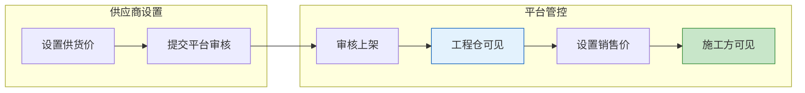
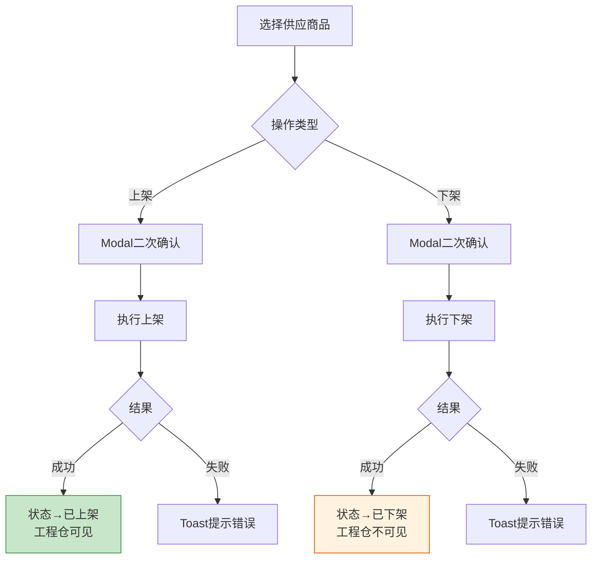

# 平台端 - 商品市场管理功能详细设计

> 版本：v1.0  
> 文档状态：初稿  
> 所属章节：第八章

## 版本历史

| 版本 | 日期 | 修订内容 | 修订人 |
|:----:|:----:|---------|:-----:|
| v1.0 | 2026-04-24 | 初始创建，覆盖商品市场9个功能点的完整详细设计 | PM |
| v2.0 | 2026-04-24 | 重构为新版11章模板，新增核心设计原则、Mermaid流程图、权限矩阵、非功能性需求、异常汇总表、接口依赖建议 | PM |

<!-- ============================================================ -->
<!-- PRD六层模型：                                                    -->
<!--                                                              -->
<!-- 核心层(必写)： 功能概述 → 设计原则 → 业务规则(含流程图) → 功能点详情   -->
<!-- 扩展层(推荐)： 权限矩阵 → 非功能性需求 → 异常汇总 → 接口依赖      -->
<!-- 治理层(状态模块必写)： 状态流转图 → 状态治理矩阵 → 版本历史       -->
<!-- ============================================================ -->

---

## 一、功能概述

### 1.1 功能定位

商品市场管理是平台运营控制**商品在市场上的可见性和价格**的模块，包括供应商品管理、销售商品管理、BOM管理、价格监控等，是平台端管控商品流通的核心入口。

### 1.2 核心概念

| 概念 | 说明 | 示例 |
|:----|------|------|
| 供应商品 | 供应商设置供货价后的商品，决定工程仓看到的价格 | 水泥¥300/吨 |
| 销售商品 | 工程仓设置了销售价的商品，决定施工方看到的价格 | 水泥¥350/吨 |
| BOM | 物料清单/基装包，预设的套餐商品组合 | "标准装修套餐" |
| 商品上下架 | 控制商品在市场中的可见状态 | 已上架/已下架 |

### 1.3 目标用户

- **平台运营**（核心用户）：控制商品可见性和价格
- **平台管理员**：审核和监控商品市场状态

### 1.4 模块范围

| 功能分类 | 主要功能 | 优先级 |
|:--------|---------|:------:|
| 供应商品 | 供应商品列表、商品上下架 | P0 |
| 销售商品 | 销售商品列表、销售价格设置 | P0 |
| BOM管理 | BOM列表、创建BOM、BOM详情、BOM编辑 | P1+P2 |
| 价格管理 | 价格管理列表（异常监控） | P1 |

---

## 二、核心设计原则

> **商品市场管理遵循"三层可见性"原则：平台控制商品流通的每一层可见开关。**

### 2.1 三层可见性原则

- **第一层**（供应商品）：供应商→平台，平台决定工程仓是否可见
- **第二层**（销售商品）：工程仓→施工方，平台监控销售价格
- **第三层**（BOM套餐）：平台预设组合，施工方可直接选购

### 2.2 上下架分离原则

- 上架/下架控制商品可见性，不影响已有订单执行
- 批量操作支持Promise.all并行处理，失败项独立提示

### 2.3 价格监控原则

- 销售价>供货价（亏损可提示）
- 价格变更记录操作日志（操作人/旧值/新值/时间）

---

## 三、业务规则

### 3.1 商品上下架规则

- 上架后供应商端商品对工程仓可见
- 下架后工程仓不可下单，已有订单正常执行
- 批量上下架支持最多100个SKU同时操作

### 3.2 销售价格规则

- 销售价>0，且建议销售价>供货价（允许亏损但黄色提示）
- 销售价变更记录变更历史

### 3.3 BOM规则

- BOM是一个套餐组合，包含多个SKU
- BOM价格=包含商品价格之和
- BOM编辑时支持增删商品

### 3.4 核心业务流程图

#### 流程图1：商品市场三层可见性流转

#### 流程图2：商品上下架操作流程

---

## 四、权限矩阵

### 4.1 功能权限总表

| 功能模块 | 具体操作 | 运营 | 管理员 | 说明 |
|:--------|---------|:----:|:------:|------|
| **供应商品** | 查看列表 | ✅ | ✅ | - |
| | 商品上架/下架 | ✅ | ✅ | 单行+批量 |
| **销售商品** | 查看列表 | ✅ | ✅ | 仓库联动筛选 |
| | 设置销售价 | ✅ | ✅ | - |
| **BOM管理** | BOM增删改查 | ✅ | ✅ | - |
| **价格管理** | 查看价格列表 | ✅ | ✅ | - |

### 4.2 权限校验方式

前端按钮级控制，后端接口校验平台角色。

---

## 五、非功能性需求

### 5.1 性能要求

| 接口/场景 | 指标 | P95要求 | 说明 |
|:---------|:----|:-------:|------|
| 供应商品列表 | 响应时间 | ≤ 500ms | 含筛选+分页 |
| 销售商品列表 | 响应时间 | ≤ 500ms | 含仓库联动筛选 |
| 批量上下架 | 响应时间 | ≤ 3s | 最多100个SKU并行 |

### 5.2 安全要求

| 风险点 | 防护措施 |
|:------|---------|
| 越权设置价格 | 价格操作接口校验平台角色 |
| 重复提交BOM | BOM名称唯一约束 |

---

## 六、功能点详细设计

### 6.1 供应商品列表（P0）

#### 交互逻辑

1. 页面加载：获取所有供应商品列表 → 渲染表格
2. 多条件筛选：供应商/分类/上下架状态/审核状态
3. 列表字段：SKU编码/商品名称/供应商/供货价/上下架状态/审核状态/操作按钮

#### 原子字段定义

| 字段 | 类型 | 必填 | 来源 | 展示规则 |
|:----|:----|:----:|:----|:--------|
| SKU编码 | String(32) | 是 | 系统 | 超链接跳转 |
| 商品名称 | String(100) | 是 | SPU | 文本 |
| 供应商 | String(50) | 是 | 供货关系 | 文本 |
| 供货价 | Decimal(10,2) | 是 | 供应商设置 | 数字+单位"元" |
| 上下架状态 | Enum | 是 | 系统 | Tag(上架=绿/下架=灰) |

---

### 6.2 商品上下架（P0）

#### 交互逻辑

1. 单行操作：每行提供上架/下架按钮
2. 批量操作：勾选多条 → 批量上架/批量下架 → Modal二次确认 → 进度条+结果汇总
3. 状态标签：已上架(🟢)/已下架(⚪)

#### 边界情况覆盖

| 场景 | 处理逻辑 | 提示文案 |
|:----|:--------|---------|
| 下架确认 | Modal二次确认 | "确认下架？下架后工程仓端将无法下单" |
| 批量下架确认 | Modal二次确认 | "确认对选中的N个商品执行下架操作？" |

---

### 6.3 销售商品列表（P0）

#### 交互逻辑

1. 下拉选择：工程仓 → 子仓库联动过滤
2. 列表展示：SKU编码/商品名称/供货价(成本)/销售价/工程仓名称
3. 无权限仓库不显示

---

### 6.4 销售价格设置（P0）

#### 交互逻辑

1. 弹窗编辑：输入销售价
2. 价格校验：>0 + 低于供货价时黄色警告
3. 提交后记录变更历史

#### 边界情况覆盖

| 场景 | 处理逻辑 | 提示文案 |
|:----|:--------|---------|
| 销售价≤0 | 前端拦截 | "销售价格必须大于0" |
| 销售价<供货价 | 黄色警告提示 | "销售价低于供货价，可能导致亏损" |

---

### 6.5 BOM列表（P1）

列表展示：BOM名称/包含商品数/总价/创建时间/状态。操作按钮：新增/编辑/删除/查看详情。

### 6.6 创建BOM（P1）

填写BOM名称+说明 → 搜索并添加SKU商品（支持多选） → 预览BOM总价 → 提交保存。

#### 边界情况覆盖

| 场景 | 处理逻辑 | 提示文案 |
|:----|:--------|---------|
| BOM名重复 | 后端校验 | "BOM名称已存在" |

### 6.7 BOM详情（P1）

基本信息：BOM名称/说明/总价/创建时间。商品明细：表格展示包含的SKU列表。

### 6.8 价格管理列表（P1）

监控全平台商品价格异常，价格异常项标红。支持按时间范围和供应商筛选。

### 6.9 BOM编辑（P2）

编辑BOM基本信息，支持增删商品，重新计算总价。

---

## 七、异常处理汇总表

| 异常场景 | 前端处理 | 提示文案 |
|:--------|:--------|---------|
| 销售价≤0 | 表单标红 | "销售价格必须大于0" |
| 销售价<供货价 | 黄色警告提示 | "销售价低于供货价，可能导致亏损" |
| 下架确认 | Modal | "确认下架？下架后工程仓端将无法下单" |
| 批量下架确认 | Modal | "确认对选中的N个商品执行下架操作？" |
| BOM名重复 | Toast | "BOM名称已存在" |
| BOM删除确认 | Modal(黄色警告) | "确认删除BOM？删除后不可恢复" |

---

## 八、接口依赖建议

| 接口 | 用途 | 核心字段/逻辑 | 性能要求 |
|:----|:----|:-------------|:--------:|
| `/api/market/supply/list` | 供应商品列表 | 输入：supplierId/categoryId/status；输出：分页列表 | P95 ≤ 500ms |
| `/api/market/supply/toggle-status` | 商品上下架 | 输入：skuIds[]/action(up/down) | P95 ≤ 3s(批量) |
| `/api/market/sale/list` | 销售商品列表 | 输入：warehouseId/；输出：分页列表 | P95 ≤ 500ms |
| `/api/market/sale/price` | 设置销售价 | 输入：skuId/warehouseId/price | P95 ≤ 500ms |
| `/api/market/bom/create` | 创建BOM | 输入：name/desc/skuIds[] | P95 ≤ 500ms |
| `/api/market/bom/list` | BOM列表 | 输出：分页列表 | P95 ≤ 300ms |
| `/api/market/price/list` | 价格管理列表 | 输入：supplierId/dateRange；输出：价格数据 | P95 ≤ 500ms |

---

## 九、状态治理矩阵

### 9.1 动作定义表

| 动作ID | 动作名称 | 触发方式 | 说明 |
|:-----:|---------|---------|------|
| MKT-01 | 查看供应商品 | 页面加载/筛选 | 供应商商品池 |
| MKT-02 | 商品上架 | 单行/批量操作 | 控制可见性 |
| MKT-03 | 商品下架 | 单行/批量操作 | 控制可见性 |
| MKT-04 | 查看销售商品 | 仓库联动筛选 | 工程仓售价 |
| MKT-05 | 设置销售价 | 弹窗编辑 | 价格校验 |
| MKT-06 | 创建BOM | 多步骤创建 | 套餐组合 |
| MKT-07 | 编辑BOM | 详情页编辑 | 增删商品 |
| MKT-08 | 删除BOM | 列表行操作 | 删除套餐 |

### 9.2 错误提示汇总

| 场景 | 提示文案 | 组件类型 |
|:----:|---------|:--------:|
| 销售价≤0 | "销售价格必须大于0" | Toast |
| 销售价<供货价 | "销售价低于供货价，可能导致亏损" | 黄色警告提示 |
| 下架确认 | "确认下架？下架后工程仓端将无法下单" | Modal |
| 批量下架确认 | "确认对选中的N个商品执行下架操作？" | Modal |
| BOM名重复 | "BOM名称已存在" | Toast |
| BOM删除确认 | "确认删除BOM？删除后不可恢复" | Modal(黄色警告) |
