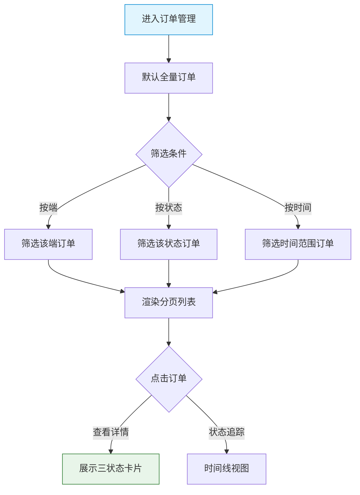

# 平台端 - 订单管理功能详细设计

> 版本：v1.0  
> 文档状态：初稿  
> 所属章节：第九章

## 版本历史

| 版本 | 日期 | 修订内容 | 修订人 |
|:----:|:----:|---------|:-----:|
| v1.0 | 2026-04-24 | 初始创建，覆盖订单管理4个功能点的完整详细设计 | PM |
| v2.0 | 2026-04-24 | 重构为新版11章模板，新增核心设计原则、Mermaid流程图、权限矩阵、非功能性需求、异常汇总表、接口依赖建议 | PM |

<!-- ============================================================ -->
<!-- PRD六层模型：                                                    -->
<!--                                                              -->
<!-- 核心层(必写)： 功能概述 → 设计原则 → 业务规则(含流程图) → 功能点详情   -->
<!-- 扩展层(推荐)： 权限矩阵 → 非功能性需求 → 异常汇总 → 接口依赖      -->
<!-- 治理层(状态模块必写)： 状态流转图 → 状态治理矩阵 → 版本历史       -->
<!-- ============================================================ -->

---

## 一、功能概述

### 1.1 功能定位

订单管理是平台端**跨端订单监控**的入口，平台管理员可查看全平台（供应商+工程仓）所有订单的完整信息，追踪异常订单，协调售后处理。平台端订单管理的核心是"监控和协调"，不直接参与交易操作。

### 1.2 核心概念

| 概念 | 说明 | 示例 |
|:----|------|------|
| 全平台订单 | 包括供应商→工程仓采购订单 + 工程仓→施工方销售订单 | - |
| 订单溯源 | 跨端查看订单从创建到完成的完整流转 | - |
| 售后协调 | 平台介入处理供应商/工程仓/施工方之间的售后纠纷 | - |

### 1.3 目标用户

- **平台管理员**：监控全平台订单状态，追踪异常订单
- **平台客服**：查看订单详情，协调售后处理

### 1.4 模块范围

| 功能分类 | 主要功能 | 优先级 |
|:--------|---------|:------:|
| 订单查询 | 全量订单查询（多维度筛选） | P0 |
| 订单查看 | 订单详情（三状态展示） | P0 |
| 订单追踪 | 订单状态追踪（时间线） | P1 |
| 数据导出 | 订单导出（Excel） | P2 |

---

## 二、核心设计原则

> **订单管理遵循"只读监控"原则——平台端可查看所有订单，不可编辑和操作。**

### 2.1 只读监控原则

- 平台端可查看所有端的订单，但不可编辑/取消/修改
- 异常订单（售后中、超48小时未处理）红色标记
- 订单详情展示三状态（订单状态/支付状态/发货状态）

### 2.2 全量覆盖原则

- 覆盖供应商端采购订单 + 工程仓端销售订单
- 支持按订单端筛选（供应商端/工程仓端/施工方端）
- 支持按订单状态/时间范围多维度筛选

---

## 三、业务规则

- 平台端可查看所有端的订单，不可编辑和操作
- 异常订单包含：售后中、超48小时未处理
- 订单详情展示三状态（订单状态/支付状态/发货状态）

### 3.1 核心业务流程图

#### 流程图1：全量订单查询流程

---

## 四、权限矩阵

| 功能模块 | 具体操作 | 管理员 | 客服 | 说明 |
|:--------|---------|:------:|:----:|------|
| **订单查询** | 查看全量订单 | ✅ | ✅ | - |
| **订单详情** | 查看订单详情 | ✅ | ✅ | - |
| **状态追踪** | 查看时间线 | ✅ | ✅ | - |
| **数据导出** | 导出Excel | ✅ | ❌ | - |

---

## 五、非功能性需求

### 5.1 性能要求

| 接口/场景 | P95要求 |
|:---------|:-------:|
| 全量订单查询 | ≤ 500ms |
| 订单详情查询 | ≤ 300ms |
| 订单导出 | ≤ 5s（异步） |

---

## 六、功能点详细设计

### 6.1 全量订单查询（P0）

#### 交互逻辑

1. 页面加载：获取全量订单列表 → 支持分页展示（每页20条）
2. 多条件筛选：
   - 订单端：全部/供应商端/工程仓端/施工方端
   - 订单编号：精确搜索
   - 订单状态：待付款/待发货/待收货/已完成/已取消/售后中
   - 时间范围：下单时间起止
3. 列表字段：订单编号/下单端/买家/金额/状态/下单时间/操作

#### 原子字段定义

| 字段 | 类型 | 必填 | 来源 | 展示规则 |
|:----|:----|:----:|:----|:--------|
| 订单编号 | String(32) | 是 | 系统生成 | 超链接，可点击 |
| 下单端 | Enum | 是 | 订单来源 | Tag标签(颜色区分) |
| 买家 | String(50) | 是 | 订单信息 | 文本 |
| 商品金额 | Decimal(12,2) | 是 | 订单商品 | 数字+单位"元" |
| 状态 | Enum | 是 | 系统状态 | Tag+售后红色标记 |
| 下单时间 | DateTime | 是 | 系统生成 | YYYY-MM-DD HH:mm |

#### 边界情况覆盖

| 场景 | 处理逻辑 |
|:----|:--------|
| 异常订单（售后中） | 红色标记 |
| 超48小时未处理 | 橙色标记 |
| 筛选无结果 | 空状态展示 |

---

### 6.2 订单详情（P0）

#### 交互逻辑

1. 订单基本信息区：订单编号/下单时间/下单端/买家（只读）
2. 三状态卡片：
   - 订单状态卡片：待付款→待发货→待收货→已完成/已取消
   - 支付状态卡片：未支付→已支付→已退款
   - 发货状态卡片：未发货→已发货→已签收
3. 商品列表区：该订单包含的商品明细（SKU/数量/单价/小计）
4. 收货信息区：收货人/电话/地址

---

### 6.3 订单状态追踪（P1）

以时间线方式展示订单从创建到当前的全流程状态变更记录。每条记录包含：操作时间/操作人/状态变更（前→后）/备注。

### 6.4 订单数据导出（P2）

#### 交互逻辑

1. 点击"导出"按钮 → 弹窗选择导出条件（范围/字段）
2. 确认导出 → 异步生成文件 → 完成后提供下载链接

#### 边界情况覆盖

| 场景 | 提示文案 |
|:----|---------|
| 导出已提交 | "导出任务已提交，请稍后下载" |
| 字段未选择 | "请至少选择一个导出字段" |

---

## 七、异常处理汇总表

| 异常场景 | 前端处理 | 提示文案 |
|:--------|:--------|---------|
| 订单数据加载失败 | 重试按钮 | "订单数据加载失败，请稍后重试" |
| 订单详情加载失败 | 重试按钮 | "订单详情加载失败" |
| 导出已提交 | Toast | "导出任务已提交，请稍后在下载中心查看" |
| 导出字段未选择 | Modal提示 | "请至少选择一个导出字段" |

---

## 八、接口依赖建议

| 接口 | 用途 | 核心逻辑 | 性能要求 |
|:----|:----|:---------|:--------:|
| `/api/order/list` | 全量订单查询 | 输入：source/status/dateRange；输出：分页订单列表 | P95 ≤ 500ms |
| `/api/order/detail` | 订单详情 | 输入：orderId；输出：订单完整信息+三状态 | P95 ≤ 300ms |
| `/api/order/timeline` | 状态追踪 | 输入：orderId；输出：状态变更时间线 | P95 ≤ 300ms |
| `/api/order/export` | 订单导出 | 输入：filter/fields；异步生成Excel | P95 ≤ 5s |

---

## 九、状态治理矩阵

### 9.1 动作定义表

| 动作ID | 动作名称 | 触发方式 | 说明 |
|:-----:|---------|---------|------|
| ORD-01 | 查询订单 | 筛选条件+搜索 | 全量查询 |
| ORD-02 | 查看详情 | 点击订单编号 | 完整信息查看 |
| ORD-03 | 追踪状态 | 时间线Tab查看 | 状态变更记录 |
| ORD-04 | 导出数据 | 导出按钮+弹窗配置 | 文件导出 |

### 9.2 错误提示汇总

| 场景 | 提示文案 | 组件类型 |
|:----:|---------|:--------:|
| 导出任务已提交 | "导出任务已提交，请稍后下载" | Toast |
| 导出字段未选择 | "请至少选择一个导出字段" | Modal提示 |
