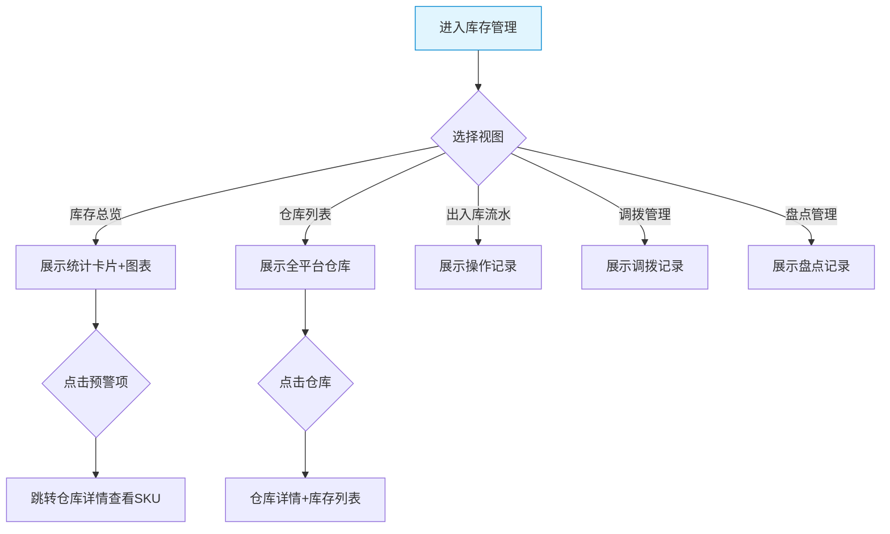

# 平台端 - 库存管理功能详细设计

> 版本：v1.0  
> 文档状态：初稿  
> 所属章节：第十章

## 版本历史

| 版本 | 日期 | 修订内容 | 修订人 |
|:----:|:----:|---------|:-----:|
| v1.0 | 2026-04-24 | 初始创建，覆盖库存管理6个功能点的完整详细设计 | PM |
| v2.0 | 2026-04-24 | 重构为新版11章模板，新增核心设计原则、Mermaid流程图、权限矩阵、非功能性需求、异常汇总表、接口依赖建议 | PM |

<!-- ============================================================ -->
<!-- PRD六层模型：                                                    -->
<!--                                                              -->
<!-- 核心层(必写)： 功能概述 → 设计原则 → 业务规则(含流程图) → 功能点详情   -->
<!-- 扩展层(推荐)： 权限矩阵 → 非功能性需求 → 异常汇总 → 接口依赖      -->
<!-- 治理层(状态模块必写)： 状态流转图 → 状态治理矩阵 → 版本历史       -->
<!-- ============================================================ -->

---

## 一、功能概述

### 1.1 功能定位

库存管理是平台端**全平台库存总览**的入口，平台可查看所有工程仓的库存数据、仓库信息、出入库流水。平台端不操作库存（操作由工程仓端完成），只做监控和审计。

### 1.2 核心概念

| 概念 | 说明 |
|:----|------|
| 全平台库存 | 所有工程仓的库存数据汇总 |
| 出入库流水 | 所有端的库存操作记录 |
| 库存预警 | SKU库存低于预警线的告警 |

### 1.3 目标用户

- **平台管理员**：监控全平台库存状况
- **平台运营**：关注库存预警和异常

### 1.4 模块范围

| 功能分类 | 主要功能 | 优先级 |
|:--------|---------|:------:|
| 库存总览 | 库存总览（图表展示） | P1 |
| 仓库管理 | 仓库列表、仓库详情 | P1 |
| 出入库 | 出入库流水 | P1 |
| 调拨 | 调拨管理 | P2 |
| 盘点 | 盘点管理 | P2 |

---

## 二、核心设计原则

> **库存管理遵循"只读审计"原则——平台端可查看全平台库存数据，不可执行任何操作。**

### 2.1 只读审计原则

- 平台端只读查看，不可操作库存
- 出入库流水展示所有端的操作记录（审计视角）
- 数据为全平台汇总，各端数据独立统计

### 2.2 维度统一原则

- 库存总览使用统一的统计口径（实时库存）
- 预警线统一标准（工程仓端定义，平台端只读展示）

---

## 三、业务规则

- 平台端只读查看，不可操作库存
- 库存总览展示全平台汇总数据（总金额/SKU种类/预警数）
- 出入库流水展示所有端的操作记录

### 3.1 核心业务流程图

---

## 四、权限矩阵

| 功能模块 | 具体操作 | 管理员 | 运营 | 说明 |
|:--------|---------|:------:|:----:|------|
| **库存总览** | 查看看板 | ✅ | ✅ | - |
| **仓库列表** | 查看仓库信息 | ✅ | ✅ | - |
| **仓库详情** | 查看详情+库存 | ✅ | ✅ | - |
| **出入库流水** | 查看记录 | ✅ | ✅ | - |
| **调拨/盘点** | 查看记录 | ✅ | ✅ | - |

---

## 五、非功能性需求

### 5.1 性能要求

| 接口/场景 | P95要求 |
|:---------|:-------:|
| 库存总览 | ≤ 500ms |
| 仓库列表查询 | ≤ 300ms |
| 出入库流水 | ≤ 500ms |

---

## 六、功能点详细设计

### 6.1 库存总览（P1）

#### 交互逻辑

1. 顶部统计卡片：总库存金额/总SKU种类/低于预警线数量/近7天出入库笔数
2. 图表区：库存趋势折线图/库存分布饼图/品类占比柱状图
3. 预警列表：低于预警线的SKU明细（工程仓/SKU/当前库存/预警线）

#### 边界情况覆盖

| 场景 | 处理逻辑 |
|:----|:--------|
| 数据加载失败 | Toast+重试按钮 |
| 无预警数据 | 预警列表显示"暂无预警" |

---

### 6.2 仓库列表（P1）

列表展示：仓库名称/所属工程仓/地址/联系人/电话/状态。筛选项：按工程仓/状态。点击仓库名称→跳转仓库详情。

### 6.3 仓库详情（P1）

仓库信息卡片：名称/地址/联系人/电话/创建时间。当前库存Tab：仓库内所有SKU的库存清单。出入库流水Tab：该仓库的出入库记录。

### 6.4 出入库流水（P1）

筛选条件：端/仓库/操作类型（入库/出库/调拨入/调拨出）/时间范围。列表展示：单据编号/操作端/仓库/SKU/类型/数量/操作人/操作时间。

### 6.5 调拨管理（P2）

列表展示：调拨单编号/调出仓库/调入仓库/SKU/数量/状态/创建时间。支持按状态/仓库/时间筛选。

### 6.6 盘点管理（P2）

列表展示：盘点单编号/仓库/SKU/账面数量/实盘数量/差异/盘点人/时间。差异不为0的记录标黄。

---

## 七、异常处理汇总表

| 异常场景 | 提示文案 |
|:--------|---------|
| 数据加载失败 | "库存数据加载失败，请稍后重试" |
| 出入库流水加载失败 | "流水数据加载失败" |

---

## 八、接口依赖建议

| 接口 | 用途 | 性能要求 |
|:----|:----|:--------:|
| `/api/inventory/overview` | 库存总览 | P95 ≤ 500ms |
| `/api/inventory/warehouse/list` | 仓库列表 | P95 ≤ 300ms |
| `/api/inventory/warehouse/detail` | 仓库详情 | P95 ≤ 300ms |
| `/api/inventory/transaction/list` | 出入库流水 | P95 ≤ 500ms |
| `/api/inventory/transfer/list` | 调拨管理 | P95 ≤ 500ms |
| `/api/inventory/check/list` | 盘点管理 | P95 ≤ 500ms |

---

## 九、状态治理矩阵

### 9.1 动作定义表

| 动作ID | 动作名称 | 触发方式 | 说明 |
|:-----:|---------|---------|------|
| INV-01 | 查看库存总览 | 页面加载 | 全平台汇总看板 |
| INV-02 | 查看仓库列表 | 页面加载/筛选 | 仓库信息 |
| INV-03 | 查看仓库详情 | 点击仓库名称 | 信息卡片+库存列表 |
| INV-04 | 查看出入库流水 | 筛选+搜索 | 操作记录查看 |
| INV-05 | 查看调拨管理 | 页面加载/筛选 | 调拨记录查看 |
| INV-06 | 查看盘点记录 | 页面加载/筛选 | 盘点差异查看 |

### 9.2 错误提示汇总

| 场景 | 提示文案 |
|:----:|---------|
| 数据加载失败 | "库存数据加载失败，请稍后重试" |
