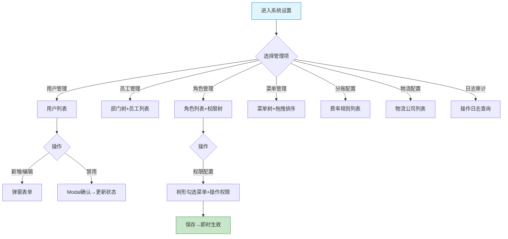

# 平台端 - 系统设置功能详细设计

> 版本：v1.0  
> 文档状态：初稿  
> 所属章节：第十二章

## 版本历史

| 版本 | 日期 | 修订内容 | 修订人 |
|:----:|:----:|---------|:-----:|
| v1.0 | 2026-04-24 | 初始创建，覆盖系统设置7个功能点的完整详细设计 | PM |
| v2.0 | 2026-04-24 | 重构为新版11章模板，新增核心设计原则、Mermaid流程图、权限矩阵、非功能性需求、异常汇总表、接口依赖建议 | PM |

<!-- ============================================================ -->
<!-- PRD六层模型：                                                    -->
<!--                                                              -->
<!-- 核心层(必写)： 功能概述 → 设计原则 → 业务规则(含流程图) → 功能点详情   -->
<!-- 扩展层(推荐)： 权限矩阵 → 非功能性需求 → 异常汇总 → 接口依赖      -->
<!-- 治理层(状态模块必写)： 状态流转图 → 状态治理矩阵 → 版本历史       -->
<!-- ============================================================ -->

---

## 一、功能概述

### 1.1 功能定位

系统设置是平台端**后台管理配置**的核心入口，包括平台用户管理、员工管理、角色权限配置、菜单管理、分账配置、物流配置、操作日志审计等，是平台运行的基础支撑模块。

### 1.2 核心概念

| 概念 | 说明 |
|:----|------|
| 用户管理 | 平台登录账号管理（启用/禁用） |
| 员工管理 | 平台员工信息+部门树 |
| 角色管理 | RBAC角色定义+权限树形勾选 |
| 菜单管理 | 系统菜单结构维护+拖拽排序 |
| 分账配置 | 商品分账费率规则配置 |
| 日志审计 | 全量操作审计记录 |

### 1.3 目标用户

- **平台超管**：拥有所有系统设置权限
- **平台管理员**：日常系统配置操作

### 1.4 模块范围

| 功能分类 | 主要功能 | 优先级 |
|:--------|---------|:------:|
| 用户管理 | 用户列表（启用/禁用） | P0 |
| 员工管理 | 员工列表（部门树筛选） | P0 |
| 角色管理 | 角色管理+权限配置 | P0 |
| 菜单管理 | 菜单管理（拖拽排序） | P1 |
| 分账配置 | 分账配置（费率配置） | P1 |
| 物流配置 | 物流配置 | P1 |
| 日志审计 | 操作日志 | P2 |

---

## 二、核心设计原则

> **系统设置遵循RBAC权限模型——所有操作权限通过角色树形配置实现精细化管控。**

### 2.1 RBAC三要素原则

- 用户→角色→权限，三层映射关系
- 超管角色不可修改/不可删除，拥有所有权限
- 父菜单选中时子菜单自动全选，取消父菜单时子菜单全部取消

### 2.2 配置即生效原则

- 角色权限修改后立即生效（用户下次请求时刷新权限）
- 菜单结构调整后实时反映到前端导航
- 分账/物流配置修改后后续交易按新规则执行

### 2.3 操作审计原则

- 所有配置变更操作写入日志（操作人/IP/时间/变更内容）
- 日志不可删除/不可修改（仅可查看和导出）

---

## 三、业务规则

### 3.1 权限规则

- RBAC模型：用户→角色→权限（菜单+操作）
- 超管角色不可修改、不可删除
- 父菜单选中时子菜单自动全选，取消父菜单时子菜单全部取消

### 3.2 用户规则

- 禁用后用户无法登录系统
- 一个用户可关联多个角色

### 3.3 核心业务流程图

---

## 四、权限矩阵

| 功能模块 | 具体操作 | 超管 | 管理员 | 说明 |
|:--------|---------|:----:|:------:|------|
| **用户管理** | 查看列表 | ✅ | ✅ | - |
| | 新增/编辑用户 | ✅ | ✅ | - |
| | 启用/禁用用户 | ✅ | ✅ | - |
| **员工管理** | 查看列表 | ✅ | ✅ | - |
| | 新增/编辑员工 | ✅ | ✅ | - |
| **角色管理** | 查看角色 | ✅ | ✅ | - |
| | 新增/编辑/删除角色 | ✅ | ✅ | 超管不可编辑/删除 |
| | 权限配置 | ✅ | ✅ | - |
| **菜单管理** | 增删改查 | ✅ | ✅ | - |
| **分账配置** | CRUD | ✅ | ✅ | - |
| **物流配置** | CRUD | ✅ | ✅ | - |
| **日志审计** | 查看/导出 | ✅ | ✅ | - |

---

## 五、非功能性需求

| 接口/场景 | P95要求 |
|:---------|:-------:|
| 用户列表查询 | ≤ 300ms |
| 角色权限保存 | ≤ 500ms |
| 日志查询 | ≤ 500ms |
| 日志导出 | ≤ 5s |

---

## 六、功能点详细设计

### 6.1 用户列表（P0）

#### 交互逻辑

1. 列表展示：用户名/姓名/角色/手机号/邮箱/状态/最近登录时间
2. 新增用户：弹窗填写信息→选择角色→保存
3. 编辑用户：修改基本信息/角色
4. 启用/禁用：点击开关→确认→更新状态

#### 边界情况覆盖

| 场景 | 处理逻辑 | 提示文案 |
|:----|:--------|---------|
| 用户名重复 | 后端校验 | "用户名已存在" |
| 禁用确认 | Modal | "禁用后该用户将无法登录系统，确认禁用？" |

---

### 6.2 员工列表（P0）

左侧部门树：树形展示部门结构 → 选中后右侧展示该部门员工。右侧列表：员工姓名/工号/部门/职位/手机号/邮箱。支持新增/编辑。

### 6.3 角色管理+权限配置（P0）

#### 交互逻辑

1. 角色列表：角色名称/角色描述/关联用户数/状态
2. 新增角色：输入角色名称/描述
3. 权限配置：树形勾选菜单和操作权限（菜单权限+按钮级操作权限）
4. 角色删除：校验是否有人关联该角色

#### 边界情况覆盖

| 场景 | 处理逻辑 | 提示文案 |
|:----|:--------|---------|
| 角色有用户→删除 | 阻止删除 | "该角色下有N个用户，请先调整用户角色再删除" |
| 超管角色不可改 | 按钮置灰 | "超管角色不可修改/删除" |

---

### 6.4 菜单管理（P1）

树形列表展示菜单层级结构（1-3级），支持拖拽排序、新增/编辑/删除。

### 6.5 分账配置（P1）

列表展示：规则名称/适用分类/供应商/费率(%)/生效状态/创建时间。支持新增/编辑/删除/启用/禁用。

### 6.6 物流配置（P1）

列表展示：物流公司名称/物流单号格式/联系方式/状态/排序。支持新增/编辑/启禁用。

### 6.7 操作日志（P2）

列表展示：操作时间/操作人/IP地址/操作内容/操作对象/操作结果。筛选条件：操作人/时间范围/模块/操作类型。支持导出Excel。

---

## 七、异常处理汇总表

| 异常场景 | 提示文案 |
|:--------|---------|
| 用户名重复 | "用户名已存在" |
| 角色有用户→删除 | "该角色下有N个用户，请先调整用户角色再删除" |
| 菜单有子级→删除 | "该菜单下有子菜单，无法删除" |
| 用户禁用确认 | "禁用后该用户将无法登录系统，确认禁用？" |
| 超管角色不可改 | "超管角色不可修改/删除" |

---

## 八、接口依赖建议

| 接口 | 用途 | 性能要求 |
|:----|:----|:--------:|
| `/api/system/user/list` | 用户列表 | P95 ≤ 300ms |
| `/api/system/user/create` | 新增用户 | P95 ≤ 500ms |
| `/api/system/user/toggle-status` | 启用/禁用 | P95 ≤ 300ms |
| `/api/system/employee/list` | 员工列表 | P95 ≤ 300ms |
| `/api/system/role/list` | 角色列表 | P95 ≤ 300ms |
| `/api/system/role/permission/save` | 保存权限配置 | P95 ≤ 500ms |
| `/api/system/menu/tree` | 菜单树 | P95 ≤ 300ms |
| `/api/system/config/split/list` | 分账配置列表 | P95 ≤ 300ms |
| `/api/system/config/logistics/list` | 物流配置列表 | P95 ≤ 300ms |
| `/api/system/log/list` | 操作日志 | P95 ≤ 500ms |

---

## 九、状态治理矩阵

### 9.1 动作定义表

| 动作ID | 动作名称 | 触发方式 | 说明 |
|:-----:|---------|---------|------|
| SYS-01 | 用户新增 | 弹窗表单 | 创建账号 |
| SYS-02 | 用户编辑 | 弹窗表单 | 修改信息/角色 |
| SYS-03 | 用户启禁用 | 开关操作 | 控制登录 |
| SYS-04 | 员工管理 | 部门树+列表 | 员工信息CRUD |
| SYS-05 | 角色管理 | 树形权限勾选 | RBAC配置 |
| SYS-06 | 菜单管理 | 拖拽+弹窗 | 菜单结构维护 |
| SYS-07 | 分账配置 | 弹窗编辑 | 费率规则 |
| SYS-08 | 物流配置 | 弹窗编辑 | 物流公司维护 |
| SYS-09 | 日志查询 | 筛选+搜索 | 操作审计 |
| SYS-10 | 日志导出 | 导出按钮 | 审计导出 |

### 9.2 错误提示汇总

| 场景 | 提示文案 | 组件类型 |
|:----:|---------|:--------:|
| 用户名重复 | "用户名已存在" | Toast |
| 角色有用户→删除 | "该角色下有N个用户，请先调整用户角色再删除" | Modal(黄色警告) |
| 菜单有子级→删除 | "该菜单下有子菜单，无法删除" | Modal |
| 用户禁用确认 | "禁用后该用户将无法登录系统，确认禁用？" | Modal |
| 超管角色不可改 | "超管角色不可修改/删除" | Toast |
