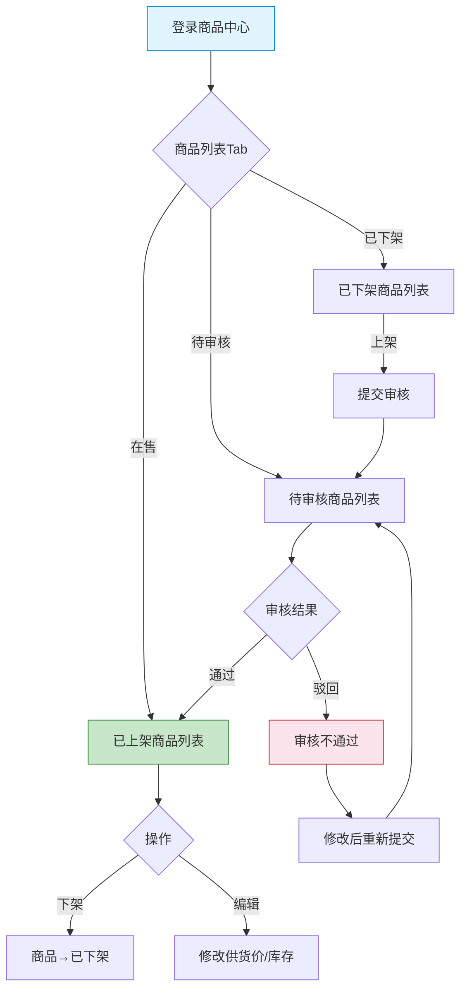
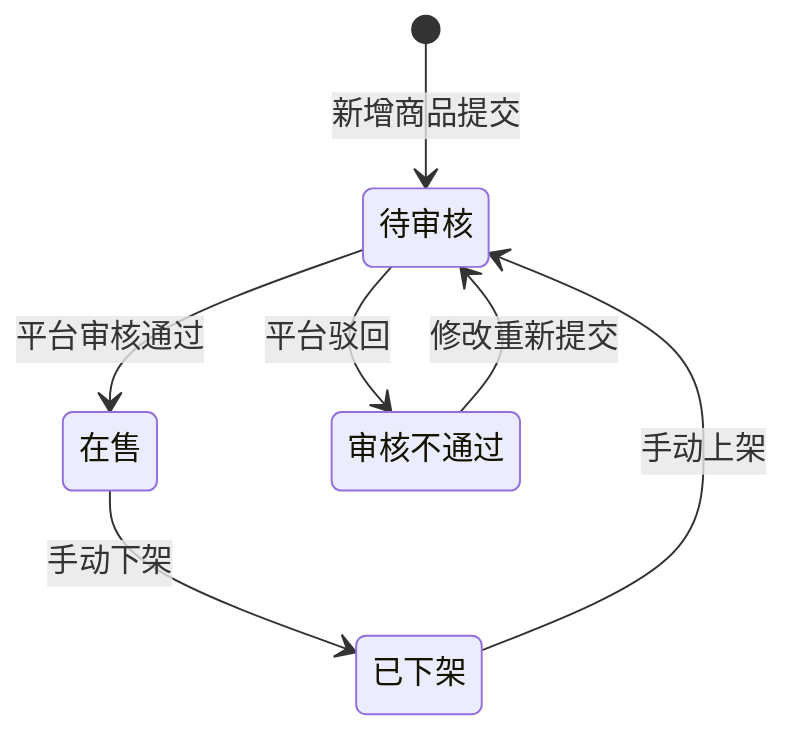

# 供应商端 - 商品中心功能详细设计

> 版本：v1.0  
> 文档状态：初稿  
> 所属章节：第六章

## 版本历史

| 版本 | 日期 | 修订内容 | 修订人 |
|:----:|:----:|---------|:-----:|
| v1.0 | 2026-04-24 | 初始创建，覆盖7个功能点的完整详细设计 | PM |
| v2.0 | 2026-04-24 | 重构为新版11章模板，新增核心设计原则、Mermaid流程图、权限矩阵、非功能性需求、异常汇总表、接口依赖建议，原子字段新增必填列 | PM |

<!-- ============================================================ -->
<!-- PRD六层模型：                                                    -->
<!--                                                              -->
<!-- 核心层(必写)： 功能概述 → 设计原则 → 业务规则(含流程图) → 功能点详情   -->
<!-- 扩展层(推荐)： 权限矩阵 → 非功能性需求 → 异常汇总 → 接口依赖      -->
<!-- 治理层(状态模块必写)： 状态流转图 → 状态治理矩阵 → 版本历史       -->
<!-- ============================================================ -->

---

## 一、功能概述

### 1.1 功能定位

商品中心是供应商在平台的"数字货架"，覆盖从平台商品库选品到设置供货价、管理上下架的完整商品生命周期。

### 1.2 核心概念

| 概念 | 说明 | 示例 |
|:----|------|------|
| 供货价 | 供应商为商品设定的销售单价 | 水泥¥300/吨 |
| 审核状态 | 商品需要平台审核后方可在售 | pending→online/rejected |
| 库存流水 | 记录商品库存的每一次变动历史 | 入库/出库/调整 |

### 1.3 目标用户

- **管理员**（核心用户）：管理商品和库存
- **业务员**：协助管理商品信息

### 1.4 模块范围

| 功能分类 | 主要功能 | 优先级 |
|:--------|---------|:------:|
| 商品管理 | 商品列表、新增、编辑、详情、上下架 | P0 |
| 库存管理 | 库存查询、库存流水 | P1 |

---

## 二、核心设计原则

> **商品中心遵循"两段定义"中的第二段——供应商负责商品价格和库存，不干预商品规格定义。**

### 2.1 价格自主原则

- 供应商自行设定供货价（≥0），平台审核后方可生效
- 供货价变更后自动记录变更历史
- 不同供应商对同一SKU可设定不同的供货价

### 2.2 库存自管原则

- 库存由供应商自行维护和更新
- 每次库存变动自动记录流水（类型/数量/操作人/时间）
- 库存变更实时同步到工程仓端

---

## 三、业务规则

### 3.1 商品状态规则

- **待审核**（pending）：供应商提交后等待平台审核
- **在售**（online）：审核通过，工程仓可见可采购
- **已下架**（offline）：供应商主动下架，工程仓不可见
- **审核不通过**（rejected）：平台驳回，需修改后重新提交

### 3.2 库存规则

- 库存由供应商自行维护
- 库存流水记录每次变动：类型（入库/出库/调整）、数量、操作人、时间
- 库存变更时自动记录流水

### 3.3 核心业务流程图

---

## 四、权限矩阵

| 功能模块 | 具体操作 | 管理员 | 业务员 | 仓管员 | 说明 |
|:--------|---------|:------:|:------:|:------:|------|
| **商品管理** | 查看列表 | ✅ | ✅ | ❌ | - |
| | 新增商品 | ✅ | ✅ | ❌ | - |
| | 编辑商品 | ✅ | ✅ | ❌ | - |
| | 上架/下架 | ✅ | ✅ | ❌ | - |
| **库存管理** | 库存查询 | ✅ | ✅ | ✅ | - |
| | 库存流水 | ✅ | ✅ | ✅ | - |

---

## 五、非功能性需求

| 接口/场景 | P95要求 |
|:---------|:-------:|
| 商品列表查询 | ≤ 500ms |
| 新增商品提交 | ≤ 1s |
| 库存查询 | ≤ 300ms |

---

## 六、功能点详细设计

### 6.1 商品列表（P0）

#### 交互逻辑

1. 页面加载：默认展示"在售"Tab的商品列表
2. Tab切换：在售/已下架/待审核/审核不通过
3. 点击某行商品 → 进入商品详情页
4. 分页：每页20条

#### 原子字段定义

| 字段 | 类型 | 必填 | 来源 | 展示规则 |
|:----|:----|:----:|:----|:--------|
| 商品图片 | URL | 否 | SPU | 缩略图 |
| 商品名称 | String(100) | 是 | SPU | 文本 |
| SKU编码 | String(32) | 是 | 系统 | 文本 |
| 规格 | String(100) | 否 | 属性 | 标签展示 |
| 供货价 | Decimal(10,2) | 是 | 供应商设置 | 数字+单位"元" |
| 库存 | Integer | 否 | 供应商维护 | 数字 |
| 审核状态 | Enum | 是 | 系统 | Tag标签(颜色区分) |

---

### 6.2 新增商品（P0）

#### 交互逻辑

1. 点击新增 → 弹出商品选择弹窗（从平台商品库搜索）
2. 选择商品后 → 进入供货价设置表单
3. 填写供货价、库存 → 点击提交
4. 提交成功 → 商品进入"待审核"状态

#### 原子字段定义

| 字段 | 类型 | 必填 | 来源 | 校验规则 | 展示规则 |
|:----|:----|:----:|:----|:--------|:--------|
| 商品 | ID | 是 | 平台库选择 | - | 搜索选择器 |
| 供货价 | Decimal(10,2) | 是 | 表单输入 | 必须>0 | InputNumber |
| 库存 | Integer | 是 | 表单输入 | 必须≥0 | InputNumber |

#### 边界情况覆盖

| 场景 | 处理逻辑 | 提示文案 |
|:----|:--------|---------|
| 供货价≤0 | 前端校验拦截 | "供货价必须大于0" |
| 重复添加同一SKU | 后端校验 | "该商品已添加，请勿重复操作" |

---

### 6.3 商品上下架（P0）

#### 交互逻辑

1. 点击开关 → 弹出二次确认弹窗
2. 确认 → 执行状态变更 → Toast提示成功
3. 下架后工程仓端不可见该商品

#### 边界情况覆盖

| 场景 | 处理逻辑 | 提示文案 |
|:----|:--------|---------|
| 仅"在售"商品可下架 | 其他状态按钮置灰 | - |
| 仅"已下架"/"审核通过"可上架 | 其他状态按钮置灰 | - |

---

### 6.4 库存查询（P1）

在商品列表的库存列直接展示当前库存数，点击可进入库存详情。

### 6.5 库存流水（P1）

弹出侧边面板展示库存流水列表，按时间倒序排列。字段：变动时间/变动类型/变动数量/变动后库存/操作人。

---

## 七、异常处理汇总表

| 异常场景 | 前端处理 | 提示文案 |
|:--------|:--------|---------|
| 供货价≤0 | 表单标红 | "供货价必须大于0" |
| 重复添加SKU | Toast | "该商品已添加，请勿重复操作" |
| 审核不通过→上架 | Toast | "该商品审核不通过，请重新提交" |
| 商品列表加载失败 | 重试按钮 | "商品列表加载失败" |

---

## 八、接口依赖建议

| 接口 | 用途 | 性能要求 |
|:----|:----|:--------:|
| `/api/supplier/product/list` | 商品列表 | P95 ≤ 500ms |
| `/api/supplier/product/create` | 新增商品 | P95 ≤ 1s |
| `/api/supplier/product/toggle-status` | 上下架 | P95 ≤ 500ms |
| `/api/supplier/product/edit` | 编辑商品 | P95 ≤ 500ms |
| `/api/supplier/inventory/list` | 库存查询 | P95 ≤ 300ms |
| `/api/supplier/inventory/flow` | 库存流水 | P95 ≤ 300ms |

---

## 九、状态流转图

### 9.1 商品状态流转

---

## 十、状态治理矩阵

### 10.1 动作定义表

| 动作ID | 动作名称 | 触发方式 | 说明 |
|:-----:|---------|---------|------|
| SPD-01 | 新增商品 | 点击按钮 | 从平台库选择并提交审核 |
| SPD-02 | 编辑商品 | 点击编辑 | 修改供货价/库存 |
| SPD-03 | 上架商品 | 点击上架 | 商品提交审核 |
| SPD-04 | 下架商品 | 点击下架 | 商品变为下架状态 |

### 10.2 状态×操作矩阵

| 状态 \ 操作 | SPD-01新增 | SPD-02编辑 | SPD-03上架 | SPD-04下架 |
|:----------:|:----------:|:----------:|:----------:|:----------:|
| **待审核** | ✅ | ✅ | ❌ | ❌ |
| **在售** | ✅ | ✅ | ❌ | ✅ |
| **已下架** | ✅ | ✅ | ✅ | ❌ |
| **审核不通过** | ✅ | ✅ | ❌ | ❌ |

### 10.3 错误提示汇总

| 场景 | 提示文案 |
|:----:|---------|
| 供货价≤0 | "供货价必须大于0" |
| 重复添加SKU | "该商品已添加，请勿重复操作" |
| 审核不通过商品上架 | "该商品审核不通过，请重新提交" |
