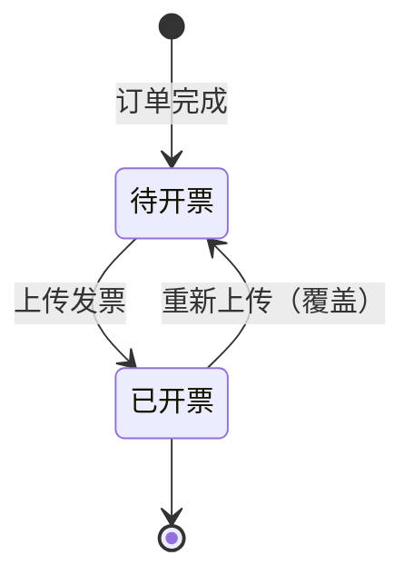
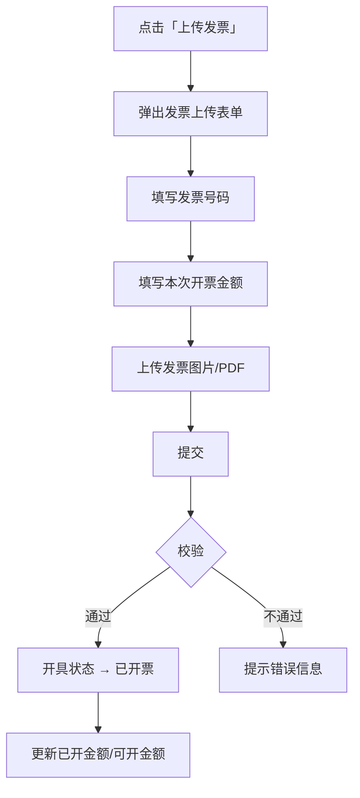
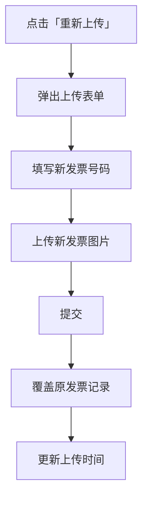

# 供应商端发票管理功能PRD

## 1. 产品概述

### 1.1 产品定位

供应商端发票管理是供应商管理采购订单发票的核心功能模块，支持发票查询、上传、查看及重新上传等操作。

### 1.2 核心原则

- **供应商主动开票**：订单完成后，供应商有义务直接开票，无需工程仓申请
- **一个订单可多次开票**：支持分批开票场景
- **发票可追溯**：所有发票记录留存，支持查看历史

### 1.3 页面路径

```text
供应商端 → 财务管理 → 发票管理
```

---

## 2. 页面布局

```text
┌─────────────────────────────────────────────────────────────────────────────────────┐
│ 发票管理                                                                           │
├─────────────────────────────────────────────────────────────────────────────────────┤
│ [全部] [待开票] [已开票]                                                            │
├─────────────────────────────────────────────────────────────────────────────────────┤
│ 订单编号：[请输入]              发票抬头：[请输入]                                   │
│ 申请时间：[起始日期] 至 [结束日期]                                                   │
│                                                 [查询] [重置] [批量导出]            │
├─────────────────────────────────────────────────────────────────────────────────────┤
│ │ 订单编号 │ 实付金额 │ 已开金额 │ 可开金额 │ 本次开票金额 │ 发票号码 │ 发票抬头 │ 上传时间 │ 开具状态 │ 操作 │
│ ├──────────┼──────────┼──────────┼──────────┼──────────────┼──────────┼──────────┼──────────┼──────────┼──────┤
│ │ PO001    │ ¥12,800 │ ¥0      │ ¥12,800 │ —            │ —       │ 杭州公司 │ —        │ 待开票   │ 上传 │
│ │ PO002    │ ¥6,400  │ ¥6,400  │ ¥0      │ ¥6,400       │ FP001   │ 上海公司 │ 03-16    │ 已开票   │ 查看 │
│ │ PO003    │ ¥25,600 │ ¥10,000 │ ¥15,600 │ ¥10,000      │ FP002   │ 广州公司 │ 03-17    │ 已开票   │ 查看 │
└─────────────────────────────────────────────────────────────────────────────────────┘
```

---

## 3. 功能清单

| 功能模块 | 功能点 | 说明 |
|----------|--------|------|
| 发票查询 | 状态筛选 | 全部/待开票/已开票 |
| 发票查询 | 订单编号搜索 | 模糊搜索 |
| 发票查询 | 发票抬头搜索 | 模糊搜索 |
| 发票查询 | 时间筛选 | 按申请时间范围筛选 |
| 发票操作 | 上传发票 | 支持分批上传 |
| 发票操作 | 查看发票 | 预览发票图片 |
| 发票操作 | 重新上传 | 覆盖或追加（可配置） |
| 数据导出 | 批量导出 | 导出筛选后的发票数据 |

---

## 4. 状态定义

### 4.1 发票状态

| 状态码 | 状态名称 | 说明 |
|--------|----------|------|
| 0 | 待开票 | 订单已完成，待开发票已生成，尚未上传 |
| 1 | 已开票 | 供应商已上传发票 |

### 4.2 状态流转图



---

## 5. 状态筛选Tab

| Tab | 说明 | 状态映射 |
|-----|------|----------|
| 全部 | 展示所有发票记录 | 所有状态 |
| 待开票 | 未上传发票的订单 | 开具状态 = 待开票 |
| 已开票 | 已上传发票的订单 | 开具状态 = 已开票 |

---

## 6. 筛选条件

| 筛选项 | 类型 | 说明 |
|--------|------|------|
| 订单编号 | 输入框 | 模糊搜索订单号 |
| 发票抬头 | 输入框 | 模糊搜索发票抬头名称 |
| 申请时间 | 日期范围 | 按申请时间区间筛选（订单完成时间） |

---

## 7. 列表字段说明

| 字段 | 说明 |
|------|------|
| 订单编号 | 关联采购订单号 |
| 实付金额 | 工程仓实际支付金额 |
| 已开金额 | 该订单累计已开票金额 |
| 可开金额 | 实付金额 - 已开金额 |
| 本次开票金额 | 当前发票的开票金额（已开票时显示） |
| 发票号码 | 已上传发票的号码 |
| 发票抬头 | 工程仓发票抬头名称 |
| 上传时间 | 最近一次上传时间 |
| 开具状态 | 待开票 / 已开票 |
| 操作 | 上传发票 / 查看 / 重新上传 |

---

## 8. 功能操作说明

### 8.1 上传发票

**触发条件**：开具状态 = 待开票 或 可开金额 > 0

**操作流程**：



**表单字段**：

| 字段 | 类型 | 必填 | 说明 |
|------|------|------|------|
| 发票号码 | 文本 | 是 | 发票唯一编号 |
| 本次开票金额 | 数字 | 是 | 默认带出可开金额，可修改 |
| 发票图片 | 文件上传 | 是 | 支持jpg/png/pdf，单文件≤5MB |

**校验规则**：

| 规则 | 说明 |
|------|------|
| 本次开票金额 ≤ 可开金额 | 不能超额开票 |
| 发票号码唯一性 | 同一订单下不可重复 |

### 8.2 查看发票

**触发条件**：开具状态 = 已开票

**展示内容**：
- 发票图片预览（支持放大）
- 发票号码
- 开票金额
- 上传时间

### 8.3 重新上传

**触发条件**：开具状态 = 已开票（发票有误需要更换）

**操作说明**：

| 方案 | 说明 | 推荐 |
|------|------|------|
| 覆盖模式 | 替换原发票，保留一条记录 | ✅ 推荐 |
| 追加模式 | 保留原记录，新增一条记录 | 备选 |

**覆盖模式流程**：



---

## 9. 分批开票场景示例

| 操作 | 订单金额 | 已开金额 | 可开金额 | 本次开票 | 状态 |
|------|----------|----------|----------|----------|------|
| 订单完成 | ¥12,800 | ¥0 | ¥12,800 | — | 待开票 |
| 第一次开票 | ¥12,800 | ¥5,000 | ¥7,800 | ¥5,000 | 已开票 |
| 第二次开票 | ¥12,800 | ¥10,000 | ¥2,800 | ¥5,000 | 已开票 |
| 第三次开票 | ¥12,800 | ¥12,800 | ¥0 | ¥2,800 | 已开票 |

---

## 10. 批量导出

**导出字段**：

| 字段 | 说明 |
|------|------|
| 订单编号 | — |
| 实付金额 | — |
| 已开金额 | — |
| 可开金额 | — |
| 发票号码 | — |
| 发票抬头 | — |
| 上传时间 | — |
| 开具状态 | — |

**导出格式**：Excel（.xlsx）

---

## 11. 权限设计

| 权限标识 | 说明 |
|----------|------|
| `invoice:menu` | 菜单权限 |
| `invoice:view` | 页面访问权限 |
| `invoice:upload` | 上传发票权限 |
| `invoice:reupload` | 重新上传权限 |
| `invoice:view_detail` | 查看发票详情权限 |
| `invoice:export` | 批量导出权限 |

**角色权限矩阵**：

| 角色 | 菜单 | 查看 | 上传 | 重新上传 | 查看详情 | 导出 |
|------|------|------|------|----------|----------|------|
| 供应商管理员 | ✅ | ✅ | ✅ | ✅ | ✅ | ✅ |
| 供应商财务 | ✅ | ✅ | ✅ | ✅ | ✅ | ✅ |
| 供应商运营 | ✅ | ✅ | ❌ | ❌ | ✅ | ❌ |

---

## 12. 数据表结构

```sql
CREATE TABLE supplier_invoice (
    invoice_id BIGINT PRIMARY KEY AUTO_INCREMENT,
    order_id BIGINT NOT NULL COMMENT '关联订单号',
    supplier_id BIGINT NOT NULL COMMENT '供应商ID',
    warehouse_id BIGINT NOT NULL COMMENT '工程仓ID',
    invoice_no VARCHAR(50) COMMENT '发票号码',
    invoice_amount DECIMAL(12,2) COMMENT '本次开票金额',
    total_invoiced DECIMAL(12,2) DEFAULT 0 COMMENT '累计已开金额',
    invoice_status TINYINT DEFAULT 0 COMMENT '0-待开票，1-已开票',
    invoice_title VARCHAR(200) COMMENT '发票抬头',
    upload_time DATETIME COMMENT '上传时间',
    file_url VARCHAR(500) COMMENT '发票文件URL',
    created_at DATETIME,
    updated_at DATETIME
);
```

---

## 13. 接口依赖

| 接口 | 说明 |
|------|------|
| 获取发票列表 | 分页查询，支持筛选 |
| 上传发票 | 上传发票文件 |
| 重新上传 | 覆盖上传 |
| 查看发票 | 获取发票详情 |
| 批量导出 | 导出发票数据 |

---

## 14. 异常场景说明

| 场景 | 处理方式 |
|------|----------|
| 开票金额超过可开金额 | Toast提示「开票金额不能超过可开金额XX元」 |
| 发票号码重复 | Toast提示「发票号码已存在，请核对」 |
| 未上传文件 | Toast提示「请上传发票文件」 |
| 文件格式错误 | 提示「请上传jpg/png/pdf格式文件」 |
| 文件大小超限 | 提示「文件大小不能超过5MB」 |
| 网络异常 | Toast提示「上传失败，请稍后重试」 |

---

如果还需要补充其他内容，请告诉我。