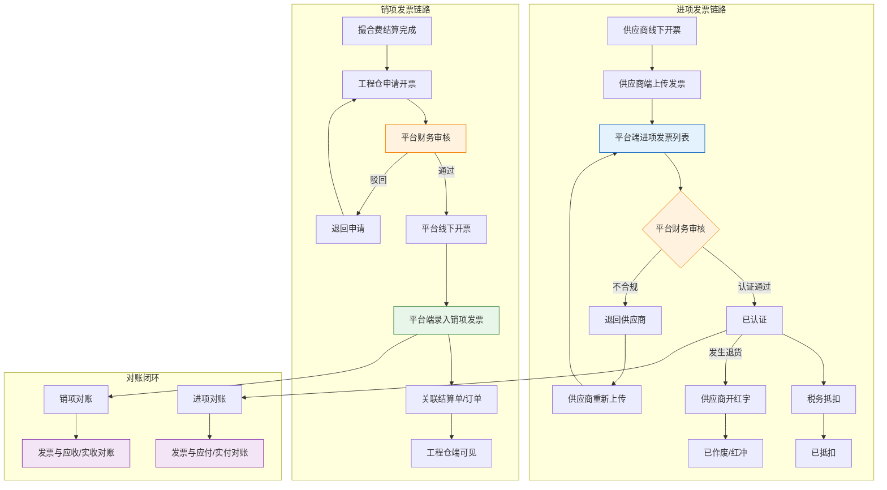
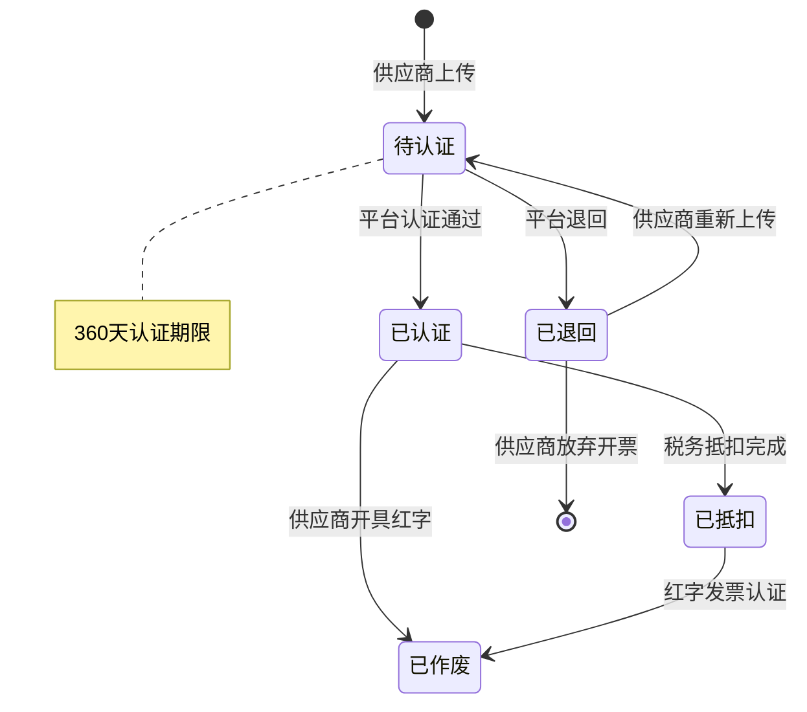
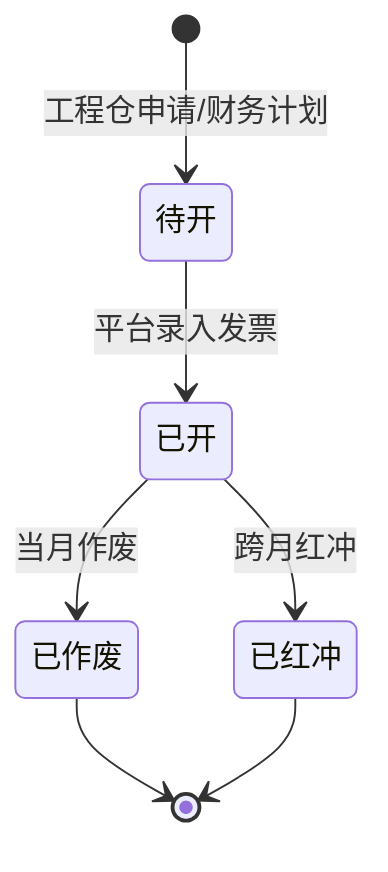

# 平台端 - 发票管理功能设计

> 版本：v1.0  
> 文档状态：初稿  
> 创建日期：2026-05-29  
> 文档负责人：产品团队  
> 所属模块：平台端 - 财务中心 - 发票管理  
> 前置依赖：[11-财务中心功能设计.md](11-财务中心功能设计.md)（支付流水/分账部分）
> 协同关联：[跨部门协同PRD.md](../跨部门协同PRD.md)（发票系统对接）

## 版本历史

| 版本 | 日期 | 修订内容 |
|:----:|:----:|---------|
| v1.0 | 2026-05-29 | 初始创建，覆盖平台端发票全链路管理：进项/销项/配置/统计/对账 |
| v1.1 | 2026-05-29 | 新增附录「三端发票文档关联索引」，关联供应商端（08-财务中心3.8节）和工程仓端（11-发票管理）发票专项PRD

---

## 零、文档索引

| 章节编号 | 名称 | 内容概要 | 面向角色 |
|:--------:|------|---------|:--------:|
| — | 本文 | 总纲：功能概述、核心设计原则、业务规则、权限矩阵 | 全局 |
| 01 | 一、功能概述 | 功能定位、目标用户、核心概念 | 全局 |
| 02 | 二、核心设计原则 | 审核管控、四端边界、开票原则 | 全局 |
| 03 | 三、业务规则 | 发票类型说明、规则约束、Mermaid流程图 | 全局 |
| 04 | 四、权限矩阵 | 角色权限分配 | 权限设计 |
| 05 | 五、非功能性需求 | 性能、安全、兼容性 | 后端/测试 |
| 06 | 六、功能点详细设计 | 进项/销项/配置/统计/对账/看板（8P1+2P2） | 前后端 |
| 07 | 七、异常处理汇总表 | 全场景异常提示 | 前后端 |
| 08 | 八、接口依赖建议 | 后端接口清单 | 后端 |
| 09 | 九、状态流转图 | 进项/销项状态机 | 后端 |
| 10 | 十、状态治理矩阵 | 动作×状态×角色矩阵 | 后端/测试 |

---

## 一、功能概述

### 1.1 功能定位

发票管理是平台端**全平台发票归集中枢**，承担三大职责：

| 职责 | 说明 |
|:----|:-----|
| **进项发票管理** | 接收并管理供应商向平台开具的增值税发票（专票/普票），完成认证与归档 |
| **销项发票管理** | 平台向工程仓/施工方开具发票（服务费/撮合费），记录开票状态与交付 |
| **发票基础配置** | 维护平台开票信息（税号、开户行等）、税率配置、发票类型规则 |

### 1.2 核心概念

| 概念 | 定义 |
|:----|:-----|
| **进项发票** | 供应商向平台开具的发票，平台作为收票方（买方），用于成本入账和进项抵扣 |
| **销项发票** | 平台向工程仓/施工方开具的发票，平台作为开票方（卖方），确认收入 |
| **发票认证** | 进项发票在税务系统中完成认证，方可进行进项抵扣 |
| **撮合费发票** | 平台就撮合服务费向工程仓/施工方开具的销项发票 |
| **红字发票** | 已开票后发生退货/退款时开具的负数发票（冲红处理） |
| **价税合计** | 含税总金额 = 不含税金额 × (1 + 税率) |

### 1.3 目标用户

| 用户角色 | 使用场景 | 使用频率 |
|---------|---------|:--------:|
| 平台财务 | 进项发票认证、销项发票开具、发票对账 | 高频（每日） |
| 平台运营 | 查看供应商发票提交情况、催票 | 中频（每周） |
| 平台管理员 | 发票配置维护、开票信息变更 | 低频（按需） |
| 平台客服 | 协助工程仓/施工方查询发票进度 | 低频（按需） |

### 1.4 模块范围

| 功能分类 | 主要功能 | 优先级 |
|---------|---------|:------:|
| 进项发票 | 进项发票列表、发票详情、发票认证、发票退回 | P1 |
| 销项发票 | 销项发票列表、发票详情、开票申请审核 | P1 |
| 发票配置 | 开票信息维护、税率配置 | P1 |
| 发票统计 | 发票数据概览、统计报表 | P2 |
| 发票对账 | 进项/销项与订单对账 | P2 |

---

## 二、核心设计原则

### 2.1 审核管控机制

| 审核场景 | 审核对象 | 审核角色 | 说明 |
|---------|---------|---------|:-----|
| **发票认证** | 进项发票 | 平台财务 | 供应商上传的发票需经财务认证 |
| **发票退回** | 进项发票 | 平台财务 | 不合规发票退回给供应商 |
| **销项开票** | 销项发票申请 | 平台财务 | 工程仓申请开票后财务审核 |

### 2.2 四端边界

| 能力维度 | 平台端 | 供应商端 | 工程仓端 | 施工方端 |
|---------|:------:|:--------:|:--------:|:--------:|
| 进项发票管理 | ✅ 全量管理 | ✅ 上传自己发票 | ❌ 查看关联 | ❌ 查看关联 |
| 销项发票管理 | ✅ 全量管理 | ❌ | ✅ 申请开票 | ✅ 申请开票 |
| 发票配置 | ✅ 维护 | ❌ 消费 | ❌ 消费 | ❌ 消费 |
| 全平台发票查询 | ✅ 全部可见 | ❌ 仅自己 | ❌ 仅自己 | ❌ 仅自己 |
| 发票认证 | ✅ 操作 | ❌ | ❌ | ❌ |
| 发票退回/冲红 | ✅ 操作 | ❌ 配合 | ❌ 配合 | ❌ 配合 |

### 2.3 发票核心设计原则（"三不三做"）

| 原则 | 说明 |
|:----|:-----|
| ❌ **不做开票校验** | 未开票不影响订单流转、发货、收货等业务流程 |
| ❌ **不做税金计算** | 税金由线下财务核算，系统只做记录和存证 |
| ❌ **不做流程拦截** | 未开票/未认证不阻塞任何业务操作 |
| ✅ **做上传存证** | 发票文件（PDF/图片）上传归档，提供预览和下载 |
| ✅ **做关联追溯** | 发票与订单、结算单的双向关联可追溯 |
| ✅ **做状态跟踪** | 发票全生命周期状态可视化（待认证→已认证→已抵扣→已作废） |

### 2.4 数据隔离原则

| 隔离维度 | 策略 | 说明 |
|---------|------|:-----|
| **商户间隔离** | 商户ID字段隔离 | 各端只看到自己的发票数据 |
| **平台端全量** | 跨端查询 | 平台端可按供应商/工程仓查看所有发票 |
| **操作审计** | 所有变更记录日志 | 发票认证、退回、作废等关键操作需留痕 |

---

## 三、业务规则

### 3.1 发票类型说明

| 发票类型 | 简称 | 适用场景 | 税率范围 |
|---------|:----:|---------|:--------:|
| 增值税专用发票 | 专票 | 供应商→平台（进项抵扣） | 13%/9%/6% |
| 增值税普通发票 | 普票 | 平台→工程仓/施工方（费用凭证） | 6%/3% |
| 增值税电子普通发票 | 电子普票 | 平台→工程仓/施工方（线上交付） | 6%/3% |
| 红字发票 | 红票 | 退货/退款/冲红场景 | 对应原税率 |

### 3.2 核心业务规则

| 规则 | 内容 |
|:----|:-----|
| **进项发票来源** | 供应商在供应商端上传提交，平台端进行认证管理 |
| **销项发票触发** | 基于撮合费结算单或服务费，由平台财务线下开票后录入系统 |
| **发票关联** | 一张发票可关联多个订单（合并开票），一个订单可关联多张发票（分批开票） |
| **发票认证期限** | 专票需在开票日起360天内完成认证 |
| **红字处理** | 已认证发票发生退货时，供应商开具红字发票后平台端确认 |
| **发票一致性校验** | 开票金额不允许超过关联订单的未开票金额 |
| **附件要求** | 支持JPG/PNG/PDF格式，单文件≤10MB，单张发票最多3个附件 |

### 3.3 发票全链路流程

---

## 四、权限矩阵

| 操作/功能 | 管理员 | 运营 | 财务 | 客服 | 超管 |
|-----------|:------:|:----:|:----:|:----:|:----:|
| 进项发票列表查看 | ✅ | ✅ | ✅ | ✅ | ✅ |
| 进项发票认证 | ❌ | ❌ | ✅ | ❌ | ✅ |
| 进项发票退回 | ❌ | ❌ | ✅ | ❌ | ✅ |
| 进项发票详情查看 | ✅ | ✅ | ✅ | ✅ | ✅ |
| 销项发票列表查看 | ✅ | ✅ | ✅ | ✅ | ✅ |
| 销项发票录入 | ❌ | ❌ | ✅ | ❌ | ✅ |
| 销项发票作废/红冲 | ❌ | ❌ | ✅ | ❌ | ✅ |
| 发票配置维护 | ✅ | ❌ | ✅ | ❌ | ✅ |
| 发票统计看板 | ✅ | ✅ | ✅ | ❌ | ✅ |
| 发票对账操作 | ❌ | ❌ | ✅ | ❌ | ✅ |
| 发票导出 | ✅ | ✅ | ✅ | ❌ | ✅ |
| 操作日志查看 | ✅ | ✅ | ✅ | ✅ | ✅ |

---

## 五、非功能性需求

### 5.1 性能需求

| 场景 | 指标 | 说明 |
|:----|:----|:-----|
| 发票列表加载 | ≤2秒 | 默认查询最近6个月，分页50条/页 |
| 发票详情打开 | ≤1.5秒 | 含附件预览加载 |
| 发票上传完成 | ≤5秒 | 10MB以内PDF/JPG |
| 发票导出 | ≤30秒 | ≤10000条记录 |
| 并发支持 | ≥50 QPS | 发票查询接口 |

### 5.2 安全需求

| 类别 | 要求 |
|:----|:-----|
| 附件安全 | 上传文件做病毒扫描，仅允许JPG/PNG/PDF |
| 权限校验 | 所有接口必须校验操作权限 |
| 操作日志 | 认证/退回/作废等关键操作记录操作人+时间+IP |
| 数据脱敏 | 纳税人识别号、银行账号等敏感信息列表页脱敏展示 |

### 5.3 兼容性

| 类别 | 要求 |
|:----|:-----|
| 浏览器 | Chrome 90+ / Edge 90+ / Firefox 90+ |
| 屏幕分辨率 | 最小支持1366×768 |
| 打印支持 | 发票详情页支持Ctrl+P打印 |

---

## 六、功能点详细设计

### 6.1 进项发票列表（P1）

#### 功能说明
查看供应商向平台开具的全部进项发票，支持多维度筛选和批量操作。

#### 入口路径
财务中心 → 发票管理 → 进项发票

#### 页面布局

| 区域 | 内容 | 组件 |
|:----|:-----|:----:|
| 统计栏 | 待认证数 / 已认证数 / 本月新增 / 认证通过率 | a-statistic × 4 |
| 操作按钮 | 批量认证、导出Excel | a-button |
| 筛选区 | 发票号码、供应商名称、发票类型、认证状态、开票日期范围 | a-select + a-input + a-range-picker |
| 表格 | 进项发票列表（详见字段定义） | a-table |
| 分页 | 50条/页，支持跳页 | a-pagination |

#### 交互逻辑

1. 默认加载：最近6个月，按开票日期倒序
2. 筛选联动：筛选条件变更后自动刷新列表，保持当前页码
3. 批量认证：勾选"待认证"状态的发票 → 点击"批量认证" → 二次确认 → 批量更新
4. 单行操作：
   - 点击发票号码 → 跳转发票详情页
   - 点击"认证" → 确认弹窗 → 状态变更为"已认证"
   - 点击"退回" → 退回弹窗（填写原因）→ 状态变更为"已退回"
5. 导出：导出当前筛选条件下的发票列表为Excel

#### 原子字段定义（列表表格）

| 字段 | 类型 | 展示规则 | 排序 |
|:----|:----|:--------|:---:|
| 发票号码 | String(20) | 超链接，点击跳详情 | ✅ |
| 发票代码 | String(12) | 文本 | ❌ |
| 发票类型 | Enum | Tag：专票(蓝)/普票(绿)/电子普票(紫) | ❌ |
| 供应商名称 | String(50) | 文本 | ❌ |
| 供应商税号 | String(20) | 脱敏：******XXXX | ❌ |
| 价税合计 | Decimal(12,2) | ¥前缀，右对齐 | ✅ |
| 税率 | Decimal(4,2) | 如13% | ❌ |
| 开票日期 | Date | YYYY-MM-DD | ✅ |
| 认证状态 | Enum | Tag：待认证(橙)/已认证(绿)/已抵扣(蓝)/已退回(红)/已作废(灰) | ❌ |
| 关联订单数 | Integer | 数字，点击查看 | ❌ |
| 操作 | - | 认证/退回（根据状态显示） | ❌ |

#### 边界情况

| 场景 | 处理逻辑 |
|:----|:---------|
| 筛选结果为空 | 展示空状态插画 + "暂无进项发票数据" |
| 批量认证含非待认证发票 | 自动跳过并提示"N张发票状态不是待认证，已跳过" |
| 认证期限超360天 | 发票列表标红提示"已超认证期限"，不允许认证 |
| 导出数据量>10000条 | 提示"导出数据量较大，将分批导出，请稍后在下载中心查看" |

---

### 6.2 进项发票详情（P1）

#### 功能说明
查看单张进项发票的完整信息，包括附件预览、关联订单、操作日志。

#### 入口路径
进项发票列表 → 点击发票号码

#### 页面布局

| 区域 | 内容 | 组件 |
|:----|:-----|:----:|
| PageHeader | 返回按钮 + 发票号码 + 认证状态Tag | a-page-header |
| 发票信息卡片 | 发票基本信息（详见下表） | a-descriptions |
| 金额明细卡片 | 含税金额/不含税金额/税额/税率 | a-descriptions |
| 附件预览卡片 | 发票图片/PDF缩略图 → 点击放大/下载 | a-image + 预览组件 |
| 关联订单卡片 | 已关联订单列表表格 | a-table |
| 操作日志 | Timeline格式操作记录 | a-timeline |

#### 发票信息字段

| 字段 | 类型 | 说明 |
|:----|:----|:-----|
| 发票号码 | String(20) | - |
| 发票代码 | String(12) | - |
| 机器编号 | String(12) | - |
| 发票类型 | Enum | 专票/普票/电子普票 |
| 开票日期 | Date | - |
| 供应商名称 | String(50) | 销售方 |
| 供应商税号 | String(20) | - |
| 平台名称 | String(50) | 购买方（平台企业名） |
| 平台税号 | String(20) | 购买方纳税人识别号 |
| 价税合计 | Decimal(12,2) | - |
| 不含税金额 | Decimal(12,2) | - |
| 税额 | Decimal(12,2) | - |
| 税率 | Decimal(4,2) | - |
| 认证状态 | Enum | - |
| 认证日期 | Date | 已认证时展示 |
| 备注 | String(200) | - |

#### 关联订单操作

| 操作 | 说明 |
|:----|:-----|
| 新增关联 | 弹窗 → 搜索订单编号/供应商 → 关联 |
| 解除关联 | 二次确认 → 解除 |
| 查看订单 | 点击订单编号 → 跳转订单详情 |

#### 边界情况

| 场景 | 处理逻辑 |
|:----|:---------|
| 附件无法预览 | 展示"暂不支持预览" + 提供下载按钮 |
| 发票已作废 | 页面顶部红色Alert提示"该发票已作废" |
| 关联订单被删除 | 订单编号灰显 + "订单已删除" |

---

### 6.3 进项发票认证（P1）

#### 功能说明
对供应商上传的进项发票进行认证操作，确认发票合规性。

#### 触发方式
1. 列表页单行操作 → 点击"认证"
2. 列表页批量勾选 → 点击"批量认证"
3. 详情页 → 点击"认证"按钮

#### 认证弹窗

| 字段 | 组件 | 必填 | 说明 |
|:----|:----|:----:|:-----|
| 发票号码 | 文本展示 | - | 只读 |
| 供应商 | 文本展示 | - | 只读 |
| 价税合计 | 文本展示 | - | 只读 |
| 认证结果 | Radio | 是 | 认证通过 / 认证不通过 |
| 认证备注 | a-textarea | 否 | 如认证不通过时必填原因 |

#### 边界情况

| 场景 | 处理逻辑 |
|:----|:---------|
| 发票已超过认证期限 | 不允许认证，提示"该发票已超过360天认证期限" |
| 发票状态不为"待认证" | 按钮置灰，不可点击 |
| 批量认证含已认证发票 | 自动跳过，提示"N张发票已认证" |

---

### 6.4 进项发票退回（P1）

#### 功能说明
对不符合要求的进项发票退回给供应商，供应商端可查看退回原因并重新上传。

#### 触发方式
列表页/详情页 → 点击"退回"

#### 退回弹窗

| 字段 | 组件 | 必填 | 说明 |
|:----|:----|:----:|:-----|
| 发票号码 | 文本展示 | - | 只读 |
| 退回原因 | a-select + a-textarea | 是 | 预置原因：发票信息有误/发票模糊不清/税率错误/发票类型错误/其他 |
| 退回说明 | a-textarea | 否 | 具体说明 |

#### 退回后处理
| 处理方 | 操作 |
|:------|:-----|
| 平台端 | 发票状态变为"已退回"，供应商端可见 |
| 供应商端 | 供应商查看退回原因 → 重新上传新发票 |
| 重新上传 | 新发票生成新记录，与退回记录可追溯关联 |

---

### 6.5 销项发票列表（P1）

#### 功能说明
查看平台向工程仓/施工方开具的全部销项发票。

#### 入口路径
财务中心 → 发票管理 → 销项发票

#### 页面布局

| 区域 | 内容 | 组件 |
|:----|:-----|:----:|
| 统计栏 | 本月开票金额 / 待开票申请数 / 已开票数 / 作废发票数 | a-statistic × 4 |
| 操作按钮 | 录入发票、导出Excel | a-button |
| 筛选区 | 发票号码、开票对象、发票类型、开票状态、开票日期范围 | a-select + a-input + a-range-picker |
| 表格 | 销项发票列表 | a-table |

#### 交互逻辑

1. 默认加载：最近6个月，按开票日期倒序
2. 录入发票：点击"录入发票" → 弹窗填写表单 → 提交保存
3. 点击发票号码 → 跳转销项发票详情页
4. 单行操作：查看详情、作废/红冲（根据状态）

#### 原子字段定义（列表表格）

| 字段 | 类型 | 展示规则 |
|:----|:----|:--------|
| 发票号码 | String(20) | 超链接 |
| 发票代码 | String(12) | 文本 |
| 发票类型 | Enum | Tag |
| 开票对象 | String(50) | 工程仓/施工方名称 |
| 开票对象税号 | String(20) | 脱敏 |
| 价税合计 | Decimal(12,2) | ¥前缀 |
| 开票日期 | Date | YYYY-MM-DD |
| 开票状态 | Enum | Tag：待开(橙)/已开(绿)/已作废(灰)/已红冲(紫) |
| 关联结算单 | String(32) | 超链接 |
| 操作 | - | 查看详情/作废 |

---

### 6.6 销项发票详情（P1）

#### 功能说明
查看单张销项发票的完整信息，包括开票对象信息、关联结算单、操作日志。

#### 入口路径
销项发票列表 → 点击发票号码

#### 页面布局

| 区域 | 内容 |
|:----|:-----|
| PageHeader | 返回按钮 + 发票号码 + 开票状态Tag |
| 发票信息卡片 | 发票号码/代码/类型/开票日期/开票人 |
| 开票对象卡片 | 开票对象名称/税号/地址/电话/开户行/账号 |
| 金额明细卡片 | 含税金额/不含税金额/税额/税率 |
| 关联结算单卡片 | 关联的撮合费结算单列表 |
| 操作日志 | Timeline格式 |

---

### 6.7 销项发票录入（P1）

#### 功能说明
平台线下开票后，在系统中录入销项发票信息。

#### 触发方式
销项发票列表页 → 点击"录入发票"

#### 录入弹窗

| 字段 | 组件 | 必填 | 校验 |
|:----|:----|:----:|:-----|
| 开票对象 | a-select | 是 | 选择已入驻的工程仓/施工方 |
| 发票类型 | a-radio | 是 | 专票/普票/电子普票 |
| 发票号码 | a-input | 是 | 必填，唯一性校验 |
| 发票代码 | a-input | 否 | - |
| 开票日期 | a-date-picker | 是 | 不能超过当天 |
| 价税合计 | a-input-number | 是 | >0，两位小数 |
| 税率 | a-select | 是 | 13%/9%/6%/3%/0% |
| 关联结算单 | a-select | 否 | 搜索撮合费结算单关联 |
| 附件上传 | a-upload | 是 | JPG/PNG/PDF，≤10MB |
| 备注 | a-textarea | 否 | 200字以内 |

#### 边界情况

| 场景 | 处理逻辑 |
|:----|:---------|
| 发票号码重复 | 提示"该发票号码已存在" |
| 关联结算单已开票 | 提示"该结算单已关联其他发票" |
| 开票金额超结算单金额 | 提示"开票金额不能超过结算单金额" |

---

### 6.8 销项发票作废/红冲（P1）

#### 功能说明
对已开具的销项发票进行作废（当月）或红冲（跨月）处理。

#### 触发条件

| 场景 | 处理方式 | 条件 |
|:----|:---------|:-----|
| 当月开票且未认证 | 作废 | 开票当月可作废 |
| 跨月或已认证 | 红冲 | 开具红字发票 |

#### 作废弹窗

| 字段 | 组件 | 必填 | 说明 |
|:----|:----|:----:|:-----|
| 发票号码 | 文本展示 | - | 只读 |
| 提示 | a-alert | - | "发票作废后不可恢复，请确认" |
| 作废原因 | a-textarea | 是 | - |

#### 红冲弹窗

| 字段 | 组件 | 必填 | 说明 |
|:----|:----|:----:|:-----|
| 原发票号码 | 文本展示 | - | 只读 |
| 红字发票号码 | a-input | 是 | 新开红字发票号码 |
| 红冲金额 | a-input-number | 是 | ≤原发票金额 |
| 红冲原因 | a-textarea | 是 | - |
| 附件上传 | a-upload | 是 | 红字发票附件 |

---

### 6.9 发票配置管理（P1）

#### 功能说明
维护平台的开票信息（企业信息、税号等）和税率配置。

#### 入口路径
系统设置 → 发票配置

#### 6.9.1 开票信息维护

| 字段 | 组件 | 必填 | 说明 |
|:----|:----|:----:|:-----|
| 企业名称 | a-input | 是 | 与营业执照一致 |
| 纳税人识别号 | a-input | 是 | 18位统一社会信用代码 |
| 注册地址 | a-input | 是 | - |
| 注册电话 | a-input | 是 | - |
| 开户银行 | a-input | 是 | - |
| 银行账号 | a-input | 是 | - |
| 发票专用章图片 | a-upload | 否 | PNG，建议尺寸200×200 |

#### 6.9.2 税率配置

| 配置项 | 组件 | 说明 |
|:-------|:----|:-----|
| 默认税率 | a-select | 销项发票默认税率 |
| 进项税率范围 | a-select | 多选，允许的进项税率 |

#### 边界情况

| 场景 | 处理逻辑 |
|:----|:---------|
| 修改开票信息 | 记录变更历史，已开票信息不受影响 |
| 纳税人识别号变更 | 提示"已关联N张发票，变更后旧税号发票仍有效" |

---

### 6.10 发票统计看板（P2）

#### 功能说明
以图表形式展示发票数据的整体概览，辅助财务决策。

#### 入口路径
财务中心 → 发票管理 → 发票统计

#### 页面布局

| 区域 | 内容 | 图表类型 |
|:----|:-----|:--------:|
| 关键指标 | 进项总额/销项总额/待认证数/待开票数 | 统计卡片 |
| 进销趋势 | 近12个月进项/销项金额趋势 | 折线图 |
| 发票类型分布 | 专票/普票/电子普票占比 | 饼图 |
| 供应商开票排行 | TOP10供应商开票金额 | 柱状图 |
| 认证状态分布 | 待认证/已认证/已抵扣/已退回 | 环形图 |

---

### 6.11 发票对账（P2）

#### 功能说明
将发票数据与支付流水/结算单进行比对，确保账票一致。

#### 入口路径
财务中心 → 发票管理 → 发票对账

#### 6.11.1 进项对账

| 比对维度 | 数据源A | 数据源B | 比对规则 |
|---------|---------|---------|---------|
| 供应商维度 | 进项发票汇总 | 应付账款汇总 | 金额是否一致 |
| 订单维度 | 发票关联订单金额 | 订单实付金额 | 金额是否一致 |

#### 6.11.2 销项对账

| 比对维度 | 数据源A | 数据源B | 比对规则 |
|---------|---------|---------|---------|
| 客户维度 | 销项发票汇总 | 撮合费结算单汇总 | 金额是否一致 |
| 结算单维度 | 发票关联结算单金额 | 结算单总金额 | 金额是否一致 |

#### 对账结果展示

| 结果 | 展示方式 |
|:----|:---------|
| 一致 | 绿色✅ "已对账" |
| 不一致 | 红色❌ 高亮显示差额 |
| 部分一致 | 橙色⚠️ 显示差额 |

---

## 七、异常处理汇总表

### 7.1 进项发票异常

| 异常场景 | 触发条件 | 前端处理 | 提示文案 |
|:--------|:--------|:--------|:---------|
| 发票号码重复 | 上传/录入已存在的发票号 | 前端查重拦截 | "该发票号码已存在，请勿重复录入" |
| 附件格式不支持 | 上传非JPG/PNG/PDF文件 | 前端拦截 | "仅支持JPG、PNG、PDF格式文件" |
| 附件超过大小限制 | 上传>10MB文件 | 前端拦截 | "单张发票附件不能超过10MB" |
| 已超认证期限 | 认证开票>360天的发票 | 按钮置灰 | "该发票已超过360天认证期限，无法认证" |
| 发票已认证 | 对已认证发票点认证 | 按钮置灰 | - |
| 发票已作废 | 对已作废发票操作 | 按钮全部置灰 | "该发票已作废，不可操作" |
| 批量认证含异常 | 选中不可认证的发票 | 自动跳过+汇总提示 | "N张发票已跳过（非待认证状态）" |
| 退回原因不填 | 退回弹窗点确定 | 阻止提交 | "请填写退回原因" |

### 7.2 销项发票异常

| 异常场景 | 触发条件 | 前端处理 | 提示文案 |
|:--------|:--------|:--------|:---------|
| 开票金额为0或负数 | 录入金额≤0 | 前端校验 | "开票金额必须大于0" |
| 关联结算单已开票 | 结算单已关联其他发票 | 后端校验 | "该结算单已关联其他发票" |
| 跨月作废 | 对非当月发票点作废 | 提示改为红冲 | "该发票已跨月，请使用红冲处理" |
| 红冲金额超原金额 | 红冲金额>原发票金额 | 前端校验 | "红冲金额不能超过原发票金额" |
| 开票对象未入驻 | 选择已冻结/退出的商户 | 下拉禁用 | "该商户状态异常，不可开票" |

### 7.3 通用异常

| 异常场景 | 触发条件 | 前端处理 | 提示文案 |
|:--------|:--------|:--------|:---------|
| 网络错误 | 接口请求失败 | Toast提示 | "网络异常，请稍后重试" |
| 无操作权限 | 非财务/超管操作 | 按钮隐藏/置灰 | - |
| 导出任务提交 | 点击导出 | 提示引导 | "导出任务已提交，请稍后在下载中心查看" |
| 关联订单不存在 | 搜索已删除的订单 | Toast提示 | "未找到该订单，请检查订单编号" |

---

## 八、接口依赖建议

### 8.1 进项发票接口

| 接口名称 | 方法 | 路径建议 | 说明 | 优先级 |
|:---------|:----|:---------|:-----|:------:|
| 进项发票列表 | GET | /api/platform/invoice/input/list | 分页查询，多条件筛选 | P1 |
| 进项发票详情 | GET | /api/platform/invoice/input/{id} | 含附件、关联订单、日志 | P1 |
| 发票认证 | PUT | /api/platform/invoice/input/{id}/verify | 单张认证 | P1 |
| 批量认证 | PUT | /api/platform/invoice/input/batch-verify | 批量认证 | P1 |
| 发票退回 | PUT | /api/platform/invoice/input/{id}/reject | 退回供应商 | P1 |
| 新增关联订单 | POST | /api/platform/invoice/input/{id}/link-order | 关联订单 | P1 |
| 解除关联订单 | DELETE | /api/platform/invoice/input/{id}/unlink-order/{orderId} | 解除关联 | P1 |
| 导出进项发票 | GET | /api/platform/invoice/input/export | Excel导出 | P1 |

### 8.2 销项发票接口

| 接口名称 | 方法 | 路径建议 | 说明 | 优先级 |
|:---------|:----|:---------|:-----|:------:|
| 销项发票列表 | GET | /api/platform/invoice/output/list | 分页查询 | P1 |
| 销项发票详情 | GET | /api/platform/invoice/output/{id} | - | P1 |
| 录入销项发票 | POST | /api/platform/invoice/output | 新增 | P1 |
| 作废发票 | PUT | /api/platform/invoice/output/{id}/void | 当月作废 | P1 |
| 红冲发票 | POST | /api/platform/invoice/output/{id}/red | 跨月红冲 | P1 |
| 导出销项发票 | GET | /api/platform/invoice/output/export | - | P1 |

### 8.3 配置与统计接口

| 接口名称 | 方法 | 路径建议 | 说明 | 优先级 |
|:---------|:----|:---------|:-----|:------:|
| 开票信息查询 | GET | /api/platform/invoice/config/tax-info | - | P1 |
| 开票信息更新 | PUT | /api/platform/invoice/config/tax-info | - | P1 |
| 税率配置查询 | GET | /api/platform/invoice/config/tax-rates | - | P1 |
| 税率配置更新 | PUT | /api/platform/invoice/config/tax-rates | - | P1 |
| 发票统计概览 | GET | /api/platform/invoice/statistics/overview | 看板数据 | P2 |
| 发票趋势 | GET | /api/platform/invoice/statistics/trend | 折线图数据 | P2 |
| 发票对账 | GET | /api/platform/invoice/reconciliation | 对账数据 | P2 |

### 8.4 外部系统依赖

| 依赖系统 | 对接内容 | 说明 |
|---------|---------|:-----|
| 发票系统（跨部门） | 发票认证状态同步 | 集团发票系统完成认证后回写状态 |
| 支付中台 | 结算单数据 | 获取撮合费结算单用于销项开票关联 |
| 记账系统 | 发票入账状态 | 记账完成后回写入账状态 |

---

## 九、状态流转图

### 9.1 进项发票状态机

### 9.2 销项发票状态机

---

## 十、状态治理矩阵

### 10.1 进项发票状态×操作矩阵

| 状态 \ 操作 | 查看详情 | 认证 | 批量认证 | 退回 | 新增关联 | 解除关联 | 下载附件 |
|:-----------|:--------:|:----:|:--------:|:----:|:--------:|:--------:|:--------:|
| 待认证 | ✅ | ✅ | ✅ | ✅ | ✅ | ✅ | ✅ |
| 已认证 | ✅ | ❌ | ❌ | ❌ | ✅ | ✅ | ✅ |
| 已抵扣 | ✅ | ❌ | ❌ | ❌ | ✅ | ✅ | ✅ |
| 已退回 | ✅ | ❌ | ❌ | ❌ | ❌ | ❌ | ✅ |
| 已作废 | ✅ | ❌ | ❌ | ❌ | ❌ | ❌ | ✅ |

### 10.2 销项发票状态×操作矩阵

| 状态 \ 操作 | 查看详情 | 录入发票 | 作废 | 红冲 | 下载附件 |
|:-----------|:--------:|:--------:|:----:|:----:|:--------:|
| 待开 | ✅ | ✅ | ❌ | ❌ | ❌ |
| 已开 | ✅ | ❌ | ✅(当月) | ✅(跨月) | ✅ |
| 已作废 | ✅ | ❌ | ❌ | ❌ | ✅ |
| 已红冲 | ✅ | ❌ | ❌ | ❌ | ✅ |

### 10.3 动作定义表

| 动作ID | 动作名称 | 触发方式 | 所属模块 | 说明 |
|:------:|---------|---------|:--------:|------|
| INV-01 | 查看进项列表 | 页面加载/筛选 | 进项发票 | - |
| INV-02 | 认证进项发票 | 单行/批量认证 | 进项发票 | 确认发票合规 |
| INV-03 | 退回进项发票 | 退回按钮 | 进项发票 | 退回供应商重传 |
| INV-04 | 新增关联订单 | 关联弹窗 | 进项发票 | 发票关联订单 |
| INV-05 | 解除关联订单 | 解除按钮 | 进项发票 | 取消关联 |
| INV-06 | 查看进项详情 | 点击发票号 | 进项发票 | - |
| INV-07 | 查看销项列表 | 页面加载/筛选 | 销项发票 | - |
| INV-08 | 录入销项发票 | 录入按钮 | 销项发票 | 线下开票后录入 |
| INV-09 | 作废销项发票 | 作废按钮 | 销项发票 | 当月作废 |
| INV-10 | 红冲销项发票 | 红冲按钮 | 销项发票 | 跨月红冲 |
| INV-11 | 查看销项详情 | 点击发票号 | 销项发票 | - |
| INV-12 | 维护开票信息 | 配置页面 | 发票配置 | - |
| INV-13 | 维护税率配置 | 配置页面 | 发票配置 | - |
| INV-14 | 查看发票统计 | 页面加载 | 发票统计 | - |
| INV-15 | 执行发票对账 | 对账页面 | 发票对账 | - |
| INV-16 | 导出发票数据 | 导出按钮 | 通用 | Excel导出 |

---

## 附录：与现有财务中心的关系说明 & 三端发票文档全景

> 本文档（11-发票管理功能设计.md）是对 [11-财务中心功能设计.md](11-财务中心功能设计.md) 中发票相关功能的**深化扩展**，两个文档的关系如下：

| 维度 | 11-财务中心功能设计.md | 11-发票管理功能设计.md（本文） |
|:----|:---------------------|:----------------------------|
| 定位 | 财务中心总纲 | 发票模块专项详细设计 |
| 覆盖范围 | 支付流水/应收/分账/发票概览 | 进项/销项/配置/统计/对账全链路 |
| 发票内容 | 3.4-3.7 共4个功能点（P1-P2） | 6.1-6.11 共11个功能点（P1-P2） |
| 状态设计 | 无状态流转 | 含完整状态机+治理矩阵 |
| 异常处理 | 4条异常提示 | 15+条异常场景全覆盖 |
| 接口定义 | 无 | 含完整接口清单+外部依赖 |

### 三端发票文档关联索引

| 端 | 文档路径 | 职责定位 | 核心链路 |
|:--:|:--------|:--------|:---------|
| **平台端** | [11-发票管理功能设计.md](11-发票管理功能设计.md) | 全平台发票归集中枢 | 进项认证 + 销项开具 + 配置 + 统计 + 对账 |
| **供应商端** | [../supplier/08-财务中心功能设计.md#38-发票管理P1](../supplier/08-财务中心功能设计.md#38-发票管理P1) | 向平台提交进项发票 | 提交发票 + 关联订单 + 退回重传 + OCR识别 |
| **工程仓端** | [../construction/11-发票管理功能设计.md](../construction/11-发票管理功能设计.md) | 向平台申请销项发票 | 申请开票 + 关联结算单 + 发票下载 + 状态追踪 |
