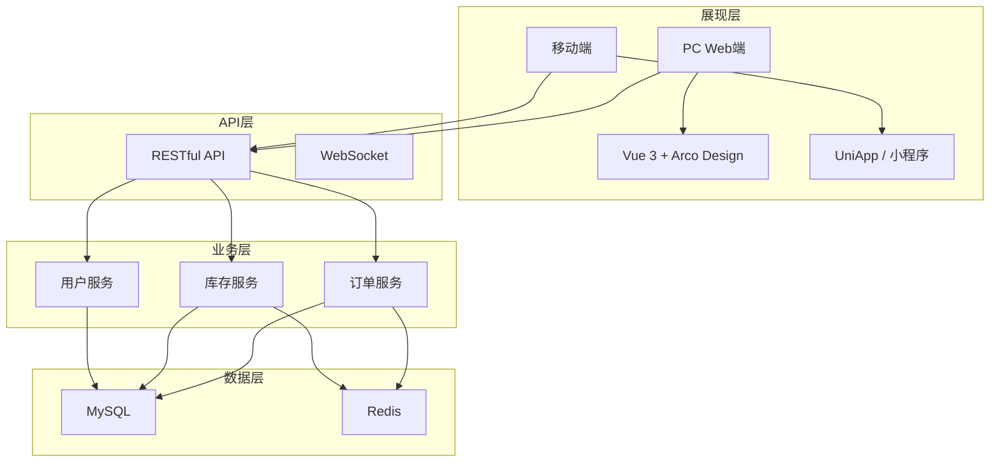

# {项目名称} - 系统概览与架构

> 版本：v1.0  
> 文档状态：初稿  
> 所属章节：第一章

<!-- ============================================================ -->
<!-- 模板说明：本文档介绍系统的整体定位、设计哲学、技术架构等宏观信息 -->
<!-- 核心章节：功能定位 / 设计哲学 / 技术架构 / 模块树 / 角色定义  -->
<!-- ============================================================ -->

---

## 一、功能定位

### 1.1 系统定位

{项目名称}是{上级系统}的**核心业务节点**，承担**{角色描述}**：

```
┌─────────────────────────────────────────────────────────────┐
│                    {项目名称}（{角色概括}）                     │
├─────────────────────────────────────────────────────────────┤
│                                                              │
│  角色一：作为{角色一}                                          │
│  ┌──────────────────┐    ┌──────────────────┐              │
│  │ {功能模块A}       │ →  │ {功能模块B}       │              │
│  │ {功能描述}        │    │ {功能描述}        │              │
│  └──────────────────┘    └──────────────────┘              │
│                                                              │
│  角色二：作为{角色二}                                          │
│  ┌──────────────────┐    ┌──────────────────┐              │
│  │ {功能模块C}       │ →  │ {功能模块D}       │              │
│  │ {功能描述}        │    │ {功能描述}        │              │
│  └──────────────────┘    └──────────────────┘              │
│                                                              │
└─────────────────────────────────────────────────────────────┘
```

### 1.2 系统设计哲学

| 原则 | 说明 |
|------|------|
| **{原则1}** | {描述} |
| **{原则2}** | {描述} |
| **{原则3}** | {描述} |

### 1.3 核心价值

- **{价值1}**：{描述}
- **{价值2}**：{描述}
- **{价值3}**：{描述}

---

## 二、技术架构

### 2.1 整体架构分层



### 2.2 技术选型

| 技术栈 | 选型 | 用途 |
|-------|------|------|
| 前端框架 | Vue 3.x + TypeScript | PC端管理后台 |
| UI组件库 | Arco Design 2.x | 统一UI风格 |
| 后端框架 | Spring Boot 3.x | 微服务架构 |
| 数据库 | MySQL 8.x | 核心业务数据 |
| 缓存 | Redis 7.x | 分布式锁/缓存 |

---

## 三、功能模块树

```
{项目名称}
├── {一级模块A}
│   ├── {功能点A1} (P0)
│   ├── {功能点A2} (P0)
│   └── {功能点A3} (P1)
├── {一级模块B}
│   ├── {功能点B1} (P0)
│   │   ├── {子功能B1a}
│   │   └── {子功能B1b}
│   ├── {功能点B2} (P1)
│   └── {功能点B3} (P2)
└── {一级模块C}
    ├── {功能点C1} (P0)
    └── {功能点C2} (P1)
```

---

## 四、角色定义

| 角色 | 系统标识 | 层级 | 核心场景 | 使用端 |
|------|---------|:----:|---------|:------:|
| {角色1} | {标识} | 操作层 | {场景描述} | PC |
| {角色2} | {标识} | 操作层 | {场景描述} | PC |
| {角色3} | {标识} | 管理层 | {场景描述} | PC |

---

## 五、非功能性需求

| 维度 | 要求 | 衡量标准 |
|-----|------|---------|
| 性能 | {描述} | {指标} |
| 可用性 | {描述} | {指标} |
| 安全 | {描述} | {指标} |
| 可扩展 | {描述} | {指标} |

---

## 六、版本历史

| 版本 | 日期 | 修订内容 |
|:----:|:----:|---------|
| v1.0 | {YYYY-MM-DD} | 初始创建 |
