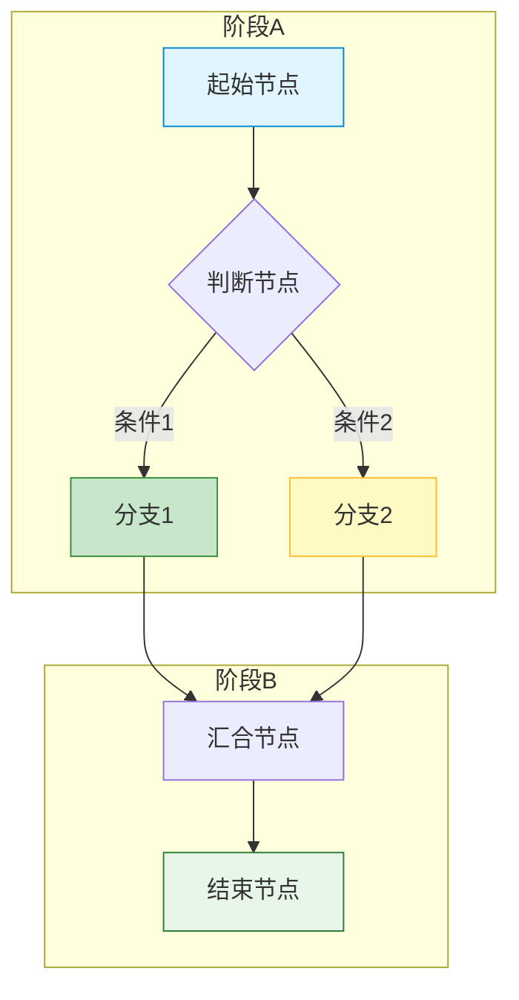
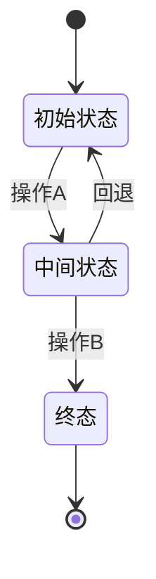
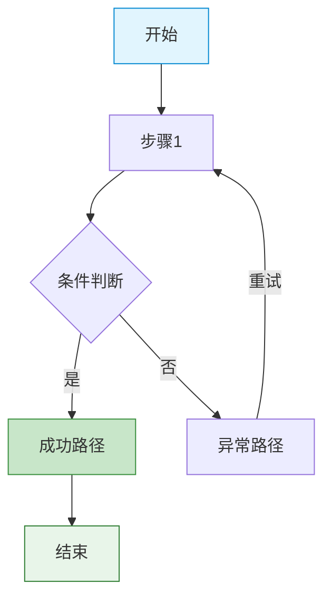

# {项目名称} - 业务流程设计

> 版本：v1.0  
> 文档状态：初稿  
> 所属章节：第二章

<!-- ============================================================ -->
<!-- 模板说明：本文档描述跨模块的核心业务流程，以Mermaid流程图为主 -->
<!-- 核心章节：功能概述 / 核心流程 / 状态流转 / 关键说明          -->
<!-- ============================================================ -->

---

## 一、功能概述

### 1.1 功能定位

业务流程设计是{项目名称}所有功能模块的**业务操作指南**，描述从{起点}到{终点}的完整业务流转。本文档面向产品、开发、测试团队，帮助理解{项目}在{生态}中的位置和各流程的业务规则。

### 1.2 核心概念

| 概念 | 说明 | 涉及链路 |
|-----|------|:--------:|
| {概念1} | {描述} | {链路标记} |
| {概念2} | {描述} | {链路标记} |
| {概念3} | {描述} | {链路标记} |

### 1.3 目标用户

- **产品经理**：理解业务链路，指导功能设计
- **开发工程师**：了解业务上下文，指导数据库设计和接口开发
- **测试工程师**：基于流程设计测试用例
- **运营人员**：了解操作流程，指导日常使用

---

## 二、核心业务链路概述

{项目名称}在平台中处于**{描述}**位置，同时参与{数量}条核心交易链路：

```
链路一：{链路一名称}
═════════════════════════════════════════════════════
    ┌──────────┐    {操作}    ┌──────────┐
    │  {角色A}  │ ──────────▶ │  {角色B}  │
    │ {说明}    │◀───────────│ {说明}    │
    └──────────┘      {操作}   └──────────┘

链路二：{链路二名称}
═════════════════════════════════════════════════════
    ┌──────────┐    {操作}    ┌──────────┐
    │  {角色C}  │ ──────────▶ │  {角色D}  │
    │ {说明}    │◀───────────│ {说明}    │
    └──────────┘      {操作}   └──────────┘
```

---

## 三、{流程一名称}

### {流程编号}.1 流程图



### {流程编号}.2 流程步骤说明

| 步骤 | 操作角色 | 操作内容 | 系统响应 | 前置条件 | 后置状态 |
|:----:|:--------:|---------|---------|---------|---------|
| 1 | {角色} | {操作描述} | {系统反馈} | {条件} | {状态变化} |
| 2 | {角色} | {操作描述} | {系统反馈} | {条件} | {状态变化} |
| 3 | {角色} | {操作描述} | {系统反馈} | {条件} | {状态变化} |

### {流程编号}.3 状态流转图



<!-- 每张流程图必须满足：无孤立节点、有明确的起点和终点、节点命名清晰 -->

---

## 四、{流程二名称}

### {流程编号}.1 流程图



### {流程编号}.2 流程图说明

| 节点 | 说明 | 角色 | 关联功能 |
|:----:|------|:----:|---------|
| {节点名} | {描述} | {角色} | {关联的模块功能} |

---

## 五、关键流程说明

### 5.1 {关键规则一}

- {规则描述}
- {规则描述}

### 5.2 {关键规则二}

- {规则描述}
- {规则描述}

---

## 六、版本历史

| 版本 | 日期 | 修订内容 |
|:----:|:----:|---------|
| v1.0 | {YYYY-MM-DD} | 初始创建 |
