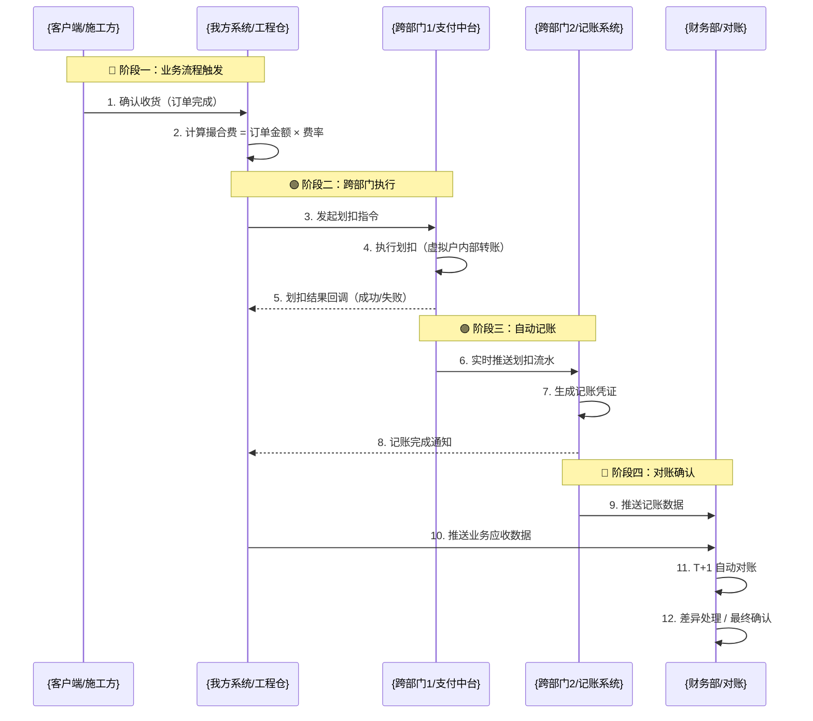
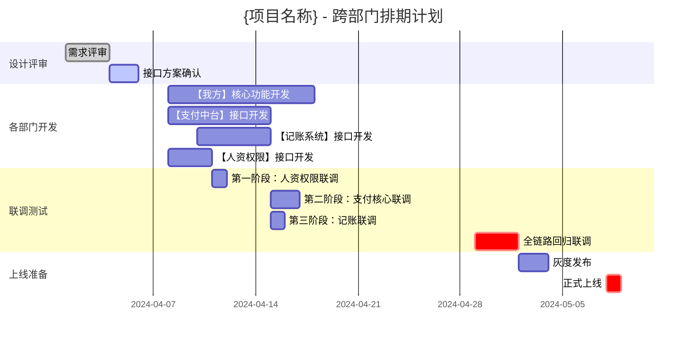

# {项目名称} - 跨部门协作PRD 标准模板

> **版本**：v1.0  
> **文档状态**：{初稿/评审中/已定稿}  
> **最后更新**：{YYYY-MM-DD}  
> **审批状态**：{待签字/已签字}

<!-- ============================================================ -->
<!-- 跨部门PRD核心理念：每个部门都清楚 "做什么、什么时候交、接口长什么样"    -->
<!--                                                              -->
<!-- 使用说明：                                                      -->
<!-- 1. 本模板包含15个标准章节，按实际项目规模裁剪                          -->
<!-- 2. 【必填】标记的章节必须完整填写，否则跨部门会推诿                   -->
<!-- 3. 【可选】标记的章节大型项目补充，中小型项目可略                     -->
<!-- 4. {花括号}内容为占位符，请替换为实际内容                             -->
<!-- 5. ⚠️ 标记为待补充的内容，必须在联调前补齐                           -->
<!-- ============================================================ -->

---

## 📋 文档元信息 【必填】

| 属性 | 内容 |
|:-----|:-----|
| **项目名称** | {如：工程仓虚拟户与撮合费记账项目} |
| **PRD编号** | {PRD-YYYY-MM-XXX} |
| **归口部门** | {如：工程仓产品部} |
| **文档作者** | {姓名 + 邮箱/企业微信} |
| **核心干系人** | {业务负责人、产品负责人、技术负责人} |
| **评审会议** | {时间 + 参会人列表} |
| **版本记录** | {版本号 + 更新日期 + 更新人 + 变更摘要} |

---

## 📌 跨部门干系人清单 【必填】

> 本项目涉及的所有部门、对接人、职责。签字前必须100%确认，否则联调时找不到人。

| 部门 | 系统 | 对接人 | 角色 | 职责 | 签字确认 |
|:-----|:-----|:-------|:-----|:-----|:---------|
| **{我方部门}** | {如：工程仓端、平台端} | {姓名1，姓名2} | ✅ 主责方 | {1. 撮合费率计算 2. 划扣时机触发 3. 业务数据提供} | □ 已确认 |
| **{跨部门1}** | {如：支付中台} | {对接人姓名} | 🤝 协同方 | {1. 虚拟户开户 2. 撮合费划扣执行 3. 流水推送} | □ 已确认 |
| **{跨部门2}** | {如：记账系统} | {对接人姓名} | 🤝 协同方 | {1. 接收划扣流水 2. 自动生成凭证 3. 记账回调} | □ 已确认 |
| **{跨部门3}** | {如：统一权限平台} | {对接人姓名} | 🤝 协同方 | {1. 统一登录SDK 2. RBAC权限接口} | □ 已确认 |
| **{跨部门4}** | {如：人资系统} | {对接人姓名} | 🤝 协同方 | {1. 第三方用户创建 2. 用户信息同步} | □ 已确认 |
| **{跨部门5}** | {如：发票系统} | {对接人姓名} | 🤝 协同方 | {1. 开票接口 2. OCR识别能力} | □ 已确认 |
| **财务部** | 对账系统 | {对接人姓名} | ✅ 最终验收 | {1. 对账差异处理 2. 最终记账确认} | □ 已确认 |

---

---

## 1. 协同背景与目标 【必填】

### 1.1 现状痛点（跨部门视角）

| 痛点编号 | 痛点描述 | 影响部门 | 量化影响 |
|:--------|:---------|:---------|:---------|
| P-001 | {如：各系统独立记账，对账差异无人认领} | {支付、财务、业务} | {每月需3人天人工核对，差异率5%} |
| P-002 | {如：划扣成功但记账失败，跨部门推诿} | {支付、财务} | {已发生N笔坏账，累计金额XX元} |
| P-003 | {如：无统一排期，各部门自行其是} | {所有部门} | {项目延期风险≥30%} |

### 1.2 本次协同目标

> 每个部门至少1条，必须包含量化指标。

| 部门 | 协同目标 | 验收指标 |
|:-----|:---------|:---------|
| **{我方部门}** | {如：完成撮合费计算自动化，准确触发划扣} | {1. 费率计算准确率100% 2. 划扣触发时效≤5分钟} |
| **{支付中台}** | {如：虚拟户划扣能力稳定可靠} | {1. 划扣成功率≥99.99% 2. 自动重试3次 3. 流水推送实时} |
| **{记账系统}** | {如：划扣流水自动记账，无需人工干预} | {1. 记账成功率100% 2. 凭证生成时效≤30分钟} |
| **财务部** | {如：自动对账，差异自动预警} | {1. 对账覆盖率100% 2. 差异处理时效≤T+1工作日} |

### 1.3 协同范围边界 【必填】

| 分类 | 系统/模块 | 说明 |
|:-----|:---------|:-----|
| ✅ **本期参与** | {系统1，系统2，系统3} | {明确列出所有必须参与的系统} |
| ❌ **本期不参与** | {系统A，系统B} | {明确排除，避免范围蔓延} |
| ⚠️ **待决策** | {系统X} | {下一期迭代，或需要另行评审} |

---

## 2. 跨部门业务流程 【必填】

### 2.1 跨部门泳道图

> 从代码调用链提取，异步用 `-->>`，同步用 `->>`，按业务阶段分组。
> Mermaid diagram 渲染失败时请检查：1）无中文特殊符号 2）无孤立节点 3）语法正确



### 2.2 跨部门职责矩阵 【必填】

> 每个环节：明确主责、协同、输入、输出、SLA。这是联调时的"法律依据"。

| 环节编号 | 环节名称 | 主责方 | 协同方 | 输入 | 输出 | SLA |
|:--------|:---------|:-------|:-------|:-----|:-----|:-----|
| L-001 | 撮合费计算 | {我方部门} | - | 订单完成事件 | 撮合费金额 | 实时 ≤ 100ms |
| L-002 | 划扣执行 | {支付中台} | {我方部门} | 划扣指令 + 金额 | 划扣记录 | 同步响应，10s内完成 |
| L-003 | 流水推送 | {支付中台} | {记账系统} | 划扣成功记录 | 标准化流水报文 | 实时 ≤ 30s |
| L-004 | 自动记账 | {记账系统} | - | 划扣流水 | 记账凭证号 | ≤ 30分钟 |
| L-005 | 自动对账 | {财务部} | 所有部门 | 记账数据 + 业务数据 | 对账报告 | T+1 日 15:00前 |
| L-006 | 差异处理 | {财务部} | 相关部门 | 对账异常标记 | 调整凭证/重记账 | T+1 工作日 |

---

## 3. 部门对接接口定义 【必填】

> 开发可以直接按此写代码。每个接口必须包含：请求/响应示例 + 错误码处理。

### 3.1 接口总览表

| 接口ID | 接口名称 | 调用方 | 提供方 | 协议 | 优先级 | 计划联调日期 |
|:-------|:---------|:-------|:-------|:-----|:-------|:------------|
| API-001 | {用户创建接口} | {工程仓} | {人资系统} | HTTP/JSON | P0 | {YYYY-MM-DD} |
| API-002 | {虚拟户开户接口} | {工程仓} | {支付中台} | HTTP/JSON | P0 | {YYYY-MM-DD} |
| API-003 | {撮合费划扣接口} | {工程仓} | {支付中台} | HTTP/JSON | P0 | {YYYY-MM-DD} |
| API-004 | {划扣流水回调} | {支付中台} | {工程仓} | HTTP/JSON | P0 | {YYYY-MM-DD} |
| API-005 | {记账凭证回调} | {记账系统} | {支付中台} | MQ | P1 | {YYYY-MM-DD} |
| API-006 | {开票申请接口} | {工程仓} | {发票系统} | HTTP/JSON | P1 | {YYYY-MM-DD} |

---

### 3.2 接口详细定义模板

> 每个接口复制此模板，可生成独立的接口文档链接。

---

#### 🔐 API-00{X}：{接口名称}

| 属性 | 内容 |
|:-----|:-----|
| **接口路径** | {POST /api/v1/xxx/xxx} |
| **调用方** | {部门名 - 系统名} |
| **提供方** | {部门名 - 系统名} |
| **对接人** | {姓名} |
| **排期要求** | {YYYY-MM-DD 前完成开发} |
| **联调日期** | {YYYY-MM-DD} |

**请求参数示例**：
```json
{
  "requestId": "唯一请求ID，用于幂等",
  "timestamp": 1714567890000,
  "data": {
    "字段1": "示例值 - 说明",
    "字段2": "示例值 - 说明"
  },
  "sign": "签名"
}
```

**响应参数示例**：
```json
{
  "code": "0",
  "message": "success",
  "requestId": "原样返回",
  "data": {
    "返回字段1": "示例值 - 说明",
    "返回字段2": "示例值 - 说明"
  }
}
```

**错误码定义**：

| 错误码 | 含义 | 调用方处理方式 |
|:-------|:-----|:-------------|
| 0 | 成功 | 业务继续 |
| A001 | 参数非法 | 校验并重试 |
| A002 | 签名错误 | 检查签名算法 |
| B001 | 业务规则校验失败 | 提示用户，走人工 |
| B002 | 幂等重复请求 | 直接返回成功 |
| C001 | 系统内部异常 | 重试最多3次，告警 |

---

## 4. 跨部门排期计划 【必填】

### 4.1 整体时间线（Mermaid甘特图）

> 时间估算：简单接口3天，中等5天，复杂10天；联调 = 涉及部门数 × 1天；加20%缓冲。



### 4.2 各部门交付物清单

| 部门 | 交付物 | 交付标准 | 计划交付日期 | 实际交付 |
|:-----|:-------|:---------|:------------|:---------|
| {我方部门} | 1. 撮合费计算代码<br/>2. 划扣触发逻辑<br/>3. 联调测试用例 | 单元测试覆盖率 ≥ 80% | {日期} | □ |
| {支付中台} | 1. 划扣接口<br/>2. 流水推送MQ<br/>3. 回调接口 | 压测TPS ≥ 100 | {日期} | □ |
| {记账系统} | 1. 自动记账引擎<br/>2. 凭证生成规则 | 记账准确率 100% | {日期} | □ |
| 财务部 | 1. 对账规则文档<br/>2. 验收标准 | 签字确认 | {日期} | □ |

### 4.3 关键依赖与风险

| 风险ID | 风险描述 | 概率 | 影响 | 应对策略 | 负责人 | 升级触发条件 |
|:-------|:---------|:-----|:-----|:---------|:-------|:------------|
| R-001 | {支付中台开发资源不足} | 30% | 延期2周 | 1. 提前对齐优先级<br/>2. 预留2天缓冲 | {项目经理} | 延期超过3天 |
| R-002 | {记账接口方案变更} | 20% | 返工 | 1. 评审时邀请记账负责人<br/>2. 接口冻结后变更走审批 | {产品} | 方案变更时 |
| R-003 | {联调环境不稳定} | 50% | 阻塞 | 1. 提前一周申请稳定环境<br/>2. 准备Mock数据 | {测试} | 环境不可用超过1天 |

---

## 5. 测试验收标准 【必填】

### 5.1 联调测试场景

| 场景ID | 测试场景 | 前置条件 | 验证点 | 验收标准 |
|:-------|:---------|:---------|:-------|:---------|
| TC-001 | 正常流程全链路 | 订单完成、余额充足 | 1. 划扣成功 2. 流水推送 3. 自动记账 | 端到端时效 ≤ 30分钟，无异常 |
| TC-002 | 划扣失败重试 | 首次划扣失败 | 自动重试3次，最终失败告警 | 重试机制正常，告警触达财务 |
| TC-003 | 对账差异处理 | 应收 ≠ 实收 | 差异标记，财务工作台可见 | 差异 ≤ 0.01元自动抹零，>0.01元人工处理 |
| TC-004 | 幂等性验证 | 重复发起相同请求 | 只处理一次，返回成功 | 无重复划扣，无重复记账 |
| TC-005 | 并发压测 | 100笔/秒并发 | 系统稳定性 | 成功率 ≥ 99.99%，无数据错乱 |

### 5.2 部门级验收标准

| 部门 | 验收条目 | 通过标准 | 验收人签字 |
|:-----|:---------|:---------|:----------|
| {我方部门} | 撮合费计算 | 准确率100%，覆盖所有商品类型 | □ |
| {支付中台} | 划扣能力 | 成功率≥99.99%，重试机制可靠 | □ |
| {记账系统} | 自动记账 | 覆盖率100%，凭证借贷平衡 | □ |
| 财务部 | 最终确认 | 连续3天对账无异常 | □ |

---

## 6. 跨部门沟通机制 【必填】

### 6.1 常规会议

| 会议类型 | 频率 | 时间 | 参会人 | 输出 |
|:--------|:-----|:-----|:------|:-----|
| **跨部门站会** | 每日 | 下午5:30 | 核心开发 + 测试 | 进度同步，阻塞问题上报 |
| **周例会** | 每周五 | 下午4:00 | 所有对接人 + 负责人 | 周报，风险盘点 |
| **里程碑评审** | 每个阶段末 | 按排期 | 全体干系人 | 阶段验收报告，排期调整 |

### 6.2 问题升级机制

| 问题等级 | 定义 | 升级路径 | 响应时效 |
|:--------|:-----|:---------|:---------|
| **P1 阻塞** | 联调完全阻塞 | 对接人 → 技术负责人 → 部门总监 | 1小时内响应，4小时内出方案 |
| **P2 严重** | 影响核心路径，但有绕行方案 | 对接人 → 技术负责人 | 4小时内响应，24小时内出方案 |
| **P3 一般** | 不影响主流程 | 对接人 | 工作日响应 |

### 6.3 沟通渠道

| 渠道 | 用途 | 说明 |
|:-----|:-----|:-----|
| 企业微信群 | 日常沟通 | 群名：{项目名}-跨部门协同群 |
| 邮件 | 正式通知、变更审批 | 抄送所有干系人 |
| JIRA/禅道 | Bug跟踪、任务管理 | 必须关联具体接口/场景 |
| 文档中心 | 接口文档、更新记录 | 实时更新，变更发群通知 |

---

## 7. 附录 【可选】

### 7.1 共享数据字典

| 数据实体 | 主数据源 | 消费方 | 同步机制 |
|:---------|:---------|:-------|:---------|
| 用户信息 | 人资系统 | 所有系统 | 实时MQ同步 |
| 商户信息 | 工程仓 | 支付、记账 | 每日批量同步 |
| 订单数据 | 工程仓 | 对账系统 | T+1 批量同步 |
| 划扣流水 | 支付中台 | 记账系统 | 实时MQ推送 |

### 7.2 变更记录

| 版本 | 更新日期 | 更新人 | 变更内容 | 影响范围 |
|:-----|:---------|:-------|:---------|:---------|
| v1.0 | {日期} | {姓名} | 初稿完成 | 全部 |
| v1.1 | {日期} | {姓名} | {变更说明} | {具体接口/场景} |

### 7.3 参考文档

| 文档名称 | 链接 |
|:---------|:-----|
| {支付中台接口规范} | {内网链接} |
| {记账系统对接文档} | {内网链接} |
| {统一权限SDK使用指南} | {内网链接} |

---

## 📝 签字确认页

> 本页作为跨部门协同的正式协议。变更任何内容必须走正式的变更流程。

| 部门 | 负责人签字 | 日期 | 备注 |
|:-----|:----------|:-----|:-----|
| {我方部门} | ____________ | ________ | |
| {支付中台} | ____________ | ________ | |
| {记账系统} | ____________ | ________ | |
| {人资系统} | ____________ | ________ | |
| {统一权限} | ____________ | ________ | |
| {财务部} | ____________ | ________ | |

---

> **模板使用小贴士**：
> 1. 先用此模板开需求评审会，对齐所有部门
> 2. 签字页拍照发到群里，作为正式启动依据
> 3. 联调前再检查一遍接口定义和排期
> 4. 出现变更立即更新文档并通知所有人
