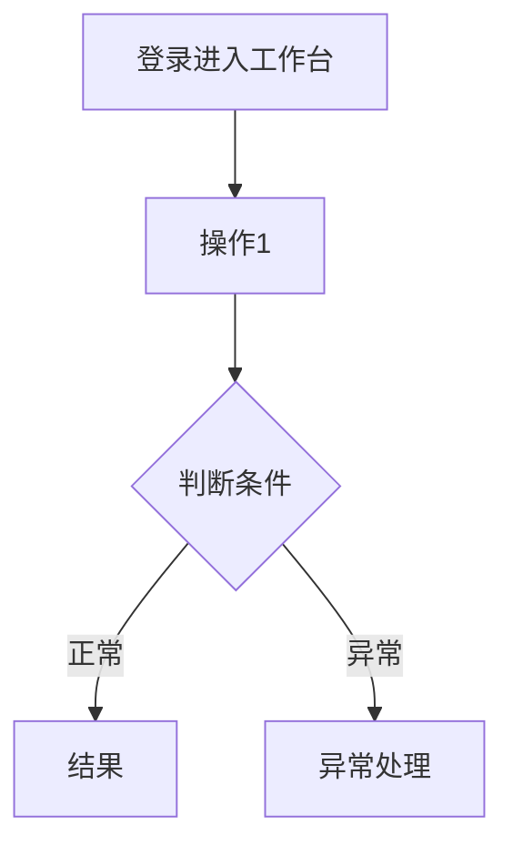
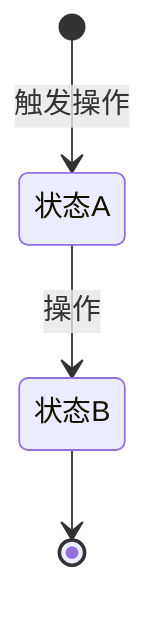

# PM纯净版分析指南

> **定位**：写给真人PM看的PRD写作指南，帮助理解「每个章节写什么、写到什么程度算合格」。
> **原则**：本文档严格遵守PM纯净版边界——只聚焦业务层定义，不涉及字段类型、API路径、技术实现方式等细节。
> **配套模板**：`05-系统模块详细设计-PM纯净版.md`

---

## 📌 一、文档前设

### 1.1 版本历史

| 版本 | 日期 | 修订内容 | 修订人 |
|:----:|:----:|---------|:-----:|
| v1.0 | YYYY-MM-DD | 初始创建，覆盖全部功能点 | PM |

**填充指南**：
- 每次有重大章节变更加一版（小修小改只改日期不改版本号）
- 修订内容写清楚改了哪个功能点，不要只写“修正Bug”
- 修订人写实际修改文档的人名

**自检**：如果你是研发，拿到文档后看版本历史能不能快速了解文档变更历史？

---

### 1.2 术语表（⚠️ 必填，消除歧义）

| 术语 | 定义 | 与本功能的关系 | 是否与上下游对齐 |
|:---|:---|:---|:---:|
| [术语1] | [完整定义] | [例：本功能管理的核心实体] | ✅/❌ |

**填充指南**：
- 列出文档中所有可能产生歧义的名词。最常见的是"商品"到底指SPU还是SKU
- 如果术语在上下游系统有不同叫法，明确映射关系（如：本系统叫"采购单"，财务系统叫"入库单"）
- 每个术语都要能在一句话内说清楚

**自检**：把文档中所有"商品"替换成"SKU"，逻辑是否还成立？

---

### 1.3 用户角色定义

| 角色 | 定义 | 在本功能的典型操作 | 本版本是否支持 |
|:---|:---|:---|:---:|
| [角色名] | [一句话定义] | 1. xxx 2. xxx | ✅/❌ |

**填充指南**：
- 不要只列角色名，要说明"这个角色在这个功能里能做什么"
- 区分"有账号就能用"和"需要特定权限"

**自检**：这个角色表，后续的权限矩阵是否有一一对应？

---

## 🎯 二、功能概述

### 2.1 功能定位（一句话）

> [解决什么业务问题？在产品架构中的位置？]

**示例**：商品市场是工程仓采购的入口级功能，为采购员提供供应商商品的浏览、搜索、选购、购物车管理和下单提交通道。

### 2.2 模块范围

| 功能分类 | 具体功能 | 优先级 | 本版本包含 | 说明/备注 |
|:---|:---|:---:|:---:|:---|
| [分类1] | [功能1] | P0 | ✅ | - |
| [分类1] | [功能2] | P1 | ✅ | MVP不包含，延后 |
| [分类2] | [功能3] | P2 | ❌ | 下个版本 |

**填充指南**：
- P0：没有此功能业务跑不通
- P1：重要但可以首个版本后补
- P2：nice to have，明确写"不包含"

---

## 📐 三、核心设计原则

> **整个系统的业务设计思想，作为所有业务规则的上层约束。**

### 3.1 [原则一：具体主题]

**规则说明**：
- 子规则1
- 子规则2
- 例外情况

**示例**：
> **轻量概览原则**：工作台只展示关键运营指标（数字卡片+趋势+图表），不做明细数据下钻。每个指标独立加载，互不影响（容错隔离）。

**填充指南**：
- 原则 = 不能违反的顶层约束。如果某个功能违反了原则，要么改功能，要么说明为什么该原则在此场景不适用
- 3-5条原则足够，太多等于没有

**自检**：把每条原则读给研发听，他是否点头说"这个有道理"？

---

## 📋 四、业务规则

### 4.1 业务规则表（⚠️ 核心，用表格替代长段落）

| 规则ID | 规则描述 | 触发时机 | 执行动作 | 例外情况 |
|:---|:---|:---|:---|:---|
| R001 | [规则内容] | [什么时候触发] | [系统做什么] | [什么情况下不适用] |
| R002 | ... | ... | ... | ... |

**填充指南**：
- 每条规则应可以被测试同学直接写成测试用例
- 覆盖：校验规则、计算规则、同步规则、通知规则
- 例外情况是规则中最容易被忽略的部分

**自检**：把所有"应该""建议"改成"必须""如果...那么..."

---

### 4.2 状态机定义（状态模块必写）

#### 状态定义表

| 状态名称 | 业务含义 | 谁可触发进入 | 可执行的操作 |
|:---|:---|:---|:---|
| [状态1] | [什么情况下是这个状态] | [角色A/B/系统自动] | 编辑、提交、删除... |
| [状态2] | ... | ... | ... |

#### 核心业务流程图

**填充指南**：
- 状态数量：3-7个为宜，太多考虑合并
- 每个状态必须回答：用户能看到什么？能做什么操作？
- Mermaid代码要可渲染，不要留语法错误

**自检**：没有"死胡同"状态（进去就出不来的状态）

---

### 4.3 状态×操作矩阵（⚠️ 研发核心编码依据）

| 状态 \ 操作 | 操作A | 操作B | 操作C | 操作D |
|:---|:---:|:---:|:---:|:---:|
| 状态1 | ✅ | ❌ | ✅ | ❌ |
| 状态2 | ❌ | ✅ | ❌ | → 状态3 |
| 状态3 | ✅ | ❌ | ❌ | ✅ |

**图例**：✅=允许操作，❌=不允许操作且按钮置灰，→=操作后状态变更

**填充指南**：
- 横向是操作（动词），纵向是状态（名词）
- 每个格子明确：允许/不允许/状态变更
- 这是研发写if-else的最直接依据

**自检**：矩阵中的每个"✅"，在后面的功能设计中都有对应的交互定义

---

### 4.4 权限矩阵（角色 × 操作 × 状态限制）

| 功能模块 | 操作 | 角色A | 角色B | 角色C | 状态限制 | 说明 |
|:---|:---|:---:|:---:|:---:|:---|:---|
| [模块] | [操作] | ✅ | ❌ | ✅ | 仅状态1/2 | - |

**填充指南**：
- 不要只写"管理员可操作"，要写清楚每个角色
- 状态限制：有些操作只在特定状态下才显示/可用

---

### 4.5 非功能性需求（PM业务层面）

| 维度 | 约束要求 | 适用场景 | 是否强制 |
|:---|:---|:---|:---:|
| 性能-列表查询 | P95 ≤ 500ms | 数据量10万以内 | ✅ |
| 性能-提交操作 | P95 ≤ 1s | - | ✅ |
| 数据量 | 支持单用户最多10万条 | - | ✅ |
| 幂等性 | 同一请求多次提交不重复创建 | 提交/支付类操作 | ✅ |
| 并发 | 支持100 TPS | 秒杀/抢购场景 | ⚠️ |

**注意**：PM只写"要什么"（如高并发），不写"用什么"（如Redis）。测量方式由QA负责。

---

## 🧩 五、功能点详细设计

每个功能点采用 **4D 模板**：交互逻辑 → 字段定义 → 操作定义 → 边界情况覆盖。

> PM纯净版：字段定义不含技术类型，操作定义不含API细节。

### 5.X [功能名称]（优先级：P0/P1）

#### 📱 交互逻辑（D1）

- **入口**：[从哪里进入？按钮/菜单/链接]
- **页面形式**：[新页面/弹窗/抽屉/行内展开]
- **操作序列**：1. xxx → 2. xxx → 3. xxx → 4. xxx
  - 正常路径：[描述]
  - 若[条件A] → [处理A]；若[条件B] → [处理B]
  - 提交后：[成功处理]；[失败处理]
- **加载状态**：[骨架屏/loading]
- **空状态**：[无数据时显示什么]
- **错误状态**：[接口报错时显示什么+重试机制]

**填充指南**：
- 操作序列要覆盖：正常路径 + 至少1个分支路径 + 异常恢复路径
- 加载/空/错误三种状态缺一不可，PM不说研发就不做
- 如果功能涉及跨页面的流程，用流程图补充说明

**自检**：按你写的操作序列走一遍，每一步都有明确的页面反应吗？

---

#### 📊 字段定义（D2）

> 不含技术类型（由技术方案补充）。PM只定义：这个字段叫什么、从哪来、必须吗、怎么校验、怎么展示。

**列表/展示字段**：

| 字段名 | 来源 | 展示规则 | 说明 |
|:---|:---|:---|:---|
| [字段] | 系统/用户/接口 | 文本/标签/图片 | - |

**表单字段**：

| 字段名 | 必填 | 来源 | 校验规则 | 默认值 | 说明 |
|:---:|:---|:---|:---|:---|:---|
| [字段] | 用户输入 | 非空，最大999999 | 0 | - |

**搜索/筛选字段**：

| 筛选项 | 可选值 | 是否支持多选 | 默认值 | 说明 |
|:---|:---|:---:|:---|:---|
| [筛选项] | A/B/C | ❌ | A | - |

**填充指南**：
- 每个字段都要问：来源是啥（用户填/系统生成/外部接口）？校验规则够明确吗？
- 枚举值列全：不写"是否"，要写"是/否"；不写"状态"，要列出所有可能值

**自检**：每个字段的校验规则，测试能直接写成一条用例吗？

---

#### 🎮 操作定义（D3）

| 操作按钮 | 可见条件 | 点击后行为 | 二次确认 | 成功反馈 | 失败反馈 |
|:---|:---|:---|:---:|:---|:---|
| [操作名] | [状态/角色限制] | [跳转/弹窗/调用接口] | ✅/❌ | 提示 | 提示 |

**填充指南**：
- 可见条件 = 什么状态下能看到/不能看到这个按钮（状态约束 + 角色约束）
- 二次确认 = 操作不可逆时（删除/审核通过/取消订单）必须有
- 成功/失败反馈 = 用户怎么知道操作结果（Toast/弹窗/页面跳转）

**自检**：每个按钮的"可见条件"能和状态×操作矩阵对应上吗？

---

#### ⚠️ 边界情况覆盖（D4）

| 场景 | 处理逻辑 | 提示文案 |
|:---|:---|:---|
| [具体场景] | [产品期望的处理行为] | "用户看到的文案" |

**填充指南**：
- 覆盖：网络超时、空数据、重复提交、权限不足、数据冲突
- 每个场景都写"用户看到什么提示"
- 至少5条边界情况，少于5条说明你没想清楚

**自检**：把你想到的所有"万一"列出来，每个都有对应行了吗？

---

## ❌ 六、异常处理汇总表

| 异常场景 | 触发条件 | 处理方式 | 提示文案 |
|:---|:---|:---|:---|
| [场景描述] | [什么情况触发] | [产品期望的处理行为] | "具体文案" |
| ... | ... | ... | ... |

> **说明**：不拆分前端处理和后端处理，PM只写"产品期望的总体处理行为"，前后端分工由技术方案定。

**可选增强列**（推荐）：

| 异常场景 | 触发条件 | 处理方式 | 提示文案 | 用户如何恢复 |
|:---|:---|:---|:---|:---|
| ... | ... | ... | "文案" | 修改后重试/刷新/联系客服 |

**填充指南**：
- 覆盖：网络错误、超时、业务校验失败、权限不足、并发冲突
- 每个异常都要考虑"用户如何恢复"——只说"报错"不够，要给用户一条路走

**自检**：把所有可能出错的环节列一遍，每个都有对应行吗？

---

## 🔗 七、接口需求说明

> 移除具体API路径和HTTP状态码。PM只定义"需要什么接口能力"。

| 接口用途 | 核心能力要求 |
|:---|:---|
| 列表查询 | 按条件筛选+分页返回列表数据 |
| 创建/提交 | 接收表单数据并保存 |

**填充指南**：
- 不要写接口名（如`/api/order/create`），只描述业务能力
- 列出本功能所有需要后端接口支持的能力

**自检**：如果把接口名列给研发，他能知道要做什么吗？如果不能，说明描述不够。

---

## 🔄 八、状态流转图（状态模块必写）

**填充指南**：
- 每个状态间的连线都要有对应的操作定义
- 考虑逆向流转（驳回、取消、退回）

---

## 📊 九、状态治理矩阵（状态模块必写）

### 9.1 动作定义表

| 动作ID | 动作名称 | 触发方式 | 触发角色 | 说明 |
|:-----:|---------|---------|:-------:|------|
| XX-01 | 动作名 | 点击按钮 | 角色 | 说明 |

### 9.2 状态×操作矩阵

| 状态 \ 操作 | 动作1 | 动作2 | 动作3 |
|:----------:|:----:|:----:|:----:|
| **状态A** | ✅ | ❌ | ✅ |
| **状态B** | ❌ | ✅ | ❌ |

---

## 📝 十、版本历史

| 版本 | 日期 | 修订内容 | 修订人 |
|:----:|:----:|---------|:-----:|
| v1.0 | YYYY-MM-DD | 初始创建，覆盖全部N个功能点 | PM |

---

## ✅ 十一、交付前自检清单

### 概念一致性
- [ ] 术语表已填写，覆盖所有关键名词
- [ ] 文档中名词使用与术语表一致
- [ ] 核心实体关系明确（1对1/1对多/多对多）

### 用户旅程闭环
- [ ] 核心实体的CRUD全覆盖（增删改查）
- [ ] 状态机+状态×操作矩阵完整
- [ ] 分支流程（驳回/取消/重试/重新提交）已定义
- [ ] 从入口到出口的完整路径可走通

### 业务规则显式化
- [ ] 业务规则表已填写（规则ID+描述+触发+动作+例外）
- [ ] 权限矩阵完整（角色×操作×状态限制）
- [ ] 所有"应该""建议"已改为"必须"

### 数据定义精确
- [ ] 每个列表/表单都有字段定义表（不含技术类型）
- [ ] 校验规则覆盖：格式/长度/必填/取值范围
- [ ] 枚举值已列出所有可能

### 异常与边界覆盖
- [ ] 异常汇总表已填写（至少5行）
- [ ] 空状态、加载状态、错误状态有定义
- [ ] 并发场景有提及（重复提交/数据冲突）

### 清晰度验证
- [ ] 忽略类型和接口路径，研发能否理解业务逻辑？
- [ ] 测试能否从文档直接写出测试用例？

### 最终验证
- [ ] 找一位研发同事盲读10分钟，他能回答：
  - 这个功能的核心实体是什么？
  - 状态流转是怎样的？
  - 他需要实现哪些接口能力？

---

## 📎 附录：不该写的内容对照表

| 如果你在想... | 这是... | 应该... |
|:---|:---|:---|
| "用Redis还是MySQL" | 技术实现 | 删掉，或改为"需支持高并发" |
| "接口路径是POST /api/xxx" | 技术实现 | 删掉，研发自己定 |
| "前端用Table组件" | 技术实现 | 删掉，或改为"列表以表格形式展示" |
| "字段类型是String(100)" | 技术实现 | 删掉，或改为"字段说明+校验规则" |
| "加一个分布式锁" | 技术实现 | 改为"需防止并发重复提交" |
| "HTTP状态码返回200/400" | 技术实现 | 删掉，研发自己定 |
| "数据库行锁+Redis预扣减" | 技术实现 | 改为"需防止超卖" |
| "这个按钮用防抖500ms" | 技术实现 | 改为"阻止短时间内重复提交" |
