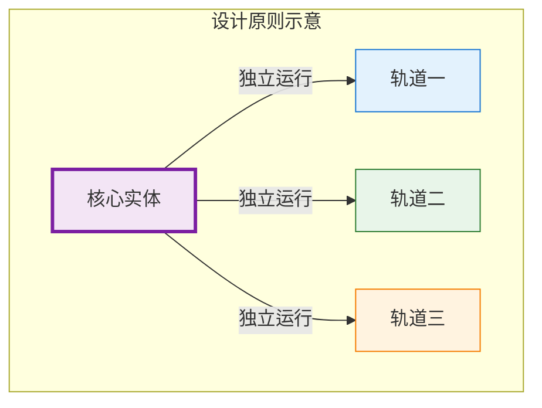
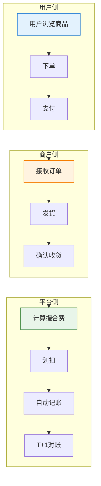
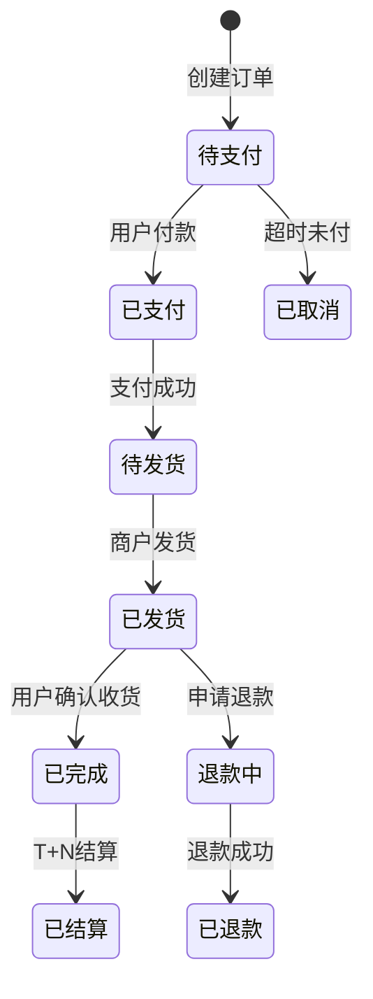
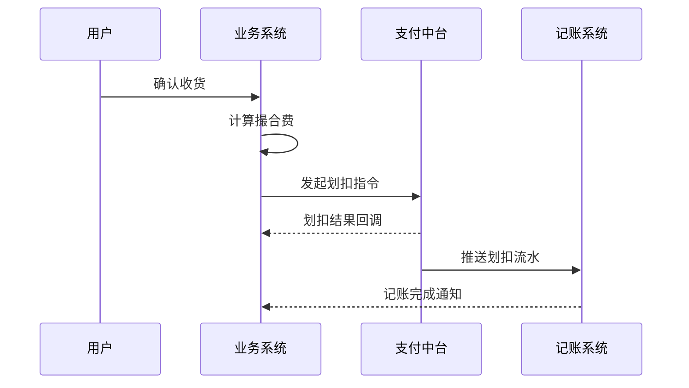
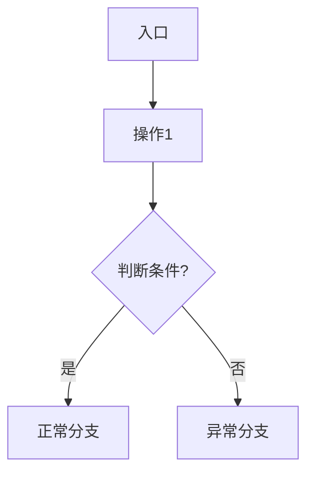
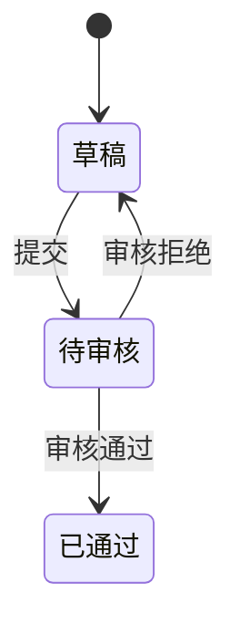

# {项目名称} - 产品需求文档 PRD

> **版本**：v1.0  
> **文档状态**：{初稿/评审中/已定稿}  
> **创建日期**：{YYYY-MM-DD}  
> **最后更新**：{YYYY-MM-DD}  
> **文档负责人**：{产品经理姓名}  
> **审批状态**：{待评审/已通过}

<!-- ============================================================ -->
<!-- 通用PRD生成器（融合版）标准模板                               -->
<!-- 四层递进输出：业务灵魂→功能全景→模块详细→流程图表                -->
<!-- ============================================================ -->

---

## 📚 文档索引

| 编号 | 文档 | 内容概要 | 面向角色 |
|:----:|------|---------|:--------:|
| — | **prd.md（本文）** | 总纲：设计原则、术语表、角色权限、功能全景、流程图 | 全局 |
| 01 | [01-系统概览与架构.md](01-系统概览与架构.md) | 系统定位、技术架构、模块树、目标用户 | 全局 |
| 02 | [02-业务流程设计.md](02-业务流程设计.md) | 核心交易链路、状态流转图、分支流程 | 全局 |
| 03 | [03-数据模型与表结构.md](03-数据模型与表结构.md) | 核心表DDL、字段约束、索引策略、实体关系 | 后端 |
| 04 | [04-领域模型设计.md](04-领域模型设计.md) | 实体、领域服务、领域事件、DDD分层 | 后端 |
| 05 | [05-跨部门协作PRD.md](05-跨部门协作PRD.md) | 接口契约、联调计划、排期甘特图、风险矩阵 | 跨部门项目 |
| 06 | [06-{模块A}功能详细设计.md](06-{模块A}功能详细设计.md) | {模块A}的4D完整设计（交互+字段+操作+边界） | 前后端 |
| 07 | [07-{模块B}功能详细设计.md](07-{模块B}功能详细设计.md) | {模块B}的4D完整设计 | 前后端 |
| 08 | [08-{模块C}功能详细设计.md](08-{模块C}功能详细设计.md) | {模块C}的4D完整设计 | 前后端 |

> **设计原则**：每个功能模块1篇独立文档，编号唯一且连续

---

---

## 🔮 第一层：业务灵魂（必须先确认！）

> 任何项目开始前，先确认核心设计原则和业务边界。这是文档的"魂"。

### 0.1 核心设计原则

| 原则 | 一句话说明 | 具体示例 |
|------|-----------|---------|
| **{原则一}** | {核心设计思想} | {在某场景下如何体现} |
| **{原则二}** | {核心设计思想} | {在某场景下如何体现} |
| **{原则三}** | {核心设计思想} | {在某场景下如何体现} |



### 0.2 商业本质一句话总结

> **用一句话描述这个项目的商业本质：**
>
> {例如：通过撮合工程仓和施工方的交易，收取撮合服务费，全程资金闭环在虚拟户体系内，平台不碰货款。}

### 0.3 明确的边界 - 我们**绝对不做**什么

> 不做什么，比做什么更重要！

| 绝对禁止 | 说明 | 替代方案 |
|:-------|------|---------|
| ❌ {禁止做的事1} | {为什么不做的原因} | {正确做法} |
| ❌ {禁止做的事2} | {为什么不做的原因} | {正确做法} |
| ❌ {禁止做的事3} | {为什么不做的原因} | {正确做法} |

### 0.4 线下生意特征还原

> 真实的生意是怎样做的？数字化必须尊重线下习惯。

| 线下环节 | 做法 | 数字化是否还原 |
|:-------|------|:------------:|
| {环节1} | {线下真实做法} | ✅ |
| {环节2} | {线下真实做法} | ✅ |
| {环节3} | {线下真实做法} | ✅ |

---

## 📖 第二层：全局规范

### 1.1 统一术语表

| 术语 | 精准定义 | 计算规则/示例 |
|------|---------|:------------:|
| **{术语1}** | {精确定义，不能有歧义} | {计算公式或示例} |
| **{术语2}** | {精确定义，不能有歧义} | {计算公式或示例} |
| **{术语3}** | {精确定义，不能有歧义} | {计算公式或示例} |
| **{术语4}** | {精确定义，不能有歧义} | {计算公式或示例} |

> 🔒 此表是全系统唯一真实来源，所有子文档不得重复定义！

---

### 1.2 用户角色全景

#### 1.2.1 角色定义表

| 角色 | 系统标识 | 核心职责 | 使用端 | 人数规模 |
|------|---------|---------|--------|---------|
| **{角色1}** | `role_admin` | {核心职责描述} | PC后台 | 少量，运维使用 |
| **{角色2}** | `role_merchant` | {核心职责描述} | PC/小程序 | 大量，商户使用 |
| **{角色3}** | `role_buyer` | {核心职责描述} | 小程序/APP | 海量，C端用户 |
| **{角色4}** | `role_finance` | {核心职责描述} | PC后台 | 财务部门 |

#### 1.2.2 端边界澄清表

| 端 | 核心诉求 | 绝对禁止功能 |
|:--:|---------|:------------:|
| **{端A}后台** | 管理、审核、对账 | ❌ 禁止做业务操作 |
| **{端B}商户端** | 经营、结算、订单 | ❌ 禁止看其他商户数据 |
| **{端C}用户端** | 交易、查询 | ❌ 禁止管理功能 |

#### 1.2.3 全局权限矩阵

| 功能模块 | 具体操作 | {角色1} | {角色2} | {角色3} | {角色4} | 说明 |
|:--------|---------|:------:|:------:|:------:|:------:|------|
| {模块A} | 创建 | ✅ | ✅ | ❌ | ❌ | - |
| {模块A} | 查询 | ✅ | ✅ | ✅ | ✅ | 按数据权限过滤 |
| {模块A} | 审核 | ✅ | ❌ | ❌ | ❌ | 只有管理员可审核 |
| {模块B} | 导出 | ✅ | ✅ | ❌ | ✅ | - |

---

## 🗺️ 第三层：功能全景

### 2.1 系统模块树（按端划分）

```
{项目名称}/
├── 平台端（后台管理）
│   ├── 系统管理
│   │   ├── 用户管理
│   │   ├── 角色权限
│   │   └── 系统配置
│   ├── 商户管理
│   │   ├── 商户入驻审核
│   │   ├── 商户信息管理
│   │   └── 商户状态管理
│   ├── 交易管理
│   │   ├── 订单查询
│   │   ├── 异常订单处理
│   │   └── 退款管理
│   └── 财务管理
│       ├── 对账管理
│       ├── 结算管理
│       └── 发票管理
│
├── {端B}商户端
│   ├── 商品管理
│   ├── 订单管理
│   └── 资金管理
│
└── {端C}用户端
    ├── 商品展示
    ├── 购物车
    └── 我的订单
```

---

### 2.2 功能全景清单（8列标准格式）

> **优先级定义**：P0=没有此功能业务跑不通 / P1=一期必须 / P2=二期优化

| 所属端 | 模块 | 一级菜单 | 二级菜单 | 核心功能点 | 物理文件 | 优先级 | 备注 |
|-------|------|---------|---------|-----------|---------|:------:|------|
| {端名} | {模块} | {菜单} | {子菜单} | {功能描述} | 06-{模块}.md | P0 | {说明} |
| {端名} | {模块} | {菜单} | {子菜单} | {功能描述} | 06-{模块}.md | P0 | {说明} |
| {端名} | {模块} | {菜单} | {子菜单} | {功能描述} | 06-{模块}.md | P1 | {说明} |
| {端名} | {模块} | {菜单} | {子菜单} | {功能描述} | 07-{模块}.md | P1 | {说明} |
| {端名} | {模块} | {菜单} | {子菜单} | {功能描述} | 07-{模块}.md | P2 | 二期优化 |

---

## 🔀 第四层：核心业务流程图

### 3.1 核心交易链路全景图



### 3.2 核心状态流转图



### 3.3 跨系统时序图（如涉及）



---

---

## 🧩 第五层：模块级详细设计指引

> **每个模块复制此模板，创建独立的 MD 文件**

---

### 模块设计标准模板（PM纯净版，4D完整设计）

```markdown
# {项目名称} - {模块名称}功能详细设计

> 版本：v1.0  
> 文档状态：初稿  
> 所属章节：第X章

---

## 一、功能概述

### 1.1 功能定位
[1-2段话：这个模块为什么存在？解决什么业务问题？在系统中的位置？]

### 1.2 核心概念
| 概念 | 说明 | 示例 |
|:----|------|------|
| 概念A | 精确定义 | 具体数值例子 |
| 概念B | 精确定义 | 具体数值例子 |

### 1.3 目标用户
- **{角色A}**（核心用户）：职责描述
- **{角色B}**：职责描述

### 1.4 模块范围
| 功能分类 | 主要功能 | 涉及角色 |
|:--------|---------|---------|
| 分类A | 功能1、功能2 | 角色A |
| 分类B | 功能3、功能4 | 角色B |

---

## 二、本模块专属设计原则

> **一句话概括本模块的设计哲学**

---

## 三、业务规则（结构化表格）

| 规则ID | 触发条件 | 系统动作 | 例外情况 | 说明 |
|:------|---------|---------|---------|------|
| R-001 | {条件} | {系统做什么} | {什么情况不执行} | {业务背景} |
| R-002 | {条件} | {系统做什么} | {什么情况不执行} | {业务背景} |

### 3.1 本模块业务流程图



---

## 四、权限矩阵（本模块细化）

| 具体操作 | 角色A | 角色B | 角色C | 说明 |
|---------|:----:|:----:|:----:|------|
| 操作1 | ✅ | ✅ | ❌ | - |
| 操作2 | ✅ | ❌ | ❌ | - |

---

## 五、非功能性需求

| 场景 | 性能指标 | 说明 |
|:----|:-------:|------|
| 列表查询 | ≤ 500ms | 含筛选+分页 |
| 提交保存 | ≤ 1s | - |

### 安全要求
| 风险点 | 预期防护策略 |
|:------|:-----------|
| 越权操作 | 校验用户角色+数据权限 |
| 重复提交 | 阻止短时间内重复提交 |

---

## 六、功能点详细设计（每个功能点用4D模板）

> **4D模板 = 交互逻辑 + 字段定义 + 操作定义 + 边界情况**

### 6.1 {功能点名称}（P0/P1/P2）

#### 🔄 交互逻辑
1. 页面加载：{描述加载行为，如默认Tab、默认筛选条件}
2. 用户{操作1}：{系统响应}
3. 若{条件A} → {处理A}；若{条件B} → {处理B}
4. 提交成功：{跳转到哪里？Toast提示？}
5. 提交失败：{提示文案？是否保留已填内容？}

#### 📋 字段定义表
| 字段 | 必填 | 来源 | 校验规则 | 展示规则 | 默认值 |
|:----|:----:|:----|:--------|:--------|:-----:|
| 字段名 | 是 | 用户输入 | 非空/长度≤50/手机号格式 | 红色星标 | - |
| 字段名 | 是 | 接口返回 | ≥0 | 红色加粗显示 | - |
| 字段名 | 否 | 用户选择 | 必选其一 | 下拉选择器 | 默认选项 |

#### 🔘 操作定义
| 按钮 | 可见条件 | 点击行为 | 二次确认 | 成功反馈 | 失败反馈 |
|:----|:---------|---------|:-------:|---------|---------|
| 保存 | 始终可见 | 提交表单 | ❌ | Toast："保存成功" | Toast："{具体错误}" |
| 删除 | 创建人可见 | 删除记录 | ✅ "确认删除？" | 刷新列表 | Toast："删除失败" |

#### ⚠️ 边界情况覆盖
| 场景 | 处理逻辑 | 用户看到的提示 |
|:----|:--------|-------------|
| 网络超时 | 前端自动重试1次，仍失败提示重试 | "网络不佳，请检查网络后重试" |
| 权限不足 | 按钮置灰 + Tooltip | "暂无此操作权限" |
| 并发操作 | 乐观锁提示 | "数据已被他人修改，请刷新后重试" |

---

## 七、异常处理汇总表

| 异常场景 | 触发条件 | 产品期望的处理方式 | 用户提示文案 |
|:--------|:--------|:----------------|-------------|
| {场景描述} | {如何触发} | {前端+后端的处理行为} | "用户友好的提示" |
| {场景描述} | {如何触发} | {前端+后端的处理行为} | "用户友好的提示" |

---

## 八、接口需求说明（PM纯净版 - 只说能力，不说路径）

| 接口用途 | 核心能力要求 | 备注 |
|:--------|:-----------|------|
| 列表查询 | 按条件筛选 + 分页返回列表数据 | - |
| 创建提交 | 接收表单数据并做业务校验 | - |

---

## 九、状态治理（状态类模块必写）

### 9.1 状态×操作权限矩阵

| 状态 \ 操作 | 编辑 | 提交 | 审核 | 删除 |
|:----------:|:----:|:----:|:----:|:----:|
| **草稿** | ✅ | ✅ | ❌ | ✅ |
| **待审核** | ❌ | ❌ | ✅ | ❌ |
| **已通过** | ❌ | ❌ | ❌ | ❌ |

### 9.2 状态流转图



---

## 十、版本历史

| 版本 | 日期 | 修订内容 | 修订人 |
|:----:|:----:|---------|:-----:|
| v1.0 | YYYY-MM-DD | 初始创建，覆盖N个功能点 | {姓名} |
```

---

---

## ✅ PRD 质量自检清单

### 业务灵魂检查
- [ ] 有没有用一句话讲清楚商业本质？
- [ ] 有没有明确列出"绝对不做"的3件事？
- [ ] 线下生意特征有没有还原？

### 完整性检查
- [ ] 每个模块都有功能定位吗？
- [ ] 每个功能点都用了4D模板（交互+字段+操作+边界）吗？
- [ ] 每个字段都有校验规则吗？
- [ ] 每个按钮都有可见条件和反馈吗？
- [ ] 每个功能点至少3个异常场景吗？
- [ ] 有没有全局权限矩阵？
- [ ] 有没有核心流程图？

### PM纯净版专项检查
- [ ] 字段定义有没有写技术类型（String/Decimal）？✅ 应该删掉！
- [ ] 有没有写API具体路径？✅ 应该只写能力！
- [ ] 有没有写HTTP状态码？✅ 应该删掉！
- [ ] 有没有拆分前后端处理？✅ 应该合并写产品期望的行为！

---

## 📝 审批签字

| 角色 | 签字 | 日期 | 意见 |
|:-----|:----:|:----:|-----|
| 产品负责人 | ____________ | ________ | |
| 技术负责人 | ____________ | ________ | |
| 测试负责人 | ____________ | ________ | |
| 业务负责人 | ____________ | ________ | |

---

> 📎 **模板使用建议**：
> 1. 新项目先用此总纲文档做需求评审，对齐所有人
> 2. 每个模块再单独展开详细设计
> 3. 定期更新功能全景清单和权限矩阵
> 4. 变更必须走版本历史记录
