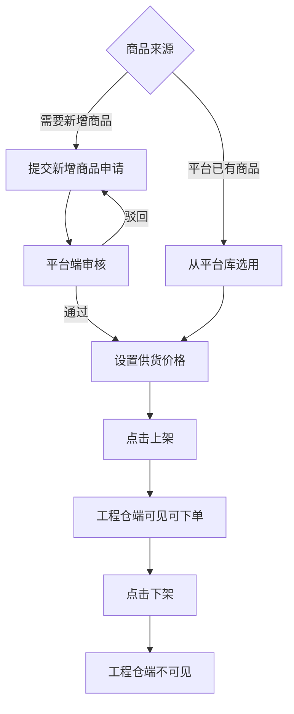
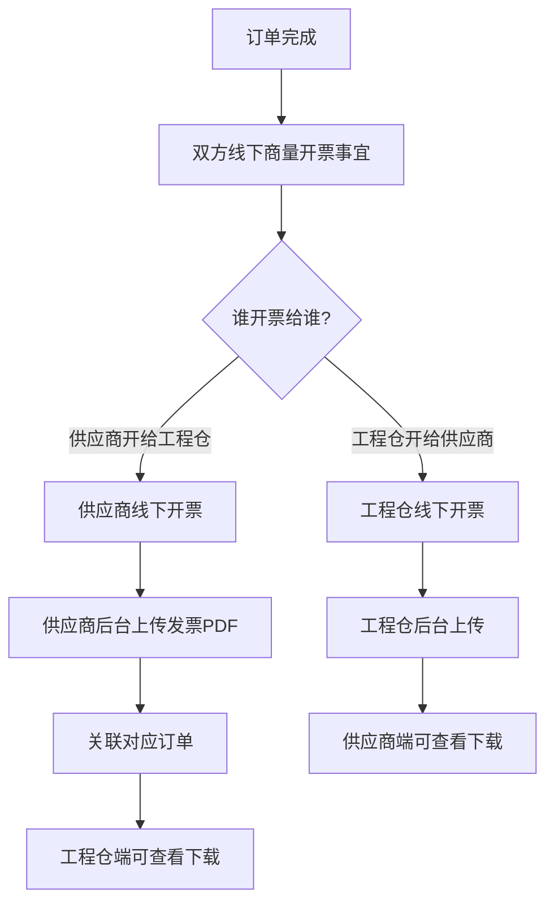

# 供应商端 - 产品功能清单 & PRD

**版本**：V1.0  
**所属端**：供应商端（PC管理后台）  
**目标用户**：供应商管理员/业务员/财务人员/仓管员  

---

## 一、产品概述

### 1.1 产品定位
供应商端是面向入驻平台的建材供应商，提供**商品管理、订单接单发货、货损售后处理、线下凭证上传**的一站式运营管理后台。

### 1.2 核心业务模式

```
【重点：全程线下模式，无在线支付】

工程仓端       →      线下转账      →      供应商
（采购方）                       （收款方）
    ↓                                   ↑
平台记录支付状态 ← 上传转账截图凭证 ← 工程仓上传
```

| 业务节点 | 实现方式 |
|---------|---------|
| **支付方式** | 工程仓直接线下转账给供应商，不走平台 |
| **对账方式** | 工程仓上传转账截图，平台做记录 |
| **退款方式** | 线下原路退回，不做线上退款 |
| **货损处理** | 优先补发，平台记录补发状态 |

### 1.3 核心设计原则
1. **三状态完全分离**：订单状态/支付状态/发货状态完全独立，互不依赖
2. **商品由平台统一管理**：供应商从平台库选用商品，设置供货价
3. **全程线下不碰钱**：供应商只需查看支付标记，无需做任何财务操作

---

## 二、功能清单总览

| 模块 | 功能点数 | P0核心 | P1重要 | P2优化 |
|------|---------|-------|-------|-------|
| 🏠 **工作台** | 1 | 0 | 1 | 0 |
| 🏢 **商户中心** | 3 | 1 | 2 | 0 |
| 🛍️ **商品管理** | 8 | 4 | 3 | 1 |
| 📦 **订单管理** | 9 | 7 | 2 | 0 |
| 🔧 **售后管理** | 4 | 3 | 1 | 0 |
| 🏪 **合作工程仓** | 3 | 0 | 2 | 1 |
| 💰 **财务中心** | 5 | 1 | 3 | 1 |
| ⚙️ **系统设置** | 4 | 2 | 2 | 0 |
| **总计** | **37个** | **18个P0** | **16个P1** | **3个P2** |

---

## 三、核心业务流程图

### 3.1 订单主流程（含分批发货+售后补发全场景）

```mermaid
graph TD
    A[工程仓下单<br>创建采购订单] --> B[订单：待确认<br>支付：未支付<br>发货：待发货]
    B --> C{供应商确认接单?}
    
    C -->|确认接单| D[订单状态：已确认<br>发货按钮点亮]
    C -->|取消订单| Z[订单：已取消<br>流程结束]
    
    D --> E{商品是否齐全?}
    
    E -->|全部齐全| F[点击发货<br>填写物流(非必填)]
    E -->|先有一部分| G[填写本次发货数量<br>发货状态：部分发货]
    
    F --> H[发货状态：全部发货<br>等待收货]
    G --> G1[后续到货了]
    G1 --> G2[按钮变成→继续发货]
    G2 -->|全部发完| H
    G2 -->|还有剩下| G
    
    H --> I[工程仓收货]
    I --> J{收货有货损吗?}
    
    J -->|没有货损| K[订单状态：已完成]
    J -->|有货损| L[工程仓填写<br>货损数量+拍照+说明]
    L --> M[系统自动生成售后单<br>订单显示：售后中]
    M --> N{供应商处理方式}
    
    N -->|补发| O[安排补发商品]
    O --> P[点击补发按钮]
    P --> Q[工程仓收到补发]
    Q --> R[售后状态：已完成]
    R --> K
    
    N -->|线下退款| S[记录退款金额<br>标记完成]
    S --> K
```

### 3.2 商品上架流程



### 3.3 发票上传流程



---

## 四、P0核心功能详细说明（18个）

### 4.1 订单管理（7个P0）

| 功能点 | 功能说明 | 交互细节 | 异常场景 |
|-------|---------|---------|---------|
| **订单列表查询** | 按状态Tab筛选工程仓采购订单 | 8个状态Tab：全部/待确认/待发货/待收货/已完成/已取消/售后中/已售后；每个订单同时显示3个状态标签 | 超过3个月查询提示 |
| **确认接单** | 确认接受工程仓订单 | 点击即时生效，待确认→已确认 | 重复确认→"已确认"提示 |
| **订单发货** | 处理订单发货 | 弹窗填写：物流公司(非必填)、物流单号(非必填)；✅ **空也能发货** | 发货数量>订单数→提示 |
| **部分发货** | 分多次发货 | 第一次部分发货→发货状态：部分发货；按钮文字自动变"继续发货" | 支持N次发货无限制 |
| **取消订单** | 取消待确认/待发货订单 | 二次确认弹窗，填写取消原因 | 已发货→按钮置灰 |
| **订单详情** | 订单完整信息 | 竖向时间线展示每个节点操作人+时间；三状态标签独立显示 | 订单不存在→返回列表 |
| **售后标记** | 有售后的订单标红 | 列表显示红色"🔴 售后中"标签 | 售后完成→"🟢 已处理" |

### 4.2 售后管理（3个P0）

| 功能点 | 功能说明 | 交互细节 | 异常场景 |
|-------|---------|---------|---------|
| **售后列表** | 货损售后单列表 | 状态Tab：待处理/已补发；关联原订单号 | 无数据→空状态 |
| **查看货损证明** | 查看工程仓上传的货损图片+说明 | 图片可放大预览；货损数量+文字说明一目了然 | 图片损坏→提示加载失败 |
| **补发处理** | 货损补发操作 | 填写补发数量，关联原订单；走单独发货流程 | 补发数量≤货损数量校验 |

### 4.3 商品管理（4个P0）

| 功能点 | 功能说明 | 交互细节 | 异常场景 |
|-------|---------|---------|---------|
| **商品列表** | 供应商商品池管理 | 状态Tab：已上架/已下架；状态颜色区分 | 无数据→空状态 |
| **商品上架** | 商品上架销售 | 支持批量上架；操作即时反馈 | 重复上架→"已上架" |
| **商品下架** | 商品临时下架 | 二次确认弹窗，可填写原因 | 下架后工程仓端立即不可见 |
| **设置供货价** | 设置给工程仓的供货价格 | 弹窗编辑，价格>0校验；记录价格变更历史 | 价格≤0→校验不通过 |

### 4.4 财务中心（1个P0）

| 功能点 | 功能说明 | 交互细节 |
|-------|---------|---------|
| **凭证上传** | 线下转账截图上传 | 关联对应订单，支持多图片，支持jpg/png/pdf格式 |

### 4.5 系统设置（2个P0）

| 功能点 | 功能说明 | 交互细节 | 异常场景 |
|-------|---------|---------|---------|
| **主体信息查看** | 供应商基本信息查看 | 信息展示，敏感信息脱敏 | 信息不存在→显示"-" |
| **账号列表** | 子账号管理 | 启用/禁用开关 | 禁用后账号无法登录 |

### 4.6 商户中心（1个P0）
| 功能点 | 功能说明 | 交互细节 |
|-------|---------|---------|
| **主体信息编辑** | 修改联系人/电话/地址/营业执照 | 表单实时校验标红；图片上传进度条 |

---

## 五、P1重要功能详细说明（16个）

### 5.1 工作台（1个）
- **数据概览**：订单总金额/订单总数/待发货数/待结算金额/在售商品数；卡片式布局+趋势箭头

### 5.2 商户中心（1个）
- **合同列表**：平台合作合同查看下载

### 5.3 商品管理（3个）
- **商品详情查看**：商品完整信息+规格属性+各工程仓报价
- **新增商品申请**：平台没有的商品申请上架，多步骤表单，提交后平台审核
- **新增商品申请列表**：查看申请审核状态（待审核/已通过/已驳回）
- **库存预警**：低库存商品红色预警提示；可设置预警阈值

### 5.4 订单管理（2个）
- **订单导出**：筛选后订单数据导出Excel
- **补发记录**：补发单完整记录

### 5.5 售后管理（1个）
- **线下退款标记**：记录线下退款金额和说明

### 5.6 合作工程仓（2个）
- **工程仓列表**：已合作的工程仓列表
- **工程仓详情**：工程仓基本信息+历史订单+采购金额统计

### 5.7 财务中心（3个）
- **结算单列表**：应收结算单列表，状态Tab筛选
- **结算单详情**：结算明细+关联订单
- **对账单列表**：与平台对账记录

### 5.8 系统设置（2个）
- **员工管理**：员工信息维护
- **角色权限配置**：不同角色菜单权限，树形勾选

---

## 六、P2优化功能（3个）

1. **供货统计报表**：按工程仓统计供货金额
2. **商品批量导入**：Excel批量导入商品，下载模板→填写→上传→解析
3. **支付流水**：收款支付记录查询

---

## 七、重点页面原型说明

### 7.1 订单详情页
```
┌─────────────────────────────────────────────────────────┐
│  订单号：PO202604200001    状态：🔴 待发货              │
├─────────────────────────────────────────────────────────┤
│  [工程仓信息]                                            │
│  中建一局深圳分公司  联系人：张经理  138****8888         │
├─────────────────────────────────────────────────────────┤
│  [商品明细]                                              │
│  商品名称        规格    单价    数量    小计            │
│  水泥325#       吨      450     10      ¥4,500          │
│  沙子           方      120     50      ¥6,000          │
│                          合计：¥10,500                  │
├─────────────────────────────────────────────────────────┤
│  [状态时间线]                                            │
│  2026-04-20 10:00  工程仓下单                           │
│  2026-04-20 10:30  供应商确认接单                       │
├─────────────────────────────────────────────────────────┤
│  [ 取消订单 ]  [ 确认发货 ]                             │
└─────────────────────────────────────────────────────────┘
```

### 7.2 状态矩阵对照表

| 订单状态 | 支付状态 | 发货状态 | 可执行操作 |
|---------|---------|---------|-----------|
| 待确认 | 未支付 | 待发货 | 确认接单 / 取消订单 |
| 待确认 | 已支付 | 待发货 | 确认接单 / 取消订单 |
| **已确认** | **未支付** | **待发货** | ✅ **可以发货！(核心)** |
| 已确认 | 已支付 | 待发货 | 可以发货 |
| 已确认 | 未支付 | 部分发货 | 继续发货 |
| 已确认 | 任意 | 全部发货 | 等待收货 |
| 已完成 | 任意 | 任意 | 查看/开票 |
| 售后中 | 任意 | 任意 | 补发操作 |

---

## 八、异常场景完整覆盖

| 异常场景 | 系统处理 |
|---------|---------|
| 工程仓一直不转钱 | 支付状态永远灰色，但订单正常发货完成 |
| 发了3次才发完 | 3条发货记录，每条单独看物流 |
| 同订单部分补发部分退款 | 分别记录，状态叠加显示 |
| 发票开错了 | 删除重新传，没有校验 |
| 先发货一个月后才转钱 | 后期工程仓上传凭证，支付状态更新 |

---

## 九、开发排期建议

| 阶段 | 时间 | 完成内容 |
|------|------|---------|
| **第一阶段** | 第1周 | 18个P0核心功能（订单接单→发货→收货→补发主流程） |
| **第二阶段** | 第2周 | 16个P1重要功能（工作台/商品/合作仓/财务/权限） |
| **第三阶段** | 第3周 | 3个P2优化+测试+用户验收 |

---

> **✅ 供应商端产品功能清单输出完成！** 共37个功能，覆盖工作台、商户中心、商品管理、订单管理、售后管理、合作工程仓、财务中心、系统设置8大模块，含完整业务流程图。
