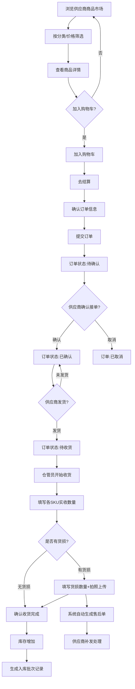
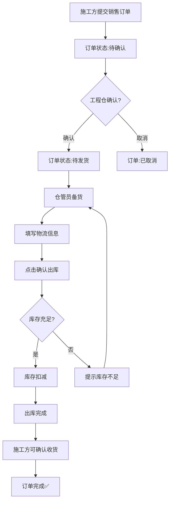
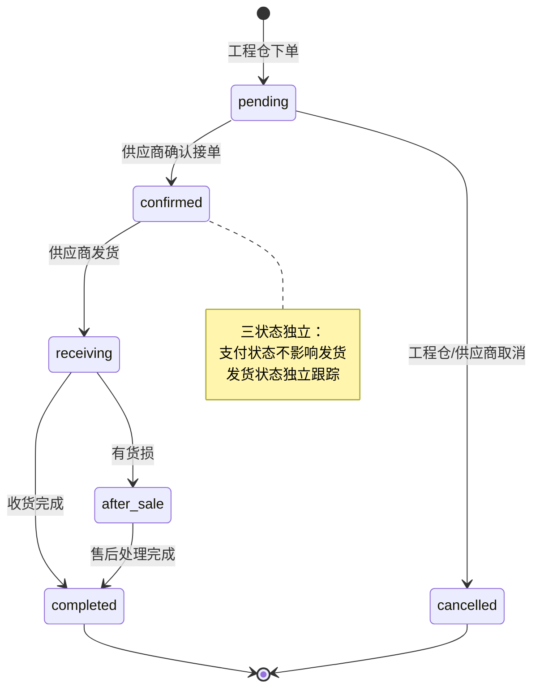
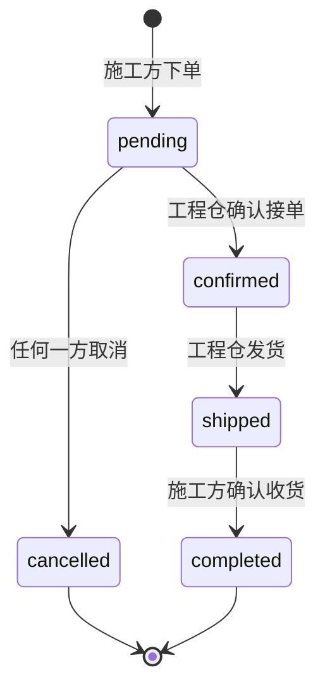
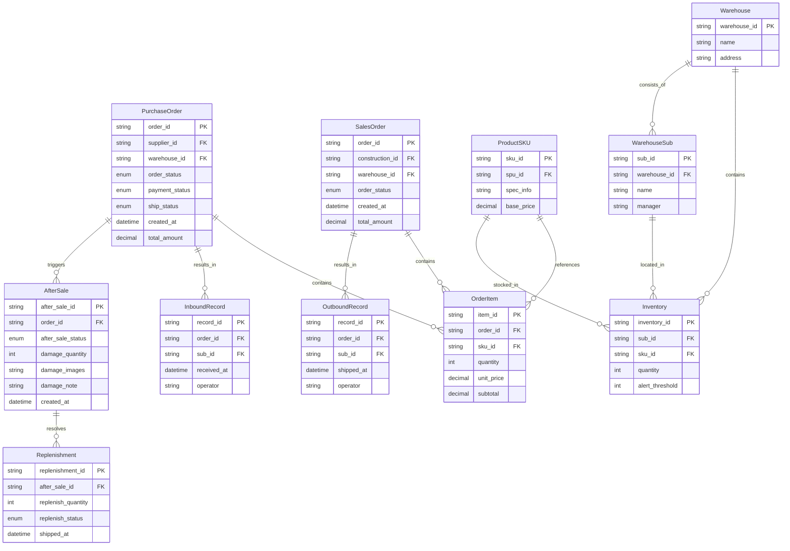

# 工程仓端 - 产品需求文档 V1.0

---

## 📋 文档元信息

| 项目信息 | 内容 |
|---------|------|
| 项目名称 | 工程材料管理采供一体化平台 - 工程仓端 |
| 所属端 | 工程仓端（PC管理后台 + 小程序） |
| 版本 | V1.0 |
| 文档状态 | 初始版本 |
| 创建日期 | 2026-04-24 |
| 目标用户 | 仓管员/采购员/主管/财务/销售 |

---

## 📌 版本记录

| 版本 | 日期 | 修订内容 | 修订人 |
|------|------|---------|-------|
| V0.1 | 2026-04-24 | 初稿创建 | 产品团队 |
| V1.0 | 2026-04-24 | 评审发布 | 产品团队 |

---

## 🔤 术语表

| 术语 | 说明 |
|------|------|
| **工程仓** | 建筑工程项目仓库管理方，也是平台的核心采购方和销售方 |
| **采购订单** | 工程仓向供应商下达的采购单据（链路一） |
| **销售订单** | 施工方向工程仓下达的采购单据（链路二） |
| **SPU** | 标准产品单元，商品定义的最上层 |
| **SKU** | 库存量单位，具体规格的商品最小颗粒度 |
| **子仓库** | 工程仓下可管理多个物理仓库 |
| **货损** | 货物在运输/收货过程中发生的损坏 |
| **三状态分离** | 订单状态/支付状态/发货状态完全独立运行的核心设计原则 |

---

## 1. 业务背景与目标

### 1.1 项目背景

工程材料管理采供一体化平台是一个面向建筑工程行业的B2B平台，连接供应商、工程仓（采购方）、施工方和平台运营方四方。

工程仓端作为平台的核心节点，承担着双重角色：
- **采购方角色**：向供应商采购建材商品，管理库存
- **销售方角色**：向施工方销售建材商品，完成出库发货

当前工程仓的运营痛点：
1. 采购流程在线化程度低，依赖电话/微信沟通下单
2. 仓库出入库记录依赖纸质单据，容易丢失
3. 库存数据不实时，无法准确掌握各子仓库库存
4. 与供应商的货损售后沟通效率低下
5. 与施工方的销售流程缺乏系统化管理

### 1.2 核心目标

| 指标 | 当前值 | 目标值 | 衡量方式 |
|------|-------|-------|---------|
| 采购下单效率 | 线下沟通，平均1-2天 | 线上30分钟内完成 | 系统记录 |
| 入库处理时效 | 到货后1-2天完成 | 到货后4小时内完成 | 系统记录 |
| 库存准确率 | 约80%（纸质管理） | ≥99%（系统管理） | 盘点差异 |
| 货损售后处理 | 线下沟通，3-7天 | 线上售后单，2个工作日内 | 系统记录 |
| 销售订单处理 | 线下沟通，1-2天 | 线上30分钟内接单 | 系统记录 |

### 1.3 非目标（明确不做什么）

1. **不做在线支付**：工程仓→供应商转账全部线下完成，系统只做凭证记录
2. **不做商品录入**：商品SPU/SKU由平台端统一管理，工程仓只能查看
3. **不做物流追踪**：物流信息仅做记录，不做第三方物流对接
4. **不做复杂财务计算**：不做税金计算、分账、结算等，只做发票存证
5. **不做多级审批流**：采购订单不设审核流程，下单即生效

---

## 2. 用户与角色

### 2.1 用户角色定义

| 角色 | 系统标识 | 核心职责 | 使用端 |
|------|---------|---------|--------|
| **采购员** | purchaser | 浏览商品、加入购物车、下单采购、采购计划 | PC |
| **仓管员** | storekeeper | 入库收货（含货损记录）、出库发货、库存查看 | PC |
| **主管/管理员** | admin | 数据看板、订单监控、员工/账号权限管理 | PC |
| **财务人员** | finance | 支付记录、发票管理、对账管理 | PC |
| **销售** | seller | 销售订单处理、发货 | PC |

### 2.2 权限矩阵

| 操作/功能 | 采购员 | 仓管员 | 主管 | 财务 | 销售 |
|-----------|--------|--------|------|------|------|
| 查看工作台 | ✅ | ✅ | ✅ | ❌ | ❌ |
| 查看主体信息 | ✅ | ✅ | ✅ | ✅ | ✅ |
| 编辑主体信息 | ❌ | ❌ | ✅ | ❌ | ❌ |
| 商品市场浏览 | ✅ | ❌ | ✅ | ❌ | ❌ |
| 加入购物车 | ✅ | ❌ | ✅ | ❌ | ❌ |
| 创建采购订单 | ✅ | ❌ | ✅ | ❌ | ❌ |
| 取消采购订单 | ✅ | ❌ | ✅ | ❌ | ❌ |
| 查看采购订单 | ✅ | ✅ | ✅ | ✅ | ✅ |
| 采购收货/入库 | ❌ | ✅ | ❌ | ❌ | ❌ |
| 出库发货 | ❌ | ✅ | ❌ | ❌ | ✅ |
| 销售订单处理 | ❌ | ❌ | ❌ | ❌ | ✅ |
| 销售发货 | ❌ | ✅ | ❌ | ❌ | ✅ |
| 查看库存 | ✅ | ✅ | ✅ | ❌ | ❌ |
| 库存盘点 | ❌ | ✅ | ✅ | ❌ | ❌ |
| 仓库调拨 | ❌ | ✅ | ✅ | ❌ | ❌ |
| 财务-支付记录 | ❌ | ❌ | ✅ | ✅ | ❌ |
| 发票管理 | ❌ | ❌ | ❌ | ✅ | ❌ |
| 账号管理 | ❌ | ❌ | ✅ | ❌ | ❌ |
| 角色权限配置 | ❌ | ❌ | ✅ | ❌ | ❌ |

---

## 3. 业务流程（含图表）

### 3.1 采购到入库全流程



### 3.2 销售到出库全流程



### 3.3 状态机图

#### 采购订单状态机


#### 销售订单状态机


### 3.4 状态转换矩阵

#### 采购订单状态转换

| 当前状态 | 触发事件 | 操作角色 | 前置条件 | 下一状态 | 数据变更 |
|---------|---------|---------|---------|---------|---------|
| pending（待确认） | 供应商确认接单 | 供应商 | 无 | confirmed（已确认） | order_status=confirmed |
| pending（待确认） | 取消订单 | 任何一方 | 无 | cancelled（已取消） | order_status=cancelled |
| confirmed（已确认） | 供应商发货 | 供应商 | 发货数量>0 | receiving（待收货） | ship_status=partial/shipped |
| receiving（待收货） | 收货完成（无货损） | 仓管员 | 订单关联入库完成 | completed（已完成） | order_status=completed, 库存增加 |
| receiving（待收货） | 收货完成（有货损） | 仓管员 | 填写货损信息 | 售后+完成 | after_sale_status=processing |

#### 发货状态子状态

| 当前状态 | 触发事件 | 操作角色 | 前置条件 | 下一状态 |
|---------|---------|---------|---------|---------|
| pending（待发货） | 首次发货（全部） | 供应商 | 货齐 | shipped（全部发货） |
| pending（待发货） | 首次发货（部分） | 供应商 | 部分有货 | partial（部分发货） |
| partial（部分发货） | 继续发货（全部） | 供应商 | 剩余货发完 | shipped（全部发货） |
| partial（部分发货） | 继续发货（部分） | 供应商 | 仍有剩余 | partial（部分发货） |

---

## 4. 关键交互时序图（本期无）

本期工程仓端不涉及复杂的异步交互场景，所有接口均为同步请求-响应模式。采购订单/销售订单的跨端状态更新由API直接返回结果。

---

## 5. 数据模型

### 5.1 ER图



### 5.2 核心表字段说明

#### orders（采购订单表）

| 字段 | 类型 | 长度 | 说明 |
|------|------|------|------|
| id | varchar | 32 | 主键，订单号 |
| supplier_id | varchar | 32 | 关联供应商ID |
| warehouse_id | varchar | 32 | 关联工程仓ID |
| total_amount | decimal | 10,2 | 订单总金额 |
| order_status | varchar | 20 | pending/confirmed/completed/cancelled |
| payment_status | varchar | 20 | unpaid/paid |
| ship_status | varchar | 20 | pending/partial/shipped |
| after_sale_status | varchar | 20 | none/processing/completed |
| remark | text | - | 备注 |
| created_at | datetime | - | 创建时间 |
| updated_at | datetime | - | 更新时间 |

#### order_items（订单商品明细）

| 字段 | 类型 | 长度 | 说明 |
|------|------|------|------|
| id | varchar | 32 | 主键 |
| order_id | varchar | 32 | 关联订单ID |
| sku_id | varchar | 32 | 关联SKU ID |
| quantity | int | - | 下单数量 |
| unit_price | decimal | 10,2 | 单价 |
| subtotal | decimal | 10,2 | 小计金额 |
| received_quantity | int | - | 实收数量 |
| damage_quantity | int | - | 货损数量 |

#### inventory（库存表）

| 字段 | 类型 | 长度 | 说明 |
|------|------|------|------|
| id | varchar | 32 | 主键 |
| sub_warehouse_id | varchar | 32 | 关联子仓库ID |
| sku_id | varchar | 32 | 关联SKU ID |
| quantity | int | - | 当前库存数量 |
| alert_threshold | int | - | 预警阈值 |

#### after_sale（售后表）

| 字段 | 类型 | 长度 | 说明 |
|------|------|------|------|
| id | varchar | 32 | 主键 |
| order_id | varchar | 32 | 关联订单ID |
| status | varchar | 20 | processing/completed |
| damage_quantity_info | json | - | 各SKU货损数量 |
| damage_images | text | - | 货损图片URL（逗号分隔） |
| damage_note | text | - | 货损说明 |
| handle_method | varchar | 20 | replenish/refund |
| created_at | datetime | - | 创建时间 |

### 5.3 枚举值定义

#### 订单主状态 `order_status`

| 枚举值 | 显示文字 | 颜色 | 说明 |
|-------|---------|------|------|
| pending | 待确认 | 🔵 蓝色 | 工程仓刚下单，供应商还没确认 |
| confirmed | 已确认 | 🟢 绿色 | 供应商已确认接单 |
| completed | 已完成 | ✅ 深绿 | 全部收货完成 |
| cancelled | 已取消 | ⚫ 灰色 | 订单已取消 |

#### 支付状态 `payment_status`

| 枚举值 | 显示文字 | 颜色 | 说明 |
|-------|---------|------|------|
| unpaid | 未支付 | ⚪ 灰色 | 还没传转账凭证 |
| paid | 已支付 | 🟢 绿色 | 已上传转账凭证 |

#### 发货状态 `ship_status`

| 枚举值 | 显示文字 | 颜色 | 说明 |
|-------|---------|------|------|
| pending | 待发货 | 🟡 黄色 | 还没发过货 |
| partial | 部分发货 | 🟠 橙色 | 发了一部分 |
| shipped | 全部发货 | 🟢 绿色 | 全部发完了 |

#### 售后状态 `after_sale_status`

| 枚举值 | 显示文字 | 颜色 | 说明 |
|-------|---------|------|------|
| none | 无售后 | ⚪ 不显示 | 正常订单 |
| processing | 售后处理中 | 🔴 红色 | 有货损，正在处理 |
| completed | 售后已完成 | 🟡 橙色 | 补发或退款完成 |

---

## 6. 功能清单

### 6.1 工程仓端功能树

```
工程仓端
├── 🏠 工作台
│   └── 数据概览看板 (P1)
│
├── 🏢 商户中心
│   ├── 主体信息查看 (P1)
│   ├── 主体信息编辑 (P1)
│   └── 合同列表查看 (P2)
│
├── 🛍️ 商品市场
│   ├── 商品浏览/搜索/分类筛选 (P0)
│   ├── 商品详情查看 (P0)
│   ├── 加入购物车 (P0)
│   ├── 购物车管理 (P0)
│   ├── 结算下单 (P0)
│   └── 确认订单 (P0)
│
├── 📋 采购计划
│   ├── 采购计划列表 (P1)
│   ├── 新建采购计划 (P1)
│   ├── 采购计划详情 (P1)
│   └── 计划转订单 (P2)
│
├── 🏪 商品中心
│   ├── 库存商品列表 (P0)
│   ├── 按仓库筛选 (P0)
│   ├── SPU详情查看 (P1)
│   └── SKU库存详情 (P0)
│
├── 📦 仓库管理
│   ├── 仓库列表 (P1)
│   ├── 仓库详情 (P1)
│   ├── 入库管理
│   │   ├── 入库单列表 (P0)
│   │   ├── 批次详情 (P0)
│   │   ├── 开始收货 (P0)
│   │   └── 货损记录 (P0)
│   ├── 出库管理
│   │   ├── 出库单列表 (P0)
│   │   └── 确认出库 (P0)
│   ├── 打印单据 (P2)
│   ├── 库存盘点 (P2)
│   └── 库存调拨 (P2)
│
├── 📦 订单管理
│   ├── 采购订单
│   │   ├── 采购订单列表 (P0)
│   │   ├── 采购订单详情 (P0)
│   │   ├── 取消采购订单 (P0)
│   │   ├── 订单收货 (P0)
│   │   └── 新建采购订单 (P1)
│   ├── 销售订单
│   │   ├── 销售订单列表 (P0)
│   │   ├── 销售订单详情 (P0)
│   │   ├── 确认销售订单 (P0)
│   │   ├── 销售订单发货 (P1)
│   │   └── 订单导出 (P2)
│   └── 收货批次列表 (P1)
│
├── 💰 财务中心
│   ├── 支付流水 (P0)
│   ├── 进项发票列表 (P1)
│   ├── 进项发票上传 (P1)
│   ├── 销项发票列表 (P1)
│   └── 对账单列表 (P2)
│
└── ⚙️ 系统设置
    ├── 账号列表 (P1)
    ├── 员工管理 (P1)
    ├── 角色列表 (P1)
    └── 角色权限配置 (P1)
```

### 6.2 功能统计

| 模块 | P0核心 | P1重要 | P2优化 | 合计 |
|------|-------|-------|-------|------|
| 工作台 | 0 | 1 | 0 | 1 |
| 商户中心 | 0 | 2 | 1 | 3 |
| 商品市场 | 6 | 0 | 0 | 6 |
| 采购计划 | 0 | 3 | 1 | 4 |
| 商品中心 | 3 | 1 | 0 | 4 |
| 仓库管理 | 6 | 2 | 4 | 12 |
| 订单管理 | 8 | 2 | 2 | 12 |
| 财务中心 | 1 | 3 | 1 | 5 |
| 系统设置 | 0 | 4 | 0 | 4 |
| **总计** | **24** | **18** | **9** | **51** |

---

## 7. 详细功能说明

### 7.1 工作台（1个P1功能）

#### 7.1.1 数据概览看板（P1）

**功能说明**：展示工程仓运营数据看板，关键指标卡片式展示。

**字段说明：**
| 字段 | 组件 | 必填 | 校验规则 | 错误提示 | 默认值 | 数据来源 |
|------|------|------|---------|---------|--------|---------|
| 时间范围 | 选择器 | 否 | 今日/本周/本月 | 无 | 今日 | 前端选择 |
| 今日订单数 | 数字卡片 | 只读 | - | - | - | 统计接口 |
| 采购总金额 | 数字卡片 | 只读 | - | - | - | 统计接口 |
| 待收货数 | 数字卡片 | 只读 | - | - | - | 统计接口 |
| 库存预警数 | 数字卡片 | 只读 | - | - | 0 | 统计接口 |

**核心逻辑：** 选择时间范围→调用统计接口→渲染指标卡片，预警数字红色标红。
**权限控制：** 采购员/仓管员/主管可见。

---

### 7.2 商户中心（3个功能）

#### 7.2.1 主体信息查看（P1）
**功能说明**：查看工程仓主体信息，敏感信息脱敏。入口：商户中心→主体信息。前置：已登录。

**字段说明：**
| 字段 | 组件 | 必填 | 校验规则 | 错误提示 | 默认值 | 数据来源 |
|------|------|------|---------|---------|--------|---------|
| 主体名称 | 文本 | 只读 | - | - | - | 商户接口 |
| 信用代码 | 文本 | 只读 | 18位统一社会信用代码 | 无 | - | 商户接口 |
| 法人信息 | 文本 | 只读 | - | - | - | 商户接口 |
| 联系人 | 文本 | 只读 | - | - | - | 商户接口 |
| 联系电话 | 文本 | 只读 | 手机号中间4位脱敏 | 无 | - | 商户接口 |

**核心逻辑：** 用户token→获取主体信息→渲染展示。信息不存在显示"-"。
**权限控制：** 所有角色可见。

#### 7.2.2 主体信息编辑（P1）
**功能说明**：修改工程仓基础信息（联系人/电话/地址/营业执照图片）。

**字段说明：**
| 字段 | 组件 | 必填 | 校验规则 | 错误提示 | 默认值 | 数据来源 |
|------|------|------|---------|---------|--------|---------|
| 联系人 | 输入框 | 否 | 2-20字 | 无 | 原值 | 前端输入 |
| 联系电话 | 输入框 | 否 | ^1[3-9]\d{9}$ | 请输入正确手机号 | 原值 | 前端输入 |
| 详细地址 | 输入框 | 否 | 最大100字 | 无 | 原值 | 前端输入 |
| 营业执照 | 图片上传 | 否 | jpg/png, ≤5M | 图片格式不支持 | 原图 | 前端文件 |

**核心逻辑：** 表单实时校验→标红提示→提交更新接口→记录修改日志。
**权限控制：** 仅主管角色可操作。

#### 7.2.3 合同列表查看（P2）
**功能说明**：查看工程仓合同列表。入口：商户中心→合同列表。

**字段说明：** 状态Tab（生效/已过期）+ 时间范围筛选 → 合同分页列表。
**交互说明：** 列表展示，无数据→空状态。
**权限控制：** 主管/财务可见。

---

### 7.3 商品市场（6个P0功能）

#### 7.3.1 商品浏览/搜索/分类筛选（P0）
**功能说明**：供应商商品市场浏览，支持分类筛选、关键词搜索、价格区间过滤和排序。

**字段说明：**
| 字段 | 组件 | 必填 | 校验规则 | 错误提示 | 默认值 | 数据来源 |
|------|------|------|---------|---------|--------|---------|
| 分类ID | Tab切换 | 否 | 从分类树选择 | 无 | 全部 | 前端选择 |
| 搜索关键词 | 输入框 | 否 | 最大50字 | 无 | 无 | 前端输入 |
| 价格区间 | 范围选择 | 否 | 最小值≤最大值 | 价格范围有误 | 无 | 前端输入 |
| 排序方式 | 下拉选择 | 否 | 价格/销量 | 无 | 综合 | 前端选择 |
| 商品卡片 | 卡片列表 | 只读 | - | - | - | 商品接口 |

**核心逻辑：** 筛选条件→API参数→分页查询→渲染卡片列表。支持滚动加载更多+下拉刷新。
**交互说明：** 加载失败→重试按钮；无结果→"找不到相关商品"；分类Tab切换高亮。
**权限控制：** 采购员/主管可见。

#### 7.3.2 商品详情查看（P0）
**功能说明**：查看商品详细信息。入口：点击商品卡片。

**字段说明：**
| 字段 | 组件 | 必填 | 校验规则 | 错误提示 | 默认值 | 数据来源 |
|------|------|------|---------|---------|--------|---------|
| 商品图片 | 图片轮播 | 只读 | - | - | - | 商品接口 |
| 商品名称 | 文本 | 只读 | - | - | - | 商品接口 |
| 规格属性 | 标签 | 只读 | - | - | - | 商品接口 |
| 供货价 | 数字 | 只读 | - | - | - | 商品接口 |
| 库存数量 | 数字 | 只读 | - | - | - | 库存接口 |
| 供应商信息 | 文本 | 只读 | - | - | - | 商品接口 |

**核心逻辑：** SKU ID→查询详情→渲染详情页。商品已下架→提示"已下架"。
**权限控制：** 采购员/主管可见。

#### 7.3.3 加入购物车（P0）
**功能说明**：将商品加入购物车。入口：商品卡片/详情页点击「加入购物车」按钮。

**字段说明：**
| 字段 | 组件 | 必填 | 校验规则 | 错误提示 | 默认值 | 数据来源 |
|------|------|------|---------|---------|--------|---------|
| 商品SKU ID | 隐藏 | 是 | - | - | - | 商品ID |
| 数量 | 数字选择器 | 是 | ≥1，≤库存 | 库存不足，仅剩N件 | 1 | 前端输入 |

**核心逻辑：** 点击加入购物车→弹出数量选择器→选数量→调用购物车添加接口→toast"已加入购物车"→购物车角标+1。
**异常场景：** 库存不足→提示"库存不足，仅剩N件"。
**权限控制：** 采购员可操作。

#### 7.3.4 购物车管理（P0）
**功能说明**：查看购物车商品列表，管理选中的商品。

**字段说明：**
| 字段 | 组件 | 必填 | 校验规则 | 错误提示 | 默认值 | 数据来源 |
|------|------|------|---------|---------|--------|---------|
| 商品列表 | 列表 | 只读 | - | - | - | 购物车接口 |
| 数量 | 数字加减 | 否 | ≥1，≤库存 | 超出库存 | 1 | 前端输入 |
| 选中状态 | 复选框 | 否 | - | - | 全选 | 前端选择 |
| 合计金额 | 数字 | 只读 | - | - | ¥0 | 自动计算 |

**核心逻辑：** 查询购物车→渲染列表→自动计算总价。左滑删除+二次确认。数量变化即时重算总价。
**异常场景：** 商品已下架→灰色置灰不可选；删除失败→重试。
**权限控制：** 采购员可操作。

#### 7.3.5 结算下单（P0）
**入口**：购物车→点击「去结算」按钮。前置：至少选中一件商品。

**字段说明：**
| 字段 | 组件 | 必填 | 校验规则 | 错误提示 | 默认值 | 数据来源 |
|------|------|------|---------|---------|--------|---------|
| 商品明细 | 表格 | 只读 | - | - | - | 购物车接口 |
| 供应商 | 标签 | 只读 | - | - | - | 自动识别 |
| 合计金额 | 数字 | 只读 | - | - | - | 自动计算 |
| 订单备注 | 文本域 | 否 | 最大200字 | 无 | 无 | 前端输入 |
| 同意协议 | 复选框 | 是 | 必须勾选 | 请先同意采购协议 | 未勾选 | 前端 |

**核心逻辑：** 选中商品→创建临时订单→用户确认→校验库存→提交订单→清空购物车→跳转订单详情。
**异常场景：** 库存变化→提示重新确认；协议未勾选→按钮置灰。
**权限控制：** 采购员可操作。

#### 7.3.6 确认订单（P0）
**入口**：结算页面→提交订单后跳转。前置：已提交订单。

**功能说明：** 展示订单提交流程中的临时确认信息，用户最终点击"提交订单"生成正式订单并跳转订单详情页。
**核心逻辑：** 勾选同意协议→点击"提交订单"→调用创建订单接口→生成正式采购订单→清空对应购物车→发通知供应商端。
**权限控制：** 采购员可操作。

---

### 7.4 采购计划（4个功能）

#### 7.4.1 采购计划列表（P1）
**功能说明**：查看采购计划列表。入口：商品市场→采购计划。

**字段说明：** 状态Tab（待执行/已执行/已取消）+ 时间范围 → 分页列表。
**交互说明：** 多Tab状态筛选，无数据→空状态。
**权限控制：** 采购员/主管可见。

#### 7.4.2 新建采购计划（P1）
**功能说明**：创建新的采购计划。入口：采购计划列表→「新建计划」按钮。

**字段说明：**
| 字段 | 组件 | 必填 | 校验规则 | 错误提示 | 默认值 | 数据来源 |
|------|------|------|---------|---------|--------|---------|
| 计划名称 | 输入框 | 是 | 2-50字 | 请输入计划名称 | 无 | 前端输入 |
| 计划商品 | 商品选择器 | 是 | 至少选择1个 | 请至少选择一个商品 | 无 | 商品市场接口 |
| 预计采购时间 | 日期选择 | 是 | ≥当前日期 | 采购时间不能早于今天 | 明天 | 前端输入 |
| 备注 | 文本域 | 否 | 最大200字 | 无 | 无 | 前端输入 |

**核心逻辑：** 多步骤选择商品→设置时间→创建计划。商品为空→提示"至少选择一个商品"。
**权限控制：** 采购员/主管可操作。

#### 7.4.3 采购计划详情（P1）
**功能说明**：查看采购计划详情。入口：点击计划列表项。

**展示内容：** 计划基本信息（名称/创建时间/状态）+ 商品明细列表。
**权限控制：** 采购员/主管可见。

#### 7.4.4 计划转订单（P2）
**功能说明**：将采购计划一键转为正式采购订单。入口：计划详情→「转成订单」按钮。前置：计划状态="待执行"。

**核心逻辑：** 点击转单→校验商品是否都可售→全部可售→生成正式采购订单→计划状态变"已执行"。
**异常场景：** 部分商品已下架→提示"有商品已下架"。
**权限控制：** 采购员可操作。

---

### 7.5 商品中心（4个功能）

#### 7.5.1 库存商品列表（P0）
**功能说明**：查看仓库内库存商品。入口：商品中心→商品列表。

**字段说明：**
| 字段 | 组件 | 必填 | 校验规则 | 错误提示 | 默认值 | 数据来源 |
|------|------|------|---------|---------|--------|---------|
| 子仓库ID | 下拉选择 | 否 | 从所属子仓库选择 | 无 | 全部 | 仓库接口 |
| 分类 | 分类树 | 否 | - | 无 | 全部 | 分类接口 |
| 搜索关键词 | 输入框 | 否 | 最大50字 | 无 | 无 | 前端输入 |
| 商品列表 | 表格 | 只读 | - | - | - | 库存接口 |
| 库存数字 | 数字 | 只读 | - | - | - | 库存接口 |

**核心逻辑：** 按子仓库下拉筛选→过滤库存商品→显示每个商品库存数量。库存为0→红色标红。
**权限控制：** 采购员/仓管员/主管可见。

#### 7.5.2 按仓库筛选（P0）
**功能说明**：按子仓库筛选查看该仓下的库存商品。

**核心逻辑：** 选择子仓库下拉→刷新库存列表→显示该仓所有商品库存。筛选条件缓存。无权限仓库→不显示。
**权限控制：** 仓管员/采购员可见。

#### 7.5.3 SPU详情查看（P1）
**功能说明**：查看SPU基本信息+规格属性。入口：点击SPU名称链接。

**展示内容：** SPU名称/品牌/所属分类/规格属性（标签展示）。
**权限控制：** 采购员/仓管员可见。

#### 7.5.4 SKU库存详情（P0）
**功能说明**：查看SKU在各仓库的库存分布、批次明细、出入库流水。

**字段说明：**
| 字段 | 组件 | 必填 | 校验规则 | 错误提示 | 默认值 | 数据来源 |
|------|------|------|---------|---------|--------|---------|
| SKU ID | 路径参数 | 是 | - | - | - | 页面URL |
| 各仓库库存 | 分布卡片 | 只读 | - | - | - | 库存接口 |
| 批次明细 | 表格Tab | 只读 | - | - | - | 批次接口 |
| 出入库流水 | 表格Tab | 只读 | - | - | - | 流水接口 |

**核心逻辑：** 分Tab展示库存分布/批次明细/出入库流水。库存不足红色标红。无数据→空状态。
**权限控制：** 采购员/仓管员/主管可见。

---

### 7.6 采购订单管理（5个P0功能）

#### 7.6.1 采购订单列表（P0）
**功能说明**：查看采购订单列表。入口：销售端/采购端→采购订单。前置：已登录+采购订单查看权限。

**字段说明：**
| 字段 | 组件 | 必填 | 校验规则 | 错误提示 | 默认值 | 数据来源 |
|------|------|------|---------|---------|--------|---------|
| 订单状态 | Tab切换 | 否 | 固定值列表 | 无 | 全部 | 前端固定 |
| 时间范围 | 日期选择 | 否 | 结束≥开始 | 开始日期不能晚于结束日期 | 本月 | 前端输入 |
| 订单号 | 输入框 | 否 | 最大32字符 | 无 | 无 | 前端输入 |
| 供应商名称 | 输入框 | 否 | 最大50字符 | 无 | 无 | 前端输入 |

**核心逻辑：** 默认查询全部状态→按时间倒序排列。每个Tab显示各状态订单数量。订单卡片同时展示订单主状态+支付状态+发货状态+售后状态。点击卡片跳转详情页。超过3个月查询提示"您查询的时间范围超过3个月，建议缩小范围"。每页20条、滚动加载更多。
**交互说明：** 骨架屏→加载失败显重试→Tab切换同步URL参数→筛选条件同步URL→无数据→"暂无订单"。
**权限控制：** 采购员/仓管员/主管/财务均可查看，不同角色操作按钮不同。

#### 7.6.2 采购订单详情（P0）
**功能说明**：查看单笔采购订单完整信息。入口：点击订单卡片。

**字段说明：**
| 字段 | 组件 | 必填 | 校验规则 | 错误提示 | 默认值 | 数据来源 |
|------|------|------|---------|---------|--------|---------|
| 订单信息 | 信息块 | 只读 | - | - | - | 订单接口 |
| 供应商信息 | 信息块 | 只读 | - | - | - | 订单接口 |
| 商品明细 | 表格 | 只读 | - | - | - | 订单接口 |
| 支付凭证 | 图片 | 只读/上传 | - | - | - | 订单/前端 |
| 操作记录 | 时间线 | 只读 | - | - | - | 日志接口 |

**展示内容：** 订单号/创建时间/订单状态/支付状态/发货状态。供应商名称/联系人/联系电话。商品SKU/名称/规格/单价/数量/小计。分页每页10条。
**核心逻辑：** 订单状态决定可操作按钮：待确认→可取消；待收货→可收货；已完成→可查看批次。
**权限控制：** 采购员/仓管员/主管/财务查看。

#### 7.6.3 取消采购订单（P0）
**功能说明**：取消状态为"待确认"的采购订单。入口：订单详情页→「取消订单」按钮。

**字段说明：**
| 字段 | 组件 | 必填 | 校验规则 | 错误提示 | 默认值 | 数据来源 |
|------|------|------|---------|---------|--------|---------|
| 取消原因 | 选择器 | 是 | 预设/自定义 | 请选择取消原因 | 无 | 前端输入 |

**核心逻辑：** 点击取消→弹窗选择原因→提交→订单状态→"已取消"→通知供应商端。若已支付→弹出强提示"订单已支付，取消后将生成退款凭证"并二次确认。
**权限控制：** 采购员可操作。

#### 7.6.4 订单收货（P0） - 同7.2入库管理-开始收货
详见7.2入库管理-开始收货（入仓流程）。

#### 7.6.5 新建采购订单（P1）
**功能说明**：手动创建采购订单（不通过购物车）。入口：采购订单列表→「新建采购订单」按钮。

**字段说明：**
| 字段 | 组件 | 必填 | 校验规则 | 错误提示 | 默认值 | 数据来源 |
|------|------|------|---------|---------|--------|---------|
| 选择供应商 | 搜索选择 | 是 | 必须从平台入驻供应商中选择 | 请选择供应商 | 无 | 供应商接口 |
| 选择商品 | 商品选择器 | 是 | 至少选择1种商品 | 请选择商品 | 无 | 商品市场接口 |
| 收货仓库 | 下拉选择 | 是 | 必须从所属子仓库选择 | 请选择收货仓库 | 无 | 仓库接口 |
| 订单备注 | 文本域 | 否 | 最大200字 | 无 | 无 | 前端输入 |

**核心逻辑：** 选择供应商→筛选该供应商可售商品→添加到订单→提交→创建采购订单（状态→待确认）。供应商切换→清空已选商品。
**权限控制：** 采购员可操作。

---

### 7.7 销售订单管理（7个功能）

#### 7.7.1 销售订单列表（P0）
**功能说明**：查看销售订单列表（施工方→工程仓）。入口：订单管理→销售订单。

**字段说明：**
| 字段 | 组件 | 必填 | 校验规则 | 错误提示 | 默认值 | 数据来源 |
|------|------|------|---------|---------|--------|---------|
| 订单状态 | Tab切换 | 否 | 待确认/待发货/待收货/已完成 | 无 | 全部 | 前端固定 |
| 时间范围 | 日期选择 | 否 | 结束≥开始 | 开始日期不能晚于结束日期 | 本月 | 前端输入 |
| 订单号 | 输入框 | 否 | 最大32字符 | 无 | 无 | 前端输入 |
| 施工方名称 | 输入框 | 否 | 最大50字符 | 无 | 无 | 前端输入 |

**核心逻辑：** 默认查询全部状态→按时间倒序排列。每个Tab显示各状态数量。
**权限控制：** 销售/仓管员/主管可见。

#### 7.7.2 销售订单详情（P0）
**功能说明**：查看销售订单完整信息。入口：点击销售订单卡片。

**展示内容：** 订单信息/施工方信息/商品明细（SKU/名称/规格/单价/数量/小计）/操作日志。
**核心逻辑：** 订单状态决定可操作按钮：待确认→可确认/取消；待发货→可发货；待收货→可查看物流。
**权限控制：** 销售/仓管员/主管查看。

#### 7.7.3 确认销售订单（P0）
**功能说明**：确认施工方提交的销售订单。入口：订单详情页面→「确认订单」按钮。前置：订单状态="待确认"/"pending"。

**核心逻辑：** 点击确认→二次确认弹窗→提交→订单→"confirmed"→开始准备发货。同时生成出库单关联该订单。
**权限控制：** 销售可操作。

#### 7.7.4 销售订单发货（P1）
**功能说明**：确认发货并填写物流信息。入口：订单详情→「发货」按钮。前置：订单状态="待发货"。

**字段说明：**
| 字段 | 组件 | 必填 | 校验规则 | 错误提示 | 默认值 | 数据来源 |
|------|------|------|---------|---------|--------|---------|
| 选择子仓库 | 下拉选择 | 是 | 从已有子仓库选择 | 请选择出库仓库 | 无 | 仓库接口 |
| 物流公司 | 输入框 | 否 | 最大20字 | 无 | 无 | 前端输入 |
| 物流单号 | 输入框 | 否 | 最大50字 | 无 | 无 | 前端输入 |

**核心逻辑：** 选择出库仓库→确认各SKU出库数量→提交→库存扣减→出库单完成→订单→"待收货"。库存不足→提示"库存不足，当前仅剩N件"。
**交互说明：** 物流字段非必填→适配自提场景。成功→toast+刷新。
**权限控制：** 仓管员/销售可操作。

#### 7.7.5 收货批次列表（P1）
**功能说明**：查看订单收货批次记录。入口：订单详情→「收货批次」Tab。

**展示内容：** 每批次收货时间/子仓库/SKU明细/实收数量/货损数量/验收人。按时间倒序排列。
**权限控制：** 仓管员/采购员可见。

#### 7.7.6 订单导出（P2）
**功能说明**：导出采购/销售订单为Excel。入口：列表页→「导出」按钮。

**核心逻辑：** 导出基于当前筛选条件→生成Excel文件→下载。支持最大1万条导出。导出中→显示loading进度条→导出完成→自动下载。
**权限控制：** 主管/财务可操作。

---

### 7.8 仓库管理（12个功能）

#### 7.8.1 入库单列表（P0）
**功能说明**：查看入库单列表。入口：仓库管理→入库管理。前置：用户是仓管员角色。

**字段说明：**
| 字段 | 组件 | 必填 | 校验规则 | 错误提示 | 默认值 | 数据来源 |
|------|------|------|---------|---------|--------|---------|
| 状态 | Tab切换 | 否 | 待收货/已完成 | 无 | 全部 | 前端固定 |
| 时间范围 | 日期选择 | 否 | 结束≥开始 | 开始日期不能晚于结束日期 | 本月 | 前端输入 |
| 入库单号 | 输入框 | 否 | 最大32字符 | 无 | 无 | 前端输入 |
| 来源订单号 | 输入框 | 否 | 最大32字符 | 无 | 无 | 前端输入 |

**核心逻辑：** 待收货→显示「开始收货」按钮；已完成→详情只读。每行显示订单信息/商品数量/实收数量/货损数量。
**权限控制：** 仓管员操作。

#### 7.8.2 批次详情（P0）
**功能说明**：查看入库批次详情。入口：入库单/采购订单→「批次详情」。

**展示内容：** 批次编号/收货时间/子仓库/商品明细/实收数量/货损数量/验收人/备注。按批次聚合展示。
**权限控制：** 仓管员/采购员可见。

#### 7.8.3 开始收货（P0） - 详见7.2!
**功能说明**：详见本文档【7.2 入库管理-开始收货】。该功能为入库操作的核心环节。

#### 7.8.4 货损记录（P0）
**功能说明**：查看所有货损记录。入口：入库单列表→点击货损数量→弹窗展示。

**展示内容：** 货损SKU/货损数量/货损图片（缩略图可放大）/货损说明/提交时间。已处理→显示处理结果。
**核心逻辑：** 货损数量>0→生成售后单→关联该货损记录。售后处理完成→货损状态→"已处理"。
**权限控制：** 仓管员/采购员可见。

#### 7.8.5 出库单列表（P0）
**功能说明**：查看出库单列表。入口：仓库管理→出库管理。

**字段说明：**
| 字段 | 组件 | 必填 | 校验规则 | 错误提示 | 默认值 | 数据来源 |
|------|------|------|---------|---------|--------|---------|
| 状态 | Tab切换 | 否 | 待出库/已完成 | 无 | 全部 | 前端固定 |
| 时间范围 | 日期选择 | 否 | 结束≥开始 | 开始日期不能晚于结束日期 | 本月 | 前端输入 |
| 出库单号 | 输入框 | 否 | 最大32字符 | 无 | 无 | 前端输入 |
| 关联订单号 | 输入框 | 否 | 最大32字符 | 无 | 无 | 前端输入 |

**核心逻辑：** 待出库→显示「确认出库」按钮；已完成→详情只读。每行显示订单信息/商品数量/应发数量/实发数量。
**权限控制：** 仓管员操作。

#### 7.8.6 确认出库（P0） - 详见7.4!
**功能说明**：详见本文档【7.4 出库管理-确认出库】。该功能为出库操作的核心环节。

#### 7.8.7 仓库列表（P1）
**功能说明**：查看工程仓下的所有子仓库。入口：仓库管理→仓库列表。

**字段说明：**
| 字段 | 组件 | 必填 | 校验规则 | 错误提示 | 默认值 | 数据来源 |
|------|------|------|---------|---------|--------|---------|
| 仓库名称 | 文本 | 只读 | - | - | - | 仓库接口 |
| 仓库地址 | 文本 | 只读 | - | - | - | 仓库接口 |
| 仓管员 | 文本 | 只读 | - | - | - | 仓库接口 |
| 商品种类数 | 数字 | 只读 | - | - | - | 统计接口 |
| 操作 | 按钮 | 操作 | - | - | - | - |

**核心逻辑：** 表格展示所有子仓库→每行显示名称/地址/仓管员/商品种类数/操作按钮。
**权限控制：** 所有角色可见。

#### 7.8.8 仓库详情（P1）
**功能说明**：查看子仓库详细信息。入口：点击仓库列表的仓库名称。

**展示内容：** 仓库名称/地址/仓管员/联系电话/仓库面积/创建时间/启用状态。+ 该仓库库存商品列表。
**权限控制：** 所有角色可见。

#### 7.8.9 打印单据（P2）
**功能说明**：打印入库单/出库单。入口：入库单/出库单详情→「打印」按钮。

**核心逻辑：** 获取单据模板数据→打开打印预览→调用浏览器打印API。使用模板：{入库/出库单号，日期，商品明细，数量，签收人}。
**权限控制：** 仓管员操作。

#### 7.8.10 库存盘点列表（P2）
**功能说明**：查看盘点记录。入口：仓库管理→库存盘点。

**字段说明：** 状态Tab（进行中/已完成）+ 时间范围 → 盘点单分页列表。
**展示内容：** 盘点单号/盘点时间/盘点仓库/盘点人/盈亏商品数/状态。
**权限控制：** 仓管员/主管可见。

#### 7.8.11 创建盘点单（P2）
**功能说明**：创建新的库存盘点任务。入口：盘点列表→「新建盘点」按钮。

**字段说明：**
| 字段 | 组件 | 必填 | 校验规则 | 错误提示 | 默认值 | 数据来源 |
|------|------|------|---------|---------|--------|---------|
| 选择仓库 | 下拉选择 | 是 | 从已有子仓库选择 | 请选择盘点仓库 | 无 | 仓库接口 |
| 盘点范围 | 商品选择 | 是 | 全仓/指定分类 | 请选择盘点范围 | 全仓 | 前端选择 |
| 备注 | 文本域 | 否 | 最大200字 | 无 | 无 | 前端输入 |

**核心逻辑：** 创建→盘点单状态→"进行中"→生成盘点商品列表。盘点员逐项填写实际库存→系统计算差异→盘点完成提交。
**权限控制：** 仓管员/主管操作。

#### 7.8.12 库存调拨（P2）
**功能说明**：将商品从一个子仓库调拨到另一个子仓库。入口：仓库管理→库存调拨。

**字段说明：**
| 字段 | 组件 | 必填 | 校验规则 | 错误提示 | 默认值 | 数据来源 |
|------|------|------|---------|---------|--------|---------|
| 调出仓库 | 下拉选择 | 是 | 从已有子仓库选择 | 请选择调出仓库 | 无 | 仓库接口 |
| 调入仓库 | 下拉选择 | 是 | 从已有子仓库选择，≠调出 | 请选择调入仓库 | 无 | 仓库接口 |
| 调拨商品 | 商品选择 | 是 | 至少1种且有库存 | 请选择调拨商品 | 无 | 库存接口 |
| 调拨数量 | 数字输入 | 是 | ≥1，≤库存 | 库存不足，仅剩N件 | 无 | 前端输入 |

**核心逻辑：** 调出仓库库存→扣减；调入仓库库存→增加。生成调拨记录。调拨后需要入库确认才能增加调入仓库存量。
**权限控制：** 仓管员操作。

---

### 7.9 财务中心（5个功能）

#### 7.9.1 支付流水（P0）
**功能说明**：查看工程仓的支付流水。入口：财务管理→支付流水。

**字段说明：**
| 字段 | 组件 | 必填 | 校验规则 | 错误提示 | 默认值 | 数据来源 |
|------|------|------|---------|---------|--------|---------|
| 时间范围 | 日期选择 | 否 | 结束≥开始 | 开始日期不能晚于结束日期 | 本月 | 前端输入 |
| 流水号 | 输入框 | 否 | 最大32字符 | 无 | 无 | 前端输入 |
| 收支类型 | 下拉选择 | 否 | 全部/收入/支出 | 无 | 全部 | 前端选择 |
| 关联订单号 | 输入框 | 否 | 最大32字符 | 无 | 无 | 前端输入 |

**展示内容：** 流水号/关联订单号/金额/收支类型/发生时间/支付方式/备注。按时间倒序。
**核心逻辑：** 支付流水由用户上传支付凭证时生成或系统自动生成。上传凭证→生成支付流水+关联订单。
**权限控制：** 财务/主管可见。

#### 7.9.2 进项发票列表（P1）
**功能说明**：查看供应商开给工程仓的发票。入口：财务管理→进项发票。

**字段说明：** 状态Tab（待认证/已认证/已作废）+ 时间范围 + 发票号码搜索 → 表格列表。
**展示内容：** 发票代码/号码/开票日期/供应商名称/金额/税额/价税合计/状态/操作。
**权限控制：** 财务/主管可见。

#### 7.9.3 进项发票上传（P1）
**功能说明**：上传供应商发票图片/PDF。入口：进项发票列表→「上传发票」按钮。

**字段说明：**
| 字段 | 组件 | 必填 | 校验规则 | 错误提示 | 默认值 | 数据来源 |
|------|------|------|---------|---------|--------|---------|
| 发票文件 | 文件上传 | 是 | jpg/png/pdf, ≤10M | 文件格式不支持 | 无 | 前端文件 |
| 发票号码 | 输入框 | 否 | 8位数字 | 请输入正确发票号码 | 无 | 前端输入 |
| 关联订单号 | 输入框 | 否 | 最大32字符 | 无 | 无 | 前端输入 |
| 发票金额 | 数字输入 | 否 | >0 | 请输入有效金额 | 无 | 前端输入 |

**核心逻辑：** 文件上传→OCR识别（如有集成）→填写发票信息→提交保存。状态→待认证。支持多张发票同时上传。
**权限控制：** 财务可操作。

#### 7.9.4 销项发票列表（P1）
**功能说明**：查看工程仓开给施工方的发票。入口：财务管理→销项发票。

**字段说明：** 状态Tab（待开/已开）+ 时间范围 → 表格列表。已开票项→显示发票号码/金额/时间。
**权限控制：** 财务/主管可见。

#### 7.9.5 对账单列表（P2）
**功能说明**：查看与供应商/施工方的对账记录。入口：财务管理→对账管理。

**字段说明：** 对账对象（供应商/施工方）+ 时间范围 → 对账单记录列表。
**展示内容：** 对账单号/对账期间/对方名称/应收/应付/差异金额/状态（未确认/已确认）/操作。
**核心逻辑：** 点击「生成对账单」→自动汇总期内所有订单→生成对账单→可导出Excel。对方确认后→状态→"已确认"。
**权限控制：** 主管/财务可操作。

---

### 7.10 系统设置（4个功能）

#### 7.10.1 账号列表（P1）
**功能说明**：查看当前组织下所有账号。入口：系统设置→账号管理。

**字段说明：** 状态（启用/停用）+ 角色筛选 → 表格列表。
**展示内容：** 账号/姓名/手机号/邮箱/角色/最近登录时间/状态/操作按钮。
**核心逻辑：** 点击「新建账号」→填写信息→创建账号→发送初始密码。账号可启用/停用。停用后该账号无法登录。
**权限控制：** 主管可操作。

#### 7.10.2 员工管理（P1）
**功能说明**：管理员工信息。入口：系统设置→员工管理。

**字段说明：** 员工姓名/部门/岗位/手机号/邮箱/入职时间/状态（在职/离职）。
**核心逻辑：** 可新增/编辑/离职员工信息。离职的员工关联账号也停用。员工可绑定用户账号。
**权限控制：** 主管可操作。

#### 7.10.3 角色列表（P1）
**功能说明**：查看角色列表。入口：系统设置→角色管理。

**展示内容：** 角色名称/角色描述/成员数/创建时间/操作（编辑/删除）。默认角色（管理员/采购员/仓管员/财务/销售）不可删除。
**权限控制：** 主管可操作。

#### 7.10.4 角色权限配置（P1）
**功能说明**：配置角色的功能权限。入口：角色管理→点击角色「编辑权限」。

**字段说明：**
| 字段 | 组件 | 必填 | 校验规则 | 错误提示 | 默认值 | 数据来源 |
|------|------|------|---------|---------|--------|---------|
| 权限树 | 权限树 | 是 | 至少勾选一项 | 请至少选择一个权限 | 原权限 | 系统预定义 |

**展示内容：** 模块级权限（如订单管理/仓库管理/财务管理）+ 功能级权限（如查看/编辑/导出）。
**核心逻辑：** 权限按模块→子功能→操作的树形结构组织。勾选后保存→角色权限更新→该角色下所有用户即时生效。
**权限控制：** 主管可操作。

## 8. 接口契约

### 8.1 接口名称：获取采购订单列表

- **URL**：`GET /api/purchase-orders`
- **Method**：GET
- **Headers**：`Authorization: Bearer {token}`

**Request Parameters：**
| 参数 | 类型 | 必填 | 说明 |
|------|------|------|------|
| status | string | 否 | 订单状态筛选，默认全部 |
| startDate | string | 否 | 开始时间，YYYY-MM-DD |
| endDate | string | 否 | 结束时间，YYYY-MM-DD |
| orderNo | string | 否 | 订单号模糊搜索 |
| supplierName | string | 否 | 供应商名称模糊搜索 |
| page | int | 否 | 页码，默认1 |
| size | int | 否 | 每页条数，默认20 |

**Response 成功示例：**
```json
{
  "code": 0,
  "message": "success",
  "data": {
    "total": 100,
    "page": 1,
    "size": 20,
    "statusCounts": {
      "pending": 10,
      "confirmed": 20,
      "completed": 60,
      "cancelled": 10
    },
    "records": [
      {
        "orderId": "PO202604200001",
        "supplierName": "深圳建材有限公司",
        "totalAmount": 4500.00,
        "orderStatus": "confirmed",
        "paymentStatus": "unpaid",
        "shipStatus": "partial",
        "afterSaleStatus": "none",
        "createdAt": "2026-04-20T10:00:00Z",
        "itemCount": 2
      }
    ]
  }
}
```

**Response 失败示例：**
```json
{
  "code": 4001,
  "message": "参数校验失败",
  "errors": [
    { "field": "page", "message": "页码必须大于0" }
  ]
}
```

**错误码表：**

| 错误码 | 含义 | HTTP状态码 | 前端处理 |
|-------|------|-----------|---------|
| 0 | 成功 | 200 | 正常渲染 |
| 4001 | 参数错误 | 400 | 显示具体字段错误 |
| 4002 | 无权限 | 403 | 跳转403页 |
| 4003 | Token过期 | 401 | 跳转登录页 |
| 5001 | 服务器异常 | 500 | 显示"系统繁忙" + 重试按钮 |

---

### 8.2 接口名称：开始收货（入库）

- **URL**：`POST /api/order/receive`
- **Method**：POST
- **Headers**：`Authorization: Bearer {token}, Content-Type: application/json`

**Request Body：**
```json
{
  "orderId": "PO202604200001",
  "subWarehouseId": "SUB001",
  "receivedItems": [
    {
      "skuId": "SKU20240001",
      "receivedQuantity": 9,
      "damageQuantity": 1,
      "damageImages": [
        "https://cdn.example.com/damage1.jpg",
        "https://cdn.example.com/damage2.jpg"
      ],
      "damageNote": "包装破损，水泥漏出"
    }
  ]
}
```

**Response 成功示例（无货损）：**
```json
{
  "code": 0,
  "message": "success",
  "data": {
    "orderStatus": "completed",
    "afterSaleStatus": "none",
    "inboundRecordId": "IN202604200001"
  }
}
```

**Response 成功示例（有货损）：**
```json
{
  "code": 0,
  "message": "success",
  "data": {
    "orderStatus": "completed",
    "afterSaleStatus": "processing",
    "afterSaleId": "AS202604200001",
    "inboundRecordId": "IN202604200001"
  }
}
```

**错误码表：**

| 错误码 | 含义 | HTTP状态码 | 前端处理 |
|-------|------|-----------|---------|
| 0 | 成功 | 200 | 正常提示"收货成功" |
| 6001 | 订单状态不允许收货 | 400 | 提示"当前订单状态不可收货" |
| 6002 | 实收数量<0 | 400 | 提示"实收数量不能小于0" |
| 6003 | 实收>下单数量 | 400 | 提示"实收数量不能大于下单数量" |
| 6004 | 货损>实收 | 400 | 提示"货损数量不能大于实收数量" |
| 6005 | 商品不存在 | 404 | 提示"商品信息异常" |
| 5001 | 系统异常 | 500 | 提示"系统繁忙" |

---

### 8.3 接口名称：获取库存列表

- **URL**：`GET /api/inventory/list`
- **Method**：GET
- **Headers**：`Authorization: Bearer {token}`

**Request Parameters：**
| 参数 | 类型 | 必填 | 说明 |
|------|------|------|------|
| subWarehouseId | string | 否 | 子仓库ID筛选 |
| categoryId | string | 否 | 分类筛选 |
| keyword | string | 否 | 搜索关键词（SKU名称） |

**Response 成功示例：**
```json
{
  "code": 0,
  "message": "success",
  "data": {
    "records": [
      {
        "skuId": "SKU20240001",
        "skuName": "水泥325#",
        "specInfo": "50kg/袋",
        "categoryName": "水泥",
        "subWarehouseName": "主仓库",
        "quantity": 500,
        "alertThreshold": 50,
        "isLowStock": false
      },
      {
        "skuId": "SKU20240002",
        "skuName": "螺纹钢HRB400",
        "specInfo": "Φ25",
        "categoryName": "钢材",
        "subWarehouseName": "钢材专库",
        "quantity": 10,
        "alertThreshold": 100,
        "isLowStock": true
      }
    ]
  }
}
```

---

### 8.4 接口名称：创建采购订单

- **URL**：`POST /api/purchase-order/create`
- **Method**：POST
- **Headers**：`Authorization: Bearer {token}, Content-Type: application/json`

**Request Body：**
```json
{
  "supplierId": "SP20240001",
  "items": [
    {
      "skuId": "SKU20240001",
      "quantity": 10,
      "unitPrice": 450.00
    },
    {
      "skuId": "SKU20240002",
      "quantity": 5,
      "unitPrice": 3800.00
    }
  ],
  "remark": "急用，请尽快发货"
}
```

**Response 成功示例：**
```json
{
  "code": 0,
  "message": "success",
  "data": {
    "orderId": "PO202604200001",
    "totalAmount": 23500.00,
    "orderStatus": "pending",
    "createdAt": "2026-04-20T10:00:00Z"
  }
}
```

**错误码表：**

| 错误码 | 含义 | HTTP状态码 | 前端处理 |
|-------|------|-----------|---------|
| 0 | 成功 | 200 | 跳转订单详情 |
| 7001 | 商品库存不足 | 400 | 提示"[商品名]库存不足" |
| 7002 | 商品已下架 | 400 | 提示"[商品名]已下架" |
| 7003 | 供应商不可用 | 400 | 提示"供应商状态异常" |
| 7004 | 购物车商品为空 | 400 | 提示"请选择至少一件商品" |

---

### 8.5 接口名称：获取商品市场列表

- **URL**：`GET /api/product-market/list`
- **Method**：GET
- **Headers**：`Authorization: Bearer {token}`

**Request Parameters：**
| 参数 | 类型 | 必填 | 说明 |
|------|------|------|------|
| categoryId | string | 否 | 分类筛选 |
| keyword | string | 否 | 关键词搜索 |
| priceMin | decimal | 否 | 最低价格 |
| priceMax | decimal | 否 | 最高价格 |
| sortBy | string | 否 | 排序字段：price/sales |
| sortOrder | string | 否 | asc/desc |
| page | int | 否 | 页码 |
| size | int | 否 | 每页条数 |

**Response 成功示例：**
```json
{
  "code": 0,
  "message": "success",
  "data": {
    "total": 200,
    "page": 1,
    "size": 20,
    "records": [
      {
        "skuId": "SKU20240001",
        "skuName": "水泥325#",
        "specInfo": "50kg/袋",
        "categoryName": "水泥",
        "supplierName": "深圳建材有限公司",
        "supplyPrice": 450.00,
        "stock": 1000,
        "mainImage": "https://cdn.example.com/img1.jpg",
        "saleCount": 500
      }
    ]
  }
}
```

---

## 9. 异常边界与容错

### 9.1 异常场景处理表

| 场景 | 触发条件 | 系统行为 | 用户提示 | 数据一致性 | 恢复方式 |
|------|---------|---------|---------|-----------|---------|
| 提交订单时库存不足 | 用户下单时，商品已被其他用户购买 | 拒绝创建订单 | "[商品名]库存不足，仅剩N件" | 无数据变更 | 用户降低数量或选择其他商品 |
| 收货时货损类型 | 实收数量<下单数量且有损坏 | 创建售后单+更新库存 | 提示"收货成功，已自动创建售后单" | 库存增加实收数量，售后单记录货损 | 供应商补发或线下退款 |
| 出库时库存不足 | 出库确认时该商品库存小于实发数量 | 拒绝出库操作 | "库存不足，当前仅剩N件" | 无数据变更 | 降低实发数量或补充库存 |
| 订单重复收货 | 已完成的采购订单再次点击收货 | 按钮置灰，拒绝操作 | "该订单已收货，不能重复操作" | 状态正常 | 无 |
| 批量发货部分失败 | 部分SKU发货数量超限 | 部分成功 | "部分发货成功，失败原因：[原因]" | 成功的更新，失败的回滚 | 刷新后重试失败项 |
| 网络超时 | API请求超时（>30秒） | 前端显示加载失败 | "网络请求超时，请重试" | 未知（需查日志） | 手动重试 |
| 并发下单 | 同一时间同一商品多个下单 | 数据库行锁保证库存准确 | 正常下单或提示库存不足 | 最终一致 | 自动重试机制 |

### 9.2 降级策略

| 场景 | 降级方案 | 影响范围 |
|------|---------|---------|
| 商品市场接口不可用 | 显示缓存的上次商品列表 | 不可查看最新价格和库存 |
| 下单接口不可用 | 提示"系统繁忙"，引导用户稍后重试 | 暂时无法下单 |
| 购物车接口不可用 | 保持本地购物车缓存 | 购物车功能正常，但无法提交 |

---

## 10. 非功能性需求

### 10.1 性能要求

| 接口 | P95响应时间 | P99响应时间 | 并发要求 |
|------|-----------|-----------|---------|
| 获取订单列表 | ≤800ms | ≤2s | 50 QPS |
| 获取商品市场列表 | ≤1s | ≤2.5s | 100 QPS |
| 创建订单 | ≤1.5s | ≤3s | 30 QPS |
| 收货/入库 | ≤2s | ≤4s | 20 QPS |
| 出库确认 | ≤1.5s | ≤3s | 20 QPS |
| 库存查询 | ≤500ms | ≤1.5s | 50 QPS |

### 10.2 安全要求
- **鉴权**：所有API接口需携带JWT Token
- **数据隔离**：工程仓只能查看自己仓库的数据，不能跨仓
- **脱敏**：手机号中间4位脱敏显示（138****8888）
- **日志**：所有订单状态变更记录操作人+时间+IP

### 10.3 数据一致性要求

| 场景 | 保证机制 |
|------|---------|
| 库存扣减 | 数据库行锁 + 乐观锁（version字段） |
| 订单创建 | 事务：创建订单+清空购物车 事务一致性 |
| 收货入库 | 事务：更新订单状态+更新库存+插入入库记录+创建售后单 |
| 出库发货 | 事务：更新出库单状态+扣减库存+生成出库记录 |

### 10.4 兼容性
- **浏览器**：Chrome 90+ / Edge 90+ / Safari 14+
- **分辨率**：1366×768 及以上
- **移动端**：适配1024×768以上屏幕

---

## 11. 数据埋点需求

### 11.1 埋点事件表

| 页面 | 事件 | 触发时机 | 参数 | 用途 |
|------|------|---------|------|------|
| 工作台 | page_view | 页面加载 | 时间范围 | PV统计 |
| 商品市场 | product_click | 点击商品卡片 | sku_id, category | 热门商品分析 |
| 商品市场 | add_to_cart | 点击加入购物车 | sku_id, quantity | 购物车转化率 |
| 购物车 | checkout_click | 点击去结算 | cart_item_count, total | 结算转化率 |
| 订单列表 | order_click | 点击订单卡片 | order_id, status | 订单详情查看率 |
| 入库管理 | receive_confirm | 确认收货提交 | order_id, damage_quantity | 货损率统计 |
| 出库管理 | outbound_confirm | 确认出库提交 | order_id | 出库效率 |

### 11.2 核心指标定义

| 指标 | 计算公式 | 数据来源 | 目标值 |
|------|---------|---------|-------|
| 下单转化率 | 下单用户数/浏览商品用户数 × 100% | 埋点数据 | ≥30% |
| 货损率 | 有货损订单数/总订单数 × 100% | 订单数据 | <5% |
| 入库时效 | 入库时间-到货时间（小时） | 系统记录 | <4小时 |
| 库存周转率 | 月度出库量/平均库存量 | 库存数据 | ≥2次/月 |

---

## 12. 测试用例矩阵

### 12.1 功能测试用例

#### TC-采购订单列表

| 用例ID | 模块 | 场景 | 前置条件 | 输入 | 预期结果 | 预期数据变化 |
|--------|------|------|---------|------|---------|------------|
| TC-PO-001 | 采购订单 | 正向-查看全部订单 | 登录成功有订单数据 | 进入订单列表页 | 展示所有状态订单，按时间倒序 | 无数据变化 |
| TC-PO-002 | 采购订单 | 正向-按Tab筛选 | 登录成功 | 点击"待确认"Tab | 只显示pending状态订单 | 无数据变化 |
| TC-PO-003 | 采购订单 | 异常-无数据 | 该工程仓无订单 | 进入页面 | 显示空状态插画 | 无数据变化 |
| TC-PO-004 | 采购订单 | 边界-时间>3个月 | 筛选条件>3个月 | 选择过去4个月的时间 | 弹出提示"建议缩小时间范围" | 无数据变化 |

#### TC-开始收货

| 用例ID | 模块 | 场景 | 前置条件 | 输入 | 预期结果 | 预期数据变化 |
|--------|------|------|---------|------|---------|------------|
| TC-RCV-001 | 入库 | 正向-无货损收货 | 订单待收货状态 | 实收=下单数量，货损=0 | 提示"收货成功" | order_status=completed, 库存+=实收 |
| TC-RCV-002 | 入库 | 正向-有货损收货 | 订单待收货状态 | 实收<下单数量，货损>0 | 提示"收货成功，已创建售后单" | order_status=completed, after_sale=processing |
| TC-RCV-003 | 入库 | 异常-实收>下单数量 | 订单待收货状态 | 实收=下单数量+1 | 提示"不能大于下单数量" | 无数据变化 |
| TC-RCV-004 | 入库 | 异常-已收货订单 | 订单已完成状态 | 点击开始收货 | 按钮置灰不可点击 | 无操作 |
| TC-RCV-005 | 入库 | 边界-实收数量=0 | 订单待收货状态 | 实收=0，货损=0 | 提示"收货成功" | order_status=completed, 库存不变 |

#### TC-确认出库

| 用例ID | 模块 | 场景 | 前置条件 | 输入 | 预期结果 | 预期数据变化 |
|--------|------|------|---------|------|---------|------------|
| TC-OUT-001 | 出库 | 正向-全部出库 | 出库单待出库，库存充足 | 实发=应发数量 | 提示"出库成功" | inventory.quantity-=实发, 状态=completed |
| TC-OUT-002 | 出库 | 异常-库存不足 | 出库单待出库，库存不足 | 实发>当前库存 | 提示"库存不足" | 无数据变化 |
| TC-OUT-003 | 出库 | 边界-实发=0 | 出库单待出库 | 实发=0 | 可出库成功 | inventory.quantity不变 |

### 12.2 状态机覆盖用例

#### 采购订单状态转换

| 用例ID | 起始状态 | 操作 | 期望状态 | 测试方法 |
|--------|---------|------|---------|---------|
| ST-PO-001 | pending（待确认） | 供应商确认接单 | confirmed（已确认） | 供应商端调用确认接单API |
| ST-PO-002 | pending（待确认） | 取消订单 | cancelled（已取消） | 调用取消订单API |
| ST-PO-003 | confirmed（已确认） | 发货 | receiving（待收货） | 供应商端调用发货API |
| ST-PO-004 | receiving（待收货） | 无货损收货 | completed（已完成） | 工程仓端调用收货API |
| ST-PO-005 | receiving（待收货） | 有货损收货 | completed + after_sale=processing | 工程仓端填写货损信息收货 |

#### 发货状态转换

| 用例ID | 起始状态 | 操作 | 期望状态 | 测试方法 |
|--------|---------|------|---------|---------|
| ST-SHIP-001 | pending（待发货） | 一次全部发货 | shipped（全部发货） | 实发=全部订单数量 |
| ST-SHIP-002 | pending（待发货） | 部分发货 | partial（部分发货） | 实发<全部订单数量 |
| ST-SHIP-003 | partial（部分发货） | 继续发货（全部） | shipped（全部发货） | 剩余全部发货 |
| ST-SHIP-004 | partial（部分发货） | 继续发货（部分） | partial（部分发货） | 再发一部分，仍有剩余 |

---

## 13. 待澄清问题清单

| 编号 | 问题 | 代码位置 | 建议方案 | 负责人 | 状态 |
|------|------|---------|---------|-------|------|
| Q-001 | 工程仓端是否支持同时管理多个工程仓主体？ | 商户中心模块 | 当前设计一个账号关联一个工程仓，暂不支持多主体 | 待指定 | 待确认 |
| Q-002 | 采购计划转为订单后，如果部分商品已下架如何处理？ | 采购计划模块 | 提示有商品已下架，允许用户删除已下架商品后转单 | 待指定 | 待确认 |
| Q-003 | 销售订单物流字段是否支持多包裹发货？ | 出库管理 | 当前只支持一次填写一个物流单号，后续可做多物流 | 待指定 | 待确认 |
| Q-004 | 商品市场浏览的商品价格是否含税？ | 商品市场模块 | 价格字段统一为不含税价，税线下处理 | 待指定 | 待确认 |
| Q-005 | 库存预警阈值的设置是否有全局统一值？ | 商品中心 | 建议每个SKU单独设置预警阈值，默认值可配置 | 待指定 | 待确认 |

---

## 14. 附录

### 14.1 修订历史

| 版本 | 日期 | 修订内容 | 修订人 |
|------|------|---------|-------|
| V0.1 | 2026-04-24 | 初稿创建 | 产品团队 |
| V1.0 | 2026-04-24 | 评审发布 | 产品团队 |

### 14.2 依赖文档清单

| 文档名称 | 说明 |
|---------|------|
| 工程仓端_完整58个功能_全链路.csv | 功能清单总表 |
| 平台端_完整67个功能_全链路.csv | 平台端功能定义（商品来源） |
| 供应商端_完整36个功能_全链路.csv | 供应商端功能定义（订单交互方） |
| 订单状态_售后状态_核心逻辑设计.md | 状态机设计规范 |
| docs/PRD/01-系统概览与架构.md | 系统架构总览 |
| docs/PRD/02-业务流程设计.md | 跨端业务流程 |

### 14.3 代码证据索引

| 章节 | 代码位置 | 说明 |
|------|---------|------|
| 3.1 采购流程 | `/apps/pc/src/views/warehouse/` | 工程仓端视图 |
| 3.2 销售流程 | `/apps/pc/src/views/warehouse/` | 工程仓端视图 |
| 3.4 状态转换 | `/packages/types/` | 状态枚举类型定义 |
| 7.1 采购订单列表 | `/apps/pc/src/views/warehouse/order/` | 订单列表组件 |
| 7.2 入库管理 | `/apps/pc/src/views/warehouse/inbound/` | 入库管理组件 |
| 7.3 结算下单 | `/apps/pc/src/views/warehouse/cart/` | 购物车组件 |
| 7.4 出库管理 | `/apps/pc/src/views/warehouse/outbound/` | 出库管理组件 |

---

> **✅ 工程仓端PRD输出完成！** 共14个完整章节（含30个子节），覆盖51个功能点、24个P0核心功能，含完整业务流程图、状态机图、ER图、接口契约、测试用例。开发可立即开工！
