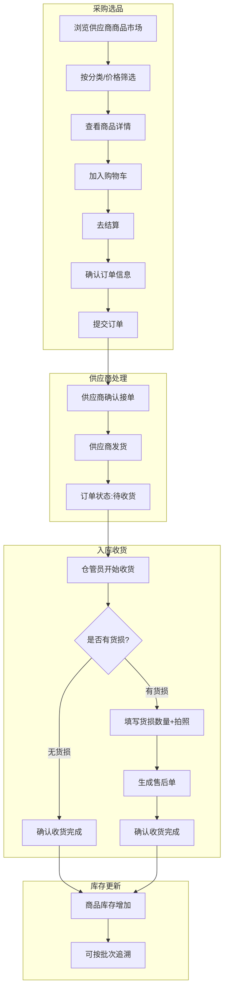
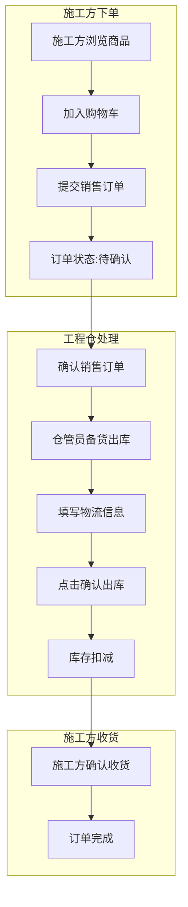
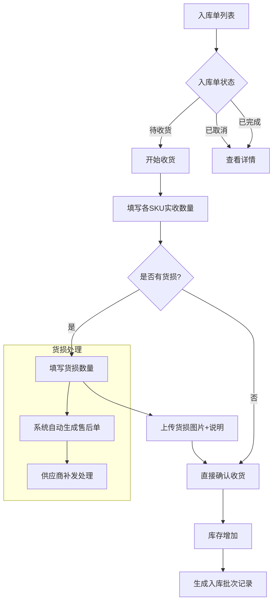

# 工程仓端 - 产品功能清单 & PRD

**版本**：V1.0  
**所属端**：工程仓端（PC管理后台 + 小程序）  
**目标用户**：仓管员/采购员/主管/财务/销售  

---

## 一、产品概述

### 1.1 产品定位
工程仓端是面向建筑工程项目仓库管理方的**采购+仓储+销售一体化管理平台**，连接供应商（采购）和施工方（销售），实现建材采购下单、仓储管理、库存盘点、财务对账等全链路功能。

### 1.2 双交易链路模型

```
链路一：采购链路（买方角色）
   工程仓（采购方）──采购订单──▶ 供应商
                    ◀──发货─────

链路二：销售链路（卖方角色）
   施工方（采购方）──销售订单──▶ 工程仓（销售方）
                    ◀──发货─────
```

### 1.3 目标用户

| 角色 | 核心职责 |
|------|---------|
| **采购员** | 浏览供应商商品、加购物车、下单采购、采购计划 |
| **仓管员** | 入库收货（含货损记录）、出库发货、库存管理、盘点 |
| **主管** | 数据看板、订单监控、采购计划审核、账号权限管理 |
| **财务** | 支付记录、发票管理、对账管理 |
| **销售** | 销售订单处理、发货 |

---

## 二、功能清单总览

| 模块 | 功能点数 | P0核心 | P1重要 | P2优化 |
|------|---------|-------|-------|-------|
| 🏠 **工作台** | 1 | 0 | 1 | 0 |
| 🏢 **商户中心** | 3 | 0 | 2 | 1 |
| 🛍️ **商品市场** | 10 | 8 | 2 | 0 |
| 🏪 **商品中心** | 3 | 2 | 1 | 0 |
| 📦 **仓库管理** | 10 | 6 | 2 | 2 |
| 📦 **订单管理** | 10 | 8 | 2 | 0 |
| 💰 **财务中心** | 5 | 1 | 3 | 1 |
| ⚙️ **系统设置** | 3 | 0 | 3 | 0 |
| **总计** | **45个** | **25个P0** | **16个P1** | **4个P2** |

---

## 三、核心业务流程图

### 3.1 采购到入库全流程



### 3.2 销售到出库全流程



### 3.3 仓库管理-入库详细流程



### 3.4 采购计划执行流程

```mermaid
graph TD
    A[新建采购计划] --> B[选择计划商品]
    B --> C[设置预计采购时间]
    C --> D[计划创建完成]
    D --> E[计划状态:待执行]
    E --> F[点击"转成订单"]
    F --> G{商品是否都可售?}
    G -->|全部可售| H[生成正式采购订单]
    G -->|部分下架| I[提示有商品已下架]
    H --> J[计划状态:已执行]
    J --> K[进入采购订单流程]
```

---

## 四、P0核心功能详细说明（25个）

### 4.1 商品市场-采购端（8个P0）

| 功能点 | 功能说明 | 交互细节 | 异常场景 |
|-------|---------|---------|---------|
| **商品浏览** | 供应商商品市场浏览 | 卡片式布局；上拉加载更多；下拉刷新 | 加载失败→重试按钮 |
| **分类筛选** | 按分类筛选商品 | 点击分类Tab切换；选中高亮 | 分类下无商品→空插画 |
| **搜索商品** | 按关键词搜索商品 | 搜索历史缓存；联想搜索 | 无结果→"找不到相关商品" |
| **商品详情** | 查看商品详细信息 | 图片/规格/供货价/供应商/库存 | 已下架→"商品已下架" |
| **加入购物车** | 将商品加入购物车 | 数量选择器弹窗；购物车角标+1 | 库存不足→"仅剩N件" |
| **购物车列表** | 查看购物车商品 | 左滑删除；数量增减按钮；自动算总价 | 商品已下架→置灰不可选 |
| **结算下单** | 购物车商品结算 | 选中商品→跳转确认订单页 | 库存变动→提示重新确认 |
| **确认订单** | 确认采购信息并提交 | 勾选协议→点击提交→生成正式订单 | 余额不足→提示充值 |

### 4.2 商品中心（2个P0）

| 功能点 | 功能说明 | 交互细节 | 异常场景 |
|-------|---------|---------|---------|
| **库存商品列表** | 查看仓库内库存商品 | 按子仓库下拉筛选；库存数字显示 | 库存为0→红色标红 |
| **SKU库存详情** | 查看SKU在各仓库库存 | 分Tab：库存分布/批次明细/出入库流水 | 无数据→空状态 |

### 4.3 仓库管理-出入库（6个P0）

| 功能点 | 功能说明 | 交互细节 | 异常场景 |
|-------|---------|---------|---------|
| **入库单列表** | 入库单列表管理 | 状态Tab切换：待收货/已完成/已取消；显示批次数量 | 无数据→空状态 |
| **入库-批次详情** | 查看完整批次记录 | 弹窗展示批次明细（批次号/数量/仓库/时间/操作员） | 无批次→不显示 |
| **入库-开始收货** | 处理采购订单收货 | 弹窗填写各SKU实收数量；上传货损图片 | 实收<0→校验不通过 |
| **入库-货损记录** | 收货时记录货损 | 上传货损图片+填写说明 | 货损>实收→提示 |
| **出库单列表** | 出库单列表管理 | 状态Tab切换：待出库/已完成/已取消 | 无数据→空状态 |
| **出库-确认出库** | 确认商品出库 | 二次确认弹窗；实发数量输入 | 实发>库存→提示不足 |

### 4.4 订单管理-采购订单（4个P0）

| 功能点 | 功能说明 | 交互细节 | 异常场景 |
|-------|---------|---------|---------|
| **采购订单列表** | 向供应商采购的订单列表 | 状态Tab：待确认/待收货/已完成/已取消；汇总金额 | 无数据→空状态 |
| **采购订单详情** | 订单详细信息 | 竖向时间线；商品明细表格；收货记录 | 订单不存在→返回列表 |
| **取消订单** | 取消待确认订单 | 二次确认弹窗；填写取消原因 | 已发货→不能取消 |
| **订单收货** | 处理订单收货 | 点击触发收货弹窗→转入入库流程 | 已收货→按钮置灰 |

### 4.5 订单管理-销售订单（4个P0）

| 功能点 | 功能说明 | 交互细节 | 异常场景 |
|-------|---------|---------|---------|
| **销售订单列表** | 施工方下的销售订单 | 状态Tab：待确认/待发货/已完成/已取消 | 无数据→空状态 |
| **销售订单详情** | 销售订单详细信息 | 施工方信息/商品明细/状态时间线/收货信息 | 订单不存在→返回 |
| **订单发货** | 处理销售订单发货 | 弹窗填写物流公司(非必填)/物流单号(非必填) | 物流字段非必填 |
| **确认订单** | 确认施工方订单 | 确认后状态→待发货 | 商品不足→提示补货 |

---

## 五、P1重要功能详细说明（16个）

### 5.1 工作台（1个）
- **数据概览**：今日订单数/采购总金额/库存SKU种类/待收货数/待发货数/库存预警数；预警数字红色标红

### 5.2 商户中心（2个）
- **主体信息查看**：工程仓基本信息查看，敏感信息脱敏
- **主体信息编辑**：修改联系人/电话/地址/营业执照

### 5.3 商品市场（2个）
- **采购计划列表**：采购计划查看，状态Tab筛选（待执行/已执行/已取消）
- **新建采购计划**：选择计划商品+设置预计采购时间
- **采购计划详情**：计划基本信息+商品明细列表
- **计划转订单**：将采购计划一键转为正式采购订单

### 5.4 商品中心（1个）
- **SPU详情查看**：查看SPU基本信息+规格属性

### 5.5 仓库管理（2个）
- **仓库列表**：工程仓下子仓库列表，每个仓库库存汇总
- **仓库详情**：子仓库基本信息+管理员+该仓商品列表

### 5.6 订单管理（2个）
- **新建采购订单**：手动创建采购订单（紧急采购直接下单）
- **订单导出**：订单数据导出Excel

### 5.7 财务中心（3个）
- **支付流水**：工程仓支付记录查询，合计金额统计
- **进项发票列表**：收到的供应商进项发票
- **上传进项发票**：上传发票PDF/图片关联订单

### 5.8 系统设置（3个）
- **账号列表**：工程仓子账号管理
- **员工管理**：员工信息维护
- **角色权限配置**：配置角色菜单权限，树形勾选

---

## 六、P2优化功能（4个）

1. **打印单据**：打印出入库单据，凭证留存归档
2. **库存盘点**：创建盘点单+盘点列表管理
3. **库存调拨**：仓库间调拨记录+创建调拨单
4. **对账单**：与供应商对账记录

---

## 七、异常场景覆盖

| 异常场景 | 系统处理 |
|---------|---------|
| 商品库存不足 | 红色标红显示0库存；下单时提示库存不足 |
| 供应商一直不发货 | 订单状态停留在"待发货"，可联系供应商 |
| 收货时发现货损 | 填写货损数量+拍照，自动生成售后单 |
| 采购超出预算 | 金额汇总显示，可做余额校验 |
| 重复收货 | 已收货→按钮置灰不可重复操作 |

---

## 八、开发排期建议

| 阶段 | 内容 | 功能数 |
|------|------|-------|
| **第一阶段** | 25个P0核心（采购→购物车→下单→入库+销售→出库） | 25个 |
| **第二阶段** | 16个P1重要（工作台/采购计划/仓库/财务/权限） | 16个 |
| **第三阶段** | 4个P2优化（打印/盘点/调拨/对账） | 4个 |

---

> **✅ 工程仓端产品功能清单输出完成！** 共45个功能，覆盖工作台、商户中心、商品市场、商品中心、仓库管理、订单管理、财务中心、系统设置8大模块，含完整业务流程图。
