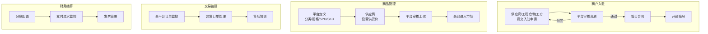
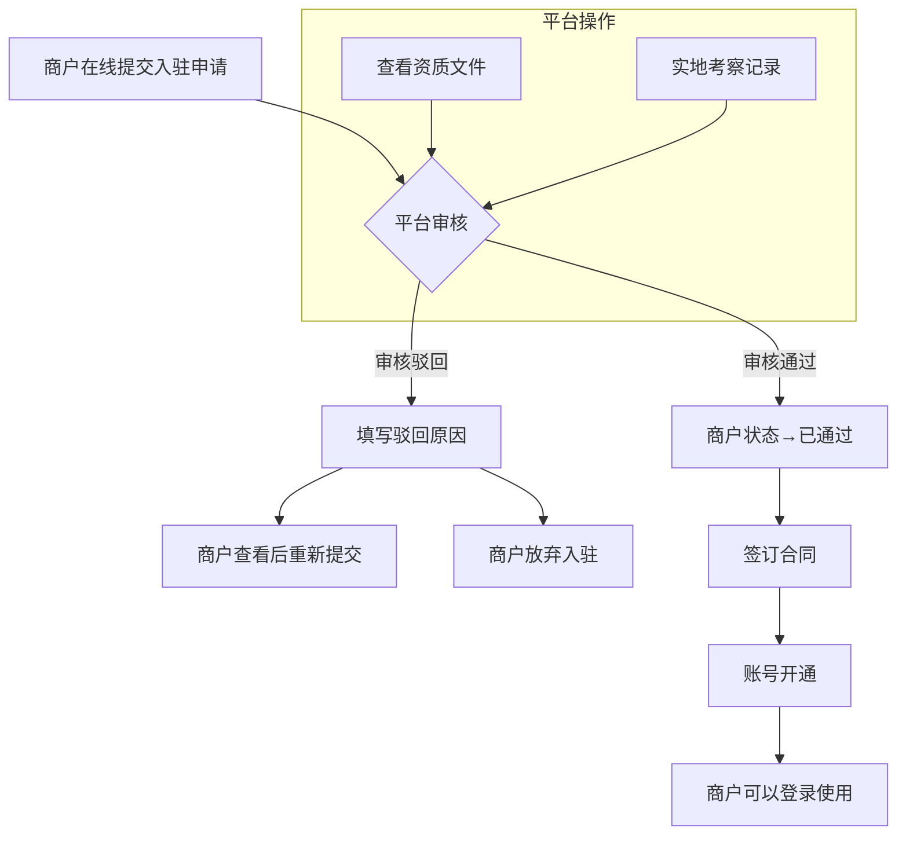
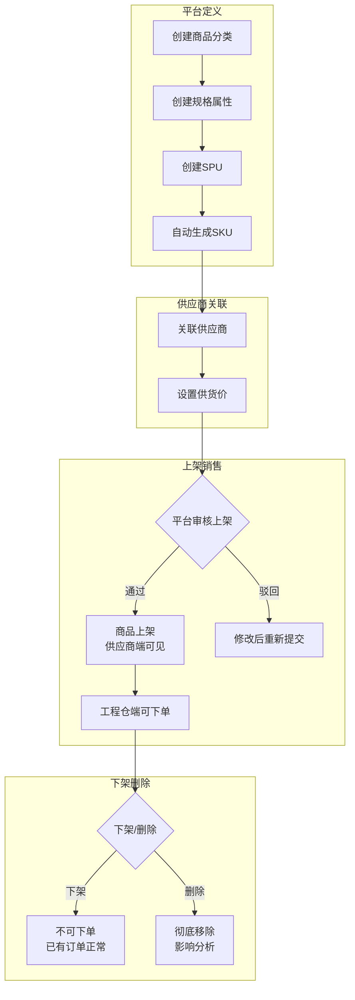
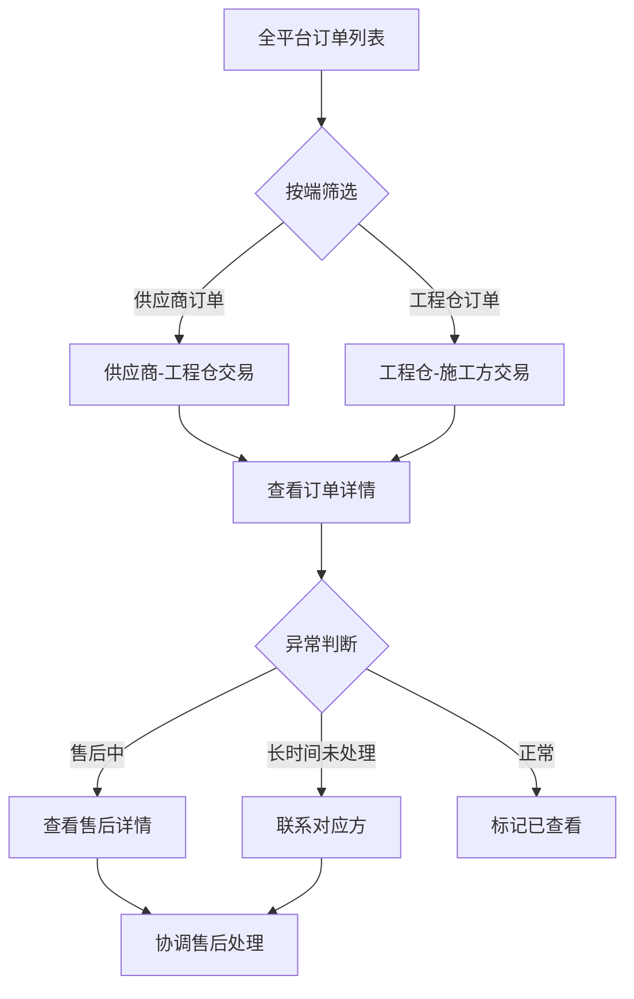
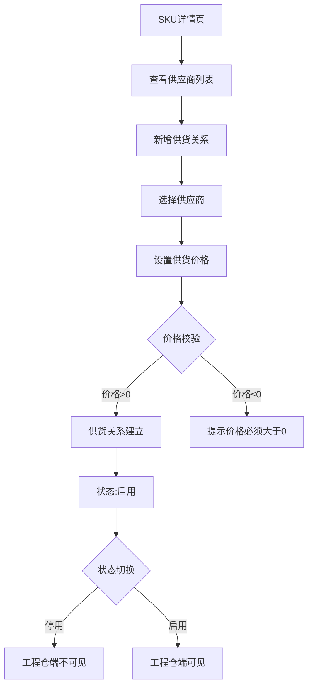

# 平台端 - 产品功能清单 & PRD

**版本**：V1.0  
**所属端**：平台端（PC管理后台）  
**目标用户**：平台管理员、平台运营、平台财务、平台客服、平台超管  

---

## 一、产品概述

### 1.1 产品定位
平台端是整个采供一体化平台的**管理中心**，面向平台运营方提供商户管理、商品统筹、订单监控、库存总览、财务核算、系统配置等全链路管理功能，是平台的"驾驶舱"。

### 1.2 核心职责
1. **商户管理**：供应商/工程仓/施工方入驻审核、合同管理、冻结解冻
2. **商品统筹**：商品分类/规格/SPU/SKU定义、供应商供货关系管理、商品上下架管控
3. **订单监控**：全平台订单查询、状态追踪、售后协调
4. **库存总览**：全平台库存统计、出入库流水审计
5. **财务核算**：分账配置、支付流水、发票管理
6. **系统配置**：用户/角色/权限/菜单管理

### 1.3 业务流程全景图

---

## 二、功能清单总览

| 模块 | 功能点数 | P0核心 | P1重要 | P2优化 |
|------|---------|-------|-------|-------|
| 🏠 **工作台** | 1 | 0 | 1 | 0 |
| 🏢 **商户管理** | 7 | 4 | 3 | 0 |
| 🛍️ **商品管理** | 14 | 10 | 4 | 0 |
| 🏪 **商品市场** | 8 | 4 | 3 | 1 |
| 📦 **订单管理** | 4 | 2 | 1 | 1 |
| 📦 **库存管理** | 6 | 0 | 4 | 2 |
| 💰 **财务中心** | 7 | 1 | 4 | 2 |
| ⚙️ **系统设置** | 7 | 3 | 3 | 1 |
| **总计** | **54个** | **24个P0** | **23个P1** | **7个P2** |

---

## 三、核心业务流程图

### 3.1 商户入驻审核流程

### 3.2 商品全生命周期管理流程

### 3.3 全平台订单监控流程

### 3.4 供应商供货管理流程

---

## 四、P0核心功能详细说明（24个）

### 4.1 商户管理（4个P0）

| 功能点 | 功能说明 | 交互细节 | 异常场景 |
|-------|---------|---------|---------|
| **商户列表查询** | 按条件筛选查询所有商户（供应商/工程仓/施工方） | 多条件筛选：名称/状态/类型/时间范围；状态标签不同颜色（待审核🟡/已通过🟢/已驳回🔴/已冻结⚪） | 网络错误→重试按钮；无数据→空插画 |
| **新增商户** | 创建新的商户主体 | 弹窗表单8字段：名称/类型/信用代码/法人/手机号/营业执照图片；实时校验标红；图片上传进度条 | 信用代码重复→"已注册"；图片过大→压缩提示 |
| **商户详情** | 查看商户完整档案 | 分Tab展示：基本信息/资质文件/审核历史/关联订单；敏感信息脱敏 | 商户不存在→返回列表 |
| **商户审核** | 审核商户入驻申请 | 审核弹窗：通过/驳回；驳回自动显示原因输入框（必填10-200字） | 重复审核→"已审核" |

### 4.2 商品管理（10个P0）

| 功能点 | 功能说明 | 交互细节 | 异常场景 |
|-------|---------|---------|---------|
| **分类树管理** | 维护商品分类树形结构 | 拖拽调整层级排序；右键菜单增删改；编辑即时刷新 | 分类下有商品→删除警告；循环嵌套→拖拽无效 |
| **属性组管理** | 维护规格属性分组 | 弹窗编辑属性组名称/排序号 | 重复名称→提示已存在 |
| **属性值管理** | 维护每个属性的可选值 | 按属性组筛选；弹窗新增属性值 | 重复属性值→提示已存在 |
| **SPU新增** | 创建SPU商品定义 | 3步骤表单：选择分类→填写信息→预览SKU；规格组合自动笛卡尔积预览 | 组合>100个→提示精简 |
| **SPU详情** | 查看SPU详细信息 | 分卡片展示：基本信息+关联SKU列表+规格属性 | SPU不存在→返回 |
| **SKU列表** | 查询SKU商品列表 | 多条件筛选：分类/SPU名称/品牌/状态 | 无数据→空状态 |
| **SKU详情** | 查看SKU完整信息 | 基本信息卡片/规格属性标签/价格信息/供应商列表（状态不同颜色） | SKU不存在→返回 |
| **供应商供货列表** | 查看供应商供货关系 | 按供应商/SKU/状态筛选 | 无数据→空状态 |
| **设置供货价** | 设置供应商的供货价格 | 弹窗编辑，价格>0校验 | 价格≤0→校验不通过 |
| **供货状态切换** | 启用/停用供货关系 | 开关切换+二次确认 | 停用后工程仓不可见 |

### 4.3 商品市场（4个P0）

| 功能点 | 功能说明 | 交互细节 | 异常场景 |
|-------|---------|---------|---------|
| **供应商品列表** | 查看供应商供应商品池 | 多条件筛选：供应商/分类/上下架状态 | 无数据→空状态 |
| **商品上下架** | 供应商商品上下架操作 | 支持批量；单行即时反馈；批量进度条 | 重复操作→提示 |
| **销售商品列表** | 按工程仓+子仓库筛选商品 | 项目仓下拉→子仓库联动过滤 | 无权限仓库→不显示 |
| **销售价格设置** | 设置工程仓销售价格 | 弹窗编辑，价格>0校验 | 价格≤0→校验不通过 |

### 4.4 订单管理（2个P0）

| 功能点 | 功能说明 | 交互细节 | 异常场景 |
|-------|---------|---------|---------|
| **全量订单查询** | 查询所有端的订单列表 | 多Tab状态快速筛选；高级筛选；点击订单号跳转详情 | 时间>3个月→提示缩小范围 |
| **订单详情** | 查看订单完整信息 | 竖向时间线展示流转；商品明细展开收起；关键金额标红 | 订单不存在→返回 |

### 4.5 财务中心（1个P0）

| 功能点 | 功能说明 | 交互细节 | 异常场景 |
|-------|---------|---------|---------|
| **支付流水** | 所有支付记录查询 | 状态筛选Tab；汇总金额统计；失败支付标红；支持导出 | 金额千分位显示 |

### 4.6 系统设置（3个P0）

| 功能点 | 功能说明 | 交互细节 | 异常场景 |
|-------|---------|---------|---------|
| **用户列表** | 平台用户管理 | 列表展示；启用/禁用开关 | 禁用后无法登录 |
| **员工列表** | 平台员工管理 | 部门树形筛选 | 无数据→空状态 |
| **角色管理+权限配置** | 角色列表+菜单权限配置 | 树形勾选；父选中子自动全选；二次确认 | 超管角色不可修改 |

---

## 五、P1重要功能详细说明（23个）

### 5.1 工作台（1个）
- **数据概览**：商户总数/订单总数/交易总额/商品SKU数/今日新增；卡片式布局+趋势箭头

### 5.2 商户管理（3个）
- **商户冻结/解冻**：异常商户临时封禁，冻结后禁止登录下单
- **合同列表查询**：商户合同归档管理
- **新增合同**：上传商户合同文件（PDF≤10M）

### 5.3 商品管理（4个）
- **SPU列表查询**：按分类/品牌/状态筛选SPU
- **SPU编辑**：修改SPU名称/品牌/描述
- **SKU编辑**：修改SKU价格信息，记录价格变更历史
- **批量上下架**：批量操作商品上下架，进度条+结果汇总

### 5.4 商品市场（3个）
- **BOM列表**：查看BOM组合商品列表
- **创建BOM**：多步骤选择商品创建BOM套餐
- **BOM详情**：查看BOM基本信息+包含商品明细
- **价格管理列表**：商品价格监控，价格异常标红

### 5.5 订单管理（1个）
- **订单状态追踪**：每个节点的操作人/时间/备注，时间线展示

### 5.6 库存管理（4个）
- **库存总览**：全平台库存统计（总金额/SKU种类/预警商品数），图表展示
- **仓库列表**：查看所有仓库列表
- **仓库详情**：查看仓库详细库存，库存为0标红
- **出入库流水**：所有出入库记录，类型标签不同颜色

### 5.7 财务中心（4个）
- **应收记录**：应收账款记录管理
- **分账列表**：订单分账记录
- **进项发票列表**：收到的进项发票管理
- **销项发票列表**：开具的销项发票管理

### 5.8 系统设置（3个）
- **菜单管理**：系统菜单结构维护，拖拽排序
- **分账配置**：配置商品分账费率
- **物流配置**：物流公司列表维护

---

## 六、P2优化功能（7个）

1. **订单导出**：订单数据导出Excel，超过1000条分批提示
2. **BOM编辑**：编辑BOM信息
3. **调拨管理**：仓库间调拨记录查看+创建调拨单
4. **盘点管理**：盘点单列表管理
5. **发票上传**：上传发票附件
6. **发票关联订单**：发票与订单关联
7. **操作日志**：系统操作日志查询（操作人/模块/时间）

---

## 七、与现有代码匹配度

| 模块 | 现有代码状态 |
|------|-----------|
| 商户管理（列表/新增/审核） | ✅ 已实现 |
| 商品分类/规格/SPU/SKU | ✅ 已实现 |
| 供应商供货 | ✅ 已实现 |
| 商品市场上下架 | ✅ 已实现 |
| 订单列表+详情 | ✅ 已实现 |
| 库存/仓库管理 | ✅ 已实现 |
| 财务流水/发票 | ✅ 已实现 |
| 系统设置/权限 | ✅ 已实现 |
| **整体匹配度** | **✅ ~90% 已实现** |

---

## 八、开发排期建议

| 阶段 | 内容 | 功能数 |
|------|------|-------|
| **第一阶段** | 24个P0核心功能（商户/商品/订单核心链路） | 24个 |
| **第二阶段** | 23个P1重要功能（市场/BOM/库存/财务/系统） | 23个 |
| **第三阶段** | 7个P2优化（调拨/盘点/日志/导出） | 7个 |

---

> **✅ 平台端产品功能清单输出完成！** 共54个功能，覆盖商户管理、商品管理、商品市场、订单管理、库存管理、财务中心、系统设置7大模块，含完整业务流程图。
