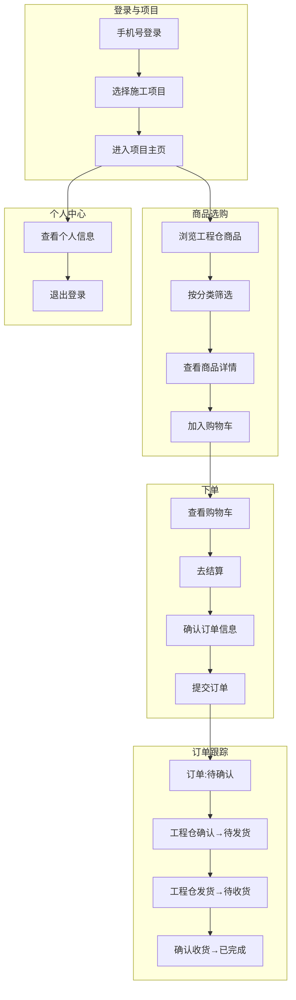
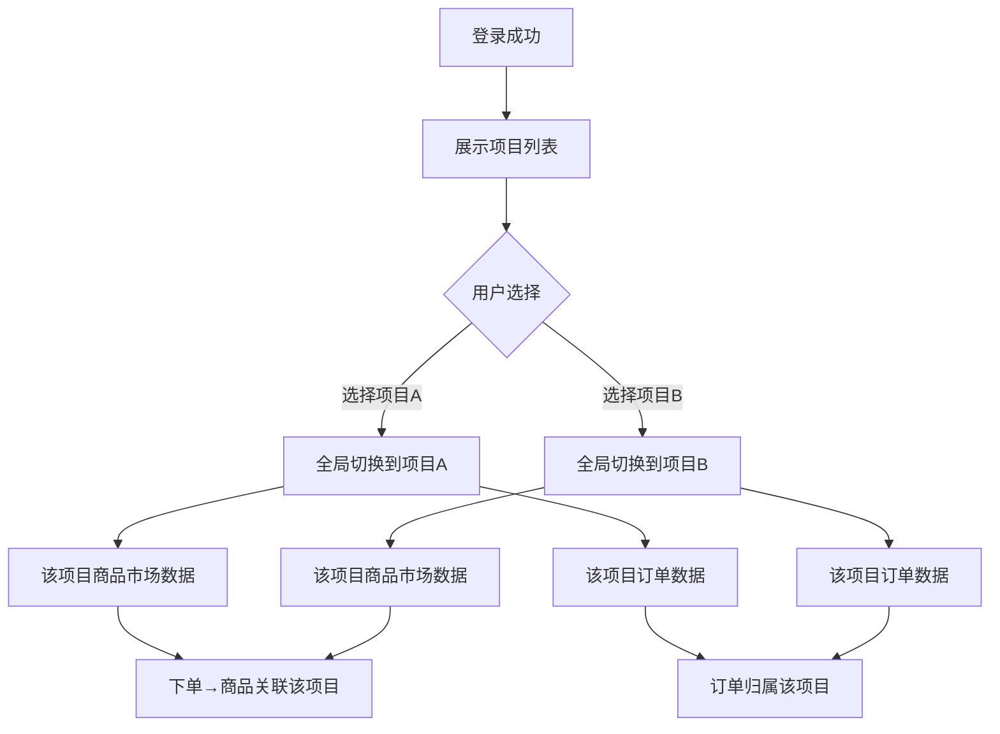
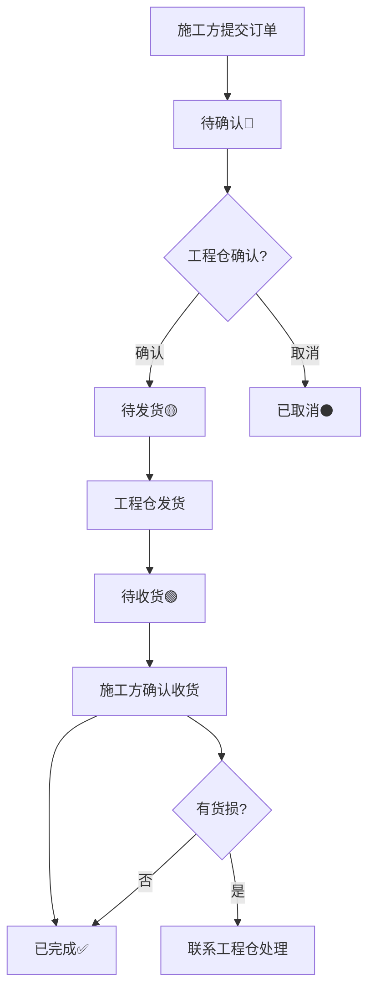

# 施工方端 - 产品功能清单 & PRD

**版本**：V1.0  
**所属端**：施工方端（小程序）  
**目标用户**：施工方采购人员/管理人员/现场人员  

---

## 一、产品概述

### 1.1 产品定位
施工方端是面向建筑施工现场管理方的**移动端采购管理平台**，以小程序形态提供服务，核心功能包括：项目管理切换、商品采购下单、订单跟踪确认、个人中心管理等。

### 1.2 业务关系

```
施工方（买方）──销售订单──▶ 工程仓（卖方）
               ◀──发货─────
```

施工方是工程仓的**下游买方**，从工程仓采购建材商品用于建筑项目施工。

### 1.3 目标用户

| 角色 | 核心职责 |
|------|---------|
| **采购人员** | 浏览商品、加购物车、下单采购、确认收货 |
| **现场管理人员** | 项目管理切换、查看订单进度、个人中心 |

---

## 二、功能清单总览

| 模块 | 功能点数 | P0核心 | P1重要 | P2优化 |
|------|---------|-------|-------|-------|
| 🔐 **登录** | 1 | 1 | 0 | 0 |
| 🏠 **首页/项目管理** | 3 | 2 | 1 | 0 |
| 🛍️ **商品市场** | 4 | 3 | 1 | 0 |
| 🛒 **购物车** | 3 | 2 | 1 | 0 |
| 📦 **订单管理** | 5 | 4 | 1 | 0 |
| 👤 **个人中心** | 3 | 1 | 1 | 1 |
| **总计** | **19个** | **13个P0** | **5个P1** | **1个P2** |

---

## 三、核心业务流程图

### 3.1 施工方采购全流程



### 3.2 多项目管理流程



### 3.3 订单状态流转



---

## 四、P0核心功能详细说明（13个）

### 4.1 登录（1个P0）

| 功能点 | 功能说明 | 交互细节 | 异常场景 |
|-------|---------|---------|---------|
| **手机号登录** | 手机号验证码登录 | 获取验证码倒计时60s；按钮置灰直到输入完成；保存token到本地 | 验证码错误→重新获取；手机号未注册→提示 |

### 4.2 首页/项目管理（2个P0）

| 功能点 | 功能说明 | 交互细节 | 异常场景 |
|-------|---------|---------|---------|
| **项目列表** | 施工方负责的项目列表 | 卡片式布局展示项目名称/地址 | 无权限项目→不显示 |
| **项目切换** | 切换不同的项目仓库 | 点击项目卡片切换；选中项目高亮标记；更新全局选中项目刷新所有页面数据 | 项目不存在→切换失败提示 |

### 4.3 商品市场（3个P0）

| 功能点 | 功能说明 | 交互细节 | 异常场景 |
|-------|---------|---------|---------|
| **商品浏览** | 工程仓商品市场浏览 | 上拉加载更多；下拉刷新；按分类/价格排序 | 加载失败→重试 |
| **商品详情** | 查看商品详细信息 | 图片/名称/规格/价格/库存展示 | 商品已下架→提示 |
| **加入购物车** | 将商品加入购物车 | 数量选择；购物车角标更新 | 库存不足→"库存不足" |

### 4.4 购物车（2个P0）

| 功能点 | 功能说明 | 交互细节 | 异常场景 |
|-------|---------|---------|---------|
| **购物车列表** | 查看购物车商品 | 左滑删除；数量加减；自动计算总价 | 商品已下架→置灰不可选 |
| **结算下单** | 购物车商品结算 | 选中商品→创建临时订单→跳转确认页 | 库存变动→提示重新确认 |

### 4.5 订单管理（4个P0）

| 功能点 | 功能说明 | 交互细节 | 异常场景 |
|-------|---------|---------|---------|
| **订单列表** | 采购订单列表 | 状态Tab切换：待确认/待发货/待收货/已完成/已取消 | 无数据→空插画 |
| **订单详情** | 订单详细信息 | 竖向时间线展示状态流转；商品明细；物流信息 | 订单不存在→返回列表 |
| **确认收货** | 确认订单收货 | 二次确认弹窗；确认后状态变"已完成" | 重复确认→"已收货" |
| **取消订单** | 取消待确认订单 | 二次确认弹窗；填写取消原因 | 已发货→不能取消 |

### 4.6 个人中心（1个P0）

| 功能点 | 功能说明 | 交互细节 | 异常场景 |
|-------|---------|---------|---------|
| **退出登录** | 退出系统 | 二次确认弹窗；清除token和缓存后跳转登录页 | 无 |

---

## 五、P1重要功能详细说明（5个）

### 5.1 首页/项目管理（1个）
- **项目搜索**：按项目名称/地址快速搜索项目

### 5.2 商品市场（1个）
- **分类筛选**：按商品分类Tab切换筛选商品

### 5.3 购物车（1个）
- **修改商品数量**：调整购物车商品购买数量；自动重新计算总价

### 5.4 订单管理（1个）
- **订单售后**：查看货损信息；联系工程仓处理

### 5.5 个人中心（1个）
- **查看个人信息**：头像/姓名/手机号/所属项目展示

---

## 六、P2优化功能（1个）

1. **项目详情**：查看项目基本信息+项目进度

---

## 七、页面原型说明

### 7.1 首页/项目列表页
```
┌───────────────────┐
│  🔙 施工方端       │
├───────────────────┤
│  我的项目           │
│  ┌───────────────┐ │
│  │ 🏗 深圳湾项目  │ │
│  │ 南山区后海路  │ │
│  │ 进行中 ▶      │ │
│  └───────────────┘ │
│  ┌───────────────┐ │
│  │ 🏗 前海项目    │ │
│  │ 南山区前海路  │ │
│  │ 进行中 ▶      │ │
│  └───────────────┘ │
└───────────────────┘
```

### 7.2 商品市场页
```
┌───────────────────┐
│  🔙 商品市场       │  🔍
├───────────────────┤
│  全部  水泥  钢材  沙子 │ ← 分类Tab
├───────────────────┤
│ ┌───┬────────────┐ │
│ │📷 │ 水泥325#    │ │
│ │   │ 规格：50kg/袋│ │
│ │   │ ¥450/吨     │ │
│ │   │   + 加入    │ │
│ └───┴────────────┘ │
│ ┌───┬────────────┐ │
│ │📷 │ 螺纹钢HRB400│ │
│ │   │ 规格：Φ25   │ │
│ │   │ ¥3800/吨   │ │
│ │   │   + 加入    │ │
│ └───┴────────────┘ │
└───────────────────┘
```

### 7.3 订单详情页
```
┌───────────────────┐
│  🔙 订单详情       │
├───────────────────┤
│  订单号：SO20240001 │
│  状态：📦 待收货    │
├───────────────────┤
│  商品明细           │
│  水泥325# × 10吨   │
│  螺纹钢 × 5吨      │
│  合计：¥23,500     │
├───────────────────┤
│  物流信息           │
│  顺丰快递：SF123456│
├───────────────────┤
│  状态时间线          │
│  ✅ 已提交 04-20    │
│  ✅ 已确认 04-20    │
│  ✅ 已发货 04-21    │
│  ⏳ 待收货         │
├───────────────────┤
│    [ 确认收货 ]     │
└───────────────────┘
```

---

## 八、异常场景覆盖

| 异常场景 | 系统处理 |
|---------|---------|
| 项目切换后数据混乱 | 全局projectId缓存，切换后刷新所有页面数据 |
| 商品库存不足 | 加入购物车时校验库存，不足则提示 |
| 网络断开 | 小程序断网提示，关键操作有重试机制 |
| 订单长时间未处理 | 可在订单列表查看状态，联系工程仓 |
| 商品已下架 | 购物车中商品置灰不可选，列表页不展示 |

---

## 九、开发排期建议

| 阶段 | 内容 | 功能数 |
|------|------|-------|
| **第一阶段** | 13个P0核心功能（登录→项目→选购→下单→收货完整流程） | 13个 |
| **第二阶段** | 5个P1重要功能（搜索/分类/售后/个人信息） | 5个 |
| **第三阶段** | 1个P2优化（项目详情）+测试验收 | 1个 |

---

## 十、与现有代码实现匹配度

| 功能 | 现有代码状态 |
|------|-----------|
| 登录（手机号验证码） | ✅ 已实现 |
| 项目列表/切换 | ✅ 已实现 |
| 商品市场浏览 | ✅ 已实现 |
| 购物车 | ✅ 已实现 |
| 订单列表+详情 | ✅ 已实现 |
| 确认收货 | ✅ 已实现 |
| 个人中心 | ✅ 已实现 |
| **整体匹配度** | **✅ ~85% 已实现** |

---

> **✅ 施工方端产品功能清单输出完成！** 共19个功能，覆盖登录、首页/项目管理、商品市场、购物车、订单管理、个人中心6大模块，含完整业务流程图。
