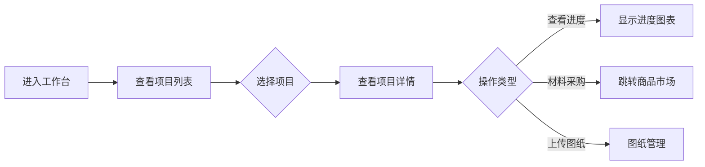
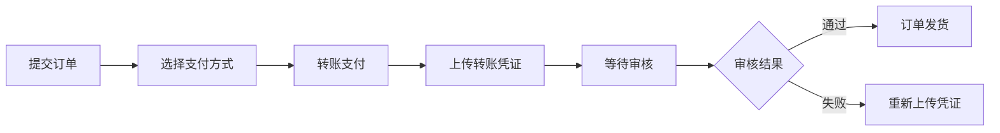

# 施工方小程序功能架构

```mindmap
## **工作台**
- 项目管理
  - 项目列表
    - 进行中项目
    - 已完成项目
    - 待验收项目
  - 项目详情
    - 项目信息
    - 施工进度
    - 材料管理
    - 图纸管理
- 快捷操作
  - BOM下单
  - 材料采购
  - 进度更新
  - 消息通知
- 数据统计
  - 项目进度统计
  - 材料消耗统计
  - 成本分析

## **商品市场**
- 商品分类
  - 建材
  - 五金
  - 电器
  - 工具
- 搜索功能
  - 关键词搜索
  - 分类筛选
  - 价格排序
- 商品详情
  - 商品信息
  - 规格参数
  - 库存查询
  - 供应商信息
- 购物车
  - 添加商品
  - 数量调整
  - 价格计算
  - 结算下单

## **订单中心**
- 订单列表
  - 待支付
  - 待发货
  - 已发货
  - 已完成
- 订单详情
  - 订单信息
  - 商品清单
  - 收货地址
  - 物流信息
- 支付管理
  - 转账支付
  - 凭证上传
  - 支付状态

## **个人中心**
- 个人信息
  - 基本信息
  - 联系方式
  - 资质认证
- 设置
  - 账号安全
  - 消息设置
  - 帮助中心
- 我的收藏
  - 收藏商品
  - 收藏店铺
- 意见反馈
  - 反馈提交
  - 历史记录
```

---

## 详细功能说明

### 一、工作台

#### 1. 项目管理
| 功能模块 | 说明 |
| :--- | :--- |
| 项目列表 | 展示进行中、已完成、待验收的项目 |
| 项目详情 | 显示项目基本信息、施工进度、材料使用情况 |
| 施工进度 | 可视化进度展示，支持堪场、设计、施工、验收四阶段 |
| 材料管理 | 材料清单、库存查询、采购申请 |
| 图纸管理 | 上传、查看项目图纸 |

#### 2. 快捷操作
| 功能模块 | 说明 |
| :--- | :--- |
| BOM下单 | 基于项目BOM清单快速下单 |
| 材料采购 | 直接跳转到商品市场采购 |
| 进度更新 | 一键更新项目施工进度 |
| 消息通知 | 查看系统通知和订单消息 |

#### 3. 数据统计
| 功能模块 | 说明 |
| :--- | :--- |
| 进度统计 | 各项目进度汇总展示 |
| 材料消耗 | 材料使用情况统计分析 |
| 成本分析 | 项目成本概览 |

---

### 二、商品市场

#### 1. 商品分类
| 分类 | 说明 |
| :--- | :--- |
| 建材 | 水泥、钢材、砂石、砖块等 |
| 五金 | 螺丝、螺母、管件等 |
| 电器 | 电线、开关、灯具等 |
| 工具 | 手动工具、电动工具等 |

#### 2. 搜索功能
| 功能模块 | 说明 |
| :--- | :--- |
| 关键词搜索 | 支持商品名称、规格搜索 |
| 分类筛选 | 按类别筛选商品 |
| 价格排序 | 支持升序/降序排序 |

#### 3. 商品详情
| 功能模块 | 说明 |
| :--- | :--- |
| 商品信息 | 名称、规格、品牌、价格 |
| 规格参数 | 详细技术参数 |
| 库存查询 | 实时库存状态 |
| 供应商信息 | 供应商名称、联系方式 |

#### 4. 购物车
| 功能模块 | 说明 |
| :--- | :--- |
| 添加商品 | 从商品详情页添加 |
| 数量调整 | 支持增减数量 |
| 价格计算 | 自动计算总价 |
| 结算下单 | 跳转订单确认页 |

---

### 三、订单中心

#### 1. 订单列表
| 状态 | 说明 |
| :--- | :--- |
| 待支付 | 已提交未支付的订单 |
| 待发货 | 已支付等待发货 |
| 已发货 | 商家已发货 |
| 已完成 | 订单已完成 |

#### 2. 订单详情
| 功能模块 | 说明 |
| :--- | :--- |
| 订单信息 | 订单号、下单时间、状态 |
| 商品清单 | 商品列表、数量、价格 |
| 收货地址 | 联系人、电话、地址 |
| 物流信息 | 物流公司、运单号 |

#### 3. 支付管理
| 功能模块 | 说明 |
| :--- | :--- |
| 转账支付 | 支持银行转账 |
| 凭证上传 | 上传转账截图 |
| 支付状态 | 待审核、已审核 |

---

### 四、个人中心

#### 1. 个人信息
| 功能模块 | 说明 |
| :--- | :--- |
| 基本信息 | 姓名、公司名称、头像 |
| 联系方式 | 手机号、邮箱 |
| 资质认证 | 营业执照、资质证书 |

#### 2. 设置
| 功能模块 | 说明 |
| :--- | :--- |
| 账号安全 | 修改密码、绑定手机 |
| 消息设置 | 通知开关 |
| 帮助中心 | 使用指南、常见问题 |

#### 3. 我的收藏
| 功能模块 | 说明 |
| :--- | :--- |
| 收藏商品 | 收藏的商品列表 |
| 收藏店铺 | 收藏的供应商店铺 |

#### 4. 意见反馈
| 功能模块 | 说明 |
| :--- | :--- |
| 反馈提交 | 提交问题和建议 |
| 历史记录 | 查看反馈历史 |

---

## 页面结构

```
施工方小程序
├── 工作台（首页）
│   ├── 项目卡片列表
│   ├── 快捷入口
│   └── 数据概览
├── 商品市场
│   ├── 搜索栏
│   ├── 分类导航
│   ├── 商品列表
│   └── 购物车悬浮按钮
├── 订单中心
│   ├── 订单状态筛选
│   ├── 订单列表
│   └── 订单详情
└── 个人中心
    ├── 用户信息
    ├── 功能菜单
    └── 设置入口
```

---

## 业务流程

### 1. 项目管理流程


### 2. 商品采购流程


### 3. 支付流程

