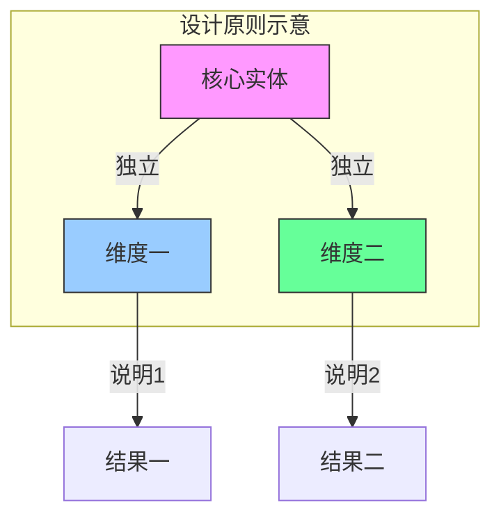
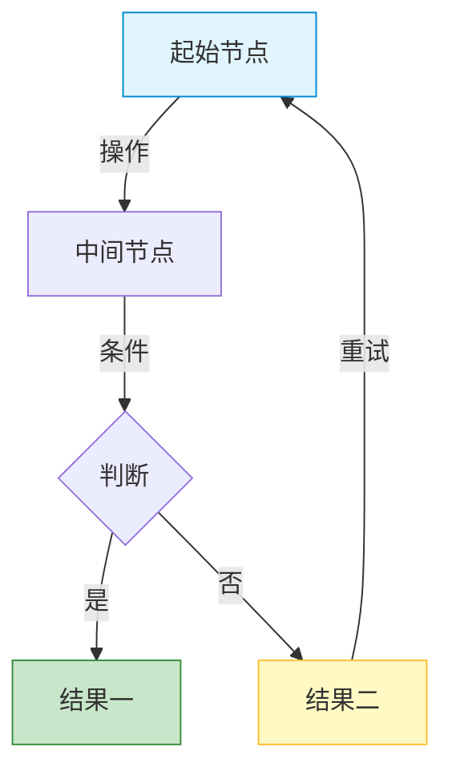
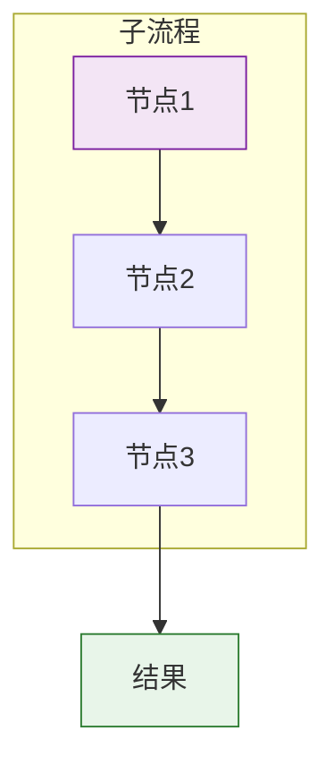

# {项目名称} - 产品需求文档

> 版本：v1.0  
> 文档状态：初稿  
> 创建日期：{YYYY-MM-DD}  
> 文档负责人：产品团队  
> 所属模块：{项目名称} - 全模块  
> 文档类型：SKILL格式PRD（融合文档深度+结构化输出）

<!-- ============================================================ -->
<!-- 模板说明：本文是PRD文档总纲/主入口，必须包含以下7个核心部分    -->
<!-- ① 文档索引（所有子文档的完整列表）                           -->
<!-- ② 核心设计原则（跨模块的灵魂设计原则）                       -->
<!-- ③ 术语表（全系统统一术语）                                   -->
<!-- ④ 用户角色与权限矩阵（全景权限视图）                         -->
<!-- ⑤ 功能全景（所有功能点的结构化清单）                         -->
<!-- ⑥ 核心流程图（业务全景流程图）                               -->
<!-- ⑦ 全局交互规范（所有模块共享的交互规则）                     -->
<!-- ============================================================ -->

---

## 零、文档索引

| 章节编号 | 名称 | 内容概要 | 面向角色 |
|:--------:|------|---------|:--------:|
| — | [prd.md](prd.md) （本文） | 总纲：设计原则、术语表、角色权限、功能全景、流程图 | 全局 |
| 01 | [01-系统概览与架构.md](01-系统概览与架构.md) | 系统定位、技术架构、模块树、角色定义 | 全局 |
| 02 | [02-业务流程设计.md](02-业务流程设计.md) | N张流程图：核心交易链路 | 全局 |
| 03 | [04-领域模型设计.md](04-领域模型设计.md) | N实体、N服务、N事件、DDD分层架构 | 后端 |
| 04 | [05-{模块名称}功能设计.md](05-{模块名称}功能设计.md) | {模块简要描述} | 前后端 |
| 05 | [06-{模块名称}功能设计.md](06-{模块名称}功能设计.md) | {模块简要描述} | 前后端 |
| ... | ... | ... | ... |
| NN | [NN-{模块名称}功能设计.md](NN-{模块名称}功能设计.md) | {模块简要描述} | 前后端 |

<!-- 原则：每个功能模块1篇独立文档，文档索引中的编号必须唯一且连续 -->

---

## 一、核心设计原则（Skill：{原则名称}）

> 这是本系统所有相关功能的**灵魂设计原则**，贯穿所有模块。

### 1.1 {原则名称}

| 设计维度 | 核心规则 | 说明 |
|---------|---------|------|
| {维度1} | {规则描述} | {说明} |
| {维度2} | {规则描述} | {说明} |
| {维度3} | {规则描述} | {说明} |



### 1.2 校验黄金准则

```typescript
// ❌ 绝对禁止 - {错误写法示例}
if ({错误条件}) {
  {错误操作} // 千万不要这样！
}

// ✅ 正确写法 - {正确做法说明}
const {变量名} = computed(() => {
  return {正确条件}
})
```

### 1.3 {业务上下文说明}

> {关键业务真相/约束}
> 系统**不做{某件事}**，只做**{另一件事}**！

---

## 二、术语表

| 术语 | 说明 |
|------|------|
| **{术语1}** | 定义说明 |
| **{术语2}** | 定义说明 |
| **{术语3}** | 定义说明 |

<!-- 术语表必须是全系统统一版本，各子文档引用时不重复定义 -->

---

## 三、用户角色与权限矩阵

### 3.1 角色定义

| 角色 | 系统标识 | 核心职责 | 使用端 |
|------|---------|---------|--------|
| **{角色1}** | {标识} | {职责描述} | PC/小程序 |
| **{角色2}** | {标识} | {职责描述} | PC/小程序 |
| **{角色3}** | {标识} | {职责描述} | PC/小程序 |

### 3.2 权限全景矩阵

| 操作/功能 | {角色1} | {角色2} | {角色3} |
|-----------|:-------:|:-------:|:-------:|
| {功能1} | ✅ | ✅ | ❌ |
| {功能2} | ✅ | ❌ | ✅ |
| {功能3} | ❌ | ✅ | ✅ |
| {功能4} | ❌ | ❌ | ✅ |

<!-- 此表给出全景视图，各子文档中可细化到更细粒度的操作 -->

---

## 四、功能全景（Skill：8列CSV格式）

| 所属端 | 模块 | 一级菜单 | 二级菜单 | 核心功能点 | 物理文件 | 优先级 | 备注 |
|-------|------|---------|---------|-----------|---------|:------:|------|
| {端名} | {模块} | {菜单} | {子菜单} | {功能描述} | {NN-文件名.md} | P0/P1/P2 | {说明} |
| {端名} | {模块} | {菜单} | {子菜单} | {功能描述} | {NN-文件名.md} | P0/P1/P2 | {说明} |

<!-- 优先级定义：P0=核心路径必须有 / P1=重要但不紧急 / P2=体验增强 -->

---

## 五、核心业务流程图（全景）

### 5.1 {流程名称一}



### 5.2 {流程名称二}



<!-- 每张流程图必须有明确的起点和终点，无孤立节点 -->

---

## 六、多端边界定义

| 能力维度 | {本端} | {对端A} | {对端B} |
|---------|:------:|:-------:|:-------:|
| {能力1} | ✅ 做 | ❌ 不做 | ❌ 不做 |
| {能力2} | ✅ 做 | ❌ 不做 | ✅ 做 |
| {能力3} | ❌ 不做 | ✅ 做 | ❌ 不做 |

<!-- 明确本系统与周边系统的功能边界，防止重复建设或遗漏 -->

---

## 七、全局交互规范

### 7.1 页面加载

| 场景 | 处理方式 | 示意 |
|-----|---------|------|
| 首次加载 | 全页Loading Skeleton | 灰色骨架屏脉冲动画 |
| 列表加载 | 底部滚动loading指示器 | 旋转loading+文字"加载中..." |
| 局部刷新 | 仅更新区域，不做全页刷新 | 区域遮罩+spin |

### 7.2 空状态

| 场景 | 处理方式 | 提示文案 |
|-----|---------|---------|
| 列表无数据 | 居中空状态插画+文字 | "暂无{数据名称}" |
| 搜索无结果 | 空状态+搜索建议 | "未找到'{关键词}'相关结果" |
| 功能未开放 | 提示入口 | "该功能即将开放，敬请期待" |

### 7.3 错误处理

| 异常场景 | UI表现 | 用户操作 |
|---------|-------|---------|
| 网络异常 | Toast提示"网络异常，请检查网络连接" | 自动重试3次后提示手动刷新 |
| 请求超时 | 区域重试按钮 | 点击重试 |
| 服务端错误 | 页面顶部通知条 | 刷新页面或联系管理员 |
| 无权限访问 | 页面级提示 | "您暂无该功能权限，请联系管理员" |

### 7.4 操作反馈

| 操作类型 | 反馈方式 | 说明 |
|---------|---------|------|
| 保存/提交 | Toast "操作成功" / "操作失败：{原因}" | 2秒自动消失 |
| 删除 | Modal二次确认（黄色警告）+ Toast | "确认删除{名称}？" |
| 批量操作 | 操作完成后Toast汇总结果 | "成功N条，失败M条" |
| 状态变更 | Toast+列表自动刷新 | "状态已更新" |

---

## 八、版本历史

| 版本 | 日期 | 修订内容 |
|:----:|:----:|---------|
| v1.0 | {YYYY-MM-DD} | 初始创建 |
