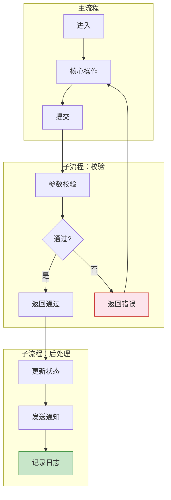

# {项目名称} - {模块名称}功能详细设计

> 版本：v1.0  
> 文档状态：初稿  
> 所属章节：第X章

<!-- ============================================================ -->
<!-- PRD六层模型：                                                    -->
<!--                                                              -->
<!-- 核心层(必写)： 功能概述 → 设计原则 → 业务规则(含流程图) → 功能点详情   -->
<!-- 扩展层(推荐)： 权限矩阵 → 非功能性需求 → 异常汇总 → 接口依赖      -->
<!-- 治理层(状态模块必写)： 状态流转图 → 状态治理矩阵 → 版本历史       -->
<!-- ============================================================ -->

---

## 一、功能概述

### 1.1 功能定位

{模块名称}是{项目名称}**{核心描述}**，覆盖从{起点}到{终点}的完整生命周期。{简要说明该模块在系统中的位置和价值}。

### 1.2 核心概念

| 概念 | 说明 | 示例 |
|:----|------|------|
| {概念1} | {描述} | {示例值} |
| {概念2} | {描述} | {示例值} |
| {概念3} | {描述} | {示例值} |

### 1.3 目标用户

- **{角色1}**（核心用户）：{职责描述}
- **{角色2}**：{职责描述}
- **{角色3}**：{职责描述}

### 1.4 模块范围

| 功能分类 | 主要功能 | 涉及角色 |
|:--------|---------|---------|
| {分类A} | {功能1}、{功能2} | {角色} |
| {分类B} | {功能3}、{功能4} | {角色} |

<!-- 模块范围表格给出该模块功能分类的全貌，每个功能点后续有详细设计 -->

---

## 二、核心设计原则

> **这是本系统的{核心设计原则}，贯穿所有相关模块。**

<!-- 设计原则必须放在最前面，它是所有业务规则和功能点设计的上层约束 -->

### 2.1 {原则一：如三状态分离}

<!-- 用表格描述核心状态轨道的独立运行规则 -->

| 状态轨道 | 状态值 | 核心规则 | 说明 |
|:--------|:-------|:--------|------|
| **{轨道1}** | {值1} → {值2} → {值3} | 独立运行，{规则} | {说明} |
| **{轨道2}** | {值1} → {值2} | 只做记录不做强校验 | {说明} |

```mermaid
graph LR
    subgraph 三轨道独立运行
        O[{主轨道}] -->|独立| P[{轨道2}]
        O -->|独立| S[{轨道3}]
    end
    style O fill:#e3f2fd,stroke:#1565c0
    style P fill:#fce4ec,stroke:#c62828
    style S fill:#e8f5e9,stroke:#2e7d32
```

### 2.2 {原则二：如商品两段定义}

| 阶段 | 定义方 | 消费方 | 核心逻辑 |
|:----|:------|:------|---------|
| {阶段1} | {角色} | {角色} | {规则} |
| {阶段2} | {角色} | {角色} | {规则} |

### 2.3 {原则三：如线下生意特征}

> {一句话说明}

---

## 三、业务规则

<!-- 本章按模块的规则类别展开，先文字规则，后流程图 -->

### 3.1 商品展示/列表规则

- **默认排序**：{描述排序算法，如：综合分=销量×0.5+评分×0.3+新鲜度×0.2}
- **支持切换排序**：{支持哪些排序方式，如：价格升序/降序、销量优先、上架时间}
- **分页规则**：{翻页方式，如：滚动加载，每页{N}条}
- **筛选规则**：{如：切换分类时重置搜索关键词；分类Tab显示商品数量}
- **空状态**：{无数据/搜索无结果时的展示方式}

### 3.2 购物车规则

- **{分组规则}**：{如：跨供应商分组展示，每组独立计算金额}
- **{结算限制}**：{如：只能同时勾选同一供应商的商品结算}
- **{数量限制}**：{如：单个SKU上限{N}件，购物车种类上限{N}种}
- **{状态处理}**：{如：已下架商品置灰不可选，不参与全选}
- **{有效期}**：{如：超过{N}天未操作自动清空}

### 3.3 结算/下单规则

- **{订单拆分}**：{如：每个供应商自动生成一个独立订单}
- **{收货信息}**：{如：展示收货仓库字段，默认选中主仓库，支持切换}
- **{协议确认}**：{如：必须勾选协议才能提交}
- **{二次校验}**：{如：进入结算页时实时校验最新价格和库存}

### 3.4 搜索/筛选规则

- **搜索范围**：{如：商品名称、规格属性、供应商名称（模糊匹配）}
- **搜索历史**：{如：记录最近{N}条搜索历史，支持一键清空}
- **搜索触发**：{如：输入关键词+回车/点击搜索按钮，防抖{N}ms}

### 3.5 实时性策略（如适用）

| 场景 | 实时性策略 | 用户提示 |
|:----|:----------|---------|
| {列表页} | {每次刷新/翻页时获取最新数据} | {无额外提示} |
| {详情页} | {进入时获取最新；停留超{N}s静默刷新} | {价格变化≥{N}%时提示} |
| {购物车页} | {打开时强制刷新；页内每{N}s轮询；获焦时刷新} | {变化时卡片显示橙色提醒图标} |
| {结算页} | {进入时强制校验，阻断提交直到确认} | {弹窗提示变更项} |
| {提交订单} | {后端最后一次校验} | {提示具体商品库存不足/价格变动} |

### 3.6 数据来源与同步规则（如适用）

<!-- 多端数据流转的项目，必须定义清楚每条数据的来源和同步方式 -->

| 数据类型 | 来源系统 | 同步方式 | 同步频率 | 备注 |
|:--------|:--------|:--------|:--------|------|
| {商品基本信息} | {平台商品库} | 实时（消息队列） | {频率} | {说明} |
| {商品库存} | {供应商端} | 供应商推送 | 准实时（延迟≤{N}min） | {说明} |
| {商品价格} | {供应商端} | 供应商推送 | 实时 | 价格变更触发MQ更新缓存 |
| {供应商信息} | {供应商管理系统} | 内部同步 | 每日全量+实时增量 | {说明} |
| {仓库信息} | {工程仓管理系统} | 内部同步 | 实时 | {说明} |

### 3.7 核心业务流程图

<!-- ============================================================ -->
<!-- 每个模块至少1张业务流程图，涉及多端协作必须附泳道图               -->
<!-- 类型说明：                                                     -->
<!--   flowchart TD   = 自上而下流程(适合单角色操作路径)               -->
<!--   flowchart LR   = 从左到右流程(适合多角色/跨系统交互)            -->
<!--   flowchart+subgraph = 泳道图(每条subgraph=一个角色泳道)         -->
<!-- ============================================================ -->

#### 流程图1：{业务流程名称}

<!-- 单角色操作路径：用 flowchart TD，展示分支判断和异常路径 -->

```mermaid
flowchart TD
    A[{起始状态/入口}] --> B[{操作1}]
    B --> C{判断条件}
    C -->|条件A| D[{操作2}]
    C -->|条件B| E[{异常处理/终态}]
    D --> F[{结果/终态}]

    style A fill:#e1f5fe,stroke:#0288d1
    style D fill:#c8e6c9,stroke:#388e3c
    style E fill:#fce4ec,stroke:#c62828
    style F fill:#c8e6c9,stroke:#388e3c
```

#### 流程图2：{业务流程名称}（含泳道）

<!-- 多角色/跨系统协作：用 flowchart LR + subgraph 实现泳道图效果 -->
<!-- 每条 subgraph 作为一个泳道(角色/系统)，水平排列展示交互 -->

```mermaid
flowchart LR
    subgraph 泳道1[{角色A/系统A}]
        direction TB
        A1[步骤1] --> A2[步骤2]
        A2 --> A3[步骤3]
    end

    subgraph 泳道2[{角色B/系统B}]
        direction TB
        B1[步骤1] --> B2[步骤2]
    end

    subgraph 泳道3[{角色C/系统C}]
        direction TB
        C1[步骤1] --> C2[步骤2]
        C2 --> C3[步骤3]
    end

    A3 -->|交互/消息| B1
    B2 -->|触发| C1
    C3 -->|反馈| A3

    style A1 fill:#e1f5fe,stroke:#0288d1
    style C3 fill:#c8e6c9,stroke:#388e3c
```

<!-- 泳道图设计说明：                                                -->
<!-- - 每条 subgraph 代表一个角色或系统的泳道                          -->
<!-- - direction TB 使每个泳道内部自上而下执行                        -->
<!-- - 泳道间的水平箭头代表跨角色/系统的交互                          -->
<!-- - 适用场景：订单履约链路、多端协作流程、审核流程等                -->

#### 流程模板参考：{业务场景名称}

```mermaid
flowchart TD
    subgraph 角色A[{角色A操作域}]
        S[开始] --> A1[操作1]
        A1 --> A2[操作2]
        A2 --> A3{判断}
    end

    subgraph 角色B[{角色B操作域}]
        B1[操作3] --> B2[操作4]
    end

    A3 -->|条件1| A2
    A3 -->|条件2| B1
    B2 --> E[结束]

    style S fill:#e1f5fe,stroke:#0288d1
    style E fill:#c8e6c9,stroke:#388e3c
```

#### 流程模板参考：子流程拆分（复杂流程用）



---

## 四、功能点详细设计

<!-- ============================================================ -->
<!-- 每个功能点的三维模板：                                        -->
<!-- ① 交互逻辑：分步骤描述用户操作路径（含分支/异常）             -->
<!-- ② 原子字段定义：字段|类型|必填|来源|校验规则|展示规则|默认值   -->
<!-- ③ 边界情况覆盖：场景|处理逻辑|提示文案                        -->
<!--                                                              -->
<!-- 与旧8维模板区别：                                             -->
<!-- - 字段定义新增「必填」+「来源」+「展示规则」列，后端直接对表  -->
<!-- - 边界情况一次性穷举，不再零散分布在业务规则/异常处理中       -->
<!-- ============================================================ -->

### 4.1 {功能点名称一}（{优先级}）

#### 交互逻辑

1. 页面加载：{描述} → {描述}
2. {步骤2}（含分支判断）
3. 若{条件A} → {处理A}；若{条件B} → {处理B}
4. 提交后：{成功处理}；{失败处理}

<!-- 交互逻辑必须写出分支路径，覆盖正常和异常两种情况 -->

#### 原子字段定义

| 字段 | 类型 | 必填 | 来源 | 校验规则 | 展示规则 | 默认值 |
|:----|:----|:----:|:----|:--------|:--------|:-----:|
| {字段名} | {类型} | 是/否 | {接口/系统} | 非空/长度≤N/格式 | {对齐/颜色/样式} | {默认值} |
| {字段名} | Decimal(10,2) | 是 | 实时价格接口 | ≥0 && ≤9999 | 红色加粗，右对齐，单位"元" | - |
| {字段名} | Enum | 否 | 用户选择 | 必选其一 | 下拉选择器 | {默认值} |

<!-- 必填列新增：后端直接知道字段约束，避免开发中反复沟通 -->

#### 边界情况覆盖

| 场景 | 处理逻辑 | 提示文案 |
|:----|:--------|---------|
| {异常/边界场景描述} | {前端+后端处理方式} | "{用户看到的文案}" |
| {场景2} | {处理方式} | "{文案}" |

---

## 五、权限矩阵

<!-- 权限矩阵独立成章：覆盖每个功能的角色可见性与可操作性 -->

### 5.1 功能权限总表

| 功能模块 | 具体操作 | {角色1} | {角色2} | {角色3} | 说明 |
|:--------|---------|:------:|:------:|:------:|------|
| {模块A} | {操作1} | ✅ | ✅ | ❌ | - |
| | {操作2} | ✅ | ❌ | ❌ | - |
| {模块B} | {操作3} | ✅ | ✅ | ✅ | 只读 |

<!-- ✅=可操作  (只读)=仅查看不可操作  ❌=无权限 -->

### 5.2 权限校验方式

- **前端**：按钮级权限控制，无权限操作置灰或隐藏
- **后端**：每个接口校验用户角色，无权限返回403错误码

---

## 六、非功能性需求

<!-- 非功能性需求是生产级PRD的必备章节，包含性能/埋点/安全三大维度 -->

### 6.1 性能要求

| 接口/场景 | 指标 | P95要求 | 说明 |
|:---------|:----|:-------:|------|
| {接口1} | 响应时间 | ≤ {N}ms | {说明} |
| {接口2} | 响应时间 | ≤ {N}ms | {说明} |
| 并发支持 | 系统容量 | {N} QPS | {接口} |

### 6.2 埋点需求

| 页面 | 事件名 | 触发时机 | 上报字段 |
|:----|:------|---------|---------|
| {页面名} | {event_name} | {触发时机描述} | `{字段1}`、`{字段2}` |

### 6.3 安全要求

| 风险点 | 防护措施 | 实现方式 |
|:------|---------|---------|
| {风险描述} | {防护策略} | {技术实现} |
| 越权操作 | 接口权限校验 | 每个接口校验用户角色和归属 |
| 重复提交 | 前端防抖+后端幂等 | 按钮{N}ms防抖 + 订单号幂等性 |

<!-- 边界情况覆盖的目的是穷举所有可能的异常和边界场景，避免开发/测试中遗漏 -->

---

### 6.2 {功能点名称二}（{优先级}）

<!-- 重复6.1的三维模板结构 -->

---

## 七、异常处理汇总表

<!-- 一次性穷举该模块所有异常场景，与6.x中的边界情况互补 -->
<!-- 6.x中的边界覆盖是每个功能点级别的异常，此处是模块级别的集中视图 -->

| 异常场景 | 触发条件 | 前端处理 | 后端处理 | 提示文案 |
|:--------|:--------|:--------|:--------|---------|
| {场景描述} | {触发逻辑} | {前端UI行为} | {后端逻辑/返回码} | "{提示文案}" |
| {场景描述} | {触发逻辑} | {前端UI行为} | {后端逻辑/返回码} | "{提示文案}" |

---

## 八、接口依赖建议

<!-- 接口依赖建议建立前端与后端的契约共识，避免开发过程中需求理解偏差 -->

| 接口 | 用途 | 核心字段/逻辑 | 性能要求 |
|:----|:----|:-------------|:--------:|
| `{接口路径}` | {用途描述} | 输入/输出关键字段 | P95 ≤ {N}ms |
| `{接口路径}` | {用途描述} | {核心逻辑} | P95 ≤ {N}ms |

---

## 九、状态流转图

<!-- ============================================================ -->
<!-- 状态流转图独立成章，专门展示多轨道并行状态的变化路径              -->
<!-- 每个轨道独立绘制，清晰展示状态之间的转换条件和触发操作             -->
<!-- 适用场景：订单三状态分离（主状态/支付/发货）并行展示              -->
<!-- ============================================================ -->

### 9.1 {轨道名称：如订单主状态}

```mermaid
graph TB
    subgraph 主状态
        A[{状态1}] -->|{操作1}| B[{状态2}]
        B -->|{操作2}| C[{状态3}]
        B -->|{操作3}| D[{状态4}]
    end
    A -->|{操作4}| D
    style A fill:#fff9c4,stroke:#fbc02d
    style B fill:#e3f2fd,stroke:#1565c0
    style C fill:#e8f5e9,stroke:#2e7d32
    style D fill:#fce4ec,stroke:#c62828
```

### 9.2 {轨道名称：如支付状态}

```mermaid
graph TB
    subgraph 支付状态
        P1[{未支付}] -->|{操作}| P2[{已支付}]
        P2 -->|{操作}| P3[{已退款}]
    end
    style P1 fill:#fff9c4,stroke:#fbc02d
    style P3 fill:#fce4ec,stroke:#c62828
```

### 9.3 {轨道名称：如发货状态}

```mermaid
graph TB
    subgraph 发货状态
        S1[{未发货}] -->|{操作}| S2[{部分发货}]
        S2 -->|{操作}| S3[{已发货}]
    end
    style S1 fill:#fff9c4,stroke:#fbc02d
    style S3 fill:#e8f5e9,stroke:#2e7d32
```

---

## 十、状态治理矩阵

### 10.1 动作定义表

| 动作ID | 动作名称 | 触发方式 | 触发角色 | 说明 |
|:-----:|---------|---------|:-------:|------|
| {前缀}-01 | {动作名} | 点击按钮/接口调用 | {角色} | {说明} |
| {前缀}-02 | {动作名} | 接口调用 | {角色} | {说明} |

<!-- 动作ID前缀取模块英文缩写（如PUR=Purchase Order），保持全局唯一 -->

### 10.2 状态×操作矩阵

| 状态 \ 操作 | {动作1} | {动作2} | {动作3} | {动作4} |
|:----------:|:-------:|:-------:|:-------:|:-------:|
| **{状态1}** | ✅ | ✅ | ❌ | ❌ |
| **{状态2}** | ✅ | ❌ | ✅ | ❌ |
| **{状态3}** | ✅ | ❌ | ❌ | ✅ |
| **{状态4}** | ✅ | ❌ | ❌ | ❌ |

<!-- ✅=允许 ❌=不允许 ➡=特殊说明(在单元格写说明文字) -->

### 10.3 每状态角色权限

#### {状态1}（{状态说明}）

| 操作 | {角色1} | {角色2} | {角色3} |
|:----:|:-------:|:-------:|:-------:|
| {动作1} | ✅ | ✅ | ❌ |
| {动作2} | ✅ | ❌ | ✅ |
| {动作3} | ❌ | ✅ | ❌ |

#### {状态2}（{状态说明}）

<!-- 重复每状态角色权限表 -->

<!-- 原则：每个状态单独一张角色权限表，清晰展示不同状态下各角色的操作边界 -->

---

## 十一、版本历史

| 版本 | 日期 | 修订内容 | 修订人 |
|:----:|:----:|---------|:-----:|
| v1.0 | {YYYY-MM-DD} | 初始创建，覆盖{模块名称}全部{数量}个功能点 | PM |
| v1.1 | {YYYY-MM-DD} | 追加权限矩阵、非功能性需求 | PM |
| v1.2 | {YYYY-MM-DD} | 新增泳道图模板、状态流转图独立成章、原子字段增加必填列 | PM |
